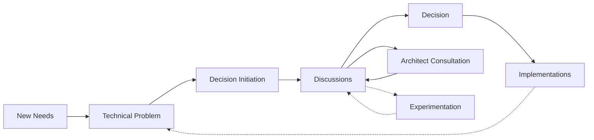

# TDR: Use of Technical Design Records

## Overview

This TDR introduces the practice of using Technical Design Records (TDRs) for tracking architectural or non-trivial changes made to the connectors-sdk package. The goal is to formalize design decisions, improve traceability, and encourage collaboration around significant codebase changes.

---

## Motivation

As the connectors-sdk grows in complexity and adoption, it's important to maintain a clear record of why and how key decisions are made. Currently, decision-making is scattered across PRs, Slack threads, and personal knowledge. This makes onboarding, auditing, and refactoring harder over time.

---

## Proposed Solution

We propose using TDRs as short, markdown-formatted documents to accompany non-trivial changes in connectors-sdk. A TDR should be created when:

- Adding or modifying architecture-level components
- Introducing new patterns or abstractions
- Deprecating or removing existing capabilities
- Resolving trade-offs with performance, compatibility, or maintenance

Each TDR will follow the established template and be added to a `/TDRs` directory in the repository. A TDR date and title will be used for tracking.

About the naming: we do not use the widely known term "ADR" (Architectural Decision Record) to avoid confusion with the more heavyweight process used in other projects. Instead, we use "TDR" to indicate a more lightweight, technical focus.

---

## Advantages

- Improves decision transparency
- Enables better asynchronous collaboration
- Creates a lightweight historical record of architectural decisions
- Helps onboard new contributors by showing rationale
- Reduces “institutional memory” risks

---

## Disadvantages

- Adds minor process overhead
- Requires some discipline to maintain quality and consistency
- Might be underused if not enforced via code review or culture

---

## Alternatives Considered

- **Relying on PR descriptions only**: Insufficient for complex decisions and often lost over time.
- **Using full-blown RFC processes**: Too heavyweight for the scope and velocity of connectors-sdk.
- **Relying on tribal knowledge**: Leads to fragmentation and inconsistency.

---

## References

- [TDR Template](0000-00-00-template.md)
- [Using architectural decision records to streamline technical decision-making for a software development project](https://docs.aws.amazon.com/prescriptive-guidance/latest/architectural-decision-records/welcome.html) (consulted on 2025-06-04)
- [Documenting architecture decisions](https://cognitect.com/blog/2011/11/15/documenting-architecture-decisions) (consulted on 2025-06-04)
- [Architecture Decision Record : starting today !](https://blog.octo.com/architecture-decision-record) (consulted on 2025-06-04)

---
