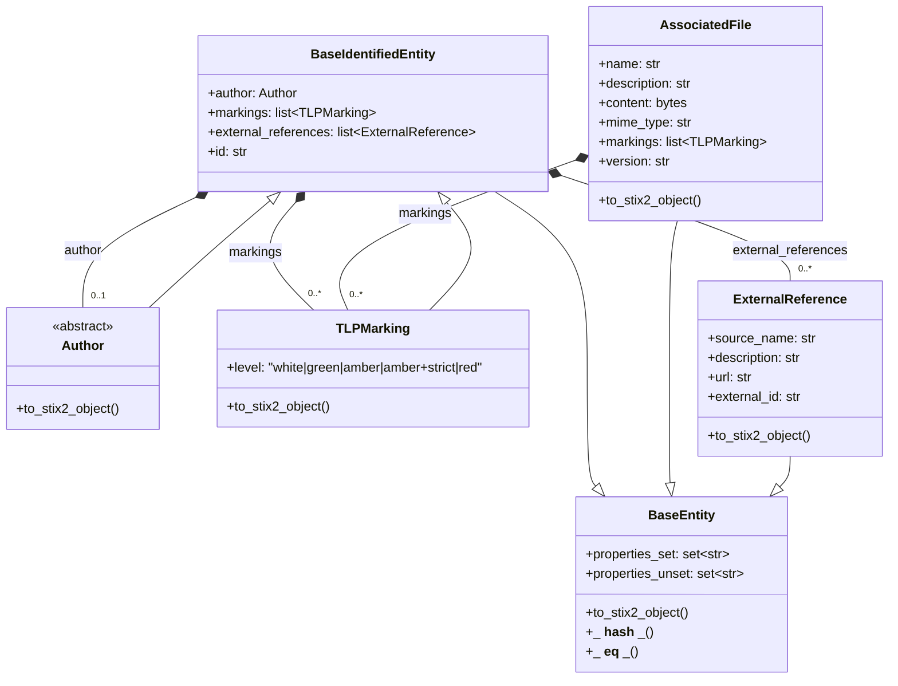

# TDR: Rely on Pydantic OCTI Models

## Overview

This TDR proposes relying on Pydantic models for OCTI Models to improve validation, error handling, and usability.

---

## Motivation

Using Pydantic models ensures robust validation of properties, provides clear error messages, and reduces verbosity compared to traditional class initialization or dataclasses. It also allows for better documentation.

---

## Proposed Solution

- Define OCTI Models using Pydantic.
- Define OCTI `BaseEntity` (general purpose) and  `BaseIdentifiedEntity` (Entity with an ID) classes as Pydantic models:
  - Provide comparison capability with hashing.
  - Use `model_config.validate_assignment` for property validation.
  - Do not enforce `frozen` models to allow for easier initialization and modification in an ingestion/processiing use case.
  - Implement `__eq__` and `__hash__` methods for comparison.
  - Add `to_stix2_object` abstract method to allow for easy conversion to STIX2 objects.
  - Wrap `BaseModel.model_fields_set` in `properties_set` and `properties_unset` properties to provide a more intuitive interface for checking which properties have been set or unset. (An unset property should generally not be set to None that could update the target object with a `null` value, but rather be left unset to avoid confusion.)
  - Define `author`, `markings`, `external_references` very common octi properties as base fields.

---

## Advantages

- Clear error messages indicating which property is invalid and why.
- Less verbose initialization compared to standard classes.
- Enhanced documentation for properties using `Field`.

---

## Disadvantages

- May require additional learning for users unfamiliar with Pydantic.
- Advanced usage (builder design pattern, etc) is less straight forward for advanced user but this disadvantage is leverage with `model_construct` pydantic functionality.
- Performance overhead compared to simple classes, but this is generally negligible for most applications. (Connectors are mostly limited by datasources and not by the connector itself)
- IDEs may not fully support Pydantic models, leading to potential issues with auto-completion or type hints. For VScode, Idea and Pycharm, pydantic model plugins are available.
- Type checker such as mypy may require additional configuration to recognize Pydantic models correctly. (see plugins = ['pydantic.mypy'])

---

## Alternatives Considered

- Using dataclasses with manual validation logic. This approach is more verbose and less flexible.
- Custom validation methods in standard Python classes. This approach lacks the built-in features of Pydantic, such as automatic error handling and property documentation, that should have been re-implemented.
- No validation at all. This would lead to potential errors and harder debugging.

---

## References

- [Pydantic Documentation](https://docs.pydantic.dev/latest/)(consulted on 2025-06-06)

---
