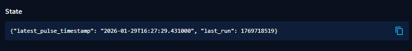
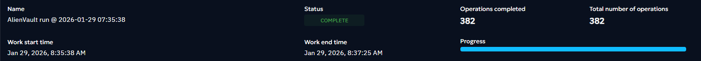
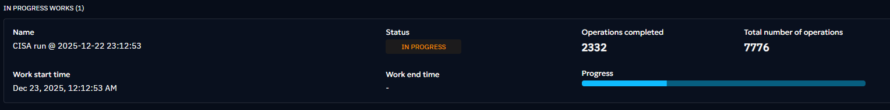

# Common Implementation Guidelines

## Table of Contents

- [Environment Setup](#environment-setup)
- [Directory Structure](#directory-structure)
- [Configuration Management](#configuration-management)
- [Using the Connectors SDK](#using-the-connectors-sdk)
- [STIX 2.1 Object Creation](#stix-21-object-creation)
- [Logging Best Practices](#logging-best-practices)
- [Connector Scopes](#connector-scopes)
- [State Management](#state-management)
- [Error Handling](#error-handling)
- [Traceback](#traceback)
- [Working with the Helper](#working-with-the-helper)

---

## Environment Setup

### Docker Environment

Docker is the recommended approach for production deployments and integration testing.

#### Prerequisites

1. **Install Docker and Docker Compose**
2. **Clone the OpenCTI Docker deployment**:

```bash
git clone https://github.com/OpenCTI-Platform/docker
cd docker
```

3. **Create environment file** with credentials:

```bash
cat << EOF > .env
###########################
# DEPENDENCIES            #
###########################

MINIO_ROOT_USER=opencti
MINIO_ROOT_PASSWORD=changeme
RABBITMQ_DEFAULT_USER=opencti
RABBITMQ_DEFAULT_PASS=changeme
SMTP_HOSTNAME=localhost
OPENSEARCH_ADMIN_PASSWORD=changeme
ELASTIC_MEMORY_SIZE=4G

###########################
# COMMON                  #
###########################

XTM_COMPOSER_ID=8215614c-7139-422e-b825-b20fd2a13a23
COMPOSE_PROJECT_NAME=xtm

###########################
# OPENCTI                 #
###########################

OPENCTI_HOST=localhost
OPENCTI_PORT=8080
OPENCTI_EXTERNAL_SCHEME=http
OPENCTI_ADMIN_EMAIL=admin@opencti.io
OPENCTI_ADMIN_PASSWORD=changeme
OPENCTI_ADMIN_TOKEN=ChangeMe_UUIDv4
OPENCTI_HEALTHCHECK_ACCESS_KEY=changeme

###########################
# OPENCTI CONNECTORS      #
###########################

CONNECTOR_EXPORT_FILE_STIX_ID=dd817c8b-abae-460a-9ebc-97b1551e70e6
CONNECTOR_EXPORT_FILE_CSV_ID=7ba187fb-fde8-4063-92b5-c3da34060dd7
CONNECTOR_EXPORT_FILE_TXT_ID=ca715d9c-bd64-4351-91db-33a8d728a58b
CONNECTOR_IMPORT_FILE_STIX_ID=72327164-0b35-482b-b5d6-a5a3f76b845f
CONNECTOR_IMPORT_DOCUMENT_ID=c3970f8a-ce4b-4497-a381-20b7256f56f0
CONNECTOR_IMPORT_FILE_YARA_ID=7eb45b60-069b-4f7f-83a2-df4d6891d5ec
CONNECTOR_IMPORT_EXTERNAL_REFERENCE_ID=d52dcbc8-fa06-42c7-bbc2-044948c87024
CONNECTOR_ANALYSIS_ID=4dffd77c-ec11-4abe-bca7-fd997f79fa36

###########################
# OPENCTI DEFAULT DATA    #
###########################

CONNECTOR_OPENCTI_ID=dd010812-9027-4726-bf7b-4936979955ae
CONNECTOR_MITRE_ID=8307ea1e-9356-408c-a510-2d7f8b28a0e2
EOF
```

4. **Start OpenCTI**:

```bash
docker compose up -d
```

#### Docker Networking

When OpenCTI is deployed in a folder named `docker`, a network called `docker_default` is created. Your connector must
attach to this network to communicate with OpenCTI services.

In your connector's `docker-compose.yml`:

```yaml
version: '3'
services:
  connector-my-connector:
    image: opencti/connector-my-connector:latest
    environment:
      - OPENCTI_URL=http://opencti:8080
      - OPENCTI_TOKEN=${OPENCTI_ADMIN_TOKEN}
      - CONNECTOR_ID=${CONNECTOR_ID}
      - CONNECTOR_NAME=My Connector
      # Additional connector-specific variables
    networks:
      - default
    restart: unless-stopped

networks:
  default:
    external: true
    name: docker_default
```

#### Running Your Connector with Docker

```bash
cd external-import/my-connector
docker compose up --build
```

### Local Environment

Local development provides faster iteration and easier debugging.

#### Setup Steps

1. **Create a virtual environment**:

```bash
cd external-import/my-connector
python3 -m venv venv
source venv/bin/activate  # On Windows: venv\Scripts\activate
```

2. **Install dependencies**:

```bash
cd src
# Using pip
pip install -r requirements.txt

# Using uv
uv pip install -r requirements.txt
```

3. **Create configuration file**:

```bash
cp config.yml.sample config.yml
```

4. **Edit `config.yml`** with your OpenCTI connection details:

```yaml
opencti:
  url: 'http://localhost:8080'
  token: 'your-opencti-token'

connector:
  id: 'unique-connector-id'  # Generate uuidv4
  name: 'My Connector'
  scope: 'indicator'
  log_level: 'info'
  duration_period: 'PT10M'  # For external import connectors

my_connector:
  api_base_url: 'https://api.example.com'
  api_key: 'your-api-key'
```

5. **Run the connector**:

```bash
python main.py
```

---

## Base Directory Structure

All connectors follow this standardized structure:

```
my-connector/
├── __metadata__/
│   ├── connector_manifest.json
│   └── logo.png (optional)
├── src/
│   ├── connector/
│   │   ├── __init__.py
│   │   ├── connector.py
│   │   ├── converter_to_stix.py
│   │   ├── settings.py
│   │   └── utils.py
│   ├── my_client/
│   │   ├── __init__.py
│   │   └── api_client.py
│   ├── main.py
│   └── requirements.txt
├── tests/
│   ├── test_connector/
│   │   └── test_settings.py
│   ├── conftest.py
│   ├── test_main.py
│   └── test-requirements.txt
├── config.yml.sample
├── docker-compose.yml
├── Dockerfile
├── entrypoint.sh
└── README.md
```

### File Descriptions

| File/Directory                       | Purpose                                                   |
| ------------------------------------ | --------------------------------------------------------- |
| `__metadata__/`                      | Contains metadata for connector catalog and documentation |
| `connector_manifest.json`            | Connector information, version, capabilities              |
| `src/connector/connector.py`         | Main connector logic and processing                       |
| `src/connector/converter_to_stix.py` | STIX object creation and conversion                       |
| `src/connector/settings.py`          | Configuration models with Pydantic validation             |
| `src/connector/utils.py`             | Utility functions and helpers                             |
| `src/my_client/api_client.py`        | External API client implementation                        |
| `src/main.py`                        | Entry point, initializes connector                        |
| `tests/`                             | Unit and integration tests                                |
| `config.yml.sample`                  | Sample configuration for users                            |
| `Dockerfile`                         | Container image definition                                |
| `docker-compose.yml`                 | Docker Compose service definition                         |

---

## Configuration Management

All connectors use **Pydantic** for configuration validation through the connectors-sdk.

### Configuration Structure

Configuration is organized into three sections:

1. **OpenCTI Connection** (`opencti`)
2. **Connector Settings** (`connector`)
3. **Connector-Specific Settings** (custom section)

### Defining Configuration with Pydantic

**File:** `src/connector/settings.py`

```python
from datetime import timedelta
from typing import Literal

from connectors_sdk import (
    BaseConfigModel,
    BaseConnectorSettings,
    BaseExternalImportConnectorConfig,
)
from pydantic import Field, HttpUrl


class ExternalImportConnectorConfig(BaseExternalImportConnectorConfig):
    """
    Override the BaseExternalImportConnectorConfig to add parameters
    and/or defaults specific to external import connectors.
    """
    name: str = Field(
        description="The name of the connector.",
        default="MyConnector",
    )
    duration_period: timedelta = Field(
        description="The period of time to await between two runs.",
        default=timedelta(hours=1),
    )


class MyConnectorConfig(BaseConfigModel):
    """
    Define parameters specific to your connector.
    """
    api_base_url: HttpUrl = Field(
        description="API base URL for the external service."
    )
    api_key: str = Field(
        description="API key for authentication."
    )
    max_tlp_level: Literal["clear", "white", "green", "amber", "red"] = Field(
        description="Maximum TLP level to process.",
        default="amber",
    )
    import_from_date: timedelta = Field(
        description="ISO 8601 duration string specifying how far back to import threat actors (e.g., P1D for 1 day, P7D for 7 days)",
        default=timedelta(days=1),
    )


class ConnectorSettings(BaseConnectorSettings):
    """
    Main settings class that combines all configuration sections.
    """
    connector: ExternalImportConnectorConfig = Field(
        default_factory=ExternalImportConnectorConfig
    )
    my_connector: MyConnectorConfig = Field(
        default_factory=MyConnectorConfig
    )
```

### Configuration File Format

**File:** `config.yml`

```yaml
opencti:
  url: 'http://localhost:8080'
  token: 'ChangeMe'

connector:
  id: 'ChangeMe'
  name: 'My Connector'
  scope: 'indicator,vulnerability'
  log_level: 'info'
  duration_period: 'PT1H'

my_connector:
  api_base_url: 'https://api.example.com'
  api_key: 'ChangeMe'
  max_tlp_level: 'amber'
  import_from_date: 'P1D'
```

### Environment Variables

Configuration can also be provided via environment variables (useful for Docker):

```bash
OPENCTI_URL=http://opencti:8080
OPENCTI_TOKEN=your-token
CONNECTOR_ID=unique-id
CONNECTOR_NAME=My Connector
CONNECTOR_SCOPE=indicator,vulnerability
CONNECTOR_LOG_LEVEL=info
CONNECTOR_DURATION_PERIOD=PT1H
MY_CONNECTOR_API_BASE_URL=https://api.example.com
MY_CONNECTOR_API_KEY=your-api-key
MY_CONNECTOR_MAX_TLP_LEVEL=amber
MY_CONNECTOR_IMPORT_FROM_DATE=P1D
```

**Naming Convention:**

- Section name + field name in UPPERCASE
- Separate with underscores
- Example: `my_connector.api_base_url` → `MY_CONNECTOR_API_BASE_URL`

### Loading Configuration

**File:** `src/main.py`

```python
import traceback

from connector import ConnectorSettings, TemplateConnector
from pycti import OpenCTIConnectorHelper

if __name__ == "__main__":
    try:
        settings = ConnectorSettings()
        helper = OpenCTIConnectorHelper(config=settings.to_helper_config())

        connector = TemplateConnector(config=settings, helper=helper)
        connector.run()
    except Exception:
        traceback.print_exc()
        exit(1)
```

---

## Using the Connectors SDK

The **connectors-sdk** simplifies STIX object creation and ensures compliance.

### Installation

Add to `requirements.txt`:

```text
connectors-sdk @ git+https://github.com/OpenCTI-Platform/connectors.git@master#subdirectory=connectors-sdk
```

### Benefits

- **Type-safe models** for STIX objects
- **Automatic ID generation** (deterministic)
- **Built-in validation** for STIX 2.1 compliance
- **OpenCTI custom properties** support
- **Relationship helpers** for linking objects

### Available Models

Common models include:

**Identity/Author:**

- `OrganizationAuthor`
- `IndividualAuthor`
- `SystemAuthor`

**Observable:**

- `IPV4Address`
- `IPV6Address`
- `DomainName`
- `URL`
- `EmailAddress`
- `FileHash`

**Indicator:**

- `Indicator`

**Threat Actor & Intrusion Set:**

- `ThreatActor`
- `IntrusionSet`

**Malware & Tool:**

- `Malware`
- `Tool`

**Vulnerability:**

- `Vulnerability`

**Marking:**

- `TLPMarking`
- `StatementMarking`

> [!NOTE]  
> Note that not all OpenCTI models are available in the connectors-sdk and some may be missing. We recommend using the connectors-sdk models whenever possible for models that are available. 
>We do our best to complete the connectors-sdk with missing models.

### Basic Usage Example

```python
from connectors_sdk.models import (
    IPV4Address,
    Indicator,
    OrganizationAuthor,
    TLPMarking,
    Vulnerability,
)
from connectors_sdk.models.octi import related_to

# Create author
author = OrganizationAuthor(name="My Threat Feed")

# Create TLP marking
tlp_green = TLPMarking(level="green")

# Create observable
ip = IPV4Address(
    value="192.0.2.1",
    author=author,
    markings=[tlp_green],
)

# Create indicator
indicator = Indicator(
    name="Malicious IP",
    pattern="[ipv4-addr:value = '192.0.2.1']",
    pattern_type="stix",
    valid_from="2026-01-14T00:00:00Z",
    labels=["malicious-activity"],
    author=author,
    markings=[tlp_green],
    score=85,
)

# Create vulnerability
vuln = Vulnerability(
    name="CVE-2024-1234",
    description="Critical vulnerability in Example Software",
    author=author,
    markings=[tlp_green],
)

# Convert to STIX objects
stix_objects = [
    author.to_stix2_object(),
    tlp_green.to_stix2_object(),
    ip.to_stix2_object(),
    indicator.to_stix2_object(),
    vuln.to_stix2_object(),
]
```

---

## STIX 2.1 Object Creation

### Using Connectors SDK (Recommended)

Always use the connectors-sdk for creating STIX objects:

```python
from connectors_sdk.models import Indicator, OrganizationAuthor, TLPMarking

author = OrganizationAuthor(name="Example Source")
tlp = TLPMarking(level="amber")

indicator = Indicator(
    # ID is automatically generated
    name="Malicious domain",
    pattern="[domain-name:value = 'evil.com']",
    pattern_type="stix",
    valid_from="2026-01-14T00:00:00Z",
    labels=["phishing"],
    author=author,
    markings=[tlp],
    score=70,
)

stix_object = indicator.to_stix2_object()
```

### Using stix2 Python library (Accepted Method)

If you must use the legacy stix2 library:

```python
import stix2
from pycti import Indicator

# Generate deterministic ID
indicator_id = Indicator.generate_id("[domain-name:value = 'evil.com']")

indicator = stix2.Indicator(
    id=indicator_id,
    name="Malicious domain",
    pattern="[domain-name:value = 'evil.com']",
    pattern_type="stix",
    valid_from="2026-01-14T00:00:00Z",
)
```

**⚠️ Warning:** Always generate IDs using `pycti` helper methods. Never let stix2 auto-generate IDs as they won't be
deterministic.

### Creating Relationships

Use the relationship helper from connectors-sdk:

Example
```python
from connectors_sdk.models import Relationship
from typing import Optional

def create_tlp_marking(self, level: str) -> TLPMarking:
    tlp_marking = TLPMarking(level=level)
    return tlp_marking

def create_author(self) -> OrganizationAuthor:
    author = OrganizationAuthor(name="Connector Enrichment")
    return author

def create_relationship(
        self,
        relationship_type: str,
        source_obj,
        target_obj,
        start_time: Optional[str] = None,
        stop_time: Optional[str] = None,
    ) -> Relationship:
        """
        Creates Relationship object
        """
        author = create_author()
        tlp_amber = create_tlp_marking("amber")

        return Relationship(
            type=relationship_type,
            source=source_obj,
            target=target_obj,
            author=author,
            start_time=start_time,
            stop_time=stop_time,
            markings=[tlp_amber],
        )

relation = create_relationship(
    source_obj=source_obj_id,
    relationship_type="related-to",
    target_obj=target_obj_id,
    start_time=first_seen_datetime,
    stop_time=last_seen_datetime,
)
```

---

## Logging Best Practices

### Using the Connector Logger

Always use `self.helper.connector_logger`:

```python
# Info level - general information
self.helper.connector_logger.info(
    "Starting data collection",
    {"source": "api.example.com"}
)

# Debug level - detailed information for debugging
self.helper.connector_logger.debug(
    "API response received",
    {"status_code": 200, "items": 42}
)

# Warning level - something unexpected but not fatal
self.helper.connector_logger.warning(
    "Rate limit approaching",
    {"remaining": 10, "reset_time": reset_time}
)

# Error level - errors that prevent processing
self.helper.connector_logger.error(
    "Failed to fetch data",
    {"error": str(e), "url": url}
)
```

### Log Levels

Set via `CONNECTOR_LOG_LEVEL` environment variable or `connector.log_level` in config:

- `debug` - Verbose output for development
- `info` - General operational messages (recommended)
- `warning` - Unexpected situations
- `error` - Errors that prevent operation

### Structured Logging

Always pass context as a dictionary:

```python
# Good - structured
self.helper.connector_logger.info(
    "Processing entity",
    {"entity_id": entity_id, "entity_type": entity_type}
)

# Bad - string concatenation
self.helper.connector_logger.info(
    f"Processing entity {entity_id} of type {entity_type}"
)
```

---

## Connector Scopes

The `scope` parameter in OpenCTI connectors defines **what the connector handles**. Its behavior depends on the connector type.

**Scope never filters the bundle content.** It only controls **when/how the platform triggers the connector**.

- For `EXTERNAL_IMPORT`: scope is purely descriptive metadata. The platform registers it but does not use it for filtering. Everything in the bundle is ingested.
- For `INTERNAL_ENRICHMENT`: scope determines which entity types trigger the connector. Without `Indicator` in the scope, the connector won't be called when enriching an Indicator. But if the connector's response bundle contains Indicators, they **will** be ingested.
- For `INTERNAL_IMPORT_FILE`: scope determines which file MIME types trigger the connector.


## State Management

Connectors can persist state between runs to track progress.

### Getting Current State

```python
current_state = self.helper.get_state()

if current_state is None:
    # First run
    current_state = {"last_run": None}
```

### Updating State

```python
from datetime import datetime, timezone

now = datetime.now(timezone.utc)
current_timestamp = int(now.timestamp())

# Update state
new_state = {
    "last_run": now.strftime("%Y-%m-%d %H:%M:%S"),
    "last_timestamp": current_timestamp,
    "items_processed": 42,
}

self.helper.set_state(new_state)
```

### State Use Cases

- **Last run timestamp** - For incremental imports
- **Cursor/pagination** - Resume from last position
- **Processing markers** - Track what's been processed
- **Rate limit tracking** - Monitor API usage

### Example: Incremental Import

```python
def process_message(self) -> None:
    try:
        current_start_time = datetime.now(timezone.utc).isoformat()
        current_state = self.helper.get_state()

        # Retrieve previous run information
        last_run_start = current_state.get("last_run_start") if current_state else None
        last_run_with_data = current_state.get("last_run_with_data") if current_state else None

        self.helper.connector_logger.info(
            "[CONNECTOR] Starting connector...",
            {
                "connector_name": self.config.connector.name,
                "last_run_start": last_run_start or "Never run",
                "last_run_with_data": last_run_with_data or "Never ingested data",
            },
        )

        # Collect and process intelligence
        collected_data = self._collect_intelligence()

        if collected_data:
            stix_objects = self._convert_to_stix(collected_data)
            self._send_to_opencti(stix_objects)
            last_run_with_data = datetime.now(timezone.utc).isoformat()

        # Update state
        new_state = {"last_run_start": current_start_time}
        if last_run_with_data:
            new_state["last_run_with_data"] = last_run_with_data

        self.helper.set_state(new_state)

    except (KeyboardInterrupt, SystemExit):
        self.helper.connector_logger.info("[CONNECTOR] Connector stopped...")
        sys.exit(0)
    except Exception as err:
        self.helper.connector_logger.error(str(err))
```

Example of state display on OpenCTI UI (Data -> Ingestion -> Connector Name)



---

## Error Handling

### Exception Handling Pattern

```python
def process_message(self, data: dict) -> str:
    try:
        # Main processing logic
        result = self._process_data(data)
        return f"Successfully processed {result}"

    except KeyError as e:
        # Handle missing data
        self.helper.connector_logger.error(
            "Missing required field",
            {"error": str(e), "data": data}
        )
        return f"Failed: missing field {e}"

    except requests.exceptions.RequestException as e:
        # Handle API errors
        self.helper.connector_logger.error(
            "API request failed",
            {"error": str(e)}
        )
        return f"Failed: API error {e}"

    except Exception as e:
        # Catch-all for unexpected errors
        self.helper.connector_logger.error(
            "Unexpected error",
            {"error": str(e), "type": type(e).__name__}
        )
        raise  # Re-raise unexpected errors
```

### Traceback

Use custom exceptions for **clarity and control**; use `raise ... from ...` to **preserve the traceback** and maintain context.

Example :

```python
# NOT VALID ❌
from external_import_connector import ConnectorTemplate

connector = ConnectorTemplate()
connector.run()

# VALID ✅
import traceback

from external_import_connector import ConnectorTemplate

if __name__ == "__main__":   
    try:
        connector = ConnectorTemplate()
        connector.run()
    except Exception:
        traceback.print_exc()
        exit(1)

```

### Retry Logic

Use the `tenacity` library for retry logic with exponential backoff:

```python
import requests
from tenacity import retry, stop_after_attempt, wait_exponential_jitter

@retry(
    stop=stop_after_attempt(3),  # Max 3 attempts
    wait=wait_exponential_jitter(initial=1, max=60, jitter=1),  # Exponential backoff with jitter
)
def fetch_with_retry(self, url: str):
    response = requests.get(url)
    response.raise_for_status()
    return response.json()
```

- **`stop_after_attempt(3)`** - Give up after 3 attempts
- **`wait_exponential_jitter`** - Wait times increase exponentially (~1s, ~2s, ~4s...) with random jitter to avoid thundering herd
- **`raise_for_status()`** - Raises exception on HTTP errors, triggering retry

---

## Working with the Helper

The `OpenCTIConnectorHelper` provides essential methods for interacting with OpenCTI.

### Initialization

```python
from pycti import OpenCTIConnectorHelper

settings = ConnectorSettings()
helper = OpenCTIConnectorHelper(config=settings.to_helper_config())
```

### Common Helper Methods

#### Creating and Sending Bundles

```python
# Create bundle from STIX objects
bundle = self.helper.stix2_create_bundle(stix_objects)

# Send bundle to OpenCTI
bundles_sent = self.helper.send_stix2_bundle(
    bundle,
    work_id=work_id,
    cleanup_inconsistent_bundle=True,
)
```
> [!CAUTION]
> If we use `cleanup_inconsistent_bundle`, it is important to include all STIX entities, including marking definitions AND author. In the case of markings that can be customized via configuration, it is essential to include all the basic options provided by STIX and add them to the final bundle.


For `send_stix2_bundle`, each connector that used this method can have `cleanup_inconsistent_bundle` set to `True` to avoid `MISSING_REFERENCE_ERROR` and to be more consistent

Commit change since ≥ 6.3.3: https://github.com/OpenCTI-Platform/client-python/commit/3f6fbb4cb26a7c26ba021f4d5b51c6891e33c21e


Example

```python
      stix_objects.append(self.converter_to_stix.author)
      stix_objects.append(self.tlp_marking)

      stix_bundle = self.helper.stix2_create_bundle(stix_objects)
      self.helper.send_stix2_bundle(
          stix_bundle,
          work_id=work_id,
          cleanup_inconsistent_bundle=True,
    )
```

#### Work Management ⚠️⚠️⚠️

Always initiate a work before pushing data.
For self-triggered connectors, OpenCTI has to be told about new jobs to process and to import. This is done by registering a so called work before sending the stix bundle and signalling the end of a work.

Methods come from client-python

```python
# Initialize work
work_id = self.helper.api.work.initiate_work(
    self.helper.connect_id,
    "Importing threat feed"
)

# Mark work as completed
self.helper.api.work.to_processed(
    work_id,
    "Successfully imported 42 indicators"
)
```
These functions are part of a work lifecycle for OpenCTI connectors:

  1. initiate_work → Creates the work item
  2. to_received → Marks work as received/acknowledged
  3. add_expectations → Sets how many items are expected to be processed
  4. report_expectation → Reports progress/errors for each item
  5. to_processed → Marks the work as complete

This provides observability into connector runs via the OpenCTI UI.


**INITIALIZE A WORK**

Purpose of `initiate_work`: Creates a new work item (job) in OpenCTI for a connector to track its processing

_How it works_

1. Only executes if self.api.bundle_send_to_queue is truthy (i.e., the API is configured to send bundles to a queue)
2. Logs the initiation with the connector ID
3. Executes a GraphQL workAdd mutation with:
   - connectorId: identifies which connector is creating this work
   - friendlyName: a human-readable name for this work item
4. Returns the newly created work's id

_Use case_

Called at the start of a connector run to create a trackable work item that can then be updated with
progress, expectations, and completion status.

**COMPLETED WORK**

Purpose of `to_processed`: Marks a work item as "processed" (completed), indicating the connector has finished its task.

_How it works_

1. Only executes if self.api.bundle_send_to_queue is truthy
2. Logs the update with the work ID
3. Executes a GraphQL workToProcessed mutation with:
   - id: the work item to update
   - message: a status message describing the outcome
   - inError: boolean flag indicating if processing ended with an error (default: False)

_Use case_ 

Called when a connector finishes processing to signal completion. The in_error flag allows distinguishing
successful completion from error states.

Example of work vizualisation on OpenCTI UI

_Completed status_


_In progress status_



#### TLP Checking

```python
# Check if entity TLP is within allowed level
is_valid = self.helper.check_max_tlp(
    entity_tlp,
    self.config.my_connector.max_tlp_level
)

if not is_valid:
    self.helper.connector_logger.warning(
        "Entity TLP exceeds maximum allowed level"
    )
    return
```

#### Querying OpenCTI API (available but NOT recommended)

```python
# Get entity by ID
entity = self.helper.api.stix_domain_object.read(id=entity_id)

# Search indicators
indicators = self.helper.api.indicator.list(
    filters=[{
        "key": "pattern_type",
        "values": ["stix"]
    }]
)
```

### Common Helper Properties

 Common Properties (All Connector Types)

  | Property               | Description                                    |
  | ---------------------- | ---------------------------------------------- |
  | `helper.connect_id`    | Connector's unique ID                          |
  | `helper.connect_name`  | Connector's name                               |
  | `helper.connect_type`  | Connector type                                 |
  | `helper.connect_scope` | Connector's scope (mime types or entity types) |
  | `helper.log_level`     | Logging level                                  |


## Next Steps

After understanding these common implementation patterns:

1. **External Import Connectors**: Read [External Import Specifications](./02-external-import-specifications.md)
2. **Internal Enrichment Connectors**:
   Read [Internal Enrichment Specifications](./03-internal-enrichment-specifications.md)
3. **Stream Connectors**: Read [Stream Connector Specifications](./04-stream-specifications.md)
4. **Code Quality**: Review [Code Quality & Standards](./05-code-quality-standards.md)
