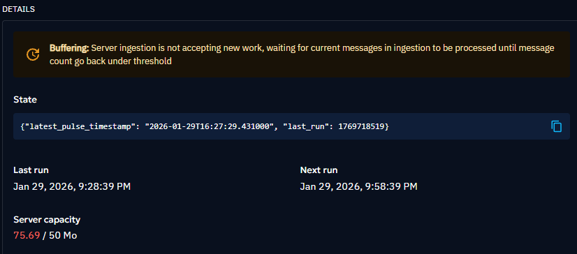

# External Import Connector Specifications

## Table of Contents

- [Overview](#overview)
- [Connector Architecture](#connector-architecture)
- [Scheduling and Execution](#scheduling-and-execution)
- [Work Management](#work-management)
- [State Management](#state-management)
- [Data Collection](#data-collection)
- [STIX Bundle Creation](#stix-bundle-creation)
- [Data Deduplication Strategies](#data-deduplication-strategies)
- [Import History and Dates](#import-history-and-dates)
- [Rate Limiting](#rate-limiting)
- [Incremental Import Strategies](#incremental-import-strategies)
- [Best Practices](#best-practices)
- [Complete Example](#complete-example)

---

## Overview

External Import connectors fetch data from external sources (APIs, feeds, databases) and import it into OpenCTI as STIX 2.1 objects.

### Purpose

- Import threat intelligence from external sources
- Periodically fetch and synchronize data
- Convert external data formats to STIX 2.1
- Maintain state for incremental imports

### Key Characteristics

- **Scheduled execution**: Runs at configured intervals
- **Pull-based**: Connector initiates data fetching
- **Stateful**: Tracks what has been imported
- **Autonomous**: Runs independently without user triggers

### Use Cases

- Threat intelligence feed ingestion
- OSINT data collection
- Vendor API integration
- Custom data source imports
- RSS/Atom feed parsing

---

## Connector Architecture

### Class Structure

```python
from connector.converter_to_stix import ConverterToStix
from connector.settings import ConnectorSettings
from pycti import OpenCTIConnectorHelper
from my_client import MyClient


class MyConnector:
    """
    External Import connector for fetching threat intelligence.
    """

    def __init__(self, config: ConnectorSettings, helper: OpenCTIConnectorHelper):
        """Initialize the connector."""
        self.config = config
        self.helper = helper

        # Initialize API client
        self.client = MyClient(
            self.helper,
            base_url=self.config.my_connector.api_base_url,
            api_key=self.config.my_connector.api_key,
        )

        # Initialize STIX converter
        self.converter_to_stix = ConverterToStix(
            self.helper,
            author_name="My Threat Feed",
            tlp_level=self.config.my_connector.tlp_level,
        )

    def _collect_intelligence(self) -> list:
        """
        Collect intelligence from the source.
        Returns list of STIX objects.
        """
        # Implementation here
        pass

    def process_message(self) -> None:
        """
        Main processing method called by scheduler.
        """
        # Implementation here
        pass

    def run(self) -> None:
        """
        Start the connector and schedule execution.
        """
        self.helper.schedule_process(
            message_callback=self.process_message,
            duration_period=self.config.connector.duration_period.total_seconds(),
        )
```

### Recommended Methods and Purpose

| Method                    | Purpose                                     |
| ------------------------- | ------------------------------------------- |
| `__init__`                | Initialize connector, client, and converter |
| `_collect_intelligence()` | Fetch and convert external data to STIX     |
| `process_message()`       | Main processing logic, work management      |
| `run()`                   | Start scheduler and begin execution         |

---

## Auto backpressure, Scheduling and Execution

### Configuration

External import connectors use `duration_period` for scheduling:

```yaml
connector:
  duration_period: 'PT1H'  # ISO-8601 duration format
```

**Common durations:**
- `PT5M` - Every 5 minutes
- `PT1H` - Every hour
- `PT6H` - Every 6 hours
- `PT24H` - Every 24 hours (daily)

### Scheduler Implementation

```python
def run(self) -> None:
    """
    Start the connector and schedule periodic execution.
    """
    self.helper.schedule_process(
        message_callback=self.process_message,
        duration_period=self.config.connector.duration_period.total_seconds(),
    )
```

### Queue Threshold

The scheduler automatically checks the connector's queue size before each run:

```yaml
connector:
  queue_threshold: 500  # MB
```

If the queue exceeds this threshold, the next run is postponed until the queue is processed.

When the RabbitMQ queue capacity exceeds the defined threshold (for example, if queue_message_size is at 9.90 MB and queue_threshold is configured to 8 MB), the connector automatically switches to ‘Buffering’ mode.

In ‘Buffering’ mode, the connector’s execution is paused until the queue capacity falls below the specified threshold. The user interface displays visual indicators to signal this state change, including a warning message and a color change in the ‘Server Capacity’ section.

Buffering mode displayed on OpenCTI UI


More details on our Filigran blog: [Auto backpressure Contrtol Article](https://filigran.io/auto-backpressue-control-octi-connectors/#:~:text=Display%20of%20Details%20for%20Connectors%20in%20%E2%80%98Buffering%E2%80%99%20Mode)

### First Run

The connector runs immediately on startup, then follows the schedule:

```python
def process_message(self) -> None:
    current_state = self.helper.get_state()

    if current_state is None or "last_run" not in current_state:
        self.helper.connector_logger.info("First run of connector")
    else:
        self.helper.connector_logger.info(
            "Connector last run",
            {"last_run": current_state["last_run"]}
        )

    # Continue processing...
```

---

## Work Management

Work management tracks individual connector runs in OpenCTI.

### Initiating Work

```python
def process_message(self) -> None:
    # Create friendly name for this work
    friendly_name = f"{self.helper.connect_name} - {datetime.now().isoformat()}"

    # Initiate work
    work_id = self.helper.api.work.initiate_work(
        self.helper.connect_id,
        friendly_name
    )

    self.helper.connector_logger.info(
        "Work initiated",
        {"work_id": work_id}
    )

    # Perform data collection
    stix_objects = self._collect_intelligence()

    # Send bundle
    if len(stix_objects) > 0:
        bundle = self.helper.stix2_create_bundle(stix_objects)
        self.helper.send_stix2_bundle(
            bundle,
            work_id=work_id,
            cleanup_inconsistent_bundle=True,
        )

    # Mark work as completed
    message = f"Imported {len(stix_objects)} objects"
    self.helper.api.work.to_processed(work_id, message)
    self.helper.connector_logger.info(message)
```

### Work Status

Work can have different statuses:
- **In Progress**: Work is being processed
- **Completed**: Work finished successfully
- **Failed**: Work encountered an error

### Error Handling in Work

```python
try:
    # Processing logic
    stix_objects = self._collect_intelligence()

    # Send bundle
    bundle = self.helper.stix2_create_bundle(stix_objects)
    self.helper.send_stix2_bundle(bundle, work_id=work_id)

    # Mark as completed
    self.helper.api.work.to_processed(
        work_id,
        f"Successfully imported {len(stix_objects)} objects"
    )

except Exception as e:
    self.helper.connector_logger.error(
        "Import failed",
        {"error": str(e)}
    )
    # Work will remain in "In Progress" or be marked as failed
    raise
```

Here a reminder for work mannagement on [Common Implementation](./01-common-implementation.md#work-management)

---

## State Management

State management enables incremental imports and tracks connector progress.

### State Structure

```python
state = {
    "last_run": "2026-01-14 10:30:00",
    "last_timestamp": 1705229400,
    "cursor": "abc123xyz",
    "items_processed": 1542,
}
```

### Reading State

```python
def process_message(self) -> None:
    # Get current state
    current_state = self.helper.get_state()

    # Initialize state if first run
    if current_state is None:
        current_state = {
            "last_run": None,
            "last_timestamp": None,
        }

    # Use state to determine what to fetch
    if current_state["last_timestamp"]:
        start_time = current_state["last_timestamp"]
    else:
        # First run - use configured start date
        start_time = self.config.my_connector.import_from_date
```

### Updating State

```python
def process_message(self) -> None:
    # ... processing logic ...

    # Update state after successful import
    now = datetime.now(timezone.utc)
    new_state = {
        "last_run": now.strftime("%Y-%m-%d %H:%M:%S"),
        "last_timestamp": int(now.timestamp()),
        "items_processed": len(stix_objects),
    }

    self.helper.set_state(new_state)
    self.helper.connector_logger.info(
        "State updated",
        {"state": new_state}
    )
```

### State Best Practices

1. **Update after successful processing** - Don't update state if processing fails
2. **Include enough context** - Store what you need to resume
3. **Use timestamps for time-based imports** - More reliable than dates
4. **Store cursors for paginated APIs** - Resume exactly where you left off
5. **Keep state minimal** - Don't store large objects

---

## Data Collection

### Collection Example Method

```python
def _collect_intelligence(self) -> list:
    """
    Collect intelligence from external source and convert to STIX.

    Returns:
        List of STIX objects
    """
    stix_objects = []

    # Get current state to determine what to fetch
    current_state = self.helper.get_state()
    start_date = self._get_start_date(current_state)

    self.helper.connector_logger.info(
        "Collecting intelligence",
        {"start_date": start_date}
    )

    # Fetch data from external source
    try:
        data = self.client.get_threat_data(since=start_date)
    except Exception as e:
        self.helper.connector_logger.error(
            "Failed to fetch data",
            {"error": str(e)}
        )
        raise

    # Convert each item to STIX objects
    for item in data:
        try:
            # Convert to STIX
            converted_objects = self.converter_to_stix.convert_item(item)
            stix_objects.extend(converted_objects)

        except Exception as e:
            self.helper.connector_logger.warning(
                "Failed to convert item, skipping",
                {"item_id": item.get("id"), "error": str(e)}
            )
            continue

    # Add author and marking
    if len(stix_objects) > 0:
        stix_objects.append(self.converter_to_stix.author)
        stix_objects.append(self.converter_to_stix.tlp_marking)

    self.helper.connector_logger.info(
        "Intelligence collected",
        {"objects_count": len(stix_objects)}
    )

    return stix_objects
```

### Pagination Handling Example

```python
def _collect_intelligence(self) -> list:
    """Collect with pagination support."""
    stix_objects = []
    page = 1
    has_more = True

    while has_more:
        self.helper.connector_logger.debug(
            "Fetching page",
            {"page": page}
        )

        # Fetch page
        response = self.client.get_data(page=page, per_page=100)
        items = response["items"]

        # Convert items
        for item in items:
            converted = self.converter_to_stix.convert_item(item)
            stix_objects.extend(converted)

        # Check if more pages
        has_more = len(items) == 100
        page += 1

    return stix_objects
```

---

## STIX Bundle Creation

### Bundle Structure

A STIX bundle must include:
1. **Knowledge objects** (indicators, observables, etc.)
2. **Author** (identity object)
3. **Markings** (TLP, statement markings)
4. **Relationships** (between objects)

### Creating the Bundle

```python
def process_message(self) -> None:
    # Collect STIX objects
    stix_objects = self._collect_intelligence()

    if len(stix_objects) > 0:
        # Create bundle
        bundle = self.helper.stix2_create_bundle(stix_objects)

        # Send to OpenCTI
        bundles_sent = self.helper.send_stix2_bundle(
            bundle,
            work_id=work_id,
            cleanup_inconsistent_bundle=True,
        )

        self.helper.connector_logger.info(
            "Bundle sent",
            {"bundles_count": len(bundles_sent), "objects_count": len(stix_objects)}
        )
    else:
        self.helper.connector_logger.info("No new data to import")
```

### Bundle Best Practices

1. **Always include author** - Required for proper attribution
2. **Include appropriate markings** - TLP, PAP, statement markings
3. **Create relationships** - Link related objects
4. **Batch appropriately** - Don't send too many objects at once (< 1000 recommended)

Reminder about cleanup_inconsistent_bundle: [Caution Clean Up Inconsistent Bundle](./01-common-implementation.md#creating-and-sending-bundles)

### Large Dataset Handling

When handling large datasets (e.g., 200k+ entities), batch processing is essential to avoid memory issues and provide progress visibility.

**Use case:** Importing a large MISP instance with hundreds of thousands of indicators.

Example of implementation

```python
def process_message(self) -> None:
    """Process large datasets in batches with individual work tracking."""
    stix_objects = self._collect_intelligence()

    batch_size = 500
    total_batches = (len(stix_objects) + batch_size - 1) // batch_size

    self.helper.connector_logger.info(
        "Processing large dataset",
        {"total_objects": len(stix_objects), "batch_size": batch_size, "total_batches": total_batches}
    )

    for batch_num, i in enumerate(range(0, len(stix_objects), batch_size), start=1):
        batch = stix_objects[i:i + batch_size]

        # Each batch gets its own work for progress tracking
        work_id = self.helper.api.work.initiate_work(
            self.helper.connect_id,
            f"Import - Batch {batch_num}/{total_batches}"
        )

        # Include author and marking in each batch
        batch_with_meta = batch + [
            self.converter_to_stix.author,
            self.converter_to_stix.tlp_marking
        ]

        bundle = self.helper.stix2_create_bundle(batch_with_meta)
        self.helper.send_stix2_bundle(
            bundle,
            work_id=work_id,
            cleanup_inconsistent_bundle=True,
        )

        # Mark batch as complete
        self.helper.api.work.to_processed(
            work_id,
            f"Batch {batch_num}/{total_batches} - {len(batch)} objects"
        )

        # Update state after each batch to avoid data loss on failure
        self.helper.set_state({
            "last_batch": batch_num,
            "last_run": datetime.now(timezone.utc).isoformat()
        })

        self.helper.connector_logger.info(
            "Batch processed",
            {"batch": batch_num, "total": total_batches, "objects": len(batch)}
        )
```

**Key points:**
- **One work per batch** - Allows progress tracking in OpenCTI UI
- **Include metadata in each batch** - Author and markings must be in every bundle when using `cleanup_inconsistent_bundle=True`
- **Update state after each batch** - If the connector fails mid-import, the next run can resume from the last successful batch instead of restarting from scratch
- **Log progress** - Essential for monitoring long-running imports

---

## Data Deduplication Strategies

OpenCTI uses a layered approach: deterministic IDs catch obvious duplicates at creation time, confidence levels govern whether incoming data can overwrite existing entries, and manual merging covers edge cases where automatic deduplication isn't sufficient

### Core concept

One of the core concepts of the OpenCTI knowledge graph is the underlying mechanisms implemented to accurately de-duplicate and consolidate (aka. upserting) information about entities and relationships. When an object is created in the platform, whether manually by a user or automatically by the connectors/workers chain, the platform checks if something already exists based on some properties of the object. If the object already exists, it will return the existing object and, in some cases, update it as well.

### Deterministic IDs (ID Contributing Properties)

OpenCTI generates deterministic IDs based on listed properties (aka "ID Contributing Properties") to prevent duplicates. There is also a special link between name and aliases: the name and aliases of an entity define a set of unique values, so it's not possible to have the name equal to an alias and vice versa, and entities cannot have overlapping aliases or an alias already used in the name of another entity.

Each entity type has its own contributing properties. For example:

- **Threat Actor / Tool / Vulnerability** → `name OR alias`
- **Report** → `name AND published date`
- **Organization** → `(name OR x_opencti_alias) AND identity_class`
- **Relationship** → `type + source + target + start/stop time (within a ±30-day window)`

---

### STIX Cyber Observables

For STIX Cyber Observables, OpenCTI also generates deterministic IDs based on the STIX specification using the "ID Contributing Properties" defined for each type of observable. In cases where an entity already exists in the platform, incoming creations can trigger updates to the existing entity's attributes.

---

### Confidence Level-Based Deduplication

The deduplication mechanism relies on the Confidence Level attribute of each STIX Object, as well as identification keys for each object. If an object is created with the same identification keys as an existing one, it will replace the existing object only if the Confidence Level of the new object is higher or equal to the existing one's. Connectors have a Confidence Level in their configuration file that can be used for deduplication purposes and if a connector imports an object already existing in the platform, it will only replace the existing one if its Confidence Level is higher or equal.

This is the **upsert rule**: new data can enrich existing data, but only if it comes from a source of equal or higher confidence.

---

### Manual Merging

Within the OpenCTI platform, the merge capability is present in the "Data > Entities" tab. To execute a merge, select the set of entities to be merged, then click on the Merge icon. It is not possible to merge entities of different types, nor is it possible to merge more than 4 entities at a time. Central to the merging process is the selection of a main entity and this primary entity becomes the anchor, retaining crucial attributes such as name and description. Other entities, while losing specific fields like descriptions, are aliased under the primary entity.

Key points about merging:

- Even if the merged entities were initially created by distinct sources, the platform ensures that data is not lost. Upon merging, the platform automatically generates relationships directly on the merged entity, ensuring that all connections, regardless of their origin, are anchored to the consolidated entity.
- It's essential to know that a merge operation is **irreversible**.

---

### Limitations

This deduplication mechanism, although powerful, still has limitations: it is not possible to associate a Confidence Level with an OCTI Live Stream or a TAXII/RSS Feed and you have no choice but to use the Confidence Level set by the source of the stream or feed. If the source has set a Confidence Level of 100 on an object, it will overwrite the existing one in your platform, even if you value it highly.

---

### Summary Table

| Strategy                      | Trigger                                   | Mechanism                                                 |
| ----------------------------- | ----------------------------------------- | --------------------------------------------------------- |
| **Automatic deduplication**   | Object creation (manual or via connector) | Deterministic IDs from contributing properties            |
| **Alias-based deduplication** | Shared name/alias between entities        | Unique alias set enforcement                              |
| **Confidence-based upsert**   | Incoming data from connectors/feeds       | Higher or equal confidence overwrites existing            |
| **STIX Observable dedup**     | Observable ingestion                      | STIX spec ID contributing properties                      |
| **Manual merge**              | User action                               | Up to 4 entities, irreversible, relationship preservation |

### Why You Must Explicitly Generate IDs in Your Connector ?

When building a connector or any external import that pushes STIX bundles into OpenCTI, you **must** always set a deterministic `id` on your STIX objects using pycti's `generate_id` class methods, rather than letting the `stix2` library auto-generate a random UUID.

The reason is rooted in how OpenCTI's deduplication engine works: the platform identifies whether an incoming object already exists by comparing its **standard ID** (`standard_id`). This standard ID is itself a **deterministic UUID v5** derived from the object's "ID Contributing Properties" (e.g. `name` for a Malware, `name + published date` for a Report, etc.).

> [!IMPORTANT]  
> If you let `stix2` generate a random ID, OpenCTI will receive a **different ID every time** the same object is imported. Even though the deduplication engine will eventually recognize it as the same entity (by its name or key properties), it will register the random ID as an additional `stix_id` on the object. Each new import adds another entry to the `x_opencti_stix_ids` list, which grows unboundedly — causing memory bloat, performance degradation, and inconsistency in the platform's Redis streams.

Using the `generate_id` method included for many object types in the pycti library prevents the `stix_ids` list from growing, since the `standard_id` will be the same every time the same object is pushed.

#### How to Use `generate_id`

The `generate_id` static method is available directly on each entity class exported by pycti. It takes the object's **ID Contributing Properties** as arguments — exactly the same fields that OpenCTI uses server-side for deduplication.

The recommended pattern is to always combine `stix2` (to build the STIX object itself) with `pycti` (to generate the deterministic ID):

```python
import stix2
from pycti import Malware, Report, Indicator

# --- Malware (contributing property: name) ---
malware = stix2.Malware(
    id=Malware.generate_id("MyMalwareName"),
    name="MyMalwareName",
    description="A dangerous piece of malware.",
    is_family=False,
)

# --- Indicator (contributing property: pattern) ---
indicator = stix2.Indicator(
    id=Indicator.generate_id("[domain-name:value = 'evil.com']"),
    name="Malicious domain",
    pattern="[domain-name:value = 'evil.com']",
    pattern_type="stix",
    valid_from="2024-01-01T00:00:00Z",
)

# --- Report (contributing properties: name + published date) ---
report = stix2.Report(
    id=Report.generate_id("My Threat Report", "2024-01-01T00:00:00Z"),
    name="My Threat Report",
    published="2024-01-01T00:00:00Z",
    report_types=["threat-report"],
    object_refs=[malware.id, indicator.id],
)
```

> ⚠️ **The arguments passed to `generate_id` must exactly match the object's ID Contributing Properties**, as defined in OpenCTI's deduplication rules. Passing different values will generate a different ID, defeating the purpose.


#### What Happens Without `generate_id`

| Scenario                    | Without `generate_id`                                                                 | With `generate_id`                                         |
| --------------------------- | ------------------------------------------------------------------------------------- | ---------------------------------------------------------- |
| First import                | Object created, random UUID stored as `standard_id`                                   | Object created, deterministic UUID stored as `standard_id` |
| Second import (same object) | Platform deduplicates by name but appends the new random UUID to `x_opencti_stix_ids` | Platform deduplicates, no new `stix_id` added — IDs match  |
| Nth import                  | `x_opencti_stix_ids` list keeps growing                                               | List stays stable                                          |
| Performance impact          | Increasing memory usage, Redis stream bloat                                           | None                                                       |


#### Available `generate_id` Methods by Entity Type

Most core SDO types in pycti expose `generate_id`. 

Key examples:

| Entity                                       | Key contributing argument(s) |
| -------------------------------------------- | ---------------------------- |
| `Malware`                                    | `name`                       |
| `ThreatActorGroup` / `ThreatActorIndividual` | `name`                       |
| `Indicator`                                  | `pattern`                    |
| `Report`                                     | `name`, `published` (date)   |
| `Vulnerability`                              | `name`                       |
| `AttackPattern`                              | `name`                       |
| `IntrusionSet`                               | `name`                       |
| `Identity` / `Organization`                  | `name`, `identity_class`     |

For **STIX Cyber Observables** (SCOs like `IPv4-Addr`, `DomainName`, etc.), OpenCTI follows the STIX 2.1 specification's own deterministic ID algorithm, so using the standard `stix2` library constructors with the correct `value` field is generally sufficient but wrapping with pycti's observable helpers is still recommended for consistency.

### Summary

To create a STIX object in a connector, use the `stix2` library for the object structure and always use pycti's `generate_id` to produce a predictable, deterministic ID, this is the official recommendation from the OpenCTI connector template. Skipping this step is a common source of data quality issues and platform performance degradation over time.


## Import History and Dates

When importing historical data, it's important to manage dates correctly to ensure accurate state management and incremental imports. We recommend to use ISO-8601 date format for all date fields in your connector configuration and state management. 
This format is widely supported and can be easily parsed in Python.

When configuring the `import_start_date` (or equivalent history parameter) of a connector, OpenCTI recommends using relative/duration-based dates (e.g., ISO 8601 durations like P30D, P1Y) rather than absolute dates (e.g., 2021-01-01).

Relative dates make connector configurations robust, portable, and safe by design, while absolute dates create a that grows more problematic the longer the platform runs.


## Rate Limiting

Use the `limiter` library for rate limiting and `tenacity` for retry logic:

```python
import requests
from limiter import Limiter
from tenacity import retry, stop_after_attempt, wait_exponential_jitter


class MyClient:
    def __init__(self, helper, base_url: str, api_key: str):
        self.helper = helper
        self.base_url = base_url
        self.api_key = api_key

        # Rate limiter: 10 requests per second, bucket capacity of 20
        self.rate_limiter = Limiter(
            rate=10,
            capacity=20,
            bucket="my_connector",
        )

    @retry(
        stop=stop_after_attempt(3),
        wait=wait_exponential_jitter(initial=1, max=60, jitter=1),
    )
    def _request(self, endpoint: str):
        """Make request with retry logic."""
        response = requests.get(
            f"{self.base_url}/{endpoint}",
            headers={"Authorization": f"Bearer {self.api_key}"}
        )
        response.raise_for_status()
        return response.json()

    def get_data(self, endpoint: str):
        """Fetch data with rate limiting and retry."""
        with self.rate_limiter:
            return self._request(endpoint)
```

- **`limiter`** - Controls request rate to avoid hitting API limits
- **`tenacity`** - Retries failed requests with exponential backoff

See also: [Retry Logic in Common Implementation](./01-common-implementation.md#retry-logic)

---

## Incremental Import Strategies

### Time-Based Incremental Import

```python
def _collect_intelligence(self) -> list:
    """Collect only new/updated data since last run."""
    current_state = self.helper.get_state()

    # Determine start time
    if current_state and "last_timestamp" in current_state:
        start_time = current_state["last_timestamp"]
    else:
        # First run - use configured start date
        start_time = self._parse_date(
            self.config.my_connector.import_from_date
        )

    # Fetch only data modified after start_time
    data = self.client.get_data(modified_since=start_time)

    # Convert to STIX
    stix_objects = []
    for item in data:
        converted = self.converter_to_stix.convert_item(item)
        stix_objects.extend(converted)

    return stix_objects
```

### Cursor-Based Incremental Import

```python
def _collect_intelligence(self) -> list:
    """Collect using cursor pagination."""
    current_state = self.helper.get_state()
    cursor = current_state.get("cursor") if current_state else None

    stix_objects = []
    has_more = True

    while has_more:
        # Fetch data with cursor
        response = self.client.get_data(cursor=cursor)

        # Convert items
        for item in response["items"]:
            converted = self.converter_to_stix.convert_item(item)
            stix_objects.extend(converted)

        # Update cursor for next run
        cursor = response.get("next_cursor")
        has_more = cursor is not None

        # Save state periodically
        if cursor:
            self.helper.set_state({"cursor": cursor})

    return stix_objects
```

### ID-Based Tracking

```python
def _collect_intelligence(self) -> list:
    """Track processed items by ID."""
    current_state = self.helper.get_state()
    processed_ids = set(current_state.get("processed_ids", []))

    # Fetch all data
    data = self.client.get_data()

    stix_objects = []
    new_ids = []

    for item in data:
        item_id = item["id"]

        # Skip if already processed
        if item_id in processed_ids:
            continue

        # Convert to STIX
        converted = self.converter_to_stix.convert_item(item)
        stix_objects.extend(converted)
        new_ids.append(item_id)

    # Update state with new IDs (keep last 10000)
    all_ids = list(processed_ids) + new_ids
    self.helper.set_state({
        "processed_ids": all_ids[-10000:]
    })

    return stix_objects
```


## Connector Run and Terminate

Run and Terminate is an execution mode for OpenCTI External Import connectors in which the connector process runs once, completes its work, and then exits, rather than staying alive in a loop and re-scheduling itself internally. 
This mode is managed entirely by the Scheduler (introduced in OpenCTI 6.2.12) via `pycti`.

Understanding this mode is essential for any contributor writing or reviewing External Import connectors.

## Two Execution Modes Compared

| Mode                | Behavior                                                     | Who manages the interval                         |
| ------------------- | ------------------------------------------------------------ | ------------------------------------------------ |
| **Scheduled**       | Connector runs, wait for next schedule, runs again on a loop | The Scheduler (via `schedule_process()`)         |
| **Run & Terminate** | Connector runs once and exits                                | External system (cron, Kubernetes CronJob, etc.) |

> [!NOTE]  
> In both cases, **the connector code itself should no longer contain any `while True` loop or `time.sleep()` call**. Since OpenCTI 6.2.12, this logic has been removed from connectors and delegated entirely to the Scheduler.

### How Run & Terminate Is Triggered

A connector enters Run & Terminate mode in two ways:

#### 1. Explicit flag via environment variable

```yaml
# docker-compose.yml
- CONNECTOR_RUN_AND_TERMINATE=true
```

```yaml
# config.yml
connector:
  run_and_terminate: true
```

#### 2. Implicit trigger via zero duration period

If `CONNECTOR_DURATION_PERIOD` is set to a zero value, the Scheduler treats it as Run & Terminate automatically:

```yaml
- CONNECTOR_DURATION_PERIOD=0      # integer zero
- CONNECTOR_DURATION_PERIOD=P0D    # ISO 8601 zero duration
- CONNECTOR_DURATION_PERIOD=PT0S   # also zero
```

This is a convenience for operators who want to drive execution purely from an external scheduler without setting the explicit boolean flag.

Since OpenCTI 6.2.12, all new External Import connectors **must** use `schedule_process()` instead of a manual loop. The Scheduler handles both the periodic and run-and-terminate cases transparently.

### Recommended pattern (`schedule_process`)

```python
from connector import ConnectorSettings
from pycti import OpenCTIConnectorHelper

class MyConnector:
    def __init__(self):
        self.settings = ConnectorSettings()
        self.helper = OpenCTIConnectorHelper(config=self.settings.to_helper_config())

    def _process(self, work_id: str) -> str:
        """Core logic: fetch data, build and send STIX bundle."""
        # ... your data fetching and bundle sending logic ...
        return "Work complete"

    def run(self):
        # schedule_process handles both scheduled and run-and-terminate modes
        self.helper.schedule_process(
            message_callback=self._process,
            duration_period=self.settings.connector.duration_period.total_seconds(),
        )
```

> `duration_period` is passed as a number of **seconds** (via `.total_seconds()` on a `timedelta`). This means your config loader must parse the ISO 8601 duration string into a `timedelta` object before passing it here.

> `message_callback` receives a `work_id` string. This is the identifier of the current work unit that you **must** pass to `send_stix2_bundle()` and `work.to_processed()`.

### Legacy pattern (to avoid / migrate away from)

```python
# ❌ OLD PATTERN — do NOT use in new connectors
def run(self):
    while True:
        self._process()
        time.sleep(self.interval)
```

```python
# ❌ OLD RUN & TERMINATE — do NOT implement manually
def run(self):
    if self.helper.connect_run_and_terminate:
        self._process()
        self.helper.force_ping()  # required before exit
        sys.exit(0)
    else:
        while True:
            self._process()
            time.sleep(self.interval)
```

Both of the above are now fully replaced by `schedule_process()`.

## Critical: State persistence before exit

This is the most common source of bugs in Run & Terminate mode.

When a connector exits after a single run, pycti must have flushed the connector state (e.g., `last_run` timestamp) to the OpenCTI platform **before** the process terminates. If the state is not saved, the next execution will re-import data from scratch.

### How `schedule_process()` solves this automatically

When using `schedule_process()`, the scheduler calls `force_ping()` internally before exiting in Run & Terminate mode. **You do not need to call it yourself.**


Failure to do this means the connector state (including `last_run`) is never saved, and the connector will restart from its `import_start_date` or similar configuration on the next execution.

### UI Display in Run & Terminate Mode

When a connector is in Run & Terminate mode, the OpenCTI UI shows:

- **Last run**: timestamp of the last completed execution
- **Next run**: `External schedule` (since OpenCTI does not control scheduling)
- **Server capacity**: updated every 40 seconds via `pingAlive`

Organizations that choose this mode typically manage execution intervals using external scheduling, allowing them flexibility in managing the connector’s execution cycles.

>[!TIP]
> The run and terminate process was implemented to address issues with importing data via cron jobs. 
>
> Occasionally, these jobs get stuck in an infinite loop, which, when OpenCTI is deployed with connectors on AWS, can lead to significantly increased costs. 
>
> To mitigate this, the process run only once, preventing unnecessary expenses.

## Best Practices

### 1. Error Recovery Example

```python
def process_message(self) -> None:
    work_id = self.helper.api.work.initiate_work(
        self.helper.connect_id,
        friendly_name
    )

    try:
        stix_objects = self._collect_intelligence()

        if len(stix_objects) > 0:
            bundle = self.helper.stix2_create_bundle(stix_objects)
            self.helper.send_stix2_bundle(bundle, work_id=work_id)

        self.helper.api.work.to_processed(
            work_id,
            f"Successfully imported {len(stix_objects)} objects"
        )

        # Only update state after successful completion
        self.helper.set_state({"last_run": datetime.now().isoformat()})

    except Exception as e:
        self.helper.connector_logger.error(
            "Import failed",
            {"error": str(e)}
        )
        # Don't update state - will retry with same parameters next run
        raise
```

### 2. Graceful Degradation Example

```python
def _collect_intelligence(self) -> list:
    """Collect from multiple sources, continue on partial failure."""
    stix_objects = []

    # Try primary source
    try:
        primary_data = self.client.get_primary_feed()
        stix_objects.extend(self._convert_data(primary_data))
    except Exception as e:
        self.helper.connector_logger.error(
            "Primary feed failed",
            {"error": str(e)}
        )
        # Continue with other sources

    # Try secondary source
    try:
        secondary_data = self.client.get_secondary_feed()
        stix_objects.extend(self._convert_data(secondary_data))
    except Exception as e:
        self.helper.connector_logger.error(
            "Secondary feed failed",
            {"error": str(e)}
        )

    return stix_objects
```

Use case: A connector fetches from 3 different API endpoints. If one endpoint is down,
you still want to import data from the other 2 rather than failing the entire run.   

When to use it:
- Multiple independent data sources
- Optional enrichment steps
- Non-critical metadata fetching

When NOT to use it:
- Core authentication fails
- Critical data source is unavailable
- Data integrity depends on all sources

### 3. Deduplication Example

```python
def _collect_intelligence(self) -> list:
    """Collect with deduplication."""
    data = self.client.get_data()

    # Deduplicate by ID
    seen_ids = set()
    unique_items = []

    for item in data:
        item_id = item["id"]
        if item_id not in seen_ids:
            seen_ids.add(item_id)
            unique_items.append(item)

    # Convert to STIX
    stix_objects = []
    for item in unique_items:
        converted = self.converter_to_stix.convert_item(item)
        stix_objects.extend(converted)

    return stix_objects
```

### 4. Logging Example

```python
def process_message(self) -> None:
    self.helper.connector_logger.info("Starting import run")

    work_id = self.helper.api.work.initiate_work(
        self.helper.connect_id,
        friendly_name
    )

    start_time = time.time()

    stix_objects = self._collect_intelligence()

    elapsed = time.time() - start_time

    self.helper.connector_logger.info(
        "Import completed",
        {
            "objects_collected": len(stix_objects),
            "duration_seconds": round(elapsed, 2)
        }
    )

    # Send bundle and complete work...
```

---

## Complete Example

### API Client (src/my_client/api_client.py)

```python
import requests
from limiter import Limiter
from tenacity import retry, stop_after_attempt, wait_exponential_jitter


class MyClient:
    """API client with rate limiting and retry logic."""

    def __init__(self, base_url: str, api_key: str):
        self.base_url = base_url
        self.api_key = api_key
        self.rate_limiter = Limiter(rate=10, capacity=20, bucket="my_client")

    @retry(
        stop=stop_after_attempt(3),
        wait=wait_exponential_jitter(initial=1, max=60, jitter=1),
    )
    def _request(self, endpoint: str, params: dict = None):
        response = requests.get(
            f"{self.base_url}/{endpoint}",
            headers={"Authorization": f"Bearer {self.api_key}"},
            params=params,
        )
        response.raise_for_status()
        return response.json()

    def get_threat_data(self, since: str) -> list:
        with self.rate_limiter:
            return self._request("threats", params={"since": since})
```

### Connector (src/connector/connector.py)

```python
import sys
from datetime import datetime, timezone

from connector.converter_to_stix import ConverterToStix
from connector.settings import ConnectorSettings
from my_client import MyClient
from pycti import OpenCTIConnectorHelper


class MyThreatFeedConnector:
    """External Import connector for My Threat Feed."""

    def __init__(self, config: ConnectorSettings, helper: OpenCTIConnectorHelper):
        self.config = config
        self.helper = helper
        self.work_id = None

        self.client = MyClient(
            base_url=str(self.config.my_connector.api_base_url),
            api_key=self.config.my_connector.api_key,
        )

        self.converter_to_stix = ConverterToStix(
            self.helper,
            author_name="My Threat Feed",
            tlp_level=self.config.my_connector.tlp_level,
        )

    def _initiate_work(self, name: str) -> str:
        self.work_id = self.helper.api.work.initiate_work(self.helper.connect_id, name)
        return self.work_id

    def _complete_work(self, message: str) -> None:
        if self.work_id:
            self.helper.api.work.to_processed(self.work_id, message)
            self.work_id = None

    def _collect_intelligence(self, since: str) -> list:
        """Collect intelligence from external source."""
        self.helper.connector_logger.info(
            "[CONNECTOR] Collecting intelligence", {"since": since}
        )

        data = self.client.get_threat_data(since=since)

        stix_objects = []
        for item in data:
            try:
                converted = self.converter_to_stix.convert_item(item)
                stix_objects.extend(converted)
            except Exception as e:
                self.helper.connector_logger.warning(
                    "[CONNECTOR] Failed to convert item",
                    {"item_id": item.get("id"), "error": str(e)},
                )
                continue

        return stix_objects

    def _send_bundle(self, stix_objects: list) -> None:
        """Send STIX bundle to OpenCTI."""
        # Add author and marking to bundle
        stix_objects.append(self.converter_to_stix.author)
        stix_objects.append(self.converter_to_stix.tlp_marking)

        bundle = self.helper.stix2_create_bundle(stix_objects)
        self.helper.send_stix2_bundle(
            bundle,
            work_id=self.work_id,
            cleanup_inconsistent_bundle=True,
        )

        self.helper.connector_logger.info(
            "[CONNECTOR] Bundle sent", {"objects_count": len(stix_objects)}
        )

    def process_message(self) -> None:
        """Main processing method."""
        try:
            current_start_time = datetime.now(timezone.utc).isoformat()
            current_state = self.helper.get_state()

            # Retrieve previous run information
            last_run_start = current_state.get("last_run_start") if current_state else None
            last_run_with_data = current_state.get("last_run_with_data") if current_state else None

            self.helper.connector_logger.info(
                "[CONNECTOR] Starting connector...",
                {
                    "connector_name": self.config.connector.name,
                    "last_run_start": last_run_start or "Never run",
                    "last_run_with_data": last_run_with_data or "Never ingested data",
                },
            )

            # Determine start date for fetching
            since = last_run_with_data or self.config.my_connector.import_from_date

            # Collect intelligence
            stix_objects = self._collect_intelligence(since)

            if stix_objects:
                # Initiate work and send data
                self._initiate_work(f"My Threat Feed - {current_start_time}")
                self._send_bundle(stix_objects)
                self._complete_work(f"Imported {len(stix_objects)} objects")
                last_run_with_data = datetime.now(timezone.utc).isoformat()
            else:
                self.helper.connector_logger.info("[CONNECTOR] No new data to import")

            # Update state
            new_state = {"last_run_start": current_start_time}
            if last_run_with_data:
                new_state["last_run_with_data"] = last_run_with_data

            self.helper.set_state(new_state)

        except (KeyboardInterrupt, SystemExit):
            self.helper.connector_logger.info("[CONNECTOR] Connector stopped...")
            sys.exit(0)
        except Exception as err:
            self.helper.connector_logger.error(str(err))

    def run(self) -> None:
        """Start the connector with scheduled execution."""
        self.helper.schedule_process(
            message_callback=self.process_message,
            duration_period=self.config.connector.duration_period.total_seconds(),
        )
```

### Entry Point (src/main.py)

```python
import traceback

from connector import ConnectorSettings, MyThreatFeedConnector
from pycti import OpenCTIConnectorHelper

if __name__ == "__main__":
    try:
        settings = ConnectorSettings()
        helper = OpenCTIConnectorHelper(config=settings.to_helper_config())

        connector = MyThreatFeedConnector(config=settings, helper=helper)
        connector.run()
    except Exception:
        traceback.print_exc()
        exit(1)
```

> [!TIP]
> A ready-to-use template with the base implementation is available at [templates/external-import](../templates/external-import). See the [CONTRIBUTING guidelines](../CONTRIBUTING.md) for step-by-step instructions on how to copy and set up the template.

---

## Next Steps

- Review [Internal Enrichment Specifications](./03-internal-enrichment-specifications.md)
- Review [Stream Connector Specifications](./04-stream-specifications.md)
- Review [Code Quality & Standards](./05-code-quality-standards.md)
