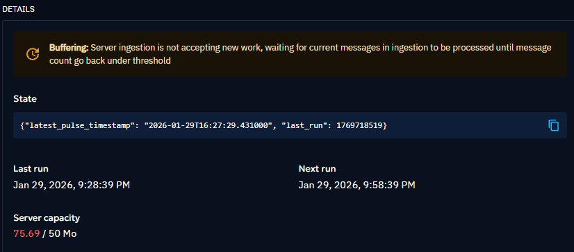

# External Import Connector Specifications

## Table of Contents

- [Overview](#overview)
- [Connector Architecture](#connector-architecture)
- [Scheduling and Execution](#scheduling-and-execution)
- [Work Management](#work-management)
- [State Management](#state-management)
- [Data Collection](#data-collection)
- [STIX Bundle Creation](#stix-bundle-creation)
- [Data Deduplication Strategies](#data-deduplication-strategies)
- [Import History and Dates](#import-history-and-dates)
- [Rate Limiting](#rate-limiting)
- [Incremental Import Strategies](#incremental-import-strategies)
- [Best Practices](#best-practices)
- [Complete Example](#complete-example)

---

## Overview

External Import connectors fetch data from external sources (APIs, feeds, databases) and import it into OpenCTI as STIX 2.1 objects.

### Purpose

- Import threat intelligence from external sources
- Periodically fetch and synchronize data
- Convert external data formats to STIX 2.1
- Maintain state for incremental imports

### Key Characteristics

- **Scheduled execution**: Runs at configured intervals
- **Pull-based**: Connector initiates data fetching
- **Stateful**: Tracks what has been imported
- **Autonomous**: Runs independently without user triggers

### Use Cases

- Threat intelligence feed ingestion
- OSINT data collection
- Vendor API integration
- Custom data source imports
- RSS/Atom feed parsing

---

## Connector Architecture

Since the release of the `connectors-sdk`, external import connectors are built on top of the
`ExternalImportConnector` base class. **You no longer write the run loop, the state
persistence, the work management or the bundle sending yourself** — the base class does
all of that for you. Your job is to describe *what* to import, not *how* the connector
runs.

An external import connector is made of four pieces:

| Piece                             | Base class (from `connectors-sdk`)         | Responsibility                                                        |
| --------------------------------- | ------------------------------------------ | -------------------------------------------------------------------- |
| `ConnectorSettings`               | `BaseConnectorSettings`                    | Validate configuration (env vars / `config.yml`) with Pydantic       |
| `ConnectorState`                  | `ExternalImportConnectorState`             | Persist lightweight checkpoints between runs (cursors, timestamps)   |
| One or more `...Processor`        | `BaseDataProcessor`                        | Fetch (`collect`) and convert (`transform`) **one data type** to STIX |
| The connector itself              | `ExternalImportConnector`                  | Orchestrate everything: schedule, state, work, bundle sending        |

> [!TIP]
> A ready-to-use, fully documented template implementing this architecture is available at
> [templates/external-import](../templates/external-import). Copy it as a starting point rather
> than writing everything from scratch (see the [CONTRIBUTING guidelines](../CONTRIBUTING.md)).

### The data processor: `collect()` + `transform()`

A **processor** is a self-contained unit responsible for a single data type. You subclass
`BaseDataProcessor` and implement only two methods (plus an optional `post_init()`):

```python
from __future__ import annotations

from connectors_sdk import BaseDataProcessor
from connectors_sdk.models import BaseIdentifiedObject, OrganizationAuthor, TLPMarking, Report
from my_client import MyClient


class ReportsProcessor(BaseDataProcessor):
    """Fetches and converts one data type (here, reports) to STIX."""

    work_name = "Reports import"  # human-readable name of the work created in OpenCTI

    def post_init(self) -> None:
        """Build anything the processor needs once dependencies are injected.

        `settings`, `state`, `logger` and `work_manager` are injected by the base
        connector *before* this hook runs, so they are safe to use here.
        """
        self.client = MyClient(api_key=self.settings.my_connector.api_key.get_secret_value())
        self.author = OrganizationAuthor(name="My Threat Feed")
        self.tlp_marking = TLPMarking(level=self.settings.my_connector.tlp_level)

    def collect(self) -> list:
        """Fetch raw data from the external source. No STIX conversion here."""
        since = self.state.last_run or self.settings.my_connector.import_since
        return self.client.get_reports(since=since)

    def transform(self, reports: list) -> list[BaseIdentifiedObject]:
        """Convert raw data into STIX objects. Never call `send()` yourself."""
        stix_objects: list[BaseIdentifiedObject] = []
        for report in reports:
            stix_objects.append(Report(
                name=report.title,
                publication_date=report.published_at,
                author=self.author,
                markings=[self.tlp_marking],
            ))
        if stix_objects:
            return [self.author, self.tlp_marking] + stix_objects
        return []
```

The base class calls these methods for you, in order, on every run:

```text
process():
    with work_manager:          # opens a work, closes it automatically
        send(transform(collect()))
```

- `collect()` fetches raw data (and may **yield** pages for large/paginated sources).
- `transform()` converts raw data into STIX / `connectors-sdk` model objects (and may
  **yield** one list per bundle for streaming).
- `send()` is **inherited** — it builds the bundle and delivers it to OpenCTI. You never
  override it.

### Wiring it together: `main.py`

The entry point loads the settings and state, builds the list of processors, and starts the
connector. That's it — no scheduler loop, no `while True`, no `time.sleep()`.

```python
import traceback

from connector import ConnectorSettings, ConnectorState
from connector.data_processors import ReportsProcessor
from connectors_sdk import ExternalImportConnector

if __name__ == "__main__":
    try:
        settings = ConnectorSettings()
        state = ConnectorState()

        # One processor per data type / feature flag you support.
        data_processors = []
        if settings.my_connector.import_reports:
            data_processors.append(ReportsProcessor())

        connector = ExternalImportConnector(
            settings=settings,
            state=state,
            data_processors=data_processors,
        )
        connector.start()
    except Exception:
        traceback.print_exc()
        exit(1)
```

### What each method is for

| Method / attribute            | Where          | Purpose                                                           |
| ----------------------------- | -------------- | ----------------------------------------------------------------- |
| `post_init()`                 | processor      | Build the API client and shared STIX objects (author, marking)    |
| `collect()`                   | processor      | Fetch raw data from the external source (return a list or yield)  |
| `transform(data)`             | processor      | Convert raw data to STIX objects (return a list or yield)         |
| `work_name`                   | processor      | Name of the work displayed in the OpenCTI UI                      |
| `send()` / `process()`        | `BaseDataProcessor` | **Inherited** — bundle creation and sending, never overridden |
| `callback()` / `start()`      | `ExternalImportConnector` | **Inherited** — scheduling, state, error handling      |

---

## Auto backpressure, Scheduling and Execution

### Configuration

External import connectors use `duration_period` for scheduling.

The `duration_period`  is the amount of time between the end of a connector's last run and the start of the next run. It's expressed as an ISO-8601 duration format string:


```yaml
connector:
  duration_period: 'PT1H'  # ISO-8601 duration format
```

**Common durations:**
- `PT5M` - Every 5 minutes
- `PT1H` - Every hour
- `PT6H` - Every 6 hours
- `PT24H` - Every 24 hours (daily)

### Scheduler Implementation

You do **not** implement scheduling yourself. `ExternalImportConnector.start()` (inherited)
wires the connector's `callback` to `schedule_process` using the configured
`duration_period`:

```python
# Inherited from connectors_sdk.ExternalImportConnector — shown for reference only.
def start(self) -> None:
    self._init_dependencies()
    self._helper.schedule_process(
        message_callback=self.callback,
        duration_period=self.settings.connector.duration_period.total_seconds(),
    )
```

Your `main.py` only calls `connector.start()`.

### Queue Threshold

The scheduler automatically checks the connector's queue size before each run:

```yaml
connector:
  queue_threshold: 500  # MB
```

If the queue exceeds this threshold, the next run is postponed until the queue is processed.

When the RabbitMQ queue capacity exceeds the defined threshold (for example, if queue_message_size is at 9.90 MB and queue_threshold is configured to 8 MB), the connector automatically switches to ‘Buffering’ mode.

In ‘Buffering’ mode, the connector’s execution is paused until the queue capacity falls below the specified threshold. The user interface displays visual indicators to signal this state change, including a warning message and a color change in the ‘Server Capacity’ section.

Buffering mode displayed on OpenCTI UI


More details on our Filigran blog: [Auto backpressure Control Article](https://filigran.io/auto-backpressue-control-octi-connectors/#:~:text=Display%20of%20Details%20for%20Connectors%20in%20%E2%80%98Buffering%E2%80%99%20Mode)

### First Run

The connector runs immediately on startup, then follows the schedule. The base class exposes
the previous run via `self.state.last_run` (managed for you). Inside a processor you branch on
it to decide what to fetch:

```python
def collect(self) -> list:
    if self.state.last_run is None:
        self.logger.info("First run of connector")
        since = self.settings.my_connector.import_since
    else:
        self.logger.info("Connector last run", {"last_run": str(self.state.last_run)})
        since = self.state.last_run

    return self.client.get_reports(since=since)
```

---

## Work Management

Work management tracks individual connector runs in OpenCTI. With `ExternalImportConnector`,
**work is fully automatic**: each `BaseDataProcessor` opens a work when its `process()` runs
and closes it on exit (success, failure, or deletion), through the inherited `WorkManager`
context manager. You never call `initiate_work()` or `to_processed()` yourself.

### Naming the work

The only thing you control is the work's friendly name, via the processor's `work_name`
attribute:

```python
class ReportsProcessor(BaseDataProcessor):
    work_name = "Reports import"  # shown in the OpenCTI UI
```

### Splitting a run into several works

Changing `work_name` between two `send()` calls (or between two iterations of a
generator-based `transform()`) closes the current work and opens a new one. This lets a
paginated import expose progress in the UI. The base class handles the bookkeeping — you only
`yield` bundles from `transform()`:

```python
def transform(self, pages):
    for page_number, page in enumerate(pages, start=1):
        self.work_name = f"Reports import - page {page_number}"
        yield [self.author, self.tlp_marking] + [self._convert(item) for item in page]
```

### Error handling

If `collect()` or `transform()` raises, the `WorkManager` closes the work in an error state
and the exception propagates to the base connector's `callback()`, which logs it. On the next
scheduled run the processor resumes from the checkpoint stored in `self.state` (see
[State Management](#state-management)). Because state is only updated after a successful
`transform()`, a failed run does not advance the checkpoint.

Here a reminder for work management on [Common Implementation](./01-common-implementation.md#work-management)

---

## State Management

State management enables incremental imports and tracks connector progress. With the SDK,
state is a **typed Pydantic model** subclassing `ExternalImportConnectorState`. The base class
already provides a `last_run` timestamp (loaded before each run and saved after a successful
run); you add one field per checkpoint your processors need.

### Defining the state

**File:** `src/connector/state.py`

```python
from datetime import datetime

from connectors_sdk import ExternalImportConnectorState


class ConnectorState(ExternalImportConnectorState):
    """Checkpoints used to resume imports across runs.

    `last_run` is inherited and managed by the base connector. Add one field
    per processor that needs a more precise resume marker.
    """

    # Timestamp of the last successfully processed report (used by ReportsProcessor).
    last_report_update: datetime | None = None
    # Page to resume from if a paginated import was interrupted.
    vulnerabilities_current_page: int | None = None
```

> Keep field types simple (`str`, `int`, `datetime`, `None`) — the state is serialized to
> JSON — and give each field a default of `None` so a first run starts clean.

### Reading and updating state

Inside a processor, the state is available as `self.state`. Read and write it via plain
attribute access — **do not** call `self.state.load()` or `self.state.save()`, the base
connector does that for you:

```python
def collect(self) -> list:
    # Read a checkpoint (fall back to the connector-wide last_run, then to config)
    since = self.state.last_report_update or self.state.last_run or self.settings.my_connector.import_since
    return self.client.get_reports(since=since)

def transform(self, reports: list) -> list:
    stix_objects = []
    last = None
    for report in reports:
        stix_objects.append(self._convert_report(report))
        last = report
    if stix_objects and last:
        # Update the checkpoint only from a successfully converted item.
        self.state.last_report_update = last.updated_at
    return stix_objects
```

### State Best Practices

1. **Update after successful processing** - Only advance a checkpoint from items that were converted successfully; a failed run must not skip data.
2. **Let the base class own `last_run`** - Do not set `last_run` yourself; add your own fields for finer-grained checkpoints.
3. **Use timezone-aware datetimes** - Store `datetime` objects with explicit timezone; the model serializes them to ISO strings.
4. **Store cursors/pages for paginated APIs** - Resume exactly where you left off after an interruption.
5. **Keep state minimal** - It is a checkpoint, not a cache or a database.

---

## Data Collection

Data collection lives in the processor's `collect()` (fetch raw data) and `transform()`
(convert to STIX) methods. Keep the two responsibilities separate: `collect()` must not
produce STIX, and `transform()` must not fetch from the network.

### Collection Example (single call)

```python
def collect(self) -> list:
    """Fetch raw data from the external source. No STIX conversion here."""
    since = self.state.last_run or self.settings.my_connector.import_since
    self.logger.info("Collecting intelligence", {"since": str(since)})
    return self.client.get_threat_data(since=since)


def transform(self, data: list) -> list[BaseIdentifiedObject]:
    """Convert raw data to STIX. Skip individual items that fail to convert."""
    stix_objects: list[BaseIdentifiedObject] = []
    for item in data:
        try:
            stix_objects.extend(self._convert_item(item))
        except Exception as e:
            self.logger.warning(
                "Failed to convert item, skipping",
                {"item_id": item.get("id"), "error": str(e)},
            )
    if stix_objects:
        # Author and marking must be part of every bundle.
        return [self.author, self.tlp_marking] + stix_objects
    return []
```

### Pagination Handling (streaming with generators)

For large or unbounded sources, `collect()` can **yield** pages and `transform()` can **yield**
one list of STIX objects per page. The inherited `send()` detects the generator and sends each
yielded list as its own bundle, so a very large import never has to be held entirely in
memory:

```python
from typing import Generator


def collect(self) -> Generator[list, None, None]:
    """Yield raw data page by page."""
    start_page = self.state.vulnerabilities_current_page or 1
    return self.client.iter_pages(start_page=start_page, per_page=100)


def transform(self, pages: Generator[list, None, None]) -> Generator[list, None, None]:
    """Convert each page and checkpoint progress."""
    current_page = self.state.vulnerabilities_current_page or 1
    try:
        for page in pages:
            stix_objects = [self._convert_item(item) for item in page]
            if stix_objects:
                yield [self.author, self.tlp_marking] + stix_objects
            current_page += 1
        # Import finished cleanly — clear the resume marker.
        self.state.vulnerabilities_current_page = None
    except Exception as e:
        # Keep the last completed page so the next run resumes here.
        self.logger.error("Pagination interrupted", {"error": str(e)})
        self.state.vulnerabilities_current_page = current_page
```

---

## STIX Bundle Creation

### Bundle Structure

A STIX bundle must include:
1. **Knowledge objects** (indicators, observables, etc.)
2. **Author** (identity object)
3. **Markings** (TLP, statement markings)
4. **Relationships** (between objects)

### Creating the Bundle

You **do not** build or send the bundle yourself. Whatever `transform()` returns (a list) or
yields (one list per bundle) is passed to the inherited `send()`, which builds the STIX bundle
and delivers it to OpenCTI with `cleanup_inconsistent_bundle=True`. All you do is return the
objects — including the author and marking — from `transform()`:

```python
def transform(self, data: list) -> list[BaseIdentifiedObject]:
    stix_objects = [self._convert_item(item) for item in data]
    if not stix_objects:
        # Returning an empty list simply sends nothing this run.
        return []
    # Author and marking must be part of every bundle.
    return [self.author, self.tlp_marking] + stix_objects
```

Empty results are handled gracefully: `send()` skips empty lists, so returning `[]` (or
yielding no page) means "no new data to import" without any special-casing.

### Bundle Best Practices

1. **Always include author** - Required for proper attribution
2. **Include appropriate markings** - TLP, PAP, statement markings
3. **Create relationships** - Link related objects
4. **Batch appropriately** - Don't send too many objects at once (< 10000 recommended)

Reminder about cleanup_inconsistent_bundle: [Caution Clean Up Inconsistent Bundle](./01-common-implementation.md#creating-and-sending-bundles)

### Large Dataset Handling

When handling large datasets (e.g., 200k+ entities), stream the import instead of building one
huge bundle. With the SDK you achieve this by making `collect()` and `transform()`
**generators**: `send()` delivers one bundle per yielded page, and each page can get its own
work in the UI by updating `work_name` between iterations.

**Use case:** Importing a large MISP instance with hundreds of thousands of indicators.

```python
from typing import Generator


def collect(self) -> Generator[list, None, None]:
    """Yield raw items page by page — nothing is held fully in memory."""
    start_page = self.state.import_current_page or 1
    return self.client.iter_pages(start_page=start_page, per_page=500)


def transform(self, pages: Generator[list, None, None]) -> Generator[list, None, None]:
    """Convert and send one page (bundle) at a time, checkpointing progress."""
    current_page = self.state.import_current_page or 1
    try:
        for page in pages:
            # A new work_name opens a new work in the UI for this page.
            self.work_name = f"Import - page {current_page}"

            stix_objects = [self._convert_item(item) for item in page]
            if stix_objects:
                yield [self.author, self.tlp_marking] + stix_objects

            # Checkpoint after each successful page so an interrupted run resumes here.
            self.state.import_current_page = current_page
            current_page += 1

        # Import finished cleanly — clear the resume marker.
        self.state.import_current_page = None
    except Exception as e:
        self.logger.error("Import interrupted", {"page": current_page, "error": str(e)})
        raise
```

**Key points:**
- **Stream with generators** - `collect()`/`transform()` yield pages so memory stays flat regardless of dataset size.
- **One work per page** - Update `work_name` between yields to expose progress in the OpenCTI UI.
- **Include metadata in each bundle** - Author and markings must be in every yielded list (required with `cleanup_inconsistent_bundle=True`).
- **Checkpoint after each page** - Store the page number in `self.state` so an interrupted run resumes instead of restarting.
- **Let the base class send** - You never call `initiate_work()`, `stix2_create_bundle()` or `send_stix2_bundle()` yourself.

---

## Data Deduplication Strategies

OpenCTI uses a layered approach: deterministic IDs catch obvious duplicates at creation time, confidence levels govern whether incoming data can overwrite existing entries, and manual merging covers edge cases where automatic deduplication isn't sufficient

### Core concept

One of the core concepts of the OpenCTI knowledge graph is the underlying mechanisms implemented to accurately de-duplicate and consolidate (aka. upserting) information about entities and relationships. When an object is created in the platform, whether manually by a user or automatically by the connectors/workers chain, the platform checks if something already exists based on some properties of the object. If the object already exists, it will return the existing object and, in some cases, update it as well.

### Deterministic IDs (ID Contributing Properties)

OpenCTI generates deterministic IDs based on listed properties (aka "ID Contributing Properties") to prevent duplicates. There is also a special link between name and aliases: the name and aliases of an entity define a set of unique values, so it's not possible to have the name equal to an alias and vice versa, and entities cannot have overlapping aliases or an alias already used in the name of another entity.

Each entity type has its own contributing properties. For example:

- **Threat Actor / Tool / Vulnerability** → `name OR alias`
- **Report** → `name AND published date`
- **Organization** → `(name OR x_opencti_alias) AND identity_class`
- **Relationship** → `type + source + target + start/stop time (within a ±30-day window)`

---

### STIX Cyber Observables

For STIX Cyber Observables, OpenCTI also generates deterministic IDs based on the STIX specification using the "ID Contributing Properties" defined for each type of observable. In cases where an entity already exists in the platform, incoming creations can trigger updates to the existing entity's attributes.

---

### Confidence Level-Based Deduplication

The deduplication mechanism relies on the Confidence Level attribute of each STIX Object, as well as identification keys for each object. If an object is created with the same identification keys as an existing one, it will replace the existing object only if the Confidence Level of the new object is higher or equal to the existing one's. 

This is the **upsert rule**: new data can enrich existing data, but only if it comes from a source of equal or higher confidence.

---

### Manual Merging

Within the OpenCTI platform, the merge capability is present in the "Data > Entities" tab. To execute a merge, select the set of entities to be merged, then click on the Merge icon. It is not possible to merge entities of different types, nor is it possible to merge more than 4 entities at a time. Central to the merging process is the selection of a main entity and this primary entity becomes the anchor, retaining crucial attributes such as name and description. Other entities, while losing specific fields like descriptions, are aliased under the primary entity.

Key points about merging:

- Even if the merged entities were initially created by distinct sources, the platform ensures that data is not lost. Upon merging, the platform automatically generates relationships directly on the merged entity, ensuring that all connections, regardless of their origin, are anchored to the consolidated entity.
- It's essential to know that a merge operation is **irreversible**.

---

### Limitations

This deduplication mechanism, although powerful, still has limitations: it is not possible to associate a Confidence Level with an OCTI Live Stream or a TAXII/RSS Feed and you have no choice but to use the Confidence Level set by the source of the stream or feed. If the source has set a Confidence Level of 100 on an object, it will overwrite the existing one in your platform, even if you value it highly.

---

### Deduplication on OpenCTI strategy summary

| Strategy                      | Trigger                                   | Mechanism                                                 |
| ----------------------------- | ----------------------------------------- | --------------------------------------------------------- |
| **Automatic deduplication**   | Object creation (manual or via connector) | Deterministic IDs from contributing properties            |
| **Alias-based deduplication** | Shared name/alias between entities        | Unique alias set enforcement                              |
| **Confidence-based upsert**   | Incoming data from connectors/feeds       | Higher or equal confidence overwrites existing            |
| **STIX Observable dedup**     | Observable ingestion                      | STIX spec ID contributing properties                      |
| **Manual merge**              | User action                               | Up to 4 entities, irreversible, relationship preservation |

### Why You Must Explicitly Generate IDs in Your Connector ?

When building a connector or any external import that pushes STIX bundles into OpenCTI, you **must** always set a deterministic `id` on your STIX objects using pycti's `generate_id` class methods, rather than letting the `stix2` library auto-generate a random UUID.

The reason is rooted in how OpenCTI's deduplication engine works: the platform identifies whether an incoming object already exists by comparing its **standard ID** (`standard_id`). This standard ID is itself a **deterministic UUID v5** derived from the object's "ID Contributing Properties" (e.g. `name` for a Malware, `name + published date` for a Report, etc.).

> [!IMPORTANT]  
> If you let `stix2` generate a random ID, OpenCTI will receive a **different ID every time** the same object is imported. Even though the deduplication engine will eventually recognize it as the same entity (by its name or key properties), it will register the random ID as an additional `stix_id` on the object. Each new import adds another entry to the `x_opencti_stix_ids` list, which grows unboundedly — causing memory bloat, performance degradation, and inconsistency in the platform's Redis streams.

Using the `generate_id` method included for many object types in the pycti library prevents the `stix_ids` list from growing, since the `standard_id` will be the same every time the same object is pushed.

#### How to Use `generate_id`

The `generate_id` static method is available directly on each entity class exported by pycti. It takes the object's **ID Contributing Properties** as arguments — exactly the same fields that OpenCTI uses server-side for deduplication.

The recommended pattern is to always combine `stix2` (to build the STIX object itself) with `pycti` (to generate the deterministic ID):

```python
import stix2
from pycti import Malware, Report, Indicator

# --- Malware (contributing property: name) ---
malware = stix2.Malware(
    id=Malware.generate_id("MyMalwareName"),
    name="MyMalwareName",
    description="A dangerous piece of malware.",
    is_family=False,
)

# --- Indicator (contributing property: pattern) ---
indicator = stix2.Indicator(
    id=Indicator.generate_id("[domain-name:value = 'evil.com']"),
    name="Malicious domain",
    pattern="[domain-name:value = 'evil.com']",
    pattern_type="stix",
    valid_from="2024-01-01T00:00:00Z",
)

# --- Report (contributing properties: name + published date) ---
report = stix2.Report(
    id=Report.generate_id("My Threat Report", "2024-01-01T00:00:00Z"),
    name="My Threat Report",
    published="2024-01-01T00:00:00Z",
    report_types=["threat-report"],
    object_refs=[malware.id, indicator.id],
)
```

> ⚠️ **The arguments passed to `generate_id` must exactly match the object's ID Contributing Properties**, as defined in OpenCTI's deduplication rules. Passing different values will generate a different ID, defeating the purpose.


#### What Happens Without `generate_id`

| Scenario                    | Without `generate_id`                                                                 | With `generate_id`                                         |
| --------------------------- | ------------------------------------------------------------------------------------- | ---------------------------------------------------------- |
| First import                | Object created, random UUID stored as `standard_id`                                   | Object created, deterministic UUID stored as `standard_id` |
| Second import (same object) | Platform deduplicates by name but appends the new random UUID to `x_opencti_stix_ids` | Platform deduplicates, no new `stix_id` added — IDs match  |
| Nth import                  | `x_opencti_stix_ids` list keeps growing                                               | List stays stable                                          |
| Performance impact          | Increasing memory usage, Redis stream bloat                                           | None                                                       |


#### Available `generate_id` Methods by Entity Type

Most core SDO types in pycti expose `generate_id`. 

Key examples:

| Entity                                       | Key contributing argument(s) |
| -------------------------------------------- | ---------------------------- |
| `Malware`                                    | `name`                       |
| `ThreatActorGroup` / `ThreatActorIndividual` | `name`                       |
| `Indicator`                                  | `pattern`                    |
| `Report`                                     | `name`, `published` (date)   |
| `Vulnerability`                              | `name`                       |
| `AttackPattern`                              | `name`                       |
| `IntrusionSet`                               | `name`                       |
| `Identity` / `Organization`                  | `name`, `identity_class`     |

For **STIX Cyber Observables** (SCOs like `IPv4-Addr`, `DomainName`, etc.), OpenCTI follows the STIX 2.1 specification's own deterministic ID algorithm, so using the standard `stix2` library constructors with the correct `value` field is generally sufficient but wrapping with pycti's observable helpers is still recommended for consistency.

### Summary

To create a STIX object in a connector, use the `stix2` library for the object structure and always use pycti's `generate_id` to produce a predictable, deterministic ID, this is the official recommendation from the OpenCTI connector template. Skipping this step is a common source of data quality issues and platform performance degradation over time.


## Import History and Dates

When importing historical data, it's important to manage dates correctly to ensure accurate state management and incremental imports. We recommend to use ISO-8601 date format for all date fields in your connector configuration and state management. 
This format is widely supported and can be easily parsed in Python.

When configuring the `import_start_date` (or equivalent history parameter) of a connector, OpenCTI recommends using relative/duration-based dates (e.g., ISO 8601 durations like P30D, P1Y) rather than absolute dates (e.g., 2021-01-01).

Relative dates make connector configurations robust, portable, and safe by design, while absolute dates create a configuration that grows more problematic the longer the platform runs.


## Rate Limiting

Use the `limiter` library for rate limiting and `tenacity` for retry logic:

```python
import requests
from limiter import Limiter
from tenacity import retry, stop_after_attempt, wait_exponential_jitter


class MyClient:
    def __init__(self, logger, base_url: str, api_key: str):
        self.logger = logger
        self.base_url = base_url
        self.api_key = api_key

        # Rate limiter: 10 requests per second, bucket capacity of 20
        self.rate_limiter = Limiter(
            rate=10,
            capacity=20,
            bucket="my_connector",
        )

    @retry(
        stop=stop_after_attempt(3),
        wait=wait_exponential_jitter(initial=1, max=60, jitter=1),
    )
    def _request(self, endpoint: str):
        """Make request with retry logic."""
        response = requests.get(
            f"{self.base_url}/{endpoint}",
            headers={"Authorization": f"Bearer {self.api_key}"}
        )
        response.raise_for_status()
        return response.json()

    def get_data(self, endpoint: str):
        """Fetch data with rate limiting and retry."""
        with self.rate_limiter:
            return self._request(endpoint)
```

- **`limiter`** - Controls request rate to avoid hitting API limits
- **`tenacity`** - Retries failed requests with exponential backoff

See also: [Retry Logic in Common Implementation](./01-common-implementation.md#retry-logic)

---

## Incremental Import Strategies

### Time-Based Incremental Import

Add a `datetime` checkpoint to your `ConnectorState`, then read it in `collect()` and update
it in `transform()`:

```python
def collect(self) -> list:
    """Collect only new/updated data since last run."""
    since = self.state.last_run or self.settings.my_connector.import_since
    return self.client.get_data(modified_since=since)


def transform(self, data: list) -> list[BaseIdentifiedObject]:
    stix_objects = [self._convert_item(item) for item in data]
    return [self.author, self.tlp_marking] + stix_objects if stix_objects else []
```

### Cursor-Based Incremental Import

Store the opaque cursor on the state (e.g. `cursor: str | None = None`). Stream pages with a
generator so each page is sent as its own bundle and the cursor is checkpointed as you go:

```python
from typing import Generator


def collect(self) -> Generator[dict, None, None]:
    """Yield API responses page by page, following the cursor."""
    cursor = self.state.cursor
    while True:
        response = self.client.get_data(cursor=cursor)
        yield response
        cursor = response.get("next_cursor")
        if cursor is None:
            break


def transform(self, responses: Generator[dict, None, None]) -> Generator[list, None, None]:
    for response in responses:
        stix_objects = [self._convert_item(item) for item in response["items"]]
        if stix_objects:
            yield [self.author, self.tlp_marking] + stix_objects
        # Checkpoint the cursor after each successfully processed page.
        self.state.cursor = response.get("next_cursor")
```

### ID-Based Tracking

Store the set of processed ids on the state (e.g. `processed_ids: list[str] = []`) and skip
items you have already imported:

```python
def collect(self) -> list:
    return self.client.get_data()


def transform(self, data: list) -> list[BaseIdentifiedObject]:
    processed_ids = set(self.state.processed_ids or [])

    stix_objects: list[BaseIdentifiedObject] = []
    new_ids: list[str] = []
    for item in data:
        if item["id"] in processed_ids:
            continue  # already imported on a previous run
        stix_objects.append(self._convert_item(item))
        new_ids.append(item["id"])

    # Keep the list bounded (last 10000 ids) and update the checkpoint.
    self.state.processed_ids = (list(processed_ids) + new_ids)[-10000:]

    return [self.author, self.tlp_marking] + stix_objects if stix_objects else []
```


## Connector Run and Terminate

Run and Terminate is an execution mode for OpenCTI External Import connectors in which the connector process runs once, completes its work, and then exits, rather than staying alive in a loop and re-scheduling itself internally. 
This mode is managed entirely by the Scheduler (introduced in OpenCTI 6.2.12) via `pycti`.

Understanding this mode is essential for any contributor writing or reviewing External Import connectors.

## Two Execution Modes Compared

| Mode                | Behavior                                                     | Who manages the interval                         |
| ------------------- | ------------------------------------------------------------ | ------------------------------------------------ |
| **Scheduled**       | Connector runs, wait for next schedule, runs again on a loop | The Scheduler (via `schedule_process()`)         |
| **Run & Terminate** | Connector runs once and exits                                | External system (cron, Kubernetes CronJob, etc.) |

> [!NOTE]  
> In both cases, **the connector code itself should no longer contain any `while True` loop or `time.sleep()` call**. Since OpenCTI 6.2.12, this logic has been removed from connectors and delegated entirely to the Scheduler.

### How Run & Terminate Is Triggered

A connector enters Run & Terminate mode in two ways:

#### 1. Explicit flag via environment variable

```yaml
# docker-compose.yml
- CONNECTOR_RUN_AND_TERMINATE=true
```

```yaml
# config.yml
connector:
  run_and_terminate: true
```

#### 2. Implicit trigger via zero duration period

If `CONNECTOR_DURATION_PERIOD` is set to a zero value, the Scheduler treats it as Run & Terminate automatically:

```yaml
- CONNECTOR_DURATION_PERIOD=0      # integer zero
- CONNECTOR_DURATION_PERIOD=P0D    # ISO 8601 zero duration
- CONNECTOR_DURATION_PERIOD=PT0S   # also zero
```

This is a convenience for operators who want to drive execution purely from an external scheduler without setting the explicit boolean flag.

Since OpenCTI 6.2.12, all new External Import connectors **must** delegate scheduling to the
Scheduler instead of a manual loop. When you build on `ExternalImportConnector`, this is done
for you: its `start()` method calls `schedule_process()` internally, which handles both the
periodic and run-and-terminate cases transparently.

### Recommended pattern (`ExternalImportConnector.start()`)

```python
from connector import ConnectorSettings, ConnectorState
from connector.data_processors import ReportsProcessor
from connectors_sdk import ExternalImportConnector

settings = ConnectorSettings()
connector = ExternalImportConnector(
    settings=settings,
    state=ConnectorState(),
    data_processors=[ReportsProcessor()],
)
# start() schedules the connector; the Scheduler handles both scheduled
# and run-and-terminate modes based on duration_period / run_and_terminate.
connector.start()
```

> Internally, `start()` reads `settings.connector.duration_period` (a `timedelta`) and passes
> `duration_period.total_seconds()` to `schedule_process()`. Because `duration_period` is
> validated by Pydantic in `ConnectorSettings`, the ISO 8601 string is already parsed into a
> `timedelta` for you.

> The connector's core logic is the `callback()` method (inherited), which runs every
> processor's `collect()`/`transform()`. It is called by the Scheduler according to the
> configured interval, or just once in Run & Terminate mode.

### Legacy pattern (to avoid / migrate away from)

```python
# ❌ OLD PATTERN — do NOT use in new connectors
def run(self):
    while True:
        self._process()
        time.sleep(self.interval)
```

```python
# ❌ OLD RUN & TERMINATE — do NOT implement manually
def run(self):
    if self.helper.connect_run_and_terminate:
        self._process()
        self.helper.force_ping()  # required before exit
        sys.exit(0)
    else:
        while True:
            self._process()
            time.sleep(self.interval)
```

Both of the above are now fully replaced by `schedule_process()`.

## Critical: State persistence before exit

This is the most common source of bugs in Run & Terminate mode.

When a connector exits after a single run, pycti must have flushed the connector state (e.g., `last_run` timestamp) to the OpenCTI platform **before** the process terminates. If the state is not saved, the next execution will re-import data from scratch.

### How `schedule_process()` solves this automatically

When using `schedule_process()`, the scheduler calls `force_ping()` internally before exiting in Run & Terminate mode. **You do not need to call it yourself.**


Failure to do this means the connector state (including `last_run`) is never saved, and the connector will restart from its `import_start_date` or similar configuration on the next execution.

### UI Display in Run & Terminate Mode

When a connector is in Run & Terminate mode, the OpenCTI UI shows:

- **Last run**: timestamp of the last completed execution
- **Next run**: `External schedule` (since OpenCTI does not control scheduling)
- **Server capacity**: updated every 40 seconds via `pingAlive`

Organizations that choose this mode typically manage execution intervals using external scheduling, allowing them flexibility in managing the connector’s execution cycles.

>[!TIP]
> The run and terminate process was implemented to address issues with importing data via cron jobs. 
>
> Occasionally, these jobs get stuck in an infinite loop, which, when OpenCTI is deployed with connectors on AWS, can lead to significantly increased costs. 
>
> To mitigate this, the process run only once, preventing unnecessary expenses.

## Best Practices

### 1. Error Recovery Example

Work opening/closing and state saving are handled by the base connector. To make a run
recoverable, only advance your checkpoint from successfully processed items and let exceptions
propagate — the base class logs them and the next run resumes from the last saved checkpoint:

```python
def transform(self, data: list) -> list[BaseIdentifiedObject]:
    stix_objects: list[BaseIdentifiedObject] = []
    last_processed = None
    for item in data:
        try:
            stix_objects.append(self._convert_item(item))
            last_processed = item
        except Exception as e:
            # One bad item must not fail the whole run.
            self.logger.warning("Failed to convert item, skipping", {"error": str(e)})

    if stix_objects and last_processed:
        # Checkpoint only from the last successfully converted item, so a failure
        # mid-run does not skip unprocessed data on the next run.
        self.state.last_item_update = last_processed.updated_at
        return [self.author, self.tlp_marking] + stix_objects
    return []
```

### 2. Graceful Degradation Example

```python
def collect(self) -> dict:
    """Collect from multiple sources, continue on partial failure."""
    data = {"primary": [], "secondary": []}

    try:
        data["primary"] = self.client.get_primary_feed()
    except Exception as e:
        self.logger.error("Primary feed failed", {"error": str(e)})  # continue

    try:
        data["secondary"] = self.client.get_secondary_feed()
    except Exception as e:
        self.logger.error("Secondary feed failed", {"error": str(e)})

    return data


def transform(self, data: dict) -> list[BaseIdentifiedObject]:
    stix_objects: list[BaseIdentifiedObject] = []
    for item in data["primary"] + data["secondary"]:
        stix_objects.append(self._convert_item(item))
    return [self.author, self.tlp_marking] + stix_objects if stix_objects else []
```

Use case: A connector fetches from 3 different API endpoints. If one endpoint is down,
you still want to import data from the other 2 rather than failing the entire run.   

When to use it:
- Multiple independent data sources
- Optional enrichment steps
- Non-critical metadata fetching

When NOT to use it:
- Core authentication fails
- Critical data source is unavailable
- Data integrity depends on all sources

### 3. Deduplication Example

```python
def collect(self) -> list:
    return self.client.get_data()


def transform(self, data: list) -> list[BaseIdentifiedObject]:
    """Convert with in-run deduplication by source id."""
    seen_ids = set()
    stix_objects: list[BaseIdentifiedObject] = []
    for item in data:
        if item["id"] in seen_ids:
            continue
        seen_ids.add(item["id"])
        stix_objects.append(self._convert_item(item))
    return [self.author, self.tlp_marking] + stix_objects if stix_objects else []
```

### 4. Logging Example

Use `self.logger` (the injected `ConnectorLogger`) inside processors — no direct `pycti`
dependency:

```python
import time


def transform(self, data: list) -> list[BaseIdentifiedObject]:
    self.logger.info("Starting conversion", {"items": len(data)})
    start_time = time.time()

    stix_objects = [self._convert_item(item) for item in data]

    self.logger.info(
        "Conversion completed",
        {
            "objects_collected": len(stix_objects),
            "duration_seconds": round(time.time() - start_time, 2),
        },
    )
    return [self.author, self.tlp_marking] + stix_objects if stix_objects else []
```

---

## Complete Example

### API Client (src/my_client/api_client.py)

```python
import requests
from limiter import Limiter
from tenacity import retry, stop_after_attempt, wait_exponential_jitter


class MyClient:
    """API client with rate limiting and retry logic."""

    def __init__(self, base_url: str, api_key: str):
        self.base_url = base_url
        self.api_key = api_key
        self.rate_limiter = Limiter(rate=10, capacity=20, bucket="my_client")

    @retry(
        stop=stop_after_attempt(3),
        wait=wait_exponential_jitter(initial=1, max=60, jitter=1),
    )
    def _request(self, endpoint: str, params: dict = None):
        response = requests.get(
            f"{self.base_url}/{endpoint}",
            headers={"Authorization": f"Bearer {self.api_key}"},
            params=params,
        )
        response.raise_for_status()
        return response.json()

    def get_threat_data(self, since: str) -> list:
        with self.rate_limiter:
            return self._request("threats", params={"since": since})
```

### Configuration (src/connector/settings.py)

```python
from datetime import datetime, timedelta, timezone

from connectors_sdk import (
    BaseConfigModel,
    BaseConnectorSettings,
    BaseExternalImportConnectorConfig,
    DatetimeFromIsoString,
    ListFromString,
)
from connectors_sdk.models.enums import TLPLevel
from pydantic import Field, HttpUrl, SecretStr


class ExternalImportConnectorConfig(BaseExternalImportConnectorConfig):
    """Connector-level config, common to every EXTERNAL_IMPORT connector."""

    id: str = Field(description="Unique identifier of the connector.")
    name: str = Field(description="Name of the connector.", default="My Threat Feed")
    scope: ListFromString = Field(
        description="Entity types the connector imports.",
        default=["Report", "Indicator"],
    )
    duration_period: timedelta = Field(
        description="Time to wait between two runs (ISO 8601 duration, e.g. `PT1H`).",
        default=timedelta(hours=1),
    )


class MyConnectorConfig(BaseConfigModel):
    """Config specific to this connector."""

    api_base_url: HttpUrl = Field(description="Base URL of the external service.")
    api_key: SecretStr = Field(description="API key for the external service.")
    import_since: DatetimeFromIsoString = Field(
        description="Initial import start date (absolute like '2023-01-01T00:00:00Z' "
        "or relative like 'P30D').",
        default_factory=lambda: datetime.now(timezone.utc) - timedelta(days=30),
    )
    tlp_level: TLPLevel = Field(
        description="Default TLP marking applied to created objects.",
        default=TLPLevel.CLEAR,
    )


class ConnectorSettings(BaseConnectorSettings):
    """Aggregates all configuration sections."""

    connector: ExternalImportConnectorConfig = Field(
        default_factory=ExternalImportConnectorConfig
    )
    my_connector: MyConnectorConfig = Field(default_factory=MyConnectorConfig)
```

### State (src/connector/state.py)

```python
from datetime import datetime

from connectors_sdk import ExternalImportConnectorState


class ConnectorState(ExternalImportConnectorState):
    """`last_run` is inherited; add checkpoints specific to this connector."""

    last_threat_update: datetime | None = None
```

### Data processor (src/connector/data_processors/threats_processor.py)

```python
from __future__ import annotations

from typing import TYPE_CHECKING

from connectors_sdk import BaseDataProcessor
from connectors_sdk.models import (
    BaseIdentifiedObject,
    Indicator,
    OrganizationAuthor,
    TLPMarking,
)
from my_client import MyClient

if TYPE_CHECKING:
    from connector.settings import ConnectorSettings
    from connector.state import ConnectorState


class ThreatConversionError(Exception):
    """Raised when a single raw item cannot be converted to STIX."""


class ThreatsProcessor(BaseDataProcessor):
    """Fetches threats from the external API and converts them to STIX."""

    settings: ConnectorSettings
    state: ConnectorState

    work_name = "My Threat Feed - Threats import"

    def post_init(self) -> None:
        """Build the client and the STIX objects shared by every item."""
        self.client = MyClient(
            base_url=str(self.settings.my_connector.api_base_url),
            api_key=self.settings.my_connector.api_key.get_secret_value(),
        )
        self.author = OrganizationAuthor(name="My Threat Feed")
        self.tlp_marking = TLPMarking(level=self.settings.my_connector.tlp_level)

    def collect(self) -> list:
        """Fetch raw data since the last checkpoint."""
        since = (
            self.state.last_threat_update
            or self.state.last_run
            or self.settings.my_connector.import_since
        )
        self.logger.info("Collecting intelligence", {"since": str(since)})
        return self.client.get_threat_data(since=since)

    def transform(self, data: list) -> list[BaseIdentifiedObject]:
        """Convert raw data to STIX and checkpoint progress."""
        stix_objects: list[BaseIdentifiedObject] = []
        last = None
        for item in data:
            try:
                stix_objects.append(self._convert_item(item))
                last = item
            except ThreatConversionError as e:
                self.logger.warning(
                    "Failed to convert item, skipping",
                    {"item_id": item.get("id"), "error": str(e)},
                )

        if stix_objects and last:
            self.state.last_threat_update = last["updated_at"]
            # Author and marking must be part of every bundle.
            return [self.author, self.tlp_marking] + stix_objects
        return []

    def _convert_item(self, item: dict) -> Indicator:
        """Convert a single raw item into a STIX object."""
        try:
            return Indicator(
                name=item["name"],
                pattern=item["pattern"],
                pattern_type="stix",
                author=self.author,
                markings=[self.tlp_marking],
            )
        except Exception as e:
            raise ThreatConversionError(str(e)) from e
```

### Entry Point (src/main.py)

```python
import traceback

from connector import ConnectorSettings, ConnectorState
from connector.data_processors import ThreatsProcessor
from connectors_sdk import ExternalImportConnector

if __name__ == "__main__":
    try:
        settings = ConnectorSettings()

        connector = ExternalImportConnector(
            settings=settings,
            state=ConnectorState(),
            data_processors=[ThreatsProcessor()],
        )
        connector.start()
    except Exception:
        traceback.print_exc()
        exit(1)
```

> [!TIP]
> A ready-to-use template with the base implementation is available at [templates/external-import](../templates/external-import). See the [CONTRIBUTING guidelines](../CONTRIBUTING.md) for step-by-step instructions on how to copy and set up the template.

---

## Next Steps

- Review [Internal Enrichment Specifications](./03-internal-enrichment-specifications.md)
- Review [Stream Connector Specifications](./04-stream-specifications.md)
- Review [Code Quality & Standards](./05-code-quality-standards.md)
