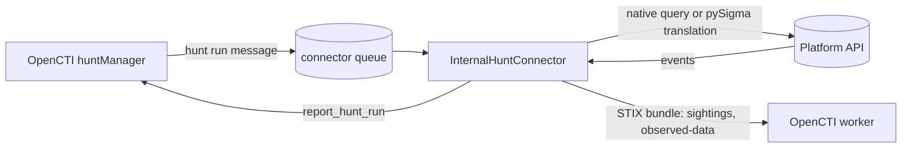

# Internal Hunt Connector Specifications

## Table of Contents

- [Overview](#overview)
- [Architecture](#architecture)
- [Configuration](#configuration)
- [Hunt run lifecycle](#hunt-run-lifecycle)
- [Implementing a hunt connector](#implementing-a-hunt-connector)
- [Knowledge produced](#knowledge-produced)
- [Evidence and privacy](#evidence-and-privacy)
- [Outside-in (internet) hunt connectors](#outside-in-internet-hunt-connectors)
- [Testing](#testing)
- [Compatibility](#compatibility)

## Overview

Internal hunt connectors (`INTERNAL_HUNT`) execute the **hunts** of OpenCTI. A hunt is a falsifiable hypothesis plus
the logic to test it: a canonical Sigma rule, optional native queries per platform, the techniques and threats it
targets, and a schedule. OpenCTI dispatches one message per **hunt run** (one hunt, one platform, one time window) to
the connector bound to the platform; the connector executes it, sends the resulting knowledge and reports the run.

Each connector instance executes against exactly one platform, identified by a slug passed as `CONNECTOR_SCOPE`:

| Slug | Platform |
|---|---|
| `splunk` | Splunk Enterprise / Splunk Cloud |
| `microsoft-sentinel` | Microsoft Sentinel (Log Analytics) |
| `elastic-security` | Elastic Security (Elasticsearch) |
| `crowdstrike-logscale` | CrowdStrike Falcon LogScale |
| `google-secops` | Google Security Operations (Chronicle) |
| `opensearch` | OpenSearch (OCSF data) |
| `clickhouse` | ClickHouse |
| `s3-ocsf` | OCSF data lake on S3 |
| `internet` | Internet scanning APIs (outside-in hunts, no Security Platform) |

Query languages: `spl`, `kql`, `esql`, `lucene`, `eql`, `logscale`, `yara-l`, `udm`, `ppl`, `opensearch-lucene`, `sql`,
`internet`.

## Architecture



Hunt connectors are built on `InternalHuntConnector` from the connectors-sdk. The base class handles:

- the pycti compatibility check (fail fast when the installed pycti does not provide hunts);
- the platform registration (`register_hunt_platform`) and the queue listener (`listen_hunt`);
- the message validation, the native query override and the preview mode;
- the run timeout and the `max_results` cap;
- the benign pattern suppression;
- the STIX mapping of telemetry results and the bundle sending within the run work;
- the evidence redaction and the run report (`report_hunt_run`).

## Configuration

Settings inherit `BaseInternalHuntConnectorConfig` (connector namespace, `CONNECTOR_*` variables):

| Variable | Description |
|---|---|
| `CONNECTOR_SCOPE` | Exactly one platform slug. |
| `CONNECTOR_SECURITY_PLATFORM_NAME` | Security Platform identity the hunts run against (created by OpenCTI when missing). Required, except for `internet`. |
| `CONNECTOR_SECURITY_PLATFORM_TYPE` | `SIEM`, `EDR`, `XDR`, `SOAR`, `NDR` or `ISPM` (default `SIEM`). |
| `CONNECTOR_MAX_CONCURRENT_RUNS` | Connector-side concurrency limit, sent at registration. |
| `CONNECTOR_OBSERVABLE_TYPES` | Observable types the connector may create (IOC types by default: `IPv4-Addr`, `IPv6-Addr`, `Domain-Name`, `Url`, `StixFile`, `Email-Addr`; can be widened with `Hostname`, `User-Account`, `Mac-Addr`). |
| `CONNECTOR_MAX_OBSERVABLES` | Maximum number of observables per run (default 100). |

Platform credentials and options live in the connector namespace (`<CONNECTOR_NAME>_*`), with secrets typed as
`SecretStr`. A `<CONNECTOR_NAME>_SIGMA_PIPELINE` option selects the default pySigma processing pipeline.

## Hunt run lifecycle

1. **Message**: `event_type = INTERNAL_HUNT`, `mode` (`execute` or `preview`), `hunt_run`, `hunt` (Sigma rule,
   native query, expected observables, benign patterns, markings, author, techniques, targets, indicators),
   `time_window`, `limits` (`max_results`, `timeout_seconds`, `evidence_max_items`, `evidence_max_value_length`) and
   `security_platform`.
2. **Query**: the hunt native query written for the connector platform is executed verbatim (its language must be one
   of the connector languages). Otherwise the Sigma rule is translated with pySigma; a native query with an empty
   query only selects the pipeline used for the translation.
3. **Preview**: in `preview` mode the run is reported `completed` with the translated query; nothing is executed and
   no knowledge is sent.
4. **Execution**: `execute()` runs in a worker thread bounded by `timeout_seconds`; it receives the `RunDeadline` the
   base class waits for, so its requests, polling, retries and authentication share one absolute deadline. On timeout
   `on_timeout()` cancels the platform job and the run fails. Results beyond `max_results` are dropped, the total hit
   count is kept.
5. **Suppression**: events matching a benign pattern (case-insensitive substring, or `/regex/`) are removed. Regular
   expressions run on the `regex` engine within what is left of `timeout_seconds`: a pattern that backtracks past it
   ends the run as a `timeout` instead of blocking its report.
6. **Knowledge**: `to_stix()` maps the results; the bundle is sent with the run work id.
7. **Report**: `completed` with hits, distinct entities, evidence, translated query, language, cost and result ids, or
   `failed` / `timeout` with the error (the error is then raised so that OpenCTI marks the work in error). A reported
   error carries `hunt_run_reported = True`, so the `listen_hunt` wrapper of pycti does not report the run a second time.

## Implementing a hunt connector

```python
from connectors_sdk import InternalHuntConnector
from connectors_sdk.connectors.internal_hunt import (
    HuntEvent,
    HuntResult,
    RunDeadline,
    build_pipeline,
    flatten_fields,
)
from sigma.backends.splunk import SplunkBackend
from sigma.pipelines.splunk import splunk_windows_pipeline

PIPELINES = {"splunk_windows": splunk_windows_pipeline}


class SplunkHuntConnector(InternalHuntConnector):
    languages = ("spl",)

    def sigma_backend(self, pipeline):
        return SplunkBackend(build_pipeline(pipeline or "splunk_windows", PIPELINES))

    def execute(self, native_query, time_window, limits, deadline=None):
        deadline = deadline or RunDeadline(limits.timeout_seconds)
        response = self.client.search(native_query.query, time_window, limits.max_results, deadline)
        return HuntResult(
            events=[HuntEvent(timestamp=row.time, fields=flatten_fields(row.fields)) for row in response.rows],
            total_hits=response.total,
            truncated=response.total > len(response.rows),
        )
```

Rules:

- Build the platform client on `HuntApiClient` from the connectors-sdk: `hunt_request()` bounds every call with the run
  deadline (the `deadline` given to `execute()`; `RunDeadline.request_timeout()` never gives a request more than the
  time left and refuses to send one once it is spent), retries on 429/5xx and raises `HuntExecutionError` /
  `HuntTimeoutError` carrying the platform error message; `cleanup_request()` cancels or deletes platform jobs without
  masking the run outcome. Poll asynchronous jobs with `RunDeadline.check()` / `RunDeadline.sleep()` and cancel them in
  `on_timeout()`.
- Fetch at most `limits.max_results` events in total for the run (shared by every query when a run issues several)
  and report the platform total when it is available.
- Declare `evidence_excluded_fields` for raw payload fields (e.g. Splunk `_raw`), `entity_fields` for the host, user
  and peer fields of the platform, and `observable_fields` for platform fields the name heuristics do not recognize.
- Add `pysigma` and the backend package of the platform to `src/requirements.txt` (the SDK `hunt` extra cannot be
  used because the CI rewrites the connectors-sdk requirement line).

Start from the `templates/internal-hunt` template:

```bash
cd templates
sh create_connector_dir.sh -t internal-hunt -n my-siem-hunt
```

## Knowledge produced

For a telemetry run with hits:

- one **sighting** per technique and per indicator of the hunt: `sighting_of_ref` is the technique or indicator,
  `where_sighted_refs` the Security Platform identity, `count` the hits, `first_seen`/`last_seen` the first and last
  matching events, and the description names the hunt and the run;
- one **observed-data** per number of observations, referencing the IOC observables extracted from the results that
  many result events hold: `number_observed` is the count of each referenced observable (an observable is counted once
  per event), only for the observable types the hunt expects and the connector allows.

Objects inherit the markings and the author of the hunt, and every sighting and observed-data carries its run in
`x_opencti_hunt_run_id`. Identifiers are deterministic: observables keep their standard pycti ids, while the ids of the
sightings and observed-data derive from their standard pycti id and the hunt run (`hunt_run.id`, which does not change
between the attempts of a run). A retry of a run therefore upserts its own objects, and a separate run, even over the
same window, creates its own run-linked sightings and observed-data: never rely on cross-run upserts. On the platform,
the OpenCTI deduplication may still merge sightings sharing their ends and close time bounds, or observed-data sharing
their objects; the `result_ids` reported with every run keep the link between a run and its objects in all cases.
Connectors never create incidents: OpenCTI creates incident drafts above the escalation threshold of the hunt.

## Evidence and privacy

- Raw events never leave the connector.
- The evidence sample holds at most `evidence_max_items` values; each value is SHA-256 hashed and its preview truncated
  to `evidence_max_value_length`. Fields referenced by the detection come first.
- Host names, user names and command lines only appear in the evidence sample, unless the configuration explicitly
  widens the observable types.
- Private, loopback and reserved IP addresses, and internal domain suffixes (`.local`, `.corp`, `.internal`...), are
  never turned into observables.

## Outside-in (internet) hunt connectors

Connectors with the `internet` platform hunt adversary infrastructure on internet scanning APIs from fingerprint
rules stored as hunt native queries (`platform: internet`, `language: internet`). They have no Security Platform and
override `to_stix()` to produce `infrastructure`, observables (`ipv4-addr`, `domain-name`, `x509-certificate`) and
detection indicators, linked with `consists-of`, `based-on`, `related-to` and `indicates` relationships, plus the
run-scoped observed-data of the observables found (`build_observed_data`, one per number of hosts) as the link to the
run (see `internal-hunt/infrastructure-tracker`). The infrastructure, observables, indicators and relationships keep
their standard ids, so every run of a hunt grows the same infrastructure.

## Testing

- Mock the pycti helper (no OpenCTI platform needed) and the platform HTTP API (`requests-mock`).
- Cover translation (Sigma rule, native override, preview), execution (time window, limits, pagination, job
  polling), timeout and cancellation, failures, and the STIX mapping.

## Compatibility

`INTERNAL_HUNT`, `listen_hunt`, `register_hunt_platform` and `report_hunt_run` ship with the pycti release of the
OpenCTI platform providing hunts. `start()` checks them and stops with an explicit message when the installed pycti
is older.
