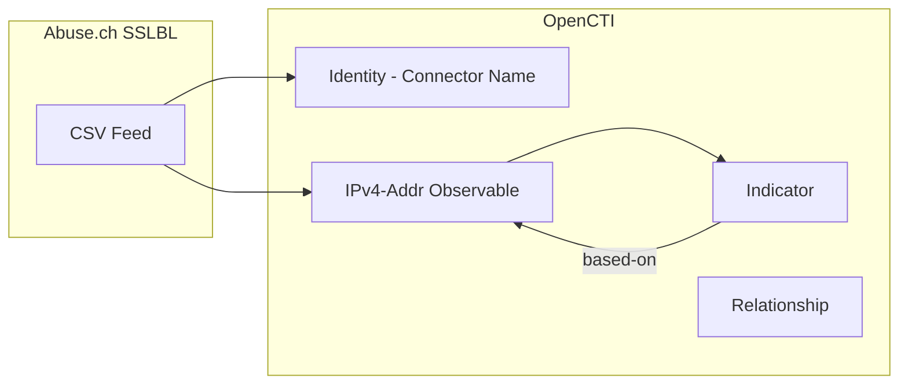

# OpenCTI Abuse.ch SSL Blacklist Connector

| Status | Date | Comment |
|--------|------|---------|
| Community | -    | -       |

The Abuse.ch SSL connector imports botnet C&C server IP addresses detected based on SSL certificate signatures from the SSLBL blacklist into OpenCTI.

## Table of Contents

- [OpenCTI Abuse.ch SSL Blacklist Connector](#opencti-abusech-ssl-blacklist-connector)
  - [Table of Contents](#table-of-contents)
  - [Introduction](#introduction)
  - [Installation](#installation)
    - [Requirements](#requirements)
  - [Configuration variables](#configuration-variables)
    - [OpenCTI environment variables](#opencti-environment-variables)
    - [Base connector environment variables](#base-connector-environment-variables)
    - [Connector extra parameters environment variables](#connector-extra-parameters-environment-variables)
  - [Deployment](#deployment)
    - [Docker Deployment](#docker-deployment)
    - [Manual Deployment](#manual-deployment)
  - [Usage](#usage)
  - [Behavior](#behavior)
  - [Debugging](#debugging)
  - [Additional information](#additional-information)

## Introduction

The Abuse.ch SSLBL (SSL Blacklist) identifies and lists IP addresses associated with botnet Command & Control (C&C) servers based on SSL certificate fingerprints. An SSL certificate can be associated with one or more servers (IP address:port combination). SSLBL collects IP addresses running with blacklisted SSL certificates.

This connector fetches the CSV-formatted blacklist from Abuse.ch SSLBL and converts the IP addresses into STIX 2.1 objects for import into OpenCTI.

## Installation

### Requirements

- OpenCTI Platform >= 6.x
- Access to Abuse.ch SSLBL CSV feed (publicly available)

## Configuration variables

There are a number of configuration options, which are set either in `docker-compose.yml` (for Docker) or in `config.yml` (for manual deployment).

### OpenCTI environment variables

| Parameter     | config.yml | Docker environment variable | Mandatory | Description                                          |
|---------------|------------|-----------------------------|-----------|------------------------------------------------------|
| OpenCTI URL   | url        | `OPENCTI_URL`               | Yes       | The URL of the OpenCTI platform.                     |
| OpenCTI Token | token      | `OPENCTI_TOKEN`             | Yes       | The default admin token set in the OpenCTI platform. |

### Base connector environment variables

| Parameter        | config.yml | Docker environment variable | Default  | Mandatory | Description                                                              |
|------------------|------------|-----------------------------|----------|-----------|--------------------------------------------------------------------------|
| Connector ID     | id         | `CONNECTOR_ID`              |          | Yes       | A unique `UUIDv4` identifier for this connector instance.                |
| Connector Name   | name       | `CONNECTOR_NAME`            |          | Yes       | Name of the connector.                                                   |
| Connector Scope  | scope      | `CONNECTOR_SCOPE`           | abusessl | Yes       | The scope or type of data the connector is importing.                    |
| Log Level        | log_level  | `CONNECTOR_LOG_LEVEL`       | error    | No        | Determines the verbosity of logs: `debug`, `info`, `warn`, or `error`.   |

### Connector extra parameters environment variables

| Parameter     | config.yml    | Docker environment variable | Default                                                 | Mandatory | Description                                                    |
|---------------|---------------|-----------------------------|---------------------------------------------------------|-----------|----------------------------------------------------------------|
| SSLBL URL     | abusessl.url  | `ABUSESSL_URL`              | https://sslbl.abuse.ch/blacklist/sslipblacklist.csv     | Yes       | The Abuse.ch SSLBL CSV feed URL.                               |
| Interval      | abusessl.interval | `ABUSESSL_INTERVAL`     | 360                                                     | Yes       | Interval in minutes between collections.                       |

## Deployment

### Docker Deployment

Build the Docker image:

```bash
docker build -t opencti/connector-abuse-ssl:latest .
```

Configure the connector in `docker-compose.yml`:

```yaml
  connector-abuse-ssl:
    image: opencti/connector-abuse-ssl:latest
    environment:
      - OPENCTI_URL=http://localhost
      - OPENCTI_TOKEN=ChangeMe
      - CONNECTOR_ID=ChangeMe_UUID4
      - CONNECTOR_NAME=Abuse.ch SSL Blacklist
      - CONNECTOR_SCOPE=abusessl
      - CONNECTOR_LOG_LEVEL=error
      - ABUSESSL_URL=https://sslbl.abuse.ch/blacklist/sslipblacklist.csv
      - ABUSESSL_INTERVAL=360
    restart: always
```

Start the connector:

```bash
docker compose up -d
```

### Manual Deployment

1. Copy and configure `config.yml` from the provided `config.yml.sample`.

2. Install dependencies:

```bash
pip3 install -r requirements.txt
```

3. Start the connector:

```bash
python3 abuse_ssl.py
```

## Usage

The connector runs automatically at the interval set by `ABUSESSL_INTERVAL`. You can also manually trigger it from:

**Data Management → Ingestion → Connectors**

Find the connector and click on the refresh button to reset the connector's state and force a new download of data.

## Behavior

The connector fetches the SSLBL CSV feed containing IP addresses of botnet C&C servers and converts them to STIX 2.1 objects.

### Data Flow



### Entity Mapping

| Abuse.ch SSLBL Data  | OpenCTI Entity      | Description                                      |
|----------------------|---------------------|--------------------------------------------------|
| IP Address           | IPv4-Addr           | Observable with labels `osint`, `ssl-blacklist`  |
| IP Address           | Indicator           | STIX pattern `[ipv4-addr:value = '<ip>']`        |
| -                    | Relationship        | `based-on` from Indicator to Observable          |

### Processing Details

For each IP address in the SSLBL feed, the connector creates:

1. **Identity**: Organization identity based on connector name
2. **IPv4-Addr Observable**: With custom properties:
   - `x_opencti_description`: "Malicious SSL connections"
   - `x_opencti_labels`: `["osint", "ssl-blacklist"]`
3. **Indicator**: STIX 2.1 indicator with:
   - Pattern: `[ipv4-addr:value = '<ip>']`
   - `x_opencti_main_observable_type`: "IPv4-Addr"
4. **Relationship**: `based-on` linking Indicator to Observable

All objects are marked with **TLP:WHITE**.

## Debugging

Enable verbose logging by setting:

```env
CONNECTOR_LOG_LEVEL=debug
```

Log output includes:
- IPv4 address enumeration progress
- STIX observable, indicator, and relationship creation
- Bundle sending status

## Additional information

- All imported data is marked as **TLP:WHITE**
- The SSLBL feed is updated frequently; default interval is 360 minutes (6 hours)
- Each run fetches the complete current blacklist
- Duplicate detection is handled by OpenCTI based on STIX IDs
