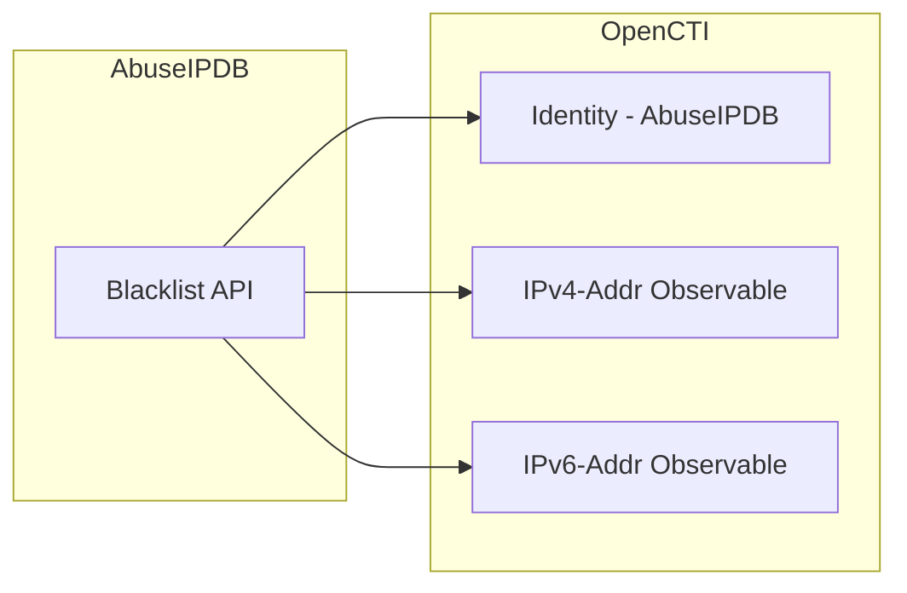

# OpenCTI AbuseIPDB IP Blacklist Connector

| Status | Date | Comment |
|--------|------|---------|
| Community | -    | -       |

The AbuseIPDB connector imports IP addresses from the AbuseIPDB blacklist API into OpenCTI as observables, with optional indicator creation.

## Table of Contents

- [OpenCTI AbuseIPDB IP Blacklist Connector](#opencti-abuseipdb-ip-blacklist-connector)
  - [Table of Contents](#table-of-contents)
  - [Introduction](#introduction)
  - [Installation](#installation)
    - [Requirements](#requirements)
  - [Configuration variables](#configuration-variables)
    - [OpenCTI environment variables](#opencti-environment-variables)
    - [Base connector environment variables](#base-connector-environment-variables)
    - [Connector extra parameters environment variables](#connector-extra-parameters-environment-variables)
  - [Deployment](#deployment)
    - [Docker Deployment](#docker-deployment)
    - [Manual Deployment](#manual-deployment)
  - [Usage](#usage)
  - [Behavior](#behavior)
  - [Debugging](#debugging)
  - [Additional information](#additional-information)

## Introduction

AbuseIPDB is a project dedicated to helping combat the spread of hackers, spammers, and abusive activity on the internet. The AbuseIPDB API provides access to their comprehensive database of IP addresses reported for malicious activity.

This connector fetches the IP blacklist from AbuseIPDB API and imports the malicious IP addresses into OpenCTI as IPv4/IPv6 observables, with optional indicator creation for detection purposes.

## Installation

### Requirements

- OpenCTI Platform >= 6.x
- AbuseIPDB API key (subscription required for higher limits)

## Configuration variables

Find all the configuration variables available here: [Connector Configurations](./__metadata__/CONNECTOR_CONFIG_DOC.md)

_The `opencti` and `connector` options in the `docker-compose.yml` and `config.yml` are the same as for any other connector.
For more information regarding variables, please refer to [OpenCTI's documentation on connectors](https://docs.opencti.io/latest/deployment/connectors/)._

## Deployment

### Docker Deployment

Build the Docker image:

```bash
docker build -t opencti/connector-abuseipdb-ipblacklist:latest .
```

Configure the connector in `docker-compose.yml`:

```yaml
  connector-abuseipdb-ipblacklist:
    image: opencti/connector-abuseipdb-ipblacklist:latest
    environment:
      - OPENCTI_URL=http://localhost
      - OPENCTI_TOKEN=ChangeMe
      - CONNECTOR_ID=ChangeMe
      - CONNECTOR_NAME=AbuseIPDB IP Blacklist
      - CONNECTOR_SCOPE=abuseipdb
      - CONNECTOR_LOG_LEVEL=error
      - CONNECTOR_DURATION_PERIOD=PT12H
      - ABUSEIPDB_API_KEY=ChangeMe
      - ABUSEIPDB_SCORE=75
      - ABUSEIPDB_TLP_LEVEL=clear
      # Optional filters:
      # - ABUSEIPDB_IPVERSION=4
      # - ABUSEIPDB_LIMIT=10000
      # - ABUSEIPDB_EXCEPT_COUNTRY=RU,CN
      # - ABUSEIPDB_ONLY_COUNTRY=US
      # - ABUSEIPDB_CREATE_INDICATOR=true
    restart: always
```

Start the connector:

```bash
docker compose up -d
```

### Manual Deployment

1. Create `config.yml` based on `config.yml.sample`.

2. Install dependencies:

```bash
pip3 install -r requirements.txt
```

3. Start the connector:

```bash
python3 main.py
```

## Usage

The connector runs automatically at the interval defined by `CONNECTOR_DURATION_PERIOD`. To force an immediate run:

**Data Management → Ingestion → Connectors**

Find the connector and click the refresh button to reset the state and trigger a new data fetch.

## Behavior

The connector queries the AbuseIPDB blacklist API and imports malicious IP addresses into OpenCTI.

### Data Flow



### Entity Mapping

| AbuseIPDB Data       | OpenCTI Entity      | Description                                      |
|----------------------|---------------------|--------------------------------------------------|
| IPv4 Address         | IPv4-Addr           | Observable for reported malicious IPv4           |
| IPv6 Address         | IPv6-Addr           | Observable for reported malicious IPv6           |
| Confidence Score     | x_opencti_score     | Score attribute on the observable                |
| Country Code         | Description         | Included in observable description               |
| Last Reported        | Description         | Included in observable description               |

### Processing Details

For each IP address returned by the API, the connector creates:

1. **IPv4-Addr or IPv6-Addr Observable** with:
   - `x_opencti_score`: Confidence score from AbuseIPDB
   - `x_opencti_description`: Contains country code, confidence score, and last reported date
   - `x_opencti_create_indicator`: Based on `create_indicator` config
   - External reference to AbuseIPDB database

2. **Identity**: AbuseIPDB organization identity

3. **TLP Marking**: Based on configured `tlp_level`

### Features

- **Country Filtering**: Include or exclude IPs from specific countries using `exceptCountries` or `onlyCountries`
- **Score Threshold**: Only import IPs above a certain confidence score with `confidenceMinimum`
- **IP Version Selection**: Filter by IPv4, IPv6, or both (mixed)
- **Indicator Creation**: Optionally create detection indicators with `create_indicator`

## Debugging

Enable verbose logging:

```env
CONNECTOR_LOG_LEVEL=debug
```

Common debugging information:
- API response status
- Number of IPs fetched
- STIX bundle creation details

## Additional information

- **Rate Limits**: AbuseIPDB enforces API rate limits based on subscription tier
- **Data Freshness**: Recommended poll interval is 12+ hours (`PT12H`)
- **Subscription Tiers**: Free tier has limited requests; paid tiers allow up to 500,000 IPs
- **Country Codes**: Use ISO 3166-1 alpha-2 codes for country filtering (e.g., `RU`, `CN`, `US`)
