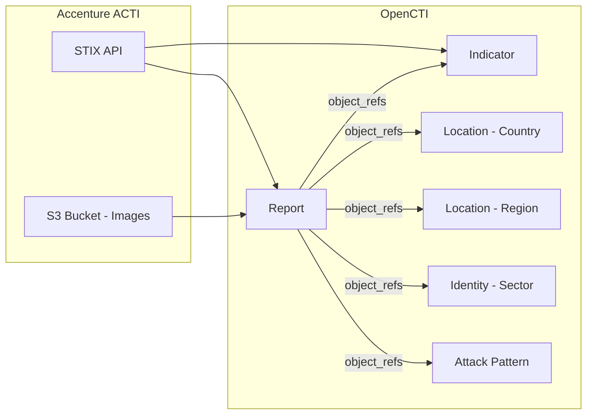

# OpenCTI Accenture ACTI Connector

The Accenture ACTI connector ingests threat intelligence reports and related entities from the Accenture Cyber Threat Intelligence (ACTI) STIX Report Feed into OpenCTI.

| Status    | Date | Comment |
|-----------|------|---------|
| Community | -    | -       |

## Table of Contents

- [OpenCTI Accenture ACTI Connector](#opencti-accenture-acti-connector)
  - [Table of Contents](#table-of-contents)
  - [Introduction](#introduction)
  - [Installation](#installation)
    - [Requirements](#requirements)
  - [Configuration variables](#configuration-variables)
    - [OpenCTI environment variables](#opencti-environment-variables)
    - [Base connector environment variables](#base-connector-environment-variables)
    - [Connector extra parameters environment variables](#connector-extra-parameters-environment-variables)
  - [Deployment](#deployment)
    - [Docker Deployment](#docker-deployment)
    - [Manual Deployment](#manual-deployment)
  - [Usage](#usage)
  - [Behavior](#behavior)
  - [Debugging](#debugging)
  - [Additional information](#additional-information)

## Introduction

Accenture Cyber Threat Intelligence (ACTI) provides comprehensive threat intelligence to help organizations protect against cyber threats. The ACTI platform delivers detailed intelligence reports covering threat actors, malware, vulnerabilities, and attack techniques.

This connector leverages the Accenture ACTI STIX Report Feed to import threat intelligence directly into OpenCTI in STIX 2.1 format, enabling correlation with existing data and enhanced threat visibility.

## Installation

### Requirements

- OpenCTI Platform >= 6.x
- Accenture ACTI subscription with API access
- AWS Cognito credentials (User Pool ID, Client ID)
- AWS S3 bucket access for report images

## Configuration variables

There are a number of configuration options, which are set either in `docker-compose.yml` (for Docker) or in `config.yml` (for manual deployment).

### OpenCTI environment variables

| Parameter     | config.yml | Docker environment variable | Mandatory | Description                                          |
|---------------|------------|-----------------------------|-----------|------------------------------------------------------|
| OpenCTI URL   | url        | `OPENCTI_URL`               | Yes       | The URL of the OpenCTI platform.                     |
| OpenCTI Token | token      | `OPENCTI_TOKEN`             | Yes       | The default admin token set in the OpenCTI platform. |

### Base connector environment variables

| Parameter         | config.yml      | Docker environment variable   | Default         | Mandatory | Description                                                                 |
|-------------------|-----------------|-------------------------------|-----------------|-----------|-----------------------------------------------------------------------------|
| Connector ID      | id              | `CONNECTOR_ID`                |                 | Yes       | A unique `UUIDv4` identifier for this connector instance.                   |
| Connector Name    | name            | `CONNECTOR_NAME`              |                 | Yes       | Name of the connector.                                                      |
| Connector Scope   | scope           | `CONNECTOR_SCOPE`             | accenture       | Yes       | The scope or type of data the connector is importing.                       |
| Log Level         | log_level       | `CONNECTOR_LOG_LEVEL`         | error           | No        | Determines the verbosity of the logs: `debug`, `info`, `warn`, or `error`.  |
| Duration Period   | duration_period | `CONNECTOR_DURATION_PERIOD`   | PT1H            | No        | Time interval between connector runs in ISO 8601 format.                    |

### Connector extra parameters environment variables

| Parameter                  | config.yml                           | Docker environment variable              | Default      | Mandatory | Description                                                                     |
|----------------------------|--------------------------------------|------------------------------------------|--------------|-----------|---------------------------------------------------------------------------------|
| Username                   | accenture_acti.username              | `ACCENTURE_ACTI_USERNAME`                |              | Yes       | Accenture ACTI platform username.                                               |
| Password                   | accenture_acti.password              | `ACCENTURE_ACTI_PASSWORD`                |              | Yes       | Accenture ACTI platform password.                                               |
| User Pool ID               | accenture_acti.user_pool_id          | `ACCENTURE_ACTI_USER_POOL_ID`            |              | Yes       | AWS Cognito User Pool ID for authentication.                                    |
| Client ID                  | accenture_acti.client_id             | `ACCENTURE_ACTI_CLIENT_ID`               |              | Yes       | AWS Cognito Client ID for authentication.                                       |
| S3 Bucket Name             | accenture_acti.s3_bucket_name        | `ACCENTURE_ACTI_S3_BUCKET_NAME`          |              | Yes       | AWS S3 bucket name for report images.                                           |
| S3 Bucket Region           | accenture_acti.s3_bucket_region      | `ACCENTURE_ACTI_S3_BUCKET_REGION`        |              | Yes       | AWS S3 bucket region.                                                           |
| S3 Bucket Access Key       | accenture_acti.s3_bucket_access_key  | `ACCENTURE_ACTI_S3_BUCKET_ACCESS_KEY`    |              | Yes       | AWS S3 access key.                                                              |
| S3 Bucket Secret Key       | accenture_acti.s3_bucket_secret_key  | `ACCENTURE_ACTI_S3_BUCKET_SECRET_KEY`    |              | Yes       | AWS S3 secret key.                                                              |
| TLP Level                  | accenture_acti.tlp_level             | `ACCENTURE_ACTI_CLIENT_TLP_LEVEL`        | amber+strict | No        | TLP marking for imported data (`clear`, `green`, `amber`, `amber+strict`, `red`). |
| Relative Import Start Date | accenture_acti.relative_import_start_date | `ACCENTURE_ACTI_RELATIVE_IMPORT_START_DATE` | P30D     | No        | ISO 8601 duration for initial data import range (e.g., `P30D` for 30 days).     |

## Deployment

### Docker Deployment

Build the Docker image:

```bash
docker build -t opencti/connector-accenture-acti:latest .
```

Configure the connector in `docker-compose.yml`:

```yaml
  connector-accenture-acti:
    image: opencti/connector-accenture-acti:latest
    environment:
      - OPENCTI_URL=http://localhost
      - OPENCTI_TOKEN=ChangeMe
      - CONNECTOR_ID=ChangeMe
      - CONNECTOR_NAME=Accenture ACTI
      - CONNECTOR_SCOPE=accenture
      - CONNECTOR_LOG_LEVEL=error
      - CONNECTOR_DURATION_PERIOD=PT1H
      - ACCENTURE_ACTI_USERNAME=ChangeMe
      - ACCENTURE_ACTI_PASSWORD=ChangeMe
      - ACCENTURE_ACTI_USER_POOL_ID=ChangeMe
      - ACCENTURE_ACTI_CLIENT_ID=ChangeMe
      - ACCENTURE_ACTI_S3_BUCKET_NAME=ChangeMe
      - ACCENTURE_ACTI_S3_BUCKET_REGION=ChangeMe
      - ACCENTURE_ACTI_S3_BUCKET_ACCESS_KEY=ChangeMe
      - ACCENTURE_ACTI_S3_BUCKET_SECRET_KEY=ChangeMe
      - ACCENTURE_ACTI_CLIENT_TLP_LEVEL=amber
      - ACCENTURE_ACTI_RELATIVE_IMPORT_START_DATE=P30D
    restart: always
```

Start the connector:

```bash
docker compose up -d
```

### Manual Deployment

1. Create `config.yml` based on `config.yml.sample`.

2. Install dependencies:

```bash
pip3 install -r requirements.txt
```

3. Start the connector from the `src` directory:

```bash
python3 main.py
```

## Usage

The connector runs automatically at the interval defined by `CONNECTOR_DURATION_PERIOD`. To force an immediate run:

**Data Management → Ingestion → Connectors**

Find the connector and click the refresh button to reset the state and trigger a new data fetch.

## Behavior

The connector fetches STIX-formatted reports from the Accenture ACTI platform and imports them into OpenCTI.

### Data Flow



### Entity Mapping

The connector processes STIX bundles from ACTI and enriches them with additional entity extraction from report labels:

| ACTI Data            | OpenCTI Entity      | Description                                      |
|----------------------|---------------------|--------------------------------------------------|
| Report               | Report              | Intelligence report (HTML converted to Markdown) |
| Indicator            | Indicator           | IOCs with `x_opencti_create_observables=true`    |
| Country label        | Location (Country)  | Extracted from taxonomy mapping                  |
| Region label         | Location (Region)   | Extracted from taxonomy mapping                  |
| Industry label       | Identity (Sector)   | Extracted from taxonomy mapping                  |
| MITRE ATT&CK label   | Attack Pattern      | Extracted from taxonomy mapping                  |
| x_severity           | Report Label        | Severity converted to label                      |
| x_threat_type        | Report Labels       | Threat types converted to labels                 |

### Processing Details

1. **Reports are fetched in 30-minute intervals** to handle large date ranges
2. **Images are processed** from two sources:
   - SHA256-referenced images downloaded from S3 bucket
   - Base64-embedded images extracted from HTML
3. **Report descriptions** are converted from HTML to Markdown
4. **Labels are mapped** to OpenCTI entities using a taxonomy file
5. **`related-to` relationships** are converted to `object_refs` on reports

### Features

- **Incremental Updates**: Processes data in 30-minute intervals since last run
- **Historical Import**: Configurable lookback period with `relative_import_start_date`
- **Image Handling**: Downloads and embeds images from S3 and inline base64
- **Taxonomy Mapping**: Converts ACTI labels to OpenCTI entities (countries, regions, sectors, attack patterns)
- **HTML to Markdown**: Report descriptions are converted for better readability

## Debugging

Enable verbose logging:

```env
CONNECTOR_LOG_LEVEL=debug
```

Log output includes:
- Interval processing progress
- Image download and processing status
- Bundle processing details
- S3 access errors

## Additional information

- **Authentication**: Uses AWS Cognito for secure API authentication
- **S3 Access**: Required for downloading report images
- **Data Format**: All data is provided in native STIX 2.1 format
- **Rate Limits**: Data is processed in 30-minute intervals to avoid overload
- **Subscription Required**: Active Accenture ACTI subscription is required
