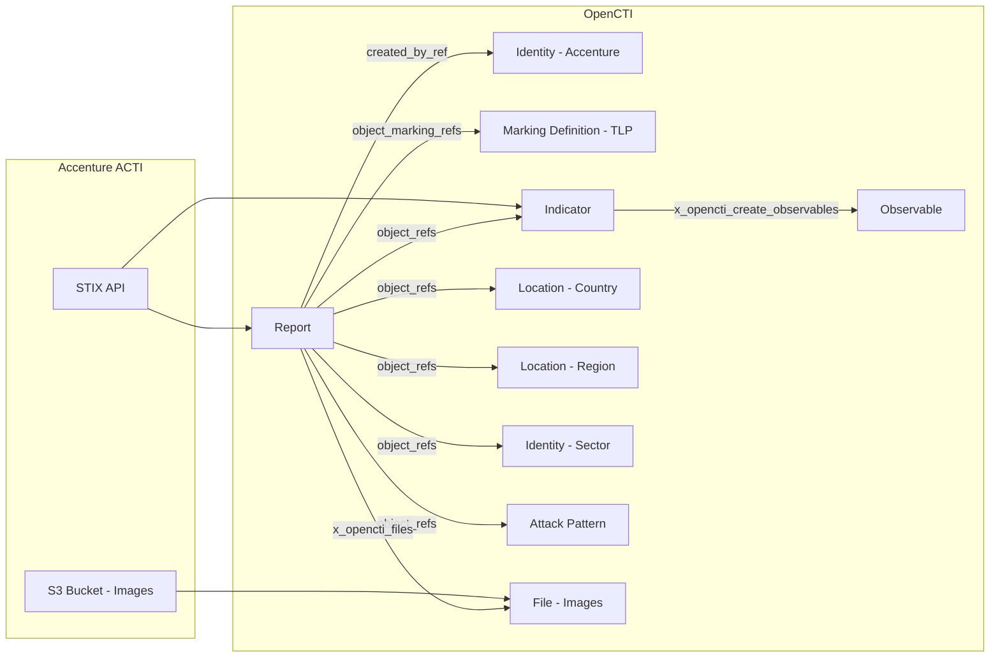

# OpenCTI Accenture ACTI Connector

| Status | Date | Comment |
|--------|------|---------|
| Community | -    | -       |

The Accenture ACTI connector ingests threat intelligence reports and related entities from the Accenture Cyber Threat Intelligence (ACTI) STIX Report Feed into OpenCTI.

## Table of Contents

- [OpenCTI Accenture ACTI Connector](#opencti-accenture-acti-connector)
  - [Table of Contents](#table-of-contents)
  - [Introduction](#introduction)
  - [Installation](#installation)
    - [Requirements](#requirements)
  - [Configuration variables](#configuration-variables)
  - [Deployment](#deployment)
    - [Docker Deployment](#docker-deployment)
    - [Manual Deployment](#manual-deployment)
  - [Usage](#usage)
  - [Behavior](#behavior)
  - [Debugging](#debugging)
  - [Additional information](#additional-information)

## Introduction

Accenture Cyber Threat Intelligence (ACTI) provides comprehensive threat intelligence to help organizations protect against cyber threats. The ACTI platform delivers detailed intelligence reports covering threat actors, malware, vulnerabilities, and attack techniques.

This connector leverages the Accenture ACTI STIX Report Feed to import threat intelligence directly into OpenCTI in STIX 2.1 format, enabling correlation with existing data and enhanced threat visibility.

## Installation

### Requirements

- OpenCTI Platform >= 6.x
- Accenture ACTI subscription with API access
- AWS Cognito credentials (User Pool ID, Client ID)
- AWS S3 bucket access for report images

## Configuration variables

Find all the configuration variables available here: [Connector Configurations](./__metadata__/CONNECTOR_CONFIG_DOC.md)

_The `opencti` and `connector` options in the `docker-compose.yml` and `config.yml` are the same as for any other connector.
For more information regarding variables, please refer to [OpenCTI's documentation on connectors](https://docs.opencti.io/latest/deployment/connectors/)._

## Deployment

### Docker Deployment

Build the Docker image:

```bash
docker build -t opencti/connector-accenture-acti:latest .
```

Configure the connector in `docker-compose.yml`:

```yaml
  connector-accenture-acti:
    image: opencti/connector-accenture-acti:latest
    environment:
      - OPENCTI_URL=http://localhost
      - OPENCTI_TOKEN=ChangeMe
      - CONNECTOR_ID=ChangeMe
      - CONNECTOR_NAME=Accenture ACTI
      - CONNECTOR_SCOPE=accenture
      - CONNECTOR_LOG_LEVEL=error
      - CONNECTOR_DURATION_PERIOD=PT1H
      - ACCENTURE_ACTI_USERNAME=ChangeMe
      - ACCENTURE_ACTI_PASSWORD=ChangeMe
      - ACCENTURE_ACTI_USER_POOL_ID=ChangeMe
      - ACCENTURE_ACTI_CLIENT_ID=ChangeMe
      - ACCENTURE_ACTI_S3_BUCKET_NAME=ChangeMe
      - ACCENTURE_ACTI_S3_BUCKET_REGION=ChangeMe
      - ACCENTURE_ACTI_S3_BUCKET_ACCESS_KEY=ChangeMe
      - ACCENTURE_ACTI_S3_BUCKET_SECRET_KEY=ChangeMe
      - ACCENTURE_ACTI_TLP_LEVEL=amber
      - ACCENTURE_ACTI_RELATIVE_IMPORT_START_DATE=P30D
    restart: always
```

Start the connector:

```bash
docker compose up -d
```

### Manual Deployment

1. Create `config.yml` based on `config.yml.sample`.

2. Install dependencies:

```bash
pip3 install -r requirements.txt
```

3. Start the connector from the `src` directory:

```bash
python3 main.py
```

## Usage

The connector runs automatically at the interval defined by `CONNECTOR_DURATION_PERIOD`. To force an immediate run:

**Data Management → Ingestion → Connectors**

Find the connector and click the refresh button to reset the state and trigger a new data fetch.

## Behavior

The connector fetches STIX-formatted reports from the Accenture ACTI platform and imports them into OpenCTI. It processes data in 30-minute intervals to handle large date ranges efficiently.

### Data Flow


```mermaid
graph LR
    subgraph Accenture ACTI
        direction TB
        API[STIX API]
        S3[S3 Bucket - Images]
    end

    subgraph OpenCTI
        direction LR
        Identity[Identity - Accenture]
        Marking[Marking Definition - TLP]
        Report[Report]
        Indicator[Indicator]
        Observable[Observable]
        Country[Location - Country]
        Region[Location - Region]
        Sector[Identity - Sector]
        AttackPattern[Attack Pattern]
        File[File - Images]
    end

    API --> Report
    API --> Indicator
    S3 --> File
    Report -- created_by_ref --> Identity
    Report -- object_marking_refs --> Marking
    Report -- object_refs --> Indicator
    Report -- object_refs --> Country
    Report -- object_refs --> Region
    Report -- object_refs --> Sector
    Report -- object_refs --> AttackPattern
    Report -- x_opencti_files --> File
    Indicator -- x_opencti_create_observables --> Observable
```

### Entity Mapping

| ACTI STIX Data       | OpenCTI Entity Type | STIX Type        | Description                                                                 |
|----------------------|---------------------|------------------|-----------------------------------------------------------------------------|
| Report               | Report              | report           | Intelligence report with HTML converted to Markdown                         |
| Indicator            | Indicator           | indicator        | IOCs with `x_opencti_create_observables=true` to auto-create observables     |
| Observable           | Observable          | Various          | Auto-created from indicators (IPv4-Addr, Domain-Name, URL, File, etc.)      |
| Country label        | Location            | location         | Country location extracted from taxonomy mapping (x_opencti_location_type: Country) |
| Region label         | Location            | location         | Region location extracted from taxonomy mapping (x_opencti_location_type: Region) |
| Industry label       | Identity            | identity         | Sector identity extracted from taxonomy mapping (identity_class: class)      |
| MITRE ATT&CK label   | Attack Pattern      | attack-pattern   | Attack pattern with x_mitre_id extracted from taxonomy mapping              |
| x_severity           | Report Label        | label            | Severity value converted to report label                                    |
| x_threat_type        | Report Labels       | label            | Threat types array converted to report labels                               |
| Image (SHA256)       | File                | artifact         | Image file downloaded from S3 bucket and attached to report                 |
| Image (Base64)       | File                | artifact         | Base64-embedded image extracted from HTML and attached to report            |
| Author                | Identity            | identity         | Accenture organization identity (created_by_ref on all objects)            |
| TLP Marking          | Marking Definition  | marking-definition | TLP marking applied to all objects (white, green, amber, amber+strict, red) |

### Data Modelization Schema

The connector processes STIX bundles with the following structure:

```
STIX Bundle
├── Identity (Accenture)
│   └── id: Identity.generate_id("Accenture", "organization")
├── Marking Definition (TLP)
│   └── id: MarkingDefinition.generate_id("TLP", "TLP:{LEVEL}")
├── Report
│   ├── created_by_ref: Identity.id
│   ├── object_marking_refs: [MarkingDefinition.id]
│   ├── object_refs: [Indicator.id, Location.id, Identity.id, AttackPattern.id]
│   ├── labels: [processed labels + x_severity + x_threat_type]
│   ├── description: HTML → Markdown converted
│   └── x_opencti_files: [File objects from S3/base64]
├── Indicator
│   ├── created_by_ref: Identity.id
│   ├── object_marking_refs: [MarkingDefinition.id]
│   ├── x_opencti_create_observables: true
│   └── pattern: STIX pattern expression
├── Observable (auto-created)
│   ├── type: IPv4-Addr, Domain-Name, URL, File, etc.
│   └── value: Observable value
├── Location (Country)
│   ├── id: Location.generate_id(name, "Country")
│   ├── country: Country name
│   ├── x_opencti_location_type: "Country"
│   └── x_opencti_aliases: [original label]
├── Location (Region)
│   ├── id: Location.generate_id(name, "Region")
│   ├── region: Region name
│   ├── x_opencti_location_type: "Region"
│   └── x_opencti_aliases: [original label, region variant]
├── Identity (Sector)
│   ├── id: Identity.generate_id(name, "class")
│   ├── identity_class: "class"
│   └── x_opencti_aliases: [original label, industry variants]
└── Attack Pattern
    ├── id: AttackPattern.generate_id(name)
    ├── x_mitre_id: MITRE ATT&CK ID
    └── aliases: [original label]
```

### Processing Details

1. **Interval Processing**: Data is fetched and processed in 30-minute intervals to avoid API overload
2. **Image Processing**: 
   - SHA256-referenced images: Downloaded from S3 bucket using hash value
   - Base64-embedded images: Extracted from HTML and converted to file objects
   - Images are attached to reports via `x_opencti_files`
3. **Description Conversion**: HTML content is converted to Markdown for better readability
4. **Label Mapping**: Report labels are processed through taxonomy mapping to generate:
   - Location entities (Country/Region)
   - Identity entities (Sector/Industry)
   - Attack Pattern entities (MITRE ATT&CK)
5. **Relationship Conversion**: `related-to` relationships from reports are converted to `object_refs`
6. **Custom Extensions**: `x_severity` and `x_threat_type` are converted to report labels
7. **Author Attribution**: All objects are attributed to Accenture Identity via `created_by_ref`
8. **TLP Marking**: All objects receive TLP marking based on configuration

### Relationships Created

- Report → `object_refs` → Indicator, Location, Identity (Sector), Attack Pattern
- Indicator → `based-on` → Observable (auto-created when `x_opencti_create_observables=true`)
- Report → `x_opencti_files` → File (images from S3/base64)
- All objects → `created_by_ref` → Identity (Accenture)
- All objects → `object_marking_refs` → Marking Definition (TLP)

## Debugging

Enable verbose logging:

```env
CONNECTOR_LOG_LEVEL=debug
```

Log output includes:
- Interval processing progress
- Image download and processing status
- Bundle processing details
- S3 access errors

## Additional information

- **Authentication**: Uses AWS Cognito for secure API authentication
- **S3 Access**: Required for downloading report images
- **Data Format**: All data is provided in native STIX 2.1 format
- **Rate Limits**: Data is processed in 30-minute intervals to avoid overload
- **Subscription Required**: Active Accenture ACTI subscription is required
