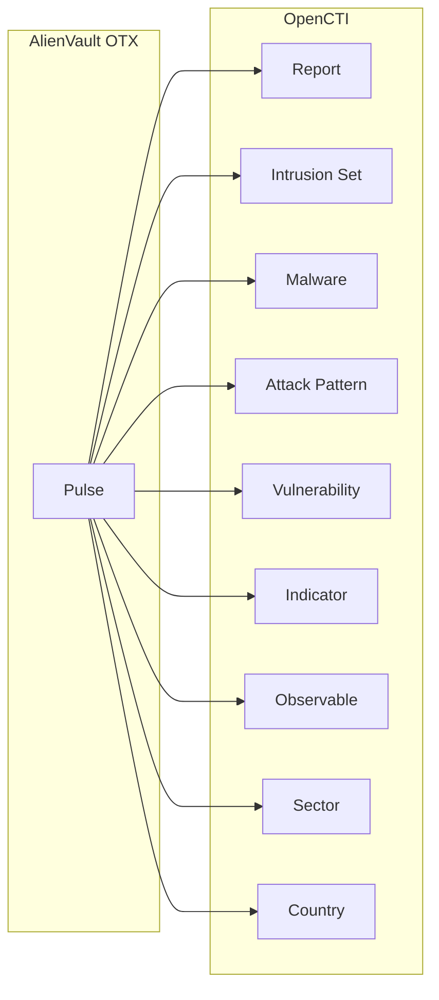

# OpenCTI AlienVault OTX Connector

| Status | Date | Comment |
|--------|------|---------|
| Community | -    | -       |

The AlienVault OTX connector imports threat intelligence "Pulses" from AlienVault's Open Threat Exchange (OTX) DirectConnect API into OpenCTI.

## Table of Contents

- [OpenCTI AlienVault OTX Connector](#opencti-alienvault-otx-connector)
  - [Table of Contents](#table-of-contents)
  - [Introduction](#introduction)
  - [Installation](#installation)
    - [Requirements](#requirements)
  - [Configuration variables](#configuration-variables)
    - [OpenCTI environment variables](#opencti-environment-variables)
    - [Base connector environment variables](#base-connector-environment-variables)
    - [Connector extra parameters environment variables](#connector-extra-parameters-environment-variables)
  - [Deployment](#deployment)
    - [Docker Deployment](#docker-deployment)
    - [Manual Deployment](#manual-deployment)
  - [Usage](#usage)
  - [Behavior](#behavior)
  - [Debugging](#debugging)
  - [Additional information](#additional-information)

## Introduction

AlienVault Open Threat Exchange (OTX) is the world's first truly open threat intelligence community. OTX allows security researchers and threat data producers to share threat data, fostering collaboration and enabling threat detection.

This connector fetches Pulses from the OTX DirectConnect API and converts them into comprehensive STIX 2.1 bundles including reports, indicators, observables, threat actors, malware, vulnerabilities, and attack patterns.

## Installation

### Requirements

- OpenCTI Platform >= 6.x
- AlienVault OTX API key (free registration at [otx.alienvault.com](https://otx.alienvault.com))

## Configuration variables

There are a number of configuration options, which are set either in `docker-compose.yml` (for Docker) or in `config.yml` (for manual deployment).

### OpenCTI environment variables

| Parameter     | config.yml | Docker environment variable | Mandatory | Description                                          |
|---------------|------------|-----------------------------|-----------|------------------------------------------------------|
| OpenCTI URL   | url        | `OPENCTI_URL`               | Yes       | The URL of the OpenCTI platform.                     |
| OpenCTI Token | token      | `OPENCTI_TOKEN`             | Yes       | The default admin token set in the OpenCTI platform. |

### Base connector environment variables

| Parameter         | config.yml      | Docker environment variable   | Default                            | Mandatory | Description                                                                 |
|-------------------|-----------------|-------------------------------|------------------------------------|-----------|-----------------------------------------------------------------------------|
| Connector ID      | id              | `CONNECTOR_ID`                | 8bbae241-6289-4faf-b7d6-7503bed50bbc | No    | A unique `UUIDv4` identifier for this connector instance.                   |
| Connector Name    | name            | `CONNECTOR_NAME`              | AlienVault                         | No        | Name of the connector.                                                      |
| Connector Scope   | scope           | `CONNECTOR_SCOPE`             | alienvault                         | No        | The scope or type of data the connector is importing.                       |
| Log Level         | log_level       | `CONNECTOR_LOG_LEVEL`         | error                              | No        | Determines the verbosity of the logs: `debug`, `info`, `warn`, or `error`.  |
| Duration Period   | duration_period | `CONNECTOR_DURATION_PERIOD`   | PT30M                              | No        | Time interval between connector runs in ISO 8601 format.                    |

### Connector extra parameters environment variables

| Parameter                       | config.yml                           | Docker environment variable                   | Default                      | Mandatory | Description                                                                      |
|---------------------------------|--------------------------------------|-----------------------------------------------|------------------------------|-----------|----------------------------------------------------------------------------------|
| Base URL                        | alienvault.base_url                  | `ALIENVAULT_BASE_URL`                         | https://otx.alienvault.com   | No        | The base URL for the OTX DirectConnect API.                                      |
| API Key                         | alienvault.api_key                   | `ALIENVAULT_API_KEY`                          |                              | Yes       | Your OTX API key.                                                                |
| TLP                             | alienvault.tlp                       | `ALIENVAULT_TLP`                              | White                        | No        | Default TLP marking if Pulse doesn't define one.                                 |
| Create Observables              | alienvault.create_observables        | `ALIENVAULT_CREATE_OBSERVABLES`               | true                         | No        | Create observables from Pulse indicators.                                        |
| Create Indicators               | alienvault.create_indicators         | `ALIENVAULT_CREATE_INDICATORS`                | true                         | No        | Create indicators from Pulse indicators.                                         |
| Pulse Start Timestamp           | alienvault.pulse_start_timestamp     | `ALIENVAULT_PULSE_START_TIMESTAMP`            | 2020-05-01T00:00:00          | No        | ISO 8601 timestamp; import Pulses modified after this date.                      |
| Report Type                     | alienvault.report_type               | `ALIENVAULT_REPORT_TYPE`                      | threat-report                | No        | Report type in OpenCTI.                                                          |
| Report Status                   | alienvault.report_status             | `ALIENVAULT_REPORT_STATUS`                    | New                          | No        | Report status: `New`, `In progress`, `Analyzed`, `Closed`.                       |
| Guess Malware                   | alienvault.guess_malware             | `ALIENVAULT_GUESS_MALWARE`                    | false                        | No        | Use Pulse tags to guess related malware.                                         |
| Guess CVE                       | alienvault.guess_cve                 | `ALIENVAULT_GUESS_CVE`                        | false                        | No        | Use Pulse tags to detect CVEs.                                                   |
| Excluded Indicator Types        | alienvault.excluded_pulse_indicator_types | `ALIENVAULT_EXCLUDED_PULSE_INDICATOR_TYPES` |                            | No        | Comma-separated list of indicator types to exclude (e.g., `FileHash-MD5,FileHash-SHA1`). |
| Enable Relationships            | alienvault.enable_relationships      | `ALIENVAULT_ENABLE_RELATIONSHIPS`             | true                         | No        | Create relationships between SDOs.                                               |
| Enable Attack Pattern Indicates | alienvault.enable_attack_patterns_indicates | `ALIENVAULT_ENABLE_ATTACK_PATTERNS_INDICATES` | true                   | No        | Create `indicates` relationships between indicators and attack patterns.         |
| Filter Indicators               | alienvault.filter_indicators         | `ALIENVAULT_FILTER_INDICATORS`                | false                        | No        | Filter out indicators created before the latest pulse datetime.                  |
| Default Score                   | alienvault.default_x_opencti_score   | `ALIENVAULT_DEFAULT_X_OPENCTI_SCORE`          | 50                           | No        | Default x_opencti_score for indicators.                                          |
| IP Score                        | alienvault.x_opencti_score_ip        | `ALIENVAULT_X_OPENCTI_SCORE_IP`               | (uses default)               | No        | x_opencti_score for IP indicators.                                               |
| Domain Score                    | alienvault.x_opencti_score_domain    | `ALIENVAULT_X_OPENCTI_SCORE_DOMAIN`           | (uses default)               | No        | x_opencti_score for Domain indicators.                                           |
| Hostname Score                  | alienvault.x_opencti_score_hostname  | `ALIENVAULT_X_OPENCTI_SCORE_HOSTNAME`         | (uses default)               | No        | x_opencti_score for Hostname indicators.                                         |
| Email Score                     | alienvault.x_opencti_score_email     | `ALIENVAULT_X_OPENCTI_SCORE_EMAIL`            | (uses default)               | No        | x_opencti_score for Email indicators.                                            |
| File Score                      | alienvault.x_opencti_score_file      | `ALIENVAULT_X_OPENCTI_SCORE_FILE`             | (uses default)               | No        | x_opencti_score for File indicators.                                             |
| URL Score                       | alienvault.x_opencti_score_url       | `ALIENVAULT_X_OPENCTI_SCORE_URL`              | (uses default)               | No        | x_opencti_score for URL indicators.                                              |
| Mutex Score                     | alienvault.x_opencti_score_mutex     | `ALIENVAULT_X_OPENCTI_SCORE_MUTEX`            | (uses default)               | No        | x_opencti_score for Mutex indicators.                                            |
| Crypto Wallet Score             | alienvault.x_opencti_score_cryptocurrency_wallet | `ALIENVAULT_X_OPENCTI_SCORE_CRYPTOCURRENCY_WALLET` | (uses default)    | No        | x_opencti_score for Cryptocurrency Wallet indicators.                            |

## Deployment

### Docker Deployment

Build the Docker image:

```bash
docker build -t opencti/connector-alienvault:latest .
```

Configure the connector in `docker-compose.yml`:

```yaml
  connector-alienvault:
    image: opencti/connector-alienvault:latest
    environment:
      - OPENCTI_URL=http://localhost
      - OPENCTI_TOKEN=ChangeMe
      - CONNECTOR_ID=8bbae241-6289-4faf-b7d6-7503bed50bbc
      - CONNECTOR_NAME=AlienVault
      - CONNECTOR_SCOPE=alienvault
      - CONNECTOR_LOG_LEVEL=error
      - CONNECTOR_DURATION_PERIOD=PT30M
      - ALIENVAULT_BASE_URL=https://otx.alienvault.com
      - ALIENVAULT_API_KEY=ChangeMe
      - ALIENVAULT_TLP=White
      - ALIENVAULT_CREATE_OBSERVABLES=true
      - ALIENVAULT_CREATE_INDICATORS=true
      - ALIENVAULT_PULSE_START_TIMESTAMP=2020-05-01T00:00:00
      - ALIENVAULT_REPORT_TYPE=threat-report
      - ALIENVAULT_REPORT_STATUS=New
      - ALIENVAULT_GUESS_MALWARE=false
      - ALIENVAULT_GUESS_CVE=false
      - ALIENVAULT_EXCLUDED_PULSE_INDICATOR_TYPES=FileHash-MD5,FileHash-SHA1
      - ALIENVAULT_ENABLE_RELATIONSHIPS=true
      - ALIENVAULT_ENABLE_ATTACK_PATTERNS_INDICATES=true
      - ALIENVAULT_DEFAULT_X_OPENCTI_SCORE=50
    restart: always
```

Start the connector:

```bash
docker compose up -d
```

### Manual Deployment

1. Create `config.yml` based on `config.yml.sample`.

2. Install dependencies:

```bash
pip3 install -r requirements.txt
```

3. Start the connector from the `src` directory:

```bash
python3 -m alienvault
```

## Usage

The connector runs automatically at the interval defined by `CONNECTOR_DURATION_PERIOD`. To force an immediate run:

**Data Management → Ingestion → Connectors**

Find the connector and click the refresh button to reset the state and trigger a new data fetch.

## Behavior

The connector fetches Pulses from OTX and converts them into comprehensive STIX 2.1 bundles.

### Data Flow



### Entity Mapping

| OTX Pulse Data         | OpenCTI Entity      | Description                                      |
|------------------------|---------------------|--------------------------------------------------|
| Pulse                  | Report              | Contains all related entities as object_refs     |
| Adversary              | Intrusion Set       | Threat actor group                               |
| Malware Families       | Malware             | Malware families mentioned in Pulse              |
| Attack IDs             | Attack Pattern      | MITRE ATT&CK techniques                          |
| CVE Indicators         | Vulnerability       | CVE vulnerabilities                              |
| Industries             | Sector (Identity)   | Targeted sectors                                 |
| Targeted Countries     | Country (Location)  | Targeted countries                               |
| IPv4/IPv6              | IPv4-Addr/IPv6-Addr | IP address observables                           |
| Domain                 | Domain-Name         | Domain name observables                          |
| Hostname               | Hostname            | Hostname observables                             |
| Email                  | Email-Addr          | Email address observables                        |
| URL/URI                | URL                 | URL observables                                  |
| FileHash-*             | File                | File hash observables (MD5, SHA1, SHA256)        |
| FilePath               | File                | File name/path observables                       |
| Mutex                  | Mutex               | Mutex observables                                |
| BitcoinAddress         | Cryptocurrency-Wallet | Bitcoin wallet observables                     |
| YARA                   | Indicator (YARA)    | YARA rule indicators                             |

### Relationships Created

- Intrusion Set → `uses` → Malware
- Intrusion Set → `uses` → Attack Pattern
- Intrusion Set → `targets` → Sector
- Intrusion Set → `targets` → Country
- Intrusion Set → `targets` → Vulnerability
- Malware → `uses` → Attack Pattern
- Malware → `targets` → Sector
- Malware → `targets` → Country
- Malware → `targets` → Vulnerability
- Attack Pattern → `targets` → Vulnerability
- Indicator → `indicates` → Intrusion Set, Malware, Attack Pattern
- Indicator → `based-on` → Observable

### Processing Details

1. **Pulse Author**: If Pulse has a specific author, a separate Identity is created
2. **TLP Handling**: Uses Pulse-defined TLP or falls back to configured default
3. **Tag-based Guessing**: Optionally infer malware/CVEs from Pulse tags
4. **Type-specific Scores**: Configure different x_opencti_score per indicator type
5. **Excluded Types**: Skip specific indicator types (e.g., weak hash types)

## Debugging

Enable verbose logging:

```env
CONNECTOR_LOG_LEVEL=debug
```

Log output includes:
- Pulse processing details
- Indicator creation progress
- Bundle sending status

## Additional information

- **Start Timestamp Warning**: Setting `ALIENVAULT_PULSE_START_TIMESTAMP` too far back can result in fetching a large number of Pulses
- **Free API**: OTX API is free to use after registration
- **Rate Limits**: OTX has rate limits; the connector handles pagination automatically
- **Deprecated**: `ALIENVAULT_INTERVAL_SEC` is deprecated; use `CONNECTOR_DURATION_PERIOD` instead
