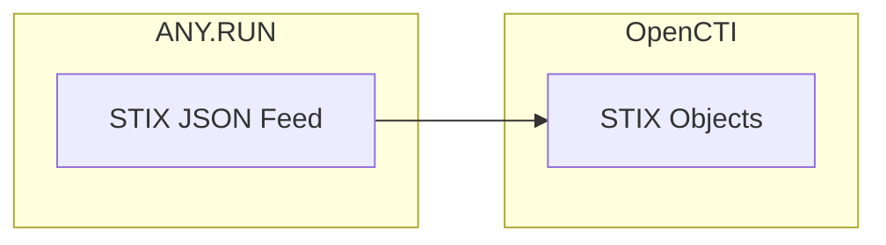

# OpenCTI ANY.RUN Feed Connector

The ANY.RUN connector imports threat intelligence feed data from the ANY.RUN Interactive Online Malware Sandbox into OpenCTI.

| Status    | Date | Comment |
|-----------|------|---------|
| Community | -    | -       |

## Table of Contents

- [OpenCTI ANY.RUN Feed Connector](#opencti-anyrun-feed-connector)
  - [Table of Contents](#table-of-contents)
  - [Introduction](#introduction)
  - [Installation](#installation)
    - [Requirements](#requirements)
  - [Configuration variables](#configuration-variables)
    - [OpenCTI environment variables](#opencti-environment-variables)
    - [Base connector environment variables](#base-connector-environment-variables)
    - [Connector extra parameters environment variables](#connector-extra-parameters-environment-variables)
  - [Deployment](#deployment)
    - [Docker Deployment](#docker-deployment)
    - [Manual Deployment](#manual-deployment)
  - [Usage](#usage)
  - [Behavior](#behavior)
  - [Debugging](#debugging)
  - [Additional information](#additional-information)

## Introduction

ANY.RUN is an interactive online malware sandbox that provides real-time analysis of suspicious files and URLs. Their threat intelligence feed provides STIX-formatted threat data extracted from malware analysis.

This connector fetches the STIX JSON feed from ANY.RUN API and imports the threat intelligence objects directly into OpenCTI.

## Installation

### Requirements

- OpenCTI Platform >= 5.12.32
- ANY.RUN TI Feed subscription

## Configuration variables

There are a number of configuration options, which are set either in `docker-compose.yml` (for Docker) or in `config.yml` (for manual deployment).

### OpenCTI environment variables

| Parameter     | config.yml | Docker environment variable | Mandatory | Description                                                                       |
|---------------|------------|-----------------------------|-----------|-----------------------------------------------------------------------------------|
| OpenCTI URL   | url        | `OPENCTI_URL`               | Yes       | The URL of the OpenCTI platform. Note: final `/` should be avoided.               |
| OpenCTI Token | token      | `OPENCTI_TOKEN`             | Yes       | The default admin token set in the OpenCTI platform.                              |

### Base connector environment variables

| Parameter        | config.yml | Docker environment variable | Default | Mandatory | Description                                                                                                         |
|------------------|------------|-----------------------------|---------|-----------|--------------------------------------------------------------------------------------------------------------------|
| Connector ID     | id         | `CONNECTOR_ID`              |         | Yes       | A unique `UUIDv4` identifier for this connector instance.                                                           |
| Connector Name   | name       | `CONNECTOR_NAME`            |         | Yes       | Name of the connector to be shown in OpenCTI.                                                                       |
| Connector Scope  | scope      | `CONNECTOR_SCOPE`           | stix2   | Yes       | Supported scope (e.g., `text/html`, `stix2`).                                                                       |
| Log Level        | log_level  | `CONNECTOR_LOG_LEVEL`       | info    | No        | Determines the verbosity of logs: `debug`, `info`, `warn`, or `error`.                                              |
| Run Every        | -          | `CONNECTOR_RUN_EVERY`       |         | Yes       | Interval format: `7d`, `12h`, `10m`, `30s` (d=days, h=hours, m=minutes, s=seconds).                                 |

### Connector extra parameters environment variables

| Parameter     | config.yml | Docker environment variable | Default                                 | Mandatory | Description                                                                                              |
|---------------|------------|-----------------------------|-----------------------------------------|-----------|----------------------------------------------------------------------------------------------------------|
| TI Token      | token      | `ANYRUN_TI_TOKEN`           |                                         | Yes       | ANY.RUN TI Feed credentials (API-Key for demo-feed, Basic for full - type selected automatically).      |
| TI URL        | url        | `ANYRUN_TI_URL`             | https://api.any.run/v1/feeds/stix.json  | No        | ANY.RUN TI Feed URL.                                                                                     |

## Deployment

### Docker Deployment

Build the Docker image:

```bash
docker build -t opencti/connector-anyrun-feed:latest .
```

Configure the connector in `docker-compose.yml`:

```yaml
  connector-anyrun-feed:
    image: opencti/connector-anyrun-feed:latest
    environment:
      - OPENCTI_URL=http://localhost
      - OPENCTI_TOKEN=ChangeMe
      - CONNECTOR_ID=ChangeMe
      - CONNECTOR_NAME=ANY.RUN feed
      - CONNECTOR_SCOPE=stix2
      - CONNECTOR_LOG_LEVEL=info
      - CONNECTOR_RUN_EVERY=1d
      - ANYRUN_TI_TOKEN=ChangeMe
    restart: always
```

Start the connector:

```bash
docker compose up -d
```

### Manual Deployment

1. Create `config.yml` based on `config.yml.sample`.

2. Install dependencies:

```bash
pip3 install -r requirements.txt
```

3. Start the connector:

```bash
python3 anyrun_feed.py
```

## Usage

The connector runs automatically at the interval set by `CONNECTOR_RUN_EVERY`. To force an immediate run:

**Data Management → Ingestion → Connectors**

Find the connector and click the refresh button to reset the state and trigger a new data fetch.

## Behavior

The connector fetches the STIX JSON feed from ANY.RUN API and imports the objects directly into OpenCTI.

### Data Flow



### Entity Mapping

The connector imports native STIX 2.1 objects from ANY.RUN feed. Common entity types include:

| ANY.RUN Data         | OpenCTI Entity      | Description                                      |
|----------------------|---------------------|--------------------------------------------------|
| Malware samples      | File                | File hashes and metadata from analysis           |
| Network indicators   | Domain/IP/URL       | Network observables extracted from samples       |
| Malware families     | Malware             | Identified malware family information            |
| Attack patterns      | Attack Pattern      | TTPs observed during analysis                    |

### Processing Details

1. **API Authentication**: Supports both API-Key (demo) and Basic (full) authentication - automatically detected
2. **Native STIX Import**: Data is already in STIX format, directly imported to OpenCTI
3. **State Management**: Tracks last run to avoid duplicate processing

## Debugging

Enable verbose logging:

```env
CONNECTOR_LOG_LEVEL=debug
```

Log output includes:
- Feed fetch status
- Number of STIX objects received
- Bundle sending status

## Additional information

- **Authentication Types**:
  - API-Key: For demo feed access
  - Basic: For full feed access
  - The connector automatically detects the correct authentication method
- **Feed Format**: Native STIX 2.1 JSON format
- **Interval Format**: Use `1d` for daily, `12h` for twice daily, etc.
