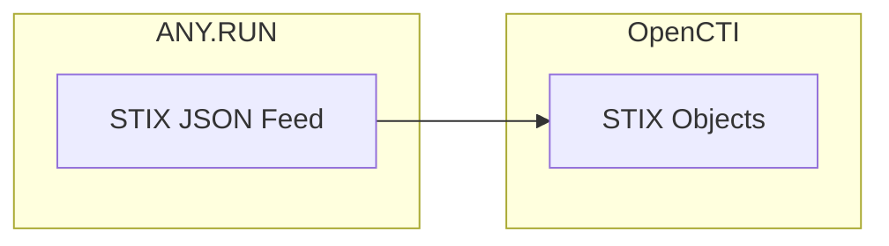

<p align="center">
    <a href="#readme">
        
    </a>
</p>

______________________________________________________________________

# OpenCTI ANY.RUN Feed Connector

| Status           | Date | Comment |
|------------------|------|---------|
| Partner Verified | -    | -       |

ANY.RUN’s TI Feeds is a continuously updated source of fresh network-based Indicators of Compromise (IOCs): IPs, domains, and URLs.

## Table of Contents

- [OpenCTI ANY.RUN Feed Connector](#opencti-anyrun-feed-connector)
  - [Table of Contents](#table-of-contents)
  - [Introduction](#introduction)
  - [Installation](#installation)
    - [Requirements](#requirements)
    - [Generate API-KEY](#generate-api-key)
  - [Configuration variables](#configuration-variables)
    - [OpenCTI environment variables](#opencti-environment-variables)
    - [Base connector environment variables](#base-connector-environment-variables)
    - [Base ANY.RUN environment variables](#base-anyrun-environment-variables)
  - [Deployment](#deployment)
    - [Docker Deployment](#docker-deployment)
    - [Manual Deployment](#manual-deployment)
  - [Usage](#usage)
  - [Behavior](#behavior)
  - [Debugging](#debugging)
  - [Additional information](#additional-information)
  - [Support](#support)

## Introduction

ANY.RUN’s [Threat Intelligence Feeds](https://any.run/threat-intelligence-feeds/?utm_source=anyrungithub&utm_medium=documentation&utm_campaign=opencti_feeds&utm_content=linktofeedslanding) (TI Feeds) is a continuously updated source of fresh network-based Indicators of Compromise (IOCs): IPs, domains, and URLs.
The IOCs are extracted from real-time analyses done by experts from 15,000 companies in ANY.RUN’s Interactive Sandbox. 

The connector for Threat Intelligence Feeds provides OpenCTI users with simple, automated access to uniquely sourced and accurate indicators of compromise. 

* Enrich OpenCTI artifacts with context from threat investigations
* Get access to pre-processed IOCs with minimum false positives
* Detect threats early and prevent attacks using high-quality indicators 

Integrate TI Feeds with OpenCTI for an easy access to all the benefits it brings:  

* Expanded Coverage: ANY.RUN’s exclusive IOCs come from Memory Dumps, Suricata IDS, in-browser data, and internal threat categorization systems, increasing the chance of detection of the most evasive threats.
* Reduced Workload: The indicators are pre-processed to avoid false positives and ready to be used for malware analysis or incident investigation.
* Informed Response: Rich metadata provided for IOCs gives you the context for in-depth threat investigations and faster response.  

## Installation

To use the integration, ensure you have an active [ANY.RUN TI Feeds subscription](https://intelligence.any.run/plans/?utm_source=anyrungithub&utm_medium=documentation&utm_campaign=opencti_feeds&utm_content=linktotiplans ).
ANY.RUN TI Feeds connector for OpenCTI is a standalone Python service that requires access to both the OpenCTI platform and RabbitMQ.
RabbitMQ credentials and connection parameters are provided automatically by the OpenCTI API, based on the platform’s configuration. 

You can enable the connector in one of the following ways: 

* Run as a Python process: simply configure the config.yml file with the appropriate values and launch the connector directly.
* Run in Docker: use the OpenCTI docker image opencti/connector-anyrun-feed

### Requirements

- OpenCTI Platform >= 6.0.0
- Available on ANY.RUN plans with API access, including trial

### Generate API-KEY

Please use ANY.RUN’s API key without a prefix. Prefixed API keys and Basic Authentication for TI Feeds won’t be supported in future releases.   
For assistance or access to ANY.RUN’s services, please reach out to our [sales team](https://any.run/enterprise/?utm_source=anyrungithub&utm_medium=documentation&utm_campaign=opencti_feeds&utm_content=linktoenterprise#contact-sales).

## Configuration variables

There are a number of configuration options, which are set either in `docker-compose.yml` (for Docker) or in `config.yml` (for manual deployment).

#### OpenCTI environment variables
| Parameter                    | Docker envvar                    | Mandatory | Description                                                                                                                                                                                  |
|------------------------------|----------------------------------|-----------|----------------------------------------------------------------------------------------------------------------------------------------------------------------------------------------------|
| `opencti_url`                | `OPENCTI_URL`                    | Yes       | The URL of the OpenCTI platform. Note that final `/` should be avoided. Example value: `http://opencti:8080`                                                                                 |
| `opencti_token`              | `OPENCTI_TOKEN`                  | Yes       | The default admin token configured in the OpenCTI platform parameters file. We recommend setting up a separate ``OPENCTI_TOKEN`` named **ANY.RUN** to identify the work of our integrations. |

#### Base connector environment variables
| Parameter                    | Docker envvar                    | Mandatory | Description                                                                                                                                                                                  |
|------------------------------|----------------------------------|-----------|----------------------------------------------------------------------------------------------------------------------------------------------------------------------------------------------|
| `connector_id`               | `CONNECTOR_ID`                   | Yes       | A valid arbitrary `UUIDv4` that must be unique for this connector.                                                                                                                           |
| `connector_type`             | `CONNECTOR_TYPE`                 | Yes       | A connector type.                                                                                                                                                                            |
| `connector_name`             | `CONNECTOR_NAME`                 | Yes       | A connector name to be shown in OpenCTI.                                                                                                                                                     |
| `connector_scope`            | `CONNECTOR_SCOPE`                | Yes       | Supported scope. E. g., `text/html`.                                                                                                                                                         |                     
| `connector_auto`             | `CONNECTOR_AUTO`                 | Yes       | Enable/disable auto-enrichment of observables.                                                                                                                                               |
| `connector_confidence_level` | `CONNECTOR_CONFIDENCE_LEVEL`     | Yes       | The default confidence level for created sightings (a number between 0 and 100, where 0 = Unknown and 100 = Fully trusted).                                                                  |
| `connector_log_level`        | `CONNECTOR_LOG_LEVEL`            | Yes       | The log level for this connector, could be `debug`, `info`, `warn` or `error` (less verbose).                                                                                                |


#### Base ANY.RUN environment variables
| Parameter                    | Docker env_var                   | Mandatory | Description                                                                                                                                                                                  |
|------------------------------|----------------------------------|-----------|----------------------------------------------------------------------------------------------------------------------------------------------------------------------------------------------|
| `token`                      | `ANYRUN_API_KEY`                   | Yes       | ANY.RUN Lookup API-KEY. See "Generate API KEY" section in the README file.                                                                                                                   |
| `anyrun_feed_fetch_interval` | `ANYRUN_FEED_FETCH_INTERVAL` | No        | Specify feed fetch interval in minutes.                                                                                                             |
| `anyrun_feed_fetch_depth`    | `ANYRUN_FEED_FETCH_DEPTH`    | No        | Specify feed fetch depth in days.                                                                                                             |

## Deployment

### Docker Deployment

Build the Docker image:

```bash
docker build -t opencti/connector-anyrun-feed:latest .
```

Configure the connector in `docker-compose.yml`:

```yaml
connector-anyrun-feed:
  image: opencti-connector-anyrun-feed:latest
  environment:
    # OpenCTI settings.
    - OPENCTI_URL=http://localhost # The URL of the OpenCTI platform. Note that final `/` should be avoided. Example value: `http://opencti:8080`
    - OPENCTI_TOKEN=ChangeMe # The default admin token configured in the OpenCTI platform parameters file.

    # Connector settings.
    - CONNECTOR_ID=ChangeMe # A valid arbitrary `UUIDv4` that must be unique for this connector.
    - CONNECTOR_TYPE=EXTERNAL_IMPORT # A connector type.
    - CONNECTOR_NAME=ANY.RUN TI Feed # A connector name to be shown in OpenCTI.
    - CONNECTOR_SCOPE=stix2 # Supported scope. E. g., `text/html`.
    - CONNECTOR_LOG_LEVEL=info # The log level for this connector, could be `debug`, `info`, `warn` or `error` (less verbose).
    - CONNECTOR_UPDATE_EXISTING_DATA=false # Update data already ingested into the platform.

    # ANY.RUN base settings.
    - ANYRUN_API_KEY=ChangeMe # ANY.RUN TI Feeds API key. See "Generate your API key" section in the README file.
    - ANYRUN_FEED_FETCH_INTERVAL=120 # Specify feed fetch interval in minutes.
    - ANYRUN_FEED_FETCH_DEPTH=90 # Specify feed fetch depth in days.
  restart: always
```

Start the connector:

```bash
docker compose up -d
```

### Manual Deployment

1. Copy and configure `config.yml` from the provided `config.yml.sample`.

2. Install dependencies:

```bash
pip3 install -r requirements.txt
```

3. Start the connector from the `src` directory:

```bash
python3 anyrun_feed.py
```

## Usage

The connector runs automatically at the interval set by `ANYRUN_FEED_FETCH_INTERVAL`. To force an immediate run:

Data Management → Ingestion → Connectors

Find the connector and click the refresh button to reset the state and trigger a new data fetch.

## Behavior

The connector fetches the STIX JSON feed from ANY.RUN TAXII API and imports the objects directly into OpenCTI.

### Data Flow


```mermaid
graph LR
    subgraph ANY.RUN
        direction TB
        Feed[STIX JSON Feed]
    end

    subgraph OpenCTI
        direction LR
        STIXObjects[STIX Objects]
    end

    Feed --> STIXObjects
```

### Entity Mapping

The connector imports native STIX 2.1 objects from ANY.RUN feed. Common entity types include:

| ANY.RUN Data         | OpenCTI Entity      | Description                                      |
|----------------------|---------------------|--------------------------------------------------|
| Network indicators   | Domain/IP/URL       | Network observables extracted from samples       |

### Processing Details

1. **Native STIX Import**: Data is already in STIX format, directly imported to OpenCTI
2. **State Management**: Tracks last run to avoid duplicate processing

## Debugging

Enable verbose logging:

```env
CONNECTOR_LOG_LEVEL=debug
```

Log output includes:
- Feed fetch status
- Number of STIX objects received
- Bundle sending status

## Additional information

- **Feed Format**: Native STIX 2.1 JSON format
- **Interval Format**: Specify feed fetch interval in minutes. For example 120 - once per two hours
- **Import format**: Specify feed fetch depth in days. For example 90 - IOCs for the last 90 days
- **API Access Required**: Available on ANY.RUN plans with API access, including trial

## Support
This is an ANY.RUN’s supported connector. You can write to us for help with integration via [techsupport@any.run](mailto:techsupport@any.run) .
Contact us for a quote or demo via [this form](https://app.any.run/contact-us/?utm_source=anyrungithub&utm_medium=documentation&utm_campaign=opencti_feeds&utm_content=linktocontactus). 
