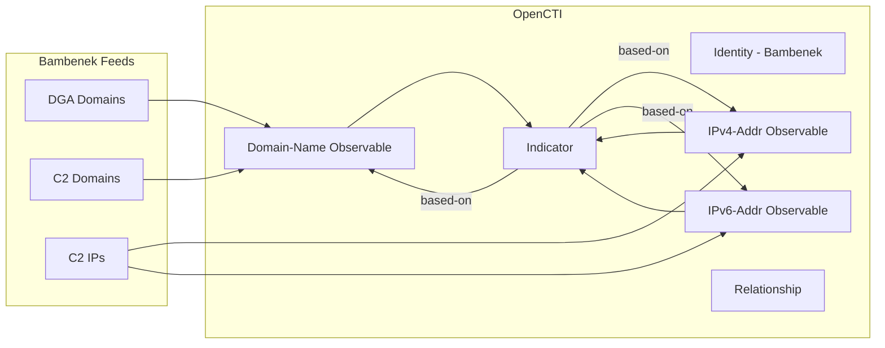

# OpenCTI Bambenek CTI Connector

The Bambenek connector ingests indicators of compromise (IOCs) from Bambenek Consulting Feeds into OpenCTI.

| Status            | Date | Comment |
|-------------------|------|---------|
| Filigran Verified | -    | -       |

## Table of Contents

- [OpenCTI Bambenek CTI Connector](#opencti-bambenek-cti-connector)
  - [Table of Contents](#table-of-contents)
  - [Introduction](#introduction)
  - [Installation](#installation)
    - [Requirements](#requirements)
  - [Configuration variables](#configuration-variables)
    - [OpenCTI environment variables](#opencti-environment-variables)
    - [Base connector environment variables](#base-connector-environment-variables)
    - [Connector extra parameters environment variables](#connector-extra-parameters-environment-variables)
  - [Deployment](#deployment)
    - [Docker Deployment](#docker-deployment)
    - [Manual Deployment](#manual-deployment)
  - [Usage](#usage)
  - [Behavior](#behavior)
  - [Debugging](#debugging)
  - [Additional information](#additional-information)

## Introduction

Bambenek Consulting provides threat intelligence feeds focused on tracking botnet C&C infrastructure. The connector supports ingestion of multiple data collections including DGA domains, C&C domains, and C&C IP addresses.

**Supported Collections:**
- `c2_dga`: Domain feed of known DGA domains from -2 to +3 days
- `c2_dga_high_conf`: High confidence DGA domain feed
- `c2_domain`: Master feed of known, active and non-sinkholed C&C domain names
- `c2_domain_highconf`: High confidence C&C domain feed
- `c2_ip`: Master feed of known, active and non-sinkholed C&C IP addresses
- `c2_ip_highconf`: High confidence C&C IP address feed

## Installation

### Requirements

- OpenCTI Platform >= 6.4.0
- Bambenek Consulting account with feed access

## Configuration variables

There are a number of configuration options, which are set either in `docker-compose.yml` (for Docker) or in `config.yml` (for manual deployment).

### OpenCTI environment variables

| Parameter     | config.yml | Docker environment variable | Mandatory | Description                                          |
|---------------|------------|-----------------------------|-----------|------------------------------------------------------|
| OpenCTI URL   | url        | `OPENCTI_URL`               | Yes       | The URL of the OpenCTI platform.                     |
| OpenCTI Token | token      | `OPENCTI_TOKEN`             | Yes       | The default admin token set in the OpenCTI platform. |

### Base connector environment variables

| Parameter         | config.yml      | Docker environment variable   | Default                              | Mandatory | Description                                                                              |
|-------------------|-----------------|-------------------------------|--------------------------------------|-----------|------------------------------------------------------------------------------------------|
| Connector ID      | id              | `CONNECTOR_ID`                |                                      | Yes       | A unique `UUIDv4` identifier for this connector instance.                                |
| Connector Type    | type            | `CONNECTOR_TYPE`              | EXTERNAL_IMPORT                      | No        | Should always be set to `EXTERNAL_IMPORT` for this connector.                            |
| Connector Name    | name            | `CONNECTOR_NAME`              |                                      | Yes       | Name of the connector.                                                                   |
| Connector Scope   | scope           | `CONNECTOR_SCOPE`             | ipv4-addr,ipv6-addr,domain,indicator | Yes       | The scope or type of data the connector is importing.                                    |
| Duration Period   | duration_period | `CONNECTOR_DURATION_PERIOD`   |                                      | Yes       | ISO 8601 interval for scheduling (feeds updated hourly max).                             |
| Log Level         | log_level       | `CONNECTOR_LOG_LEVEL`         | info                                 | No        | Determines the verbosity of the logs: `debug`, `info`, `warn`, or `error`.               |

### Connector extra parameters environment variables

| Parameter     | config.yml    | Docker environment variable | Default                                                                   | Mandatory | Description                                                                                 |
|---------------|---------------|-----------------------------|---------------------------------------------------------------------------|-----------|---------------------------------------------------------------------------------------------|
| Username      | client_id     | `BAMBENEK_USERNAME`         |                                                                           | Yes       | Bambenek username.                                                                          |
| Password      | client_secret | `BAMBENEK_PASSWORD`         |                                                                           | Yes       | Bambenek password.                                                                          |
| Collections   | collections   | `BAMBENEK_COLLECTIONS`      | c2_dga,c2_dga_high_conf,c2_domain,c2_domain_highconf,c2_ip,c2_ip_highconf | No        | Comma-separated list of collections to fetch.                                               |

## Deployment

### Docker Deployment

Build the Docker image:

```bash
docker build -t opencti/connector-bambenek:latest .
```

Configure the connector in `docker-compose.yml`:

```yaml
  connector-bambenek:
    image: opencti/connector-bambenek:latest
    environment:
      - OPENCTI_URL=http://localhost
      - OPENCTI_TOKEN=ChangeMe
      - CONNECTOR_ID=ChangeMe
      - CONNECTOR_NAME=Bambenek
      - CONNECTOR_SCOPE=ipv4-addr,ipv6-addr,domain,indicator
      - CONNECTOR_LOG_LEVEL=error
      - CONNECTOR_DURATION_PERIOD=PT1H
      - BAMBENEK_USERNAME=ChangeMe
      - BAMBENEK_PASSWORD=ChangeMe
      - BAMBENEK_COLLECTIONS=c2_dga,c2_dga_high_conf,c2_domain,c2_domain_highconf,c2_ip,c2_ip_highconf
    restart: always
```

Start the connector:

```bash
docker compose up -d
```

### Manual Deployment

1. Create `config.yml` based on `config.yml.sample`.

2. Install dependencies:

```bash
pip3 install -r requirements.txt
```

3. Start the connector from bambenek/src:

```bash
python3 main.py
```

## Usage

The connector runs automatically at the interval defined by `CONNECTOR_DURATION_PERIOD`. To force an immediate run:

**Data Management → Ingestion → Connectors**

Find the connector and click the refresh button to reset the state and trigger a new data fetch.

## Behavior

The connector pulls CSV files from Bambenek's server and parses them into STIX 2.1 objects.

### Data Flow



### Entity Mapping

| Bambenek Feed Data   | OpenCTI Entity      | Description                                      |
|----------------------|---------------------|--------------------------------------------------|
| Domain               | Domain-Name         | Observable with collection as label              |
| Domain               | Indicator           | STIX pattern `[domain-name:value = '...']`       |
| IPv4 Address         | IPv4-Addr           | Observable with collection as label              |
| IPv6 Address         | IPv6-Addr           | Observable with collection as label              |
| IP Address           | Indicator           | STIX pattern `[ipv4-addr:value = '...']` or `[ipv6-addr:value = '...']` |
| Tag                  | Label               | Malware family (e.g., "emotet", "dyre")          |
| -                    | Relationship        | `based-on` from Indicator to Observable          |

### CSV Schema

**Domain feeds** (c2_dga, c2_domain):
- `domain`: The malicious domain
- `tag`: Associated malware family (cleaned: "Domain used by " prefix removed)
- `fetch_date`: When the IOC was fetched
- `ref_url`: Reference URL

**IP feeds** (c2_ip):
- `ip`: The malicious IP address
- `tag`: Associated malware family (cleaned: "IP used by " prefix removed)
- `fetch_date`: When the IOC was fetched
- `ref_url`: Reference URL

### Processing Details

For each IOC, the connector creates:
1. **Observable**: Domain-Name, IPv4-Addr, or IPv6-Addr with:
   - `x_opencti_score`: 50 (default confidence)
   - Labels: Malware family tag
   - Marking: TLP:GREEN
2. **Indicator**: STIX pattern with:
   - Labels: Malware family tag + collection name
   - `valid_from`: Feed fetch date
   - `x_opencti_main_observable_type`: Appropriate type
3. **Relationship**: `based-on` from Indicator to Observable

## Debugging

Enable verbose logging:

```env
CONNECTOR_LOG_LEVEL=debug
```

Log output includes:
- Collection processing progress
- Entity conversion details
- Bundle sending status

## Additional information

- **Feed Updates**: Bambenek feeds are updated hourly at most; setting `CONNECTOR_DURATION_PERIOD` below `PT1H` provides no benefit
- **Documentation**: Full feed documentation available at [Bambenek Feeds](https://faf.bambenekconsulting.com/feeds/)
- **High Confidence Feeds**: Use `_highconf` variants for reduced false positives
- **TLP Marking**: All data is marked as TLP:GREEN by default
