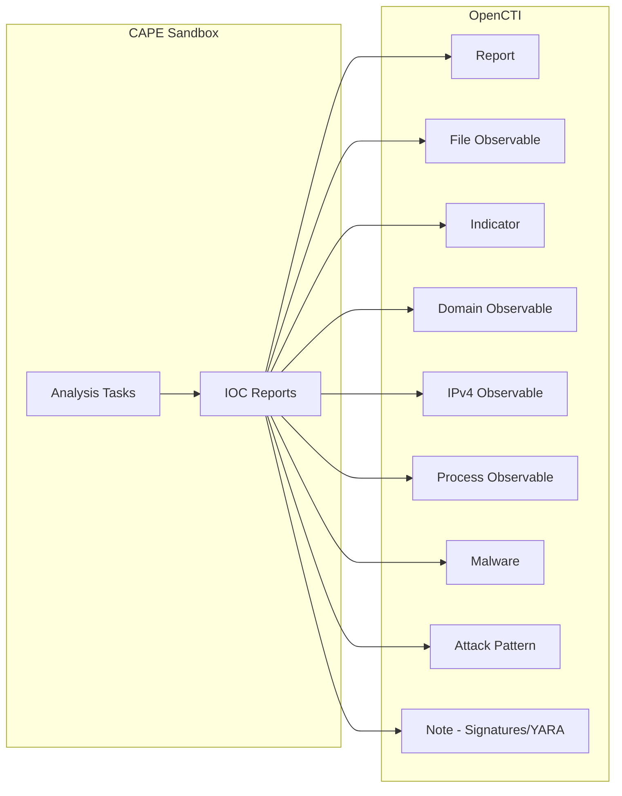

# OpenCTI CAPE Sandbox Connector

The CAPE Sandbox connector imports malware analysis reports and IOCs from CAPE/Cuckoo Sandbox into OpenCTI.

| Status    | Date | Comment |
|-----------|------|---------|
| Community | -    | -       |

## Table of Contents

- [OpenCTI CAPE Sandbox Connector](#opencti-cape-sandbox-connector)
  - [Table of Contents](#table-of-contents)
  - [Introduction](#introduction)
  - [Installation](#installation)
    - [Requirements](#requirements)
  - [Configuration variables](#configuration-variables)
    - [OpenCTI environment variables](#opencti-environment-variables)
    - [Base connector environment variables](#base-connector-environment-variables)
    - [Connector extra parameters environment variables](#connector-extra-parameters-environment-variables)
  - [Deployment](#deployment)
    - [Docker Deployment](#docker-deployment)
    - [Manual Deployment](#manual-deployment)
  - [Usage](#usage)
  - [Behavior](#behavior)
  - [Debugging](#debugging)
  - [Additional information](#additional-information)

## Introduction

CAPE (Config And Payload Extraction) is an advanced malware sandbox that builds upon Cuckoo Sandbox. It provides automated malware analysis with features like config extraction, payload dumping, and behavior analysis.

This connector polls the CAPE Sandbox API for completed analysis tasks and imports the results as STIX objects into OpenCTI, including reports, observables, indicators, and relationships.

## Installation

### Requirements

- OpenCTI Platform >= 6.x
- CAPE Sandbox instance with API access

## Configuration variables

There are a number of configuration options, which are set either in `docker-compose.yml` (for Docker) or in `config.yml` (for manual deployment).

### OpenCTI environment variables

| Parameter     | config.yml | Docker environment variable | Mandatory | Description                                          |
|---------------|------------|-----------------------------|-----------|------------------------------------------------------|
| OpenCTI URL   | url        | `OPENCTI_URL`               | Yes       | The URL of the OpenCTI platform.                     |
| OpenCTI Token | token      | `OPENCTI_TOKEN`             | Yes       | The default admin token set in the OpenCTI platform. |

### Base connector environment variables

| Parameter        | config.yml | Docker environment variable | Default | Mandatory | Description                                                              |
|------------------|------------|-----------------------------|---------|-----------|--------------------------------------------------------------------------|
| Connector ID     | id         | `CONNECTOR_ID`              |         | Yes       | A unique `UUIDv4` identifier for this connector instance.                |
| Connector Name   | name       | `CONNECTOR_NAME`            | CAPE    | Yes       | Name of the connector.                                                   |
| Log Level        | log_level  | `CONNECTOR_LOG_LEVEL`       | error   | No        | Determines the verbosity of logs: `debug`, `info`, `warn`, or `error`.   |

### Connector extra parameters environment variables

| Parameter              | config.yml             | Docker environment variable   | Default | Mandatory | Description                                                    |
|------------------------|------------------------|-------------------------------|---------|-----------|----------------------------------------------------------------|
| API URL                | api_url                | `CAPE_API_URL`                |         | Yes       | The CAPE API server endpoint (e.g., `https://cape/apiv2/`).    |
| Base URL               | base_url               | `CAPE_BASE_URL`               |         | Yes       | The CAPE Sandbox web interface URL.                            |
| Interval               | interval               | `CAPE_INTERVAL`               | 30      | Yes       | Polling interval in minutes for new analysis jobs.             |
| Create Indicators      | create_indicators      | `CAPE_CREATE_INDICATORS`      | true    | No        | Create Indicators for observables.                             |
| Enable Registry Keys   | enable_registry_keys   | `CAPE_ENABLE_REGISTRY_KEYS`   | false   | No        | Create Registry Key observables (can be verbose).              |
| Enable Network Traffic | enable_network_traffic | `CAPE_ENABLE_NETWORK_TRAFFIC` | false   | No        | Create Network Traffic observables (can be verbose).           |
| Start Task ID          | start_task_id          | `CAPE_START_TASK_ID`          | 0       | No        | First CAPE Task ID to sync from.                               |
| Report Score           | report_score           | `CAPE_REPORT_SCORE`           | 7       | No        | Minimum malscore to create a report (0-10 scale).              |
| Verify SSL             | verify_ssl             | `VERIFY_SSL`                  | true    | No        | Require SSL/TLS verification for CAPE API connections.         |

## Deployment

### Docker Deployment

Build the Docker image:

```bash
docker build -t opencti/connector-cape:latest .
```

Configure the connector in `docker-compose.yml`:

```yaml
  connector-cape:
    image: opencti/connector-cape:latest
    environment:
      - OPENCTI_URL=http://localhost
      - OPENCTI_TOKEN=ChangeMe
      - CONNECTOR_ID=ChangeMe
      - CONNECTOR_NAME=CAPE
      - CONNECTOR_LOG_LEVEL=error
      - CAPE_API_URL=https://cape.example.com/apiv2/
      - CAPE_BASE_URL=https://cape.example.com/
      - CAPE_INTERVAL=30
      - CAPE_CREATE_INDICATORS=true
      - CAPE_ENABLE_NETWORK_TRAFFIC=false
      - CAPE_ENABLE_REGISTRY_KEYS=false
      - CAPE_START_TASK_ID=0
      - CAPE_REPORT_SCORE=7
      - VERIFY_SSL=true
    restart: always
```

Start the connector:

```bash
docker compose up -d
```

### Manual Deployment

1. Create `config.yml` based on `config.yml.sample`.

2. Install dependencies:

```bash
pip3 install -r requirements.txt
```

3. Start the connector:

```bash
python3 main.py
```

## Usage

The connector polls the CAPE API at the configured interval for new completed analysis tasks. To force a sync:

**Data Management → Ingestion → Connectors**

Find the connector and click the refresh button to reset the state and trigger a new sync.

## Behavior

The connector fetches analysis reports from CAPE Sandbox and converts them to STIX objects.

### Data Flow



### Entity Mapping

| CAPE Analysis Data     | OpenCTI Entity      | Description                                      |
|------------------------|---------------------|--------------------------------------------------|
| Task Report            | Report              | Sandbox analysis report (if score >= threshold)  |
| Analyzed File          | File                | Primary binary with hashes (MD5, SHA1, SHA256, SHA512, SSDEEP) |
| Analyzed File          | Indicator           | STIX pattern for file detection                  |
| Dropped Files          | File                | Extracted payloads with hashes                   |
| Network Hosts          | IPv4-Addr           | Contacted IP addresses                           |
| Network Domains        | Domain-Name         | Resolved domain names                            |
| DNS Resolutions        | Relationship        | `resolves-to` from Domain to IP                  |
| Process Tree           | Process             | Executed processes with command lines            |
| Registry Keys          | Windows-Registry-Key| Created registry keys (if enabled)               |
| Network Traffic        | Network-Traffic     | TCP/UDP/ICMP connections (if enabled)            |
| MITRE ATT&CK TTPs      | Attack Pattern      | Linked to existing attack patterns               |
| Malware Detection      | Malware             | Detected malware families                        |
| Signatures             | Note                | CAPE signatures as report notes                  |
| YARA Matches           | Note                | YARA rule matches as report notes                |
| ClamAV Matches         | Note                | ClamAV detections as report notes                |
| TrID Analysis          | Note                | File type identification as report notes         |

### Processing Details

1. **Score Threshold**: Only creates full reports if `malscore >= CAPE_REPORT_SCORE`
2. **Indicator Creation**: Optionally creates STIX indicators with patterns
3. **TLP Marking**: Respects TLP settings from CAPE analysis (WHITE, GREEN, AMBER, RED)
4. **Confidence Score**: Derived from CAPE malscore (multiplied by 100, max 100)
5. **Labels**: Includes "sandbox", score, and detection families

### Relationships Created

- File → `related-to` → IP addresses, domains, processes, registry keys
- File → `related-to` → Attack patterns (MITRE ATT&CK)
- File → `related-to` → Malware families
- Indicator → `based-on` → File observable
- Domain → `resolves-to` → IP address

## Debugging

Enable verbose logging:

```env
CONNECTOR_LOG_LEVEL=debug
```

Log output includes:
- API request/response details
- Task processing status
- STIX object creation progress

## Additional information

- **Performance Warning**: Enabling `CAPE_ENABLE_NETWORK_TRAFFIC` and `CAPE_ENABLE_REGISTRY_KEYS` can generate very large amounts of data
- **Start Task ID**: Use `CAPE_START_TASK_ID` to skip already-processed analyses
- **Score Threshold**: Default score of 7 filters out benign samples; adjust based on your needs
- **SSL Verification**: Disable only for testing with self-signed certificates
