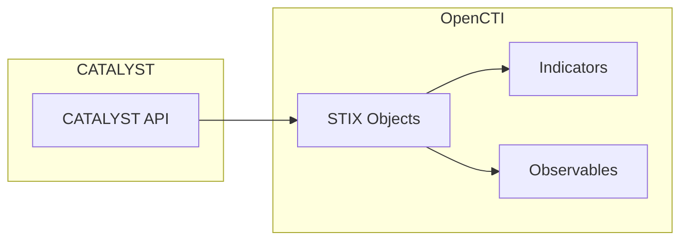

# OpenCTI CATALYST Connector

| Status | Date | Comment |
|--------|------|---------|
| Community | -    | -       |

The CATALYST connector imports threat intelligence data from the CATALYST platform (provided by PRODAFT) into OpenCTI.

## Table of Contents

- [OpenCTI CATALYST Connector](#opencti-catalyst-connector)
  - [Table of Contents](#table-of-contents)
  - [Introduction](#introduction)
  - [Installation](#installation)
    - [Requirements](#requirements)
  - [Configuration variables](#configuration-variables)
    - [OpenCTI environment variables](#opencti-environment-variables)
    - [Base connector environment variables](#base-connector-environment-variables)
    - [Connector extra parameters environment variables](#connector-extra-parameters-environment-variables)
  - [Deployment](#deployment)
    - [Docker Deployment](#docker-deployment)
    - [Manual Deployment](#manual-deployment)
  - [Usage](#usage)
  - [Behavior](#behavior)
  - [Debugging](#debugging)
  - [Additional information](#additional-information)

## Introduction

CATALYST is a threat intelligence platform provided by PRODAFT. The connector retrieves threat intelligence from the CATALYST platform and converts it into STIX format for integration into OpenCTI. It allows organizations to enrich their threat intelligence with data from CATALYST, including indicators and observables.

This connector relies on the `python-catalyst` package to retrieve and convert the data.

## Installation

### Requirements

- OpenCTI Platform >= 6.x
- CATALYST API access (optional - public endpoint available without API key)

## Configuration variables

There are a number of configuration options, which are set either in `docker-compose.yml` (for Docker) or in `config.yml` (for manual deployment).

### OpenCTI environment variables

| Parameter     | config.yml | Docker environment variable | Mandatory | Description                                          |
|---------------|------------|-----------------------------|-----------|------------------------------------------------------|
| OpenCTI URL   | url        | `OPENCTI_URL`               | Yes       | The URL of the OpenCTI platform.                     |
| OpenCTI Token | token      | `OPENCTI_TOKEN`             | Yes       | The default admin token set in the OpenCTI platform. |

### Base connector environment variables

| Parameter         | config.yml        | Docker environment variable   | Default         | Mandatory | Description                                                                 |
|-------------------|-------------------|-------------------------------|-----------------|-----------|-----------------------------------------------------------------------------|
| Connector ID      | id                | `CONNECTOR_ID`                |                 | Yes       | A unique `UUIDv4` identifier for this connector instance.                   |
| Connector Type    | type              | `CONNECTOR_TYPE`              | EXTERNAL_IMPORT | No        | Should always be set to `EXTERNAL_IMPORT` for this connector.               |
| Connector Name    | name              | `CONNECTOR_NAME`              | CATALYST        | No        | Name of the connector.                                                      |
| Connector Scope   | scope             | `CONNECTOR_SCOPE`             | catalyst        | No        | The scope or type of data the connector is importing.                       |
| Log Level         | log_level         | `CONNECTOR_LOG_LEVEL`         | info            | No        | Determines the verbosity of the logs: `debug`, `info`, `warn`, or `error`.  |
| Duration Period   | duration_period   | `CONNECTOR_DURATION_PERIOD`   | PT60M           | Yes       | Time interval between connector runs in ISO 8601 format.                    |

### Connector extra parameters environment variables

| Parameter           | config.yml              | Docker environment variable     | Default                               | Mandatory | Description                                                                 |
|---------------------|-------------------------|---------------------------------|---------------------------------------|-----------|-----------------------------------------------------------------------------|
| Base URL            | catalyst.base_url       | `CATALYST_BASE_URL`             | https://prod.blindspot.prodaft.com/api | Yes      | The base URL for the CATALYST API.                                          |
| API Key             | catalyst.api_key        | `CATALYST_API_KEY`              |                                       | No        | Your CATALYST API key. If not provided, public endpoint will be used.       |
| TLP Level           | catalyst.tlp_level      | `CATALYST_TLP_LEVEL`            | white                                 | No        | Default TLP marking for imported data.                                      |
| TLP Filter          | catalyst.tlp_filter     | `CATALYST_TLP_FILTER`           | ALL                                   | No        | Filter by TLP: `CLEAR`, `GREEN`, `AMBER`, `RED`, or `ALL`.                  |
| Category Filter     | catalyst.category_filter| `CATALYST_CATEGORY_FILTER`      | ALL                                   | No        | Filter by category: `DISCOVERY`, `ATTRIBUTION`, `RESEARCH`, `FLASH_ALERT`, `ALL`. |
| Sync Days Back      | catalyst.sync_days_back | `CATALYST_SYNC_DAYS_BACK`       | 730                                   | No        | Number of days to sync back when no last_run is present.                    |
| Create Observables  | catalyst.create_observables | `CATALYST_CREATE_OBSERVABLES` | true                                | No        | Whether to create observables from the data.                                |
| Create Indicators   | catalyst.create_indicators  | `CATALYST_CREATE_INDICATORS`  | false                               | No        | Whether to create indicators from the data.                                 |

## Deployment

### Docker Deployment

Build the Docker image:

```bash
docker build -t opencti/connector-catalyst:latest .
```

Configure the connector in `docker-compose.yml`:

```yaml
  connector-catalyst:
    image: opencti/connector-catalyst:latest
    environment:
      - OPENCTI_URL=http://localhost
      - OPENCTI_TOKEN=ChangeMe
      - CONNECTOR_ID=ChangeMe
      - CONNECTOR_NAME=CATALYST
      - CONNECTOR_SCOPE=catalyst
      - CONNECTOR_LOG_LEVEL=info
      - CONNECTOR_DURATION_PERIOD=PT60M
      - CATALYST_BASE_URL=https://prod.blindspot.prodaft.com/api
      - CATALYST_API_KEY=ChangeMe
      - CATALYST_TLP_FILTER=ALL
      - CATALYST_CATEGORY_FILTER=ALL
      - CATALYST_SYNC_DAYS_BACK=730
      - CATALYST_CREATE_OBSERVABLES=true
      - CATALYST_CREATE_INDICATORS=false
    restart: always
```

Start the connector:

```bash
docker compose up -d
```

### Manual Deployment

1. Create `config.yml` based on `config.yml.sample`.

2. Install dependencies:

```bash
pip3 install -r requirements.txt
```

3. Start the connector:

```bash
python3 main.py
```

## Usage

The connector runs automatically at the interval defined by `CONNECTOR_DURATION_PERIOD`. To force an immediate run:

**Data Management → Ingestion → Connectors**

Find the connector and click the refresh button to reset the state and trigger a new data fetch.

## Behavior

The connector fetches threat intelligence from CATALYST and imports it as STIX objects into OpenCTI.

### Data Flow



### Entity Mapping

The connector imports STIX objects from CATALYST. Common entity types include:

| CATALYST Data        | OpenCTI Entity      | Description                                      |
|----------------------|---------------------|--------------------------------------------------|
| Threat Intelligence  | Various STIX types  | Converted to appropriate STIX 2.1 objects        |
| IOCs                 | Observable          | When `create_observables=true`                   |
| IOCs                 | Indicator           | When `create_indicators=true`                    |

### Filtering Options

- **TLP Filter**: Filter data by Traffic Light Protocol level
  - `CLEAR`: Only TLP:CLEAR data
  - `GREEN`: Only TLP:GREEN data
  - `AMBER`: Only TLP:AMBER data
  - `RED`: Only TLP:RED data
  - `ALL`: All TLP levels (default)

- **Category Filter**: Filter by intelligence category
  - `DISCOVERY`: Discovery reports
  - `ATTRIBUTION`: Attribution reports
  - `RESEARCH`: Research reports
  - `FLASH_ALERT`: Flash alerts
  - `ALL`: All categories (default)

## Debugging

Enable verbose logging:

```env
CONNECTOR_LOG_LEVEL=debug
```

Log output includes:
- API response details
- Entity processing information
- Bundle creation and sending status

## Additional information

- **Public vs. Authenticated Access**: The connector can use the public endpoint without an API key, or authenticated access with an API key for additional data
- **Historical Sync**: Use `CATALYST_SYNC_DAYS_BACK` to control how far back to sync on first run (default: 730 days = 2 years)
- **Native STIX**: CATALYST provides data in STIX format via the `python-catalyst` library

## Testing

To run tests on the connector:

```bash
cd tests
pip install -r test-requirements.txt
pytest .
```
