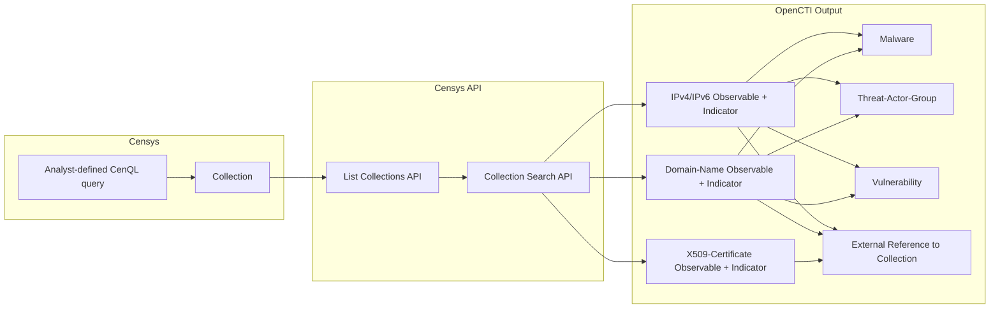

# OpenCTI Censys Collections Connector

| Status    | Date | Comment |
| --------- | ---- | ------- |
| Community | -    | -       |

The Censys Collections connector is an **external import** connector that mirrors analyst-curated Censys Collections into OpenCTI as observables and auto-generated indicators, enriched with any malware, threat-actor, and vulnerability context Censys has associated with each asset, plus an external reference back to the source collection in the Censys portal.

## Table of Contents

- [OpenCTI Censys Collections Connector](#opencti-censys-collections-connector)
  - [Table of Contents](#table-of-contents)
  - [Introduction](#introduction)
  - [Installation](#installation)
    - [Requirements](#requirements)
  - [Configuration variables](#configuration-variables)
    - [OpenCTI environment variables](#opencti-environment-variables)
    - [Base connector environment variables](#base-connector-environment-variables)
    - [Connector extra parameters environment variables](#connector-extra-parameters-environment-variables)
  - [Deployment](#deployment)
    - [Docker Deployment](#docker-deployment)
    - [Manual Deployment](#manual-deployment)
  - [Usage](#usage)
  - [Behavior](#behavior)
  - [Debugging](#debugging)
  - [Additional information](#additional-information)

## Introduction

[Censys Collections](https://docs.censys.com/docs/platform-collections) let an analyst save a CenQL search (e.g. matching known-bad IPs, hashes, or infrastructure) as a living, continuously-updated set of matching hosts, certificates, and web properties. Censys keeps the collection's membership current as its internet-wide scan data changes.

This connector is **not** an enrichment connector — a separate `censys-enrichment` connector already handles ad-hoc observable enrichment. This connector's only job is to **mirror the contents of one or more Censys Collections into OpenCTI** on a schedule, so that indicators an analyst has already vetted in Censys can flow into OpenCTI (and from there, downstream to enterprise blocking/detection tooling) automatically.

For every asset in a collection, the connector creates:

- An **observable** (`IPv4-Addr` / `IPv6-Addr` for hosts, `X509-Certificate` for certificates, `Domain-Name` for web properties) with `create_indicator` enabled, so OpenCTI automatically generates a matching **Indicator**.
- An **external reference** back to the Censys collection, so an analyst investigating a positive match can jump straight back to the collection in the Censys web UI.
- **Relationships to Malware, Threat-Actor-Group, and Vulnerability** entities when Censys has attributed a threat or CVE to that asset — giving the analyst immediate context (e.g. "this IP is associated with Cobalt Strike / APT28 / CVE-2021-44228") if the indicator is later matched by an enterprise control.

## Installation

### Requirements

- OpenCTI Platform >= 6.8.11
- Censys account with API access (Organisation ID and Token) and at least one existing [Collection](https://docs.censys.com/docs/platform-collections)

## Configuration variables

There are a number of configuration options, which are set either in `docker-compose.yml` (for Docker), `.env` file, or in `config.yml` (for manual deployment).

### OpenCTI environment variables

| Parameter     | config.yml | Docker environment variable | Mandatory | Description                                          |
| ------------- | ---------- | --------------------------- | --------- | ---------------------------------------------------- |
| OpenCTI URL   | url        | `OPENCTI_URL`               | Yes       | The URL of the OpenCTI platform.                     |
| OpenCTI Token | token      | `OPENCTI_TOKEN`             | Yes       | The default admin token set in the OpenCTI platform. |

### Base connector environment variables

| Parameter       | config.yml      | Docker environment variable | Default                                                                                             | Mandatory | Description                                                                  |
| --------------- | --------------- | --------------------------- | --------------------------------------------------------------------------------------------------- | --------- | ---------------------------------------------------------------------------- |
| Connector ID    | id              | `CONNECTOR_ID`              | censys-collections--00000000-...                                                                    | No        | A unique `UUIDv4` identifier for this connector instance.                    |
| Connector Name  | name            | `CONNECTOR_NAME`            | Censys Collections                                                                                  | No        | Name of the connector.                                                       |
| Connector Scope | scope           | `CONNECTOR_SCOPE`           | IPv4-Addr,IPv6-Addr,Domain-Name,X509-Certificate,Malware,Threat-Actor-Group,Vulnerability,Indicator | No        | The entity types this connector ingests into OpenCTI.                        |
| Connector Type  | type            | `CONNECTOR_TYPE`            | EXTERNAL_IMPORT                                                                                     | Yes       | Should always be `EXTERNAL_IMPORT` for this connector.                       |
| Log Level       | log_level       | `CONNECTOR_LOG_LEVEL`       | error                                                                                               | No        | Determines the verbosity of the logs: `debug`, `info`, `warn`, or `error`.   |
| Duration Period | duration_period | `CONNECTOR_DURATION_PERIOD` | PT1H                                                                                                | No        | ISO 8601 duration to wait between two ingestion runs (e.g. `PT1H` = 1 hour). |

### Connector extra parameters environment variables

| Parameter                 | config.yml                                   | Docker environment variable                    | Default   | Mandatory | Description                                                                                                                                                                                       |
| ------------------------- | -------------------------------------------- | ---------------------------------------------- | --------- | --------- | ------------------------------------------------------------------------------------------------------------------------------------------------------------------------------------------------- |
| Organisation ID           | censys_collections.organisation_id           | `CENSYS_COLLECTIONS_ORGANISATION_ID`           |           | Yes       | Your Censys organisation ID for API authentication.                                                                                                                                               |
| API Token                 | censys_collections.token                     | `CENSYS_COLLECTIONS_TOKEN`                     |           | Yes       | Your Censys API token for authentication.                                                                                                                                                         |
| Collection IDs            | censys_collections.collection_ids            | `CENSYS_COLLECTIONS_COLLECTION_IDS`            | (all)     | No        | Comma-separated allow-list of Censys collection IDs to ingest. Leave unset to ingest every collection visible to the organisation. Takes precedence over Excluded Collection IDs if both are set. |
| Excluded Collection IDs   | censys_collections.excluded_collection_ids   | `CENSYS_COLLECTIONS_EXCLUDED_COLLECTION_IDS`   | (none)    | No        | Comma-separated deny-list of Censys collection IDs to skip; every other collection is ingested. Ignored if Collection IDs is set.                                                                 |
| TLP Level                 | censys_collections.tlp_level                 | `CENSYS_COLLECTIONS_TLP_LEVEL`                 | TLP:AMBER | No        | TLP marking applied to every ingested observable, indicator, and related entity.                                                                                                                  |
| Indicator Score           | censys_collections.indicator_score           | `CENSYS_COLLECTIONS_INDICATOR_SCORE`           | 50        | No        | Fallback confidence score (0–100) used when Censys does not provide its own reputation score for a host.                                                                                          |
| Auto Indicator by Score   | censys_collections.auto_indicator_by_score   | `CENSYS_COLLECTIONS_AUTO_INDICATOR_BY_SCORE`   | false     | No        | Toggle: when enabled, an indicator is only auto-created for an observable if its score meets or exceeds Indicator Score Threshold. When disabled (default), an indicator is always auto-created.  |
| Indicator Score Threshold | censys_collections.indicator_score_threshold | `CENSYS_COLLECTIONS_INDICATOR_SCORE_THRESHOLD` | 50        | No        | Minimum score (0–100) an observable must have for an indicator to be auto-created. Only used when Auto Indicator by Score is enabled.                                                             |
| Request Timeout           | censys_collections.request_timeout_seconds   | `CENSYS_COLLECTIONS_REQUEST_TIMEOUT_SECONDS`   | 60        | No        | Per-request timeout (in seconds) for calls to the Censys API. Increase this if large collections cause read timeouts.                                                                             |

## Deployment

### Docker Deployment

Build the Docker image:

```bash
docker build -t opencti/connector-censys-collections:latest .
```

Configure the connector in `docker-compose.yml`:

```yaml
  connector-censys-collections:
    image: opencti/connector-censys-collections:latest
    environment:
      - OPENCTI_URL=http://localhost
      - OPENCTI_TOKEN=ChangeMe
      - CONNECTOR_ID=ChangeMe_UUID4
      - CONNECTOR_NAME=Censys Collections
      - CONNECTOR_LOG_LEVEL=error
      - CONNECTOR_DURATION_PERIOD=PT1H
      - CENSYS_COLLECTIONS_ORGANISATION_ID=ChangeMe
      - CENSYS_COLLECTIONS_TOKEN=ChangeMe
      # - CENSYS_COLLECTIONS_COLLECTION_IDS=
      # - CENSYS_COLLECTIONS_TLP_LEVEL=TLP:AMBER
      # - CENSYS_COLLECTIONS_INDICATOR_SCORE=50
    restart: always
```

Start the connector:

```bash
docker compose up -d
```

### Manual Deployment

1. Copy `.env.sample` to `.env` and configure with your credentials.
2. Install dependencies:

   ```bash
   pip3 install -r requirements.txt
   ```

3. Start the connector from the `src` directory:

   ```bash
   python3 main.py
   ```

## Usage

This connector requires no manual triggering. Once configured and started, it runs automatically on the schedule set by `CONNECTOR_DURATION_PERIOD` (default: every hour).

A typical workflow looks like:

1. An analyst builds a CenQL search in Censys matching known-bad indicators (e.g. IPs seen in an incident, malicious certificate fingerprints) and saves it as a **Collection** in the Censys web UI.
2. Censys continuously re-runs that search, keeping the collection's asset list up to date.
3. This connector polls the Censys Collections API on its configured schedule, pulls every asset from the selected collection(s), and mirrors each one into OpenCTI as an observable + indicator, with malware/threat-actor/CVE relationships and an external reference back to the collection.
4. Indicators produced this way can then flow to whichever OpenCTI stream/feed feeds your enterprise blocking or detection tooling. If one of them fires, the analyst can follow the external reference straight back to the originating Censys collection for context on why it was flagged.

## Behavior

The connector queries the [Censys Collections API](https://docs.censys.com/reference/v3-collections-crud-list) for every collection visible to the configured organisation (or only the collections listed in `CENSYS_COLLECTIONS_COLLECTION_IDS`, if set), then pages through each collection's matching assets via the collection search endpoint.

### Hosts (IPv4 / IPv6)

- Creates an `IPv4-Addr` or `IPv6-Addr` observable for the host's IP, with an indicator auto-created per the [Indicator creation](#indicator-creation) rules below.
- **Score**: uses the host's Censys `reputation.score` (0–100, higher = riskier) when Censys provides one; otherwise falls back to `CENSYS_COLLECTIONS_INDICATOR_SCORE`.
- For every service on the host, any associated `Threat` and `Vuln` entries are converted into relationships (see below). Malware/actor names are deduplicated per host.

### X.509 Certificates

- Creates an `X509-Certificate` observable using whichever of SHA-256 / SHA-1 / MD5 fingerprints Censys provides, with an indicator auto-created per the [Indicator creation](#indicator-creation) rules below. Assets without any fingerprint are skipped.
- Extracts parsed certificate metadata when available: issuer, subject, serial number, and validity period (not-before / not-after).
- **Score**: always the manually configured `CENSYS_COLLECTIONS_INDICATOR_SCORE` — Censys doesn't expose an equivalent per-certificate reputation score, so there's no automatic/derived option for this asset type (unlike hosts).

### Web Properties (Domains)

- Creates a `Domain-Name` observable from the web property's hostname, with an indicator auto-created per the [Indicator creation](#indicator-creation) rules below.
- Any `Threat` and `Vuln` entries reported against the web property are converted into relationships, same as for hosts.
- **Score**: always the manually configured `CENSYS_COLLECTIONS_INDICATOR_SCORE`, same reasoning as certificates — no per-web-property reputation score exists to derive one from.

### Indicator creation

- By default (`CENSYS_COLLECTIONS_AUTO_INDICATOR_BY_SCORE=false`), an indicator is always auto-created alongside every observable, regardless of its score.
- When `CENSYS_COLLECTIONS_AUTO_INDICATOR_BY_SCORE=true`, an indicator is only auto-created if the observable's score (see Hosts above; certificates/domains use the configured `CENSYS_COLLECTIONS_INDICATOR_SCORE`) meets or exceeds `CENSYS_COLLECTIONS_INDICATOR_SCORE_THRESHOLD`. The observable itself is always created either way — only automatic indicator generation is gated.
- **In short: is scoring manual?** Only for hosts is it not — an `IPv4-Addr`/`IPv6-Addr` observable gets Censys's own `reputation.score` when Censys provides one. Certificates and domains have no such field in the Censys API, so their score is always the static `CENSYS_COLLECTIONS_INDICATOR_SCORE` value you configure, not something calculated per-asset by this connector or by Censys.

### Threat, malware, and vulnerability relationships

- **Malware**: each unique `threat.malware` on an asset becomes a `Malware` entity (with any alternate names as aliases), linked to the observable via a `related-to` relationship.
- **Threat actors**: each unique `threat.actors` entry becomes a `Threat-Actor-Group` entity, linked via an `attributed-to` relationship.
- **Vulnerabilities**: each `Vuln` (identified by CVE ID where available) becomes a `Vulnerability` entity, linked via a `related-to` relationship.

### External references

- Every observable created by this connector receives an `ExternalReference` pointing to `https://app.censys.io/collections/{collection_id}`, so an analyst can view the source collection directly in the Censys portal.

### Grouping

- Every object generated for a collection (observables, indicators, malware, threat actors, vulnerabilities) is bundled into a STIX **Grouping** named `Censys Collection: {collection name}`, so an analyst can open the Grouping in OpenCTI and see every item that came from the same Censys collection in one place.
- The Grouping's STIX ID is derived from the Censys collection's immutable UID (not its display name), so renaming the collection in Censys updates the existing Grouping's name/description on the next run instead of creating a duplicate.
- **Automatic pruning**: because collection membership changes over time (e.g. an IP is removed once no longer considered malicious), the connector diffs each Grouping's current members against the freshly-fetched asset list on every run and explicitly unlinks any member that's no longer part of the collection. This keeps the Grouping — and any detection metrics built from it — an accurate reflection of the collection's current contents, rather than accumulating stale entries indefinitely.
- **Limitation**: pruning only *unlinks* a stale member from the Grouping (via OpenCTI's `remove_stix_object_or_stix_relationship` API) — it does not delete the underlying observable/indicator/entity itself. That object remains in the OpenCTI platform even after Censys removes it from the source collection, since it may still be relevant on its own merits (or referenced elsewhere). In practice it should naturally age out over time via OpenCTI's own decay/retention behaviour rather than being removed by this connector.

### Markings and authorship

- All generated objects are marked with the TLP level configured via `CENSYS_COLLECTIONS_TLP_LEVEL` (default `TLP:AMBER`) and attributed to a "Censys Collection" organization author.

### Data Flow



### Entity Mapping by Asset Type

| Censys Asset                    | OpenCTI Observable    | Score Source                                    | Additional Entities                        |
| ------------------------------- | --------------------- | ----------------------------------------------- | ------------------------------------------ |
| Host (`host_v1`)                | IPv4-Addr / IPv6-Addr | `reputation.score` (fallback: configured score) | Malware, Threat-Actor-Group, Vulnerability |
| Certificate (`certificate_v1`)  | X509-Certificate      | Configured score only                           | —                                          |
| Web property (`webproperty_v1`) | Domain-Name           | Configured score only                           | Malware, Threat-Actor-Group, Vulnerability |

### Relationships Created

| Relationship Type | Source                 | Target             | Description                                 |
| ----------------- | ---------------------- | ------------------ | ------------------------------------------- |
| `related-to`      | Host/Domain Observable | Malware            | Malware family associated with the asset    |
| `attributed-to`   | Host/Domain Observable | Threat-Actor-Group | Threat actor attributed to the asset        |
| `related-to`      | Host/Domain Observable | Vulnerability      | CVE reported against a service on the asset |

### Processing Details

1. **Collection discovery**: Lists all collections for the organisation, optionally filtered to `CENSYS_COLLECTIONS_COLLECTION_IDS`.
2. **Asset paging**: Pages through each collection's assets via the search endpoint until no `next_page_token` remains.
3. **Per-asset conversion**: Converts each hit's `host_v1` / `certificate_v1` / `webproperty_v1` resource into the corresponding OpenCTI observable + indicator.
4. **Threat context**: Extracts malware, threat-actor, and vulnerability relationships from each host/web-property's services.
5. **Bundle per collection**: All objects generated for a collection are sent to OpenCTI as a single bundle/work item named after that collection, so ingestion progress is visible per-collection in the OpenCTI UI.

## Debugging

Enable verbose logging by setting:

```env
CONNECTOR_LOG_LEVEL=debug
```

Log output includes:

- Number of collections discovered and how many were selected for ingestion
- Per-collection asset counts and object counts generated
- Work creation/completion status per collection

### Handling read timeouts on large collections

Very large collections can occasionally trigger `httpx.ReadTimeout` / "The read operation timed out" errors while paging through assets. The connector automatically retries transient network errors and 429/5xx responses with exponential backoff before giving up. If a collection still fails after retries are exhausted, that collection is logged as an error and skipped for the current run — it does **not** abort ingestion of the other collections, and it will be retried again on the next scheduled run.

If timeouts persist for a specific collection, increase `CENSYS_COLLECTIONS_REQUEST_TIMEOUT_SECONDS` (default `60`).

## Additional information

- **API Reference**: [Censys Collections API Documentation](https://docs.censys.com/reference/v3-collections-crud-list)
- **Relationship to `censys-enrichment`**: This connector is intentionally scoped to Collections ingestion only. Ad-hoc enrichment of arbitrary observables (not sourced from a collection) is handled by the separate `censys-enrichment` connector.
- **Rate Limits**: API calls are subject to Censys rate limits based on subscription tier; listing collections and reading their assets does not consume Censys credits.
- **TLP Handling**: All objects created by this connector are marked with the connector-configured `CENSYS_COLLECTIONS_TLP_LEVEL`; there is no per-observable TLP check since this connector ingests from Censys rather than enriching existing OpenCTI observables.
- **Scheduling**: This is an external-import connector — it runs on the schedule set by `CONNECTOR_DURATION_PERIOD`, not on-demand.
