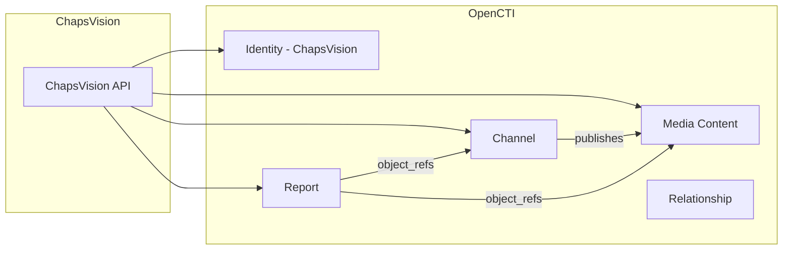

# OpenCTI ChapsVision Connector

The ChapsVision connector imports CTI data from the ChapsVision platform into OpenCTI, collecting social media and web content for threat intelligence analysis.

| Status    | Date | Comment |
|-----------|------|---------|
| Community | -    | -       |

## Table of Contents

- [OpenCTI ChapsVision Connector](#opencti-chapsvision-connector)
  - [Table of Contents](#table-of-contents)
  - [Introduction](#introduction)
  - [Installation](#installation)
    - [Requirements](#requirements)
  - [Configuration variables](#configuration-variables)
    - [OpenCTI environment variables](#opencti-environment-variables)
    - [Base connector environment variables](#base-connector-environment-variables)
    - [Connector extra parameters environment variables](#connector-extra-parameters-environment-variables)
  - [Deployment](#deployment)
    - [Docker Deployment](#docker-deployment)
    - [Manual Deployment](#manual-deployment)
  - [Usage](#usage)
  - [Behavior](#behavior)
  - [Debugging](#debugging)
  - [Additional information](#additional-information)

## Introduction

ChapsVision enables sectors with a large data footprint such as Retail, Finance, and Public Services to succeed in their digital transformation. Their CTI platform monitors social media, websites, and messaging platforms for threat-relevant content.

This connector fetches data from the ChapsVision API and imports it into OpenCTI as Channels, Media Content, and Reports, enabling organizations to track threat-related discussions across various platforms.

## Installation

### Requirements

- OpenCTI Platform >= 5.5.4
- ChapsVision API access with valid certificate and key

## Configuration variables

There are a number of configuration options, which are set either in `docker-compose.yml` (for Docker) or in `config.yml` (for manual deployment).

### OpenCTI environment variables

| Parameter     | config.yml | Docker environment variable | Mandatory | Description                                          |
|---------------|------------|-----------------------------|-----------|------------------------------------------------------|
| OpenCTI URL   | url        | `OPENCTI_URL`               | Yes       | The URL of the OpenCTI platform.                     |
| OpenCTI Token | token      | `OPENCTI_TOKEN`             | Yes       | The default admin token set in the OpenCTI platform. |

### Base connector environment variables

| Parameter          | config.yml         | Docker environment variable     | Default     | Mandatory | Description                                                                 |
|--------------------|--------------------|---------------------------------|-------------|-----------|-----------------------------------------------------------------------------|
| Connector ID       | id                 | `CONNECTOR_ID`                  |             | Yes       | A unique `UUIDv4` identifier for this connector instance.                   |
| Connector Name     | name               | `CONNECTOR_NAME`                | Chapsvision | No        | Name of the connector.                                                      |
| Connector Scope    | scope              | `CONNECTOR_SCOPE`               | chapsvision | No        | The scope or type of data the connector is importing.                       |
| Run and Terminate  | run_and_terminate  | `CONNECTOR_RUN_AND_TERMINATE`   | false       | No        | Run once and terminate instead of continuous execution.                     |
| Log Level          | log_level          | `CONNECTOR_LOG_LEVEL`           | info        | No        | Determines the verbosity of the logs: `debug`, `info`, `warn`, or `error`.  |

### Connector extra parameters environment variables

| Parameter        | config.yml                | Docker environment variable      | Default | Mandatory | Description                                                    |
|------------------|---------------------------|----------------------------------|---------|-----------|----------------------------------------------------------------|
| Certificate      | chapsvision.certificate   | `CHAPSVISION_CERTIFICATE`        |         | Yes       | ChapsVision client certificate (Base64-encoded).               |
| Key              | chapsvision.key           | `CHAPSVISION_KEY`                |         | Yes       | ChapsVision client key (Base64-encoded).                       |
| Query Parameter  | chapsvision.query_parameter | `CHAPSVISION_QUERY_PARAMETER`  |         | Yes       | Query parameter for filtering data from ChapsVision API.       |
| Start Date       | chapsvision.start_date    | `CHAPSVISION_START_DATE`         |         | Yes       | Initial start date for data collection (format: `YYYY-MM-DD`). |
| Interval         | chapsvision.interval      | `CHAPSVISION_INTERVAL`           |         | Yes       | Polling interval in minutes.                                   |

## Deployment

### Docker Deployment

Build the Docker image:

```bash
docker build -t opencti/connector-chapsvision:latest .
```

Configure the connector in `docker-compose.yml`:

```yaml
  connector-chapsvision:
    image: opencti/connector-chapsvision:latest
    environment:
      - OPENCTI_URL=http://localhost
      - OPENCTI_TOKEN=ChangeMe
      - CONNECTOR_ID=ChangeMe
      - CONNECTOR_NAME=Chapsvision
      - CONNECTOR_SCOPE=chapsvision
      - CONNECTOR_LOG_LEVEL=info
      - CONNECTOR_RUN_AND_TERMINATE=false
      - CHAPSVISION_CERTIFICATE=ChangeMe_Base64
      - CHAPSVISION_KEY=ChangeMe_Base64
      - CHAPSVISION_QUERY_PARAMETER=_query_param
      - CHAPSVISION_START_DATE=2022-01-01
      - CHAPSVISION_INTERVAL=5
    restart: always
```

Start the connector:

```bash
docker compose up -d
```

### Manual Deployment

1. Create `config.yml` based on `config.yml.sample`.

2. Install dependencies:

```bash
pip3 install -r requirements.txt
```

3. Start the connector from the `src` directory:

```bash
python3 chapsvision.py
```

## Usage

The connector runs automatically at the interval defined by `CHAPSVISION_INTERVAL`. To force an immediate run:

**Data Management → Ingestion → Connectors**

Find the connector and click the refresh button to reset the state and trigger a new data fetch.

## Behavior

The connector fetches social media and web content from ChapsVision and converts them to STIX objects.

### Data Flow



### Entity Mapping

| ChapsVision Data     | OpenCTI Entity      | Description                                      |
|----------------------|---------------------|--------------------------------------------------|
| Profile Link         | Channel             | Social media profile or messaging channel        |
| Content URL          | Media Content       | Social media post, article, or message           |
| Broadcaster Category | Channel Type/Label  | Platform type (e.g., Micro Blogging, Website)    |
| Hashtags             | Labels              | Hashtags extracted from content                  |
| Daily Collection     | Report              | Daily digest report of collected content         |

### Content Categories

The connector processes three types of content:

| Category        | Description                                       | Entities Created                    |
|-----------------|---------------------------------------------------|-------------------------------------|
| Micro Blogging  | Twitter/X, Mastodon, etc.                         | Channel + Media Content + Relationship |
| Website         | News sites, blogs, forums                         | Media Content only                  |
| Messaging       | Telegram, Discord, etc.                           | Channel + Media Content + Relationship |

### Processing Details

1. **Daily Processing**: Data is processed day by day from `start_date` to current date
2. **Channel Creation**: For social media and messaging, creates Channel entities from profile links
3. **Media Content**: Creates Media Content entities with URL, content text, title, and description
4. **Relationships**: Links Channels to Media Content via `publishes` relationships
5. **Daily Reports**: Creates a summary Report containing all day's collected entities
6. **TLP Marking**: All entities marked as TLP:GREEN

### Report Generation

For each day processed, the connector creates a report:
- **Name**: "CTI daily publications digest (X alerts detected)"
- **Content**: Links to all collected Channels and Media Content
- **Published Date**: The processing date

## Debugging

Enable verbose logging:

```env
CONNECTOR_LOG_LEVEL=debug
```

Log output includes:
- API query details
- Document processing status
- Bundle generation progress
- State management updates

## Additional information

- **Authentication**: Uses client certificate authentication (certificate + key in Base64)
- **Data Freshness**: Processes data day by day; minimum interval between runs should allow at least one day of data
- **Query Parameters**: The `query_parameter` controls what data is fetched from ChapsVision
- **Historical Data**: On first run, will process all data from `start_date` to current date
- **Rate Limiting**: 60-second delay between processing each day to avoid API overload

