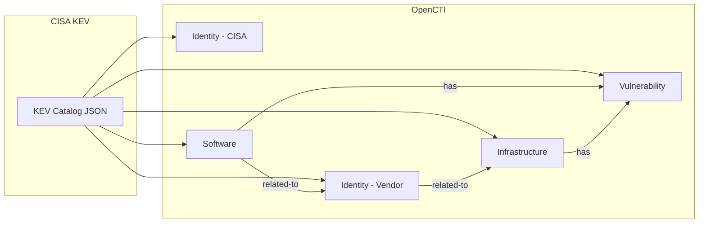

# OpenCTI CISA Known Exploited Vulnerabilities (KEV) Connector

The CISA KEV connector imports the Known Exploited Vulnerabilities Catalog from CISA into OpenCTI as Vulnerability entities with related Software and vendor information.

| Status            | Date | Comment |
|-------------------|------|---------|
| Filigran Verified | -    | -       |

## Table of Contents

- [OpenCTI CISA Known Exploited Vulnerabilities (KEV) Connector](#opencti-cisa-known-exploited-vulnerabilities-kev-connector)
  - [Table of Contents](#table-of-contents)
  - [Introduction](#introduction)
  - [Installation](#installation)
    - [Requirements](#requirements)
  - [Configuration variables](#configuration-variables)
    - [OpenCTI environment variables](#opencti-environment-variables)
    - [Base connector environment variables](#base-connector-environment-variables)
    - [Connector extra parameters environment variables](#connector-extra-parameters-environment-variables)
  - [Deployment](#deployment)
    - [Docker Deployment](#docker-deployment)
    - [Manual Deployment](#manual-deployment)
  - [Usage](#usage)
  - [Behavior](#behavior)
  - [Debugging](#debugging)
  - [Additional information](#additional-information)

## Introduction

The Cybersecurity and Infrastructure Security Agency (CISA) maintains the Known Exploited Vulnerabilities (KEV) Catalog, which provides a list of vulnerabilities that have been actively exploited in the wild. This catalog is a valuable resource for prioritizing vulnerability remediation efforts.

This connector fetches the KEV catalog in JSON format and creates Vulnerability entities in OpenCTI, along with related Software (affected products) and vendor Identity entities. All imported vulnerabilities are marked with `x_opencti_cisa_kev: true` for easy filtering.

## Installation

### Requirements

- OpenCTI Platform >= 6.x
- Internet access to CISA KEV catalog JSON feed

## Configuration variables

There are a number of configuration options, which are set either in `docker-compose.yml` (for Docker) or in `config.yml` (for manual deployment).

### OpenCTI environment variables

| Parameter     | config.yml | Docker environment variable | Mandatory | Description                                          |
|---------------|------------|-----------------------------|-----------|------------------------------------------------------|
| OpenCTI URL   | url        | `OPENCTI_URL`               | Yes       | The URL of the OpenCTI platform.                     |
| OpenCTI Token | token      | `OPENCTI_TOKEN`             | Yes       | The default admin token set in the OpenCTI platform. |

### Base connector environment variables

| Parameter         | config.yml      | Docker environment variable   | Default         | Mandatory | Description                                                                 |
|-------------------|-----------------|-------------------------------|-----------------|-----------|-----------------------------------------------------------------------------|
| Connector ID      | id              | `CONNECTOR_ID`                |                 | Yes       | A unique `UUIDv4` identifier for this connector instance.                   |
| Connector Name    | name            | `CONNECTOR_NAME`              | CISA KEV        | No        | Name of the connector.                                                      |
| Connector Scope   | scope           | `CONNECTOR_SCOPE`             | cisa            | No        | The scope or type of data the connector is importing.                       |
| Log Level         | log_level       | `CONNECTOR_LOG_LEVEL`         | info            | No        | Determines the verbosity of the logs: `debug`, `info`, `warn`, or `error`.  |
| Duration Period   | duration_period | `CONNECTOR_DURATION_PERIOD`   |                 | No        | Time interval between connector runs in ISO 8601 format.                    |

### Connector extra parameters environment variables

| Parameter               | config.yml                 | Docker environment variable     | Default                                                                       | Mandatory | Description                                                            |
|-------------------------|----------------------------|---------------------------------|-------------------------------------------------------------------------------|-----------|------------------------------------------------------------------------|
| Catalog URL             | cisa.catalog_url           | `CISA_CATALOG_URL`              | https://www.cisa.gov/sites/default/files/feeds/known_exploited_vulnerabilities.json | No   | URL of the CISA KEV catalog JSON feed.                                 |
| Create Infrastructures  | cisa.create_infrastructures| `CISA_CREATE_INFRASTRUCTURES`   | true                                                                          | No        | Create Infrastructure entities for affected products.                  |
| TLP                     | cisa.tlp                   | `CISA_TLP`                      | TLP:CLEAR                                                                     | No        | TLP marking for imported data (`TLP:CLEAR`, `TLP:GREEN`, `TLP:AMBER`, `TLP:AMBER+STRICT`, `TLP:RED`). |
| Interval (deprecated)   | cisa.interval              | `CISA_INTERVAL`                 | 7                                                                             | No        | **[DEPRECATED]** Interval in days between runs. Use `CONNECTOR_DURATION_PERIOD` instead. |

## Deployment

### Docker Deployment

Build the Docker image:

```bash
docker build -t opencti/connector-cisa-known-exploited-vulnerabilities:latest .
```

Configure the connector in `docker-compose.yml`:

```yaml
  connector-cisa-known-exploited-vulnerabilities:
    image: opencti/connector-cisa-known-exploited-vulnerabilities:latest
    environment:
      - OPENCTI_URL=http://localhost
      - OPENCTI_TOKEN=ChangeMe
      - CONNECTOR_ID=ChangeMe
      - CONNECTOR_NAME=CISA KEV
      - CONNECTOR_SCOPE=cisa
      - CONNECTOR_LOG_LEVEL=info
      - CONNECTOR_DURATION_PERIOD=P1D
      - CISA_CATALOG_URL=https://www.cisa.gov/sites/default/files/feeds/known_exploited_vulnerabilities.json
      - CISA_CREATE_INFRASTRUCTURES=true
      - CISA_TLP=TLP:CLEAR
    restart: always
```

Start the connector:

```bash
docker compose up -d
```

### Manual Deployment

1. Create `config.yml` based on the provided sample.

2. Install dependencies:

```bash
pip3 install -r requirements.txt
```

3. Start the connector from the `src` directory:

```bash
python3 main.py
```

## Usage

The connector runs automatically at the interval defined by `CONNECTOR_DURATION_PERIOD`. To force an immediate run:

**Data Management → Ingestion → Connectors**

Find the connector and click the refresh button to reset the state and trigger a new data fetch.

## Behavior

The connector fetches the CISA KEV catalog and imports each vulnerability with its associated software and vendor information.

### Data Flow



### Entity Mapping

| CISA KEV Data        | OpenCTI Entity      | Description                                      |
|----------------------|---------------------|--------------------------------------------------|
| CISA Organization    | Identity            | Created as the author of all entities            |
| vendorProject        | Identity (Organization) | Software vendor (e.g., Microsoft, Apache)    |
| cveID                | Vulnerability       | CVE identifier with `x_opencti_cisa_kev: true`   |
| product              | Software            | Affected product/software                        |
| product (optional)   | Infrastructure      | Infrastructure entity (if enabled)               |
| shortDescription     | Vulnerability.description | Vulnerability description                  |
| dateAdded            | Vulnerability.created | Date vulnerability was added to KEV             |

### Relationships Created

- Software → `has` → Vulnerability
- Software → `related-to` → Vendor (Identity)
- Infrastructure → `has` → Vulnerability (if `create_infrastructures=true`)
- Vendor → `related-to` → Infrastructure (if `create_infrastructures=true`)

### Processing Details

1. **Catalog Version Check**: Only processes if catalog `dateReleased` has changed since last run
2. **Custom Property**: All vulnerabilities marked with `x_opencti_cisa_kev: true` for easy filtering
3. **Vendor Tracking**: Creates Identity entities for each unique vendor
4. **Optional Infrastructure**: Can optionally create Infrastructure entities for affected products

### Filtering KEV Vulnerabilities

In OpenCTI, you can filter vulnerabilities that are in the CISA KEV catalog using:

```
x_opencti_cisa_kev = true
```

This allows you to prioritize remediation efforts for actively exploited vulnerabilities.

## Debugging

Enable verbose logging:

```env
CONNECTOR_LOG_LEVEL=debug
```

Log output includes:
- Catalog retrieval status
- Bundle creation progress
- State management (last update tracking)

## Additional information

- **Public Feed**: The CISA KEV catalog is publicly available without authentication
- **Update Frequency**: CISA updates the catalog as new KEVs are identified; daily polling (`P1D`) is recommended
- **Catalog Size**: As of 2024, the catalog contains 1000+ vulnerabilities
- **Prioritization**: Use the `x_opencti_cisa_kev` custom property to prioritize vulnerability remediation
- **Reference**: More information at [CISA KEV Catalog](https://www.cisa.gov/known-exploited-vulnerabilities-catalog)
