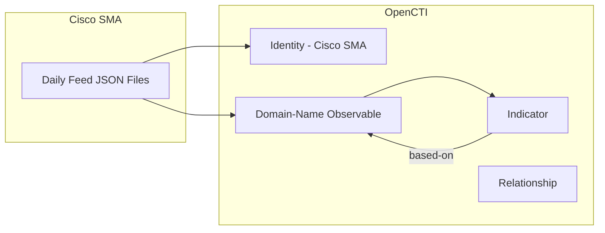

# OpenCTI Cisco SMA Connector

The Cisco SMA connector imports threat intelligence data from the Cisco Secure Malware Analytics (formerly ThreatGrid) feeds into OpenCTI.

| Status            | Date | Comment |
|-------------------|------|---------|
| Filigran Verified | -    | -       |

## Table of Contents

- [OpenCTI Cisco SMA Connector](#opencti-cisco-sma-connector)
  - [Table of Contents](#table-of-contents)
  - [Introduction](#introduction)
  - [Installation](#installation)
    - [Requirements](#requirements)
  - [Configuration variables](#configuration-variables)
    - [OpenCTI environment variables](#opencti-environment-variables)
    - [Base connector environment variables](#base-connector-environment-variables)
    - [Connector extra parameters environment variables](#connector-extra-parameters-environment-variables)
  - [Deployment](#deployment)
    - [Docker Deployment](#docker-deployment)
    - [Manual Deployment](#manual-deployment)
  - [Usage](#usage)
  - [Behavior](#behavior)
  - [Debugging](#debugging)
  - [Additional information](#additional-information)

## Introduction

Cisco Secure Malware Analytics (SMA), formerly known as ThreatGrid, is a unified malware analysis and threat intelligence platform. The SMA feeds provide daily threat indicators derived from sandbox analysis of malware samples.

This connector retrieves domain-based IOCs from various categories of malicious activity and imports them as Domain-Name observables and Indicators into OpenCTI.

> **Note**: The connector retrieves only the current day's IOCs on a daily basis. Historical data is not available. Setting the interval to less than 24 hours will only reimport already-retrieved IOCs.

## Installation

### Requirements

- OpenCTI Platform >= 6.2.0
- Cisco SMA API key

## Configuration variables

There are a number of configuration options, which are set either in `docker-compose.yml` (for Docker) or in `config.yml` (for manual deployment).

### OpenCTI environment variables

| Parameter     | config.yml | Docker environment variable | Mandatory | Description                                          |
|---------------|------------|-----------------------------|-----------|------------------------------------------------------|
| OpenCTI URL   | url        | `OPENCTI_URL`               | Yes       | The URL of the OpenCTI platform.                     |
| OpenCTI Token | token      | `OPENCTI_TOKEN`             | Yes       | The default admin token set in the OpenCTI platform. |

### Base connector environment variables

| Parameter        | config.yml | Docker environment variable | Default   | Mandatory | Description                                                              |
|------------------|------------|-----------------------------|-----------|-----------|--------------------------------------------------------------------------|
| Connector ID     | id         | `CONNECTOR_ID`              |           | Yes       | A unique `UUIDv4` identifier for this connector instance.                |
| Connector Name   | name       | `CONNECTOR_NAME`            | CISCO_SMA | Yes       | Name of the connector.                                                   |
| Connector Scope  | scope      | `CONNECTOR_SCOPE`           |           | Yes       | The scope or type of data the connector is importing.                    |
| Log Level        | log_level  | `CONNECTOR_LOG_LEVEL`       | info      | No        | Determines the verbosity of logs: `debug`, `info`, `warn`, or `error`.   |

### Connector extra parameters environment variables

| Parameter               | config.yml               | Docker environment variable     | Default                                      | Mandatory | Description                                                                                                 |
|-------------------------|--------------------------|---------------------------------|----------------------------------------------|-----------|-------------------------------------------------------------------------------------------------------------|
| API Key                 | cisco_sma.api_key        | `CISCO_SMA_API_KEY`             |                                              | Yes       | Your Cisco SMA API key.                                                                                     |
| URL                     | cisco_sma.url            | `CISCO_SMA_URL`                 | https://panacea.threatgrid.eu/api/v3/feeds/  | No        | Base URL for the Cisco SMA feeds.                                                                           |
| Interval                | cisco_sma.interval       | `CISCO_SMA_INTERVAL`            | 24                                           | No        | Run interval in hours. Recommended: `24` (see note below).                                                  |
| IOC Score               | cisco_sma.ioc_score      | `CISCO_SMA_IOC_SCORE`           | 50                                           | No        | Score to assign to imported IOCs.                                                                           |
| TLP Marking             | cisco_sma.marking_definition | `CISCO_SMA_MARKING`         | TLP:AMBER+STRICT                             | No        | TLP marking for created entities (`TLP:WHITE`, `TLP:GREEN`, `TLP:AMBER`, `TLP:AMBER+STRICT`, `TLP:RED`).    |

#### Feed Category Filters

Enable or disable specific feed categories:

| Parameter             | Docker environment variable       | Default | Description                                                                        |
|-----------------------|-----------------------------------|---------|------------------------------------------------------------------------------------|
| Autorun Registry      | `CISCO_SMA_AUTORUN_REGISTRY`      | false   | Registry entry data from persistence-related queries.                              |
| Banking DNS           | `CISCO_SMA_BANKING_DNS`           | false   | Banking Trojan network communications.                                             |
| DGA DNS               | `CISCO_SMA_DGA_DNS`               | false   | DGA domains with pseudo-randomly generated names.                                  |
| DLL Hijacking DNS     | `CISCO_SMA_DLL_HIJACKING_DNS`     | false   | Domains from samples using DLL sideloading/hijacking.                              |
| Doc Net Com DNS       | `CISCO_SMA_DOC_NET_COM_DNS`       | false   | Document (PDF, Office) network communications.                                     |
| Downloaded PE DNS     | `CISCO_SMA_DOWNLOADED_PE_DNS`     | false   | Samples downloading executables network communications.                            |
| Dynamic DNS           | `CISCO_SMA_DYNAMIC_DNS`           | false   | Samples leveraging dynamic DNS providers.                                          |
| IRC DNS               | `CISCO_SMA_IRC_DNS`               | false   | Internet Relay Chat (IRC) network communications.                                  |
| Modified Hosts DNS    | `CISCO_SMA_MODIFIED_HOSTS_DNS`    | false   | Modified Windows hosts file network communications.                                |
| Parked DNS            | `CISCO_SMA_PARKED_DNS`            | false   | Parked domains resolving to RFC1918/localhost/broadcast addresses.                 |
| Public IP Check DNS   | `CISCO_SMA_PUBLIC_IP_CHECK_DNS`   | false   | Public IP address check network communications.                                    |
| Ransomware DNS        | `CISCO_SMA_RANSOMWARE_DNS`        | true    | Samples communicating with ransomware servers.                                     |
| RAT DNS               | `CISCO_SMA_RAT_DNS`               | true    | Remote Access Trojan (RAT) network communications.                                 |
| Scheduled Tasks       | `CISCO_SMA_SCHEDULED_TASKS`       | false   | Scheduled task data observed during sample execution.                              |
| Sinkholed IP DNS      | `CISCO_SMA_SINKHOLED_IP_DNS`      | false   | DNS entries for samples communicating with known sinkholes.                        |
| Stolen Cert DNS       | `CISCO_SMA_STOLEN_CERT_DNS`       | false   | DNS entries from samples signed with stolen certificates.                          |

## Deployment

### Docker Deployment

Build the Docker image:

```bash
docker build -t opencti/connector-cisco-sma:latest .
```

Configure the connector in `docker-compose.yml`:

```yaml
  connector-cisco-sma:
    image: opencti/connector-cisco-sma:latest
    environment:
      - OPENCTI_URL=http://localhost
      - OPENCTI_TOKEN=ChangeMe
      - CONNECTOR_ID=ChangeMe
      - CONNECTOR_NAME=CISCO_SMA
      - CONNECTOR_SCOPE=cisco-sma
      - CONNECTOR_LOG_LEVEL=info
      - CISCO_SMA_API_KEY=ChangeMe
      - CISCO_SMA_URL=https://panacea.threatgrid.eu/api/v3/feeds/
      - CISCO_SMA_INTERVAL=24
      - CISCO_SMA_IOC_SCORE=50
      - CISCO_SMA_MARKING=TLP:AMBER+STRICT
      # Enable desired feed categories:
      - CISCO_SMA_RANSOMWARE_DNS=true
      - CISCO_SMA_RAT_DNS=true
      - CISCO_SMA_BANKING_DNS=false
      - CISCO_SMA_DGA_DNS=false
    restart: always
```

Start the connector:

```bash
docker compose up -d
```

### Manual Deployment

1. Create `config.yml` based on `config.yml.sample`.

2. Install dependencies:

```bash
pip3 install -r requirements.txt
```

3. Start the connector from the `src` directory:

```bash
python3 cisco_sma.py
```

## Usage

The connector runs automatically at the interval defined by `CISCO_SMA_INTERVAL`. To force an immediate run:

**Data Management → Ingestion → Connectors**

Find the connector and click the refresh button to reset the state and trigger a new data fetch.

## Behavior

The connector fetches domain-based IOCs from Cisco SMA feeds and imports them as Domain-Name observables with corresponding Indicators.

### Data Flow



### Entity Mapping

| Cisco SMA Data       | OpenCTI Entity      | Description                                      |
|----------------------|---------------------|--------------------------------------------------|
| Domain               | Domain-Name         | Observable with category as label                |
| Domain               | Indicator           | STIX pattern `[domain-name:value = '...']`       |
| Description          | Description         | Threat description from feed                     |
| Category             | Label               | Feed category (e.g., ransomware-dns, rat-dns)    |
| -                    | Relationship        | `based-on` from Indicator to Observable          |

### Processing Details

For each domain in the enabled feeds, the connector creates:

1. **Domain-Name Observable** with:
   - `x_opencti_score`: Configured IOC score (default: 50)
   - `x_opencti_description`: Threat description from feed
   - TLP marking as configured

2. **Indicator** with:
   - Pattern: `[domain-name:value = '<domain>']`
   - Labels: Feed category name
   - `x_opencti_main_observable_type`: "Domain-Name"

3. **Relationship**: `based-on` linking Indicator to Observable

### Available Feed Categories

| Category          | Description                                          | Default |
|-------------------|------------------------------------------------------|---------|
| autorun-registry  | Persistence-related registry modifications           | Off     |
| banking-dns       | Banking trojan C2 communications                     | Off     |
| dga-dns           | Domain Generation Algorithm domains                  | Off     |
| dll-hijacking-dns | DLL sideloading/hijacking related                    | Off     |
| doc-net-com-dns   | Malicious document network activity                  | Off     |
| downloaded-pe-dns | Payload download domains                             | Off     |
| dynamic-dns       | Dynamic DNS abuse                                    | Off     |
| irc-dns           | IRC-based C2 communications                          | Off     |
| modified-hosts-dns| Hosts file modification related                      | Off     |
| parked-dns        | Parked/sinkhole domains                              | Off     |
| public-ip-check-dns| IP discovery services                               | Off     |
| ransomware-dns    | Ransomware C2 infrastructure                         | **On**  |
| rat-dns           | Remote Access Trojan communications                  | **On**  |
| scheduled-tasks   | Scheduled task persistence                           | Off     |
| sinkholed-ip-dns  | Sinkholed domain communications                      | Off     |
| stolen-cert-dns   | Domains from samples with stolen certificates        | Off     |

## Debugging

Enable verbose logging:

```env
CONNECTOR_LOG_LEVEL=debug
```

Log output includes:
- API request URLs
- Feed processing status
- Entity creation details
- Bundle sending status

## Additional information

- **Daily Feeds Only**: Cisco SMA provides feeds for the previous day only. No historical data is available.
- **Recommended Interval**: Set `CISCO_SMA_INTERVAL` to `24` hours. Shorter intervals will reimport the same data; longer intervals may miss days.
- **Domain Focus**: Currently, only domain indicators are imported. IPs and hashes are available in the feeds but not yet implemented.
- **TLP Default**: Data is marked as TLP:AMBER+STRICT by default due to commercial nature of the feed.


