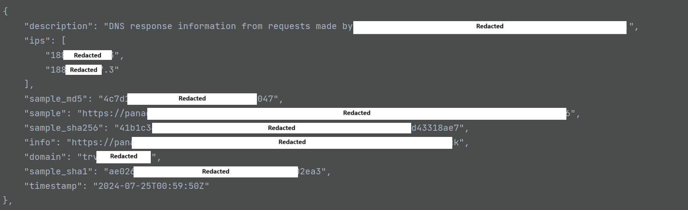

# CISCO SMA Import Connector

<!--
General description of the connector
* What it does
* How it works
* Special requirements
* Use case description
* ...
-->

## Description

This connector imports data from the [CISCO SMA database](https://www.cisco.com/c/en/us/products/collateral/security/content-security-management-appliance/datasheet_C78-721194.html). 

The connector does not retrieve historical data. It retrieves the day's IOCs on a daily basis. For this reason, there is no reason to set the “interval” variable to a value other than “24”. Setting more would cause IOCs to be missed, setting less would simply reimport IOCs already retrieved.

The connector creates the following OpenCTI entities:

- Indicator (Domain Name),
- Observable Domain Name,
- The CISCO SMA Organization.

## Additional note

Cisco SMA returns other data (mainly IPs and hashes). However, only domains are currently retrieved. This choice was made in response to the developer's need to retrieve only domains. IPs were deemed not always reliable, and hashes had no context (such as potential malware).

## Installation

### Requirements

- OpenCTI Platform >= 6.2.0

### Configuration

| Parameter              | Docker env var                   | Mandatory | Description                                                                                                                                                                       |
|------------------------|----------------------------------|-----------|-----------------------------------------------------------------------------------------------------------------------------------------------------------------------------------|
| `opencti_url`          | `OPENCTI_URL`                    | Yes       | The URL of the OpenCTI platform.                                                                                                                                                  |
| `opencti_token`        | `OPENCTI_TOKEN`                  | Yes       | The user token configured in the OpenCTI platform                                                                                                                                 |
| `connector_id`         | `CONNECTOR_ID`                   | Yes       | A valid arbitrary `UUIDv4` that must be unique for this connector.                                                                                                                |
| `connector_name`       | `CONNECTOR_NAME`                 | Yes       | Option `CISCO_SMA`                                                                                                                                                                |
| `connector_scope`      | `CONNECTOR_SCOPE`                | Yes       | Supported scope: Template Scope (MIME Type or Stix Object)                                                                                                                        |
| `log_level`            | `CONNECTOR_LOG_LEVEL`            | No        | Log output for the connector. Defaults to `INFO`                                                                                                                                  |
| `api_key`              | `CISCO_SMA_API_KEY`              | Yes       | The user api key configured in CISCO SMA                                                                                                                                          |
| `url`                  | `CISCO_SMA_URL`                  | No        | Defaults to `https://panacea.threatgrid.eu/api/v3/feeds/threats`                                                                                                                  |
| `interval`             | `CISCO_SMA_INTERVAL`             | No        | Run interval, in hours. Defaults to `24`, recommended not to touch (see above)                                                                                                    |
| `ioc_score`            | `CISCO_SMA_IOC_SCORE`            | No        | The score to be set on IOCs. Defaults to `50`                                                                                                                                     |
| `marking_definition`   | `CISCO_SMA_MARKING`              | No        | TLP to be applied to created entities (syntax: "TLP:XXX"). Default to `TLP:AMBER`                                                                                                 |
| `autorun-registry`     | `CISCO_SMA_AUTORUN_REGISTRY`     | No        | Option to import or not the indicators of the autorun-registry category: Contains registry entry data derived from querying registry changes known for persistence                |
| `banking-dns`          | `CISCO_SMA_BANKING_DNS`          | No        | Option to import or not the indicators of the banking-dns category: Banking Trojan Network Communications                                                                         |
| `dga-dns`              | `CISCO_SMA_DGA_DNS`              | No        | Option to import or not the indicators of the dga-dns category: DGA Domains with pseudo-randomly generated names                                                                  |
| `dll-hijacking-dns`    | `CISCO_SMA_DLL_HIJACKING_DNS`    | No        | Option to import or not the indicators of the dll-hijacking-dns category: Feed contains Domains communicated to by samples leveraging DLL Sideloading and/or hijacking techniques |
| `doc-net-com-dns`      | `CISCO_SMA_DOC_NET_COM_DNS`      | No        | Option to import or not the indicators of the doc-net-com-dns category: Document (PDF, Office) Network Communications                                                             |
| `downloaded-pe-dns`    | `CISCO_SMA_DOWNLOADED_PE_DNS`    | No        | Option to import or not the indicators of the downloaded-pe-dns category: Samples Downloading Executables Network Communications                                                  |
| `dynamic-dns`          | `CISCO_SMA_DYNAMIC_DNS`          | No        | Option to import or not the indicators of the dynamic-dns category: Samples Leveraging Dynamic DNS Providers                                                                      |
| `irc-dns`              | `CISCO_SMA_IRC_DNS`              | No        | Option to import or not the indicators of the irc-dns category: Internet Relay Chat (IRC) Network Communications                                                                  |
| `modified-hosts-dns`   | `CISCO_SMA_MODIFIED_HOSTS_DNS`   | No        | Option to import or not the indicators of the modified-hosts-dns category:Modified Windows Hosts File Network Communications                                                      |
| `parked-dns`           | `CISCO_SMA_PARKED_DNS`           | No        | Option to import or not the indicators of the parked-dns category: Parked Domains resolving to RFC1918, Localhost and Broadcast Addresses                                         |
| `public-ip-check-dns`  | `CISCO_SMA_PUBLIC_IP_CHECK_DNS`  | No        | Option to import or not the indicators of the public-ip-check-dns category: Check For Public IP Address Network Communications                                                    |
| `ransomware-dns`       | `CISCO_SMA_RANSOMWARE_DNS`       | No        | Option to import or not the indicators of the ransomware-dns category: Samples Communicating with Ransomware Servers                                                              |
| `rat-dns`              | `CISCO_SMA_RAT_DNS`              | No        | Option to import or not the indicators of the rat-dns category: Remote Access Trojan (RAT) Network Communications                                                                 |
| `scheduled-tasks`      | `CISCO_SMA_SCHEDULED_TASKS`      | No        | Option to import or not the indicators of the scheduled-tasks category: Feed containing scheduled task data observed during sample execution                                      |
| `sinkholed-ip-dns`     | `CISCO_SMA_SINKHOLED_IP_DNS`     | No        | Option to import or not the indicators of the sinkholed-ip-dns category: DNS entries for samples communicating with a known dns sinkhole                                          |
| `stolen-cert-dns`      | `CISCO_SMA_STOLEN_CERT_DNS`      | No        | Option to import or not the indicators of the stolen-cert-dns category: DNS Entries observed from samples signed with a stolen certificate                                        |

