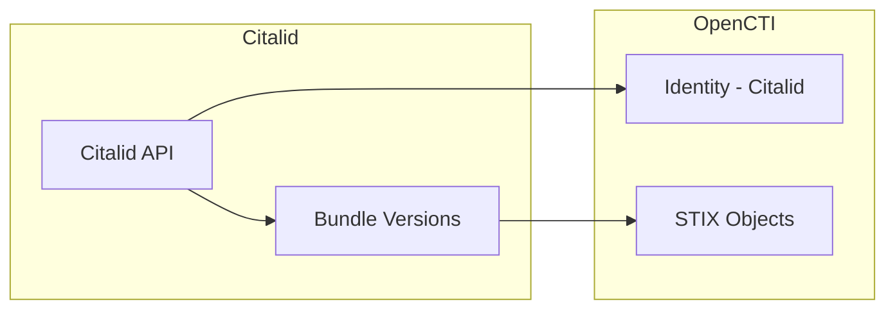

# OpenCTI Citalid Connector

| Status | Date | Comment |
|--------|------|---------|
| Partner | -    | -       |

The Citalid connector imports the latest CTI dataset from the Citalid platform into OpenCTI as STIX bundles.

## Table of Contents

- [OpenCTI Citalid Connector](#opencti-citalid-connector)
  - [Table of Contents](#table-of-contents)
  - [Introduction](#introduction)
  - [Installation](#installation)
    - [Requirements](#requirements)
  - [Configuration variables](#configuration-variables)
    - [OpenCTI environment variables](#opencti-environment-variables)
    - [Base connector environment variables](#base-connector-environment-variables)
    - [Connector extra parameters environment variables](#connector-extra-parameters-environment-variables)
  - [Deployment](#deployment)
    - [Docker Deployment](#docker-deployment)
    - [Manual Deployment](#manual-deployment)
  - [Usage](#usage)
  - [Behavior](#behavior)
  - [Debugging](#debugging)
  - [Additional information](#additional-information)

## Introduction

Citalid offers a cyber risk quantification SaaS platform to manage security and cyber insurance investments. Citalid is built upon strong expertise in strategic Cyber Threat Intelligence (CTI) which enriches risk assessment with a dynamic state of threats.

This connector retrieves STIX bundles from the Citalid API and imports them into OpenCTI, enabling organizations to leverage Citalid's threat intelligence data for risk assessment and security operations.

> **Note**: You will need access to the Citalid API. To learn more about the product, you can book a demo at [citalid.com/book-a-demo](https://citalid.com/book-a-demo/).

## Installation

### Requirements

- OpenCTI Platform >= 6.9.23
- Citalid API access (customer subdomain, username, and password)

## Configuration variables

There are a number of configuration options, which are set either in `docker-compose.yml` (for Docker) or in `config.yml` (for manual deployment).

### OpenCTI environment variables

| Parameter     | config.yml | Docker environment variable | Mandatory | Description                                          |
|---------------|------------|-----------------------------|-----------|------------------------------------------------------|
| OpenCTI URL   | url        | `OPENCTI_URL`               | Yes       | The URL of the OpenCTI platform.                     |
| OpenCTI Token | token      | `OPENCTI_TOKEN`             | Yes       | The default admin token set in the OpenCTI platform. |

### Base connector environment variables

| Parameter          | config.yml         | Docker environment variable     | Default         | Mandatory | Description                                                                 |
|--------------------|--------------------|---------------------------------|-----------------|-----------|-----------------------------------------------------------------------------|
| Connector ID       | id                 | `CONNECTOR_ID`                  |                 | Yes       | A unique `UUIDv4` identifier for this connector instance.                   |
| Connector Type     | type               | `CONNECTOR_TYPE`                | EXTERNAL_IMPORT | Yes       | Must be `EXTERNAL_IMPORT` for this connector.                               |
| Connector Name     | name               | `CONNECTOR_NAME`                | Citalid         | Yes       | Name of the connector.                                                      |
| Connector Scope    | scope              | `CONNECTOR_SCOPE`               |                 | Yes       | The scope or type of data the connector is importing.                       |
| Run and Terminate  | run_and_terminate  | `CONNECTOR_RUN_AND_TERMINATE`   | false           | Yes       | Set to `false` for continuous execution.                                    |
| Log Level          | log_level          | `CONNECTOR_LOG_LEVEL`           | info            | Yes       | Determines the verbosity of logs: `debug`, `info`, `warn`, or `error`.      |

### Connector extra parameters environment variables

| Parameter              | config.yml                    | Docker environment variable         | Default | Mandatory | Description                                                  |
|------------------------|-------------------------------|-------------------------------------|---------|-----------|--------------------------------------------------------------|
| Customer Subdomain URL | citalid.customer_sub_domain_url | `CITALID_CUSTOMER_SUB_DOMAIN_URL` |         | Yes       | URL of your Citalid instance (customer subdomain).           |
| User                   | citalid.user                  | `CITALID_USER`                      |         | Yes       | Username with access to the Citalid instance.                |
| Password               | citalid.password              | `CITALID_PASSWORD`                  |         | Yes       | Password for the Citalid user.                               |
| Interval               | citalid.interval              | `CITALID_INTERVAL`                  |         | Yes       | Polling interval in hours between connector runs.            |

## Deployment

### Docker Deployment

Build the Docker image:

```bash
docker build -t opencti/connector-citalid:latest .
```

Configure the connector in `docker-compose.yml`:

```yaml
  connector-citalid:
    image: opencti/connector-citalid:latest
    environment:
      - OPENCTI_URL=http://localhost
      - OPENCTI_TOKEN=ChangeMe
      - CONNECTOR_ID=ChangeMe
      - CONNECTOR_TYPE=EXTERNAL_IMPORT
      - CONNECTOR_NAME=Citalid
      - CONNECTOR_SCOPE=citalid
      - CONNECTOR_RUN_AND_TERMINATE=false
      - CONNECTOR_LOG_LEVEL=info
      - CITALID_CUSTOMER_SUB_DOMAIN_URL=https://your-instance.citalid.com
      - CITALID_USER=ChangeMe
      - CITALID_PASSWORD=ChangeMe
      - CITALID_INTERVAL=24
    restart: always
```

Start the connector:

```bash
docker compose up -d
```

### Manual Deployment

1. Create `config.yml` based on `config.yml.sample`.

2. Install dependencies:

```bash
pip3 install -r requirements.txt
```

3. Start the connector from the `src` directory:

```bash
python3 citalid.py
```

## Usage

The connector runs automatically at the interval defined by `CITALID_INTERVAL`. To force an immediate run:

**Data Management → Ingestion → Connectors**

Find the connector and click the refresh button to reset the state and trigger a new data fetch.

## Behavior

The connector fetches STIX bundles from the Citalid API and imports them directly into OpenCTI.

### Data Flow



### Entity Mapping

The connector imports native STIX bundles from Citalid. The exact entities depend on the Citalid dataset content:

| Citalid Data         | OpenCTI Entity      | Description                                      |
|----------------------|---------------------|--------------------------------------------------|
| Threat Intelligence  | Various STIX types  | All STIX objects from the bundle are imported    |
| Bundle Version       | State               | Tracked to import only new versions              |

### Processing Details

1. **Version Tracking**: The connector tracks the last loaded bundle version
2. **Incremental Updates**: Only new bundle versions since the last run are processed
3. **Bundle Processing**: Each new version's STIX bundle is downloaded and sent to OpenCTI
4. **Identity Creation**: Creates a Citalid organization identity as the data source

### Version Management

- Bundle versions are identified by date-based IDs (format: `YYYYMMDD...`)
- The connector maintains state to track `last_loaded_bundle_id`
- On each run, only bundles newer than the last loaded version are processed
- If no new versions are available, the connector logs that the latest version is already loaded

## Debugging

Enable verbose logging:

```env
CONNECTOR_LOG_LEVEL=debug
```

Log output includes:
- API connection status
- Bundle version listing
- Version processing progress
- Bundle sending status

## Additional information

- **Native STIX**: Citalid provides data in STIX format, which is directly imported into OpenCTI
- **Subscription Required**: Active Citalid subscription is required for API access
- **Demo Available**: Book a demo at [citalid.com/book-a-demo](https://citalid.com/book-a-demo/)
- **Python Client**: Uses the `citalid_api` Python package for API communication
- **Incremental Sync**: Designed to efficiently sync only new data versions
