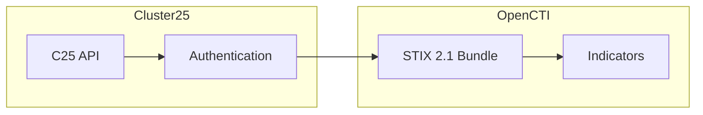

# OpenCTI Cluster25 Connector

| Status | Date | Comment |
|--------|------|---------|
| Partner | -    | -       |

The Cluster25 connector imports indicators of compromise (IOCs) from the Cluster25 (C25) threat intelligence platform into OpenCTI.

## Table of Contents

- [OpenCTI Cluster25 Connector](#opencti-cluster25-connector)
  - [Table of Contents](#table-of-contents)
  - [Introduction](#introduction)
  - [Installation](#installation)
    - [Requirements](#requirements)
  - [Configuration variables](#configuration-variables)
    - [OpenCTI environment variables](#opencti-environment-variables)
    - [Base connector environment variables](#base-connector-environment-variables)
    - [Connector extra parameters environment variables](#connector-extra-parameters-environment-variables)
  - [Deployment](#deployment)
    - [Docker Deployment](#docker-deployment)
    - [Manual Deployment](#manual-deployment)
  - [Usage](#usage)
  - [Behavior](#behavior)
  - [Debugging](#debugging)
  - [Additional information](#additional-information)

## Introduction

Cluster25 (C25) is a threat intelligence platform that provides comprehensive threat data including indicators, observables, threat actors, and various security content. The connector uses the C25 public APIs to authenticate and import supported indicators.

This connector exports indicators from C25 in STIX 2.1 format and imports them directly into OpenCTI, enabling organizations to leverage C25's threat intelligence for enhanced threat detection and response.

> **Note**: To use this connector, you need a valid `CLIENT_ID` and `CLIENT_SECRET` provided by the Cluster25 team. All results are implicitly filtered by the user's TLP level.

## Installation

### Requirements

- OpenCTI Platform >= 6.x
- Valid Cluster25 API credentials (CLIENT_ID + CLIENT_SECRET)

## Configuration variables

There are a number of configuration options, which are set either in `docker-compose.yml` (for Docker) or in `config.yml` (for manual deployment).

### OpenCTI environment variables

| Parameter     | config.yml | Docker environment variable | Mandatory | Description                                          |
|---------------|------------|-----------------------------|-----------|------------------------------------------------------|
| OpenCTI URL   | url        | `OPENCTI_URL`               | Yes       | The URL of the OpenCTI platform.                     |
| OpenCTI Token | token      | `OPENCTI_TOKEN`             | Yes       | The default admin token set in the OpenCTI platform. |

### Base connector environment variables

| Parameter        | config.yml | Docker environment variable | Default | Mandatory | Description                                                              |
|------------------|------------|-----------------------------|---------|-----------|--------------------------------------------------------------------------|
| Connector ID     | id         | `CONNECTOR_ID`              |         | Yes       | A unique `UUIDv4` identifier for this connector instance.                |
| Connector Name   | name       | `CONNECTOR_NAME`            |         | Yes       | Name of the connector.                                                   |
| Connector Scope  | scope      | `CONNECTOR_SCOPE`           |         | Yes       | The scope or type of data the connector is importing.                    |
| Log Level        | log_level  | `CONNECTOR_LOG_LEVEL`       | info    | No        | Determines the verbosity of logs: `debug`, `info`, `warn`, or `error`.   |

### Connector extra parameters environment variables

| Parameter        | config.yml               | Docker environment variable   | Default                                          | Mandatory | Description                                                            |
|------------------|--------------------------|-------------------------------|--------------------------------------------------|-----------|------------------------------------------------------------------------|
| Base URL         | cluster25.base_url       | `CLUSTER25_BASE_URL`          | https://api.intelligence.cluster25.io/api/v1     | No        | The base URL of the C25 platform (default or private instance).        |
| Client ID        | cluster25.client_id      | `CLUSTER25_CLIENT_ID`         |                                                  | Yes       | Cluster25 client ID for authentication.                                |
| Client Secret    | cluster25.client_secret  | `CLUSTER25_CLIENT_SECRET`     |                                                  | Yes       | Cluster25 client secret for authentication.                            |
| Indicator Types  | cluster25.indicator_types| `CLUSTER25_INDICATOR_TYPES`   | ipv4,domain,md5,sha1,sha256,url,email,ipv6,filename | No     | Comma-separated list of indicator types to import.                     |
| Interval         | cluster25.interval_sec   | `CLUSTER25_INTERVAL_SEC`      | 600                                              | No        | Polling interval in seconds between connector runs.                    |

## Deployment

### Docker Deployment

Build the Docker image:

```bash
docker build -t opencti/connector-cluster25:latest .
```

Configure the connector in `docker-compose.yml`:

```yaml
  connector-cluster25:
    image: opencti/connector-cluster25:latest
    environment:
      - OPENCTI_URL=http://localhost
      - OPENCTI_TOKEN=ChangeMe
      - CONNECTOR_ID=ChangeMe
      - CONNECTOR_NAME=Cluster25
      - CONNECTOR_SCOPE=cluster25
      - CONNECTOR_LOG_LEVEL=info
      - CLUSTER25_BASE_URL=https://api.intelligence.cluster25.io/api/v1
      - CLUSTER25_CLIENT_ID=ChangeMe
      - CLUSTER25_CLIENT_SECRET=ChangeMe
      - CLUSTER25_INDICATOR_TYPES=ipv4,domain,md5,sha1,sha256,url,email,ipv6,filename
      - CLUSTER25_INTERVAL_SEC=600
    restart: always
```

Start the connector:

```bash
docker compose up -d
```

### Manual Deployment

1. Create `config.yml` based on `config.yml.sample`.

2. Install dependencies:

```bash
pip3 install -r requirements.txt
```

3. Start the connector from the `src` directory:

```bash
python3 main.py
```

## Usage

The connector runs automatically at the interval defined by `CLUSTER25_INTERVAL_SEC`. To force an immediate run:

**Data Management → Ingestion → Connectors**

Find the connector and click the refresh button to reset the state and trigger a new data fetch.

## Behavior

The connector fetches indicators from the Cluster25 API and imports them as STIX objects into OpenCTI.

### Data Flow



### Entity Mapping

The connector imports indicators in native STIX 2.1 format from Cluster25:

| Cluster25 Data   | OpenCTI Entity      | Description                                      |
|------------------|---------------------|--------------------------------------------------|
| IPv4 Address     | Indicator           | IPv4 address indicators                          |
| IPv6 Address     | Indicator           | IPv6 address indicators                          |
| Domain           | Indicator           | Domain name indicators                           |
| URL              | Indicator           | URL indicators                                   |
| MD5 Hash         | Indicator           | MD5 file hash indicators                         |
| SHA1 Hash        | Indicator           | SHA-1 file hash indicators                       |
| SHA256 Hash      | Indicator           | SHA-256 file hash indicators                     |
| Email            | Indicator           | Email address indicators                         |
| Filename         | Indicator           | Filename indicators                              |

### Supported Indicator Types

The following indicator types can be configured:

| Type       | Description                    |
|------------|--------------------------------|
| `ipv4`     | IPv4 addresses                 |
| `ipv6`     | IPv6 addresses                 |
| `domain`   | Domain names                   |
| `url`      | URLs                           |
| `md5`      | MD5 file hashes                |
| `sha1`     | SHA-1 file hashes              |
| `sha256`   | SHA-256 file hashes            |
| `email`    | Email addresses                |
| `filename` | File names                     |

### Processing Details

1. **Authentication**: Obtains JWT token using client credentials
2. **Token Refresh**: Automatically refreshes token when expired
3. **Delta Sync**: Fetches indicators modified since the last run
4. **Native STIX**: Data is exported in STIX 2.1 format with `include_info=true`
5. **State Management**: Tracks last run timestamp for incremental updates

## Debugging

Enable verbose logging:

```env
CONNECTOR_LOG_LEVEL=debug
```

Log output includes:
- Token retrieval status
- IOC date range being fetched
- Number of observables uploaded
- State management details

## Additional information

- **API Access**: Contact the Cluster25 team to obtain CLIENT_ID and CLIENT_SECRET
- **TLP Filtering**: Results are automatically filtered by your user's TLP level
- **Private Instance**: Use `CLUSTER25_BASE_URL` if you have a private C25 instance
- **Future Enhancements**: Future releases will support observables, threat actors, and additional content types
- **Issues**: For bugs or issues, contact [@CorraMatte](https://github.com/CorraMatte)
