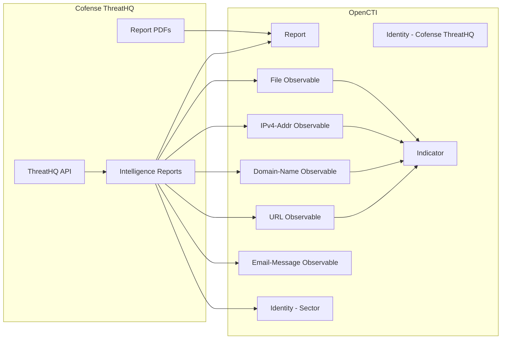

# OpenCTI Cofense ThreatHQ Connector

The Cofense ThreatHQ connector imports threat intelligence data from the Cofense ThreatHQ platform into OpenCTI, including phishing campaign reports, malware indicators, and associated observables.

| Status            | Date | Comment |
|-------------------|------|---------|
| Filigran Verified | -    | -       |

## Table of Contents

- [OpenCTI Cofense ThreatHQ Connector](#opencti-cofense-threathq-connector)
  - [Table of Contents](#table-of-contents)
  - [Introduction](#introduction)
  - [Installation](#installation)
    - [Requirements](#requirements)
  - [Configuration variables](#configuration-variables)
    - [OpenCTI environment variables](#opencti-environment-variables)
    - [Base connector environment variables](#base-connector-environment-variables)
    - [Connector extra parameters environment variables](#connector-extra-parameters-environment-variables)
  - [Deployment](#deployment)
    - [Docker Deployment](#docker-deployment)
    - [Manual Deployment](#manual-deployment)
  - [Usage](#usage)
  - [Behavior](#behavior)
  - [Debugging](#debugging)
  - [Additional information](#additional-information)

## Introduction

Cofense is a leader in email security, providing phishing detection and response solutions powered by threat intelligence from over 35 million Cofense-trained employees who actively report suspected phishing threats in real-time.

Cofense ThreatHQ is a specialized phishing threat detection, analysis, and management platform that provides real-time monitoring of indicators of compromise (IOCs) linked to phishing attacks. This connector retrieves intelligence reports from the ThreatHQ API and converts them into STIX 2.1 objects for import into OpenCTI.

**Supported Indicator Types:**
- URL
- Domain Name
- IPv4 Address
- File (with MD5, SHA-1, SHA-256, SHA-512 hashes)
- Email Message (subjects)

## Installation

### Requirements

- OpenCTI Platform >= 6.x
- Cofense ThreatHQ subscription with API access
- Cofense ThreatHQ API credentials (token user and password)

## Configuration variables

Configuration parameters can be provided via `.env` file, `config.yml` file, or directly as environment variables (e.g., from `docker-compose.yml`).

Priority: **YAML > .env > environment > defaults**.

### OpenCTI environment variables

| Parameter     | config.yml | Docker environment variable | Mandatory | Description                                          |
|---------------|------------|-----------------------------|-----------|------------------------------------------------------|
| OpenCTI URL   | url        | `OPENCTI_URL`               | Yes       | The URL of the OpenCTI platform.                     |
| OpenCTI Token | token      | `OPENCTI_TOKEN`             | Yes       | The default admin token set in the OpenCTI platform. |

### Base connector environment variables

| Parameter                   | config.yml                    | Docker environment variable             | Default            | Mandatory | Description                                                                      |
|-----------------------------|-------------------------------|-----------------------------------------|--------------------|-----------|----------------------------------------------------------------------------------|
| Connector ID                | id                            | `CONNECTOR_ID`                          |                    | Yes       | A unique `UUIDv4` identifier for this connector instance.                        |
| Connector Type              | type                          | `CONNECTOR_TYPE`                        | EXTERNAL_IMPORT    | No        | Should always be set to `EXTERNAL_IMPORT` for this connector.                    |
| Connector Name              | name                          | `CONNECTOR_NAME`                        | Cofense ThreatHQ   | No        | Name of the connector.                                                           |
| Connector Scope             | scope                         | `CONNECTOR_SCOPE`                       | Cofense ThreatHQ   | No        | The scope or type of data the connector is importing.                            |
| Log Level                   | log_level                     | `CONNECTOR_LOG_LEVEL`                   | info               | No        | Determines the verbosity of logs: `debug`, `info`, `warn`, or `error`.           |
| Duration Period             | duration_period               | `CONNECTOR_DURATION_PERIOD`             | PT5H               | No        | Time interval between connector runs in ISO 8601 format.                         |
| Queue Threshold             | queue_threshold               | `CONNECTOR_QUEUE_THRESHOLD`             | 500                | No        | RabbitMQ queue size limit (MB) before entering buffering mode.                   |
| Run and Terminate           | run_and_terminate             | `CONNECTOR_RUN_AND_TERMINATE`           | false              | No        | Launch the connector once if set to `true`.                                      |
| Send to Queue               | send_to_queue                 | `CONNECTOR_SEND_TO_QUEUE`               | true               | No        | If set to `true`, the connector will send data to the queue.                     |
| Send to Directory           | send_to_directory             | `CONNECTOR_SEND_TO_DIRECTORY`           | false              | No        | If set to `true`, the connector will send data to a directory.                   |
| Send to Directory Path      | send_to_directory_path        | `CONNECTOR_SEND_TO_DIRECTORY_PATH`      |                    | No        | Path to directory where data will be sent if `send_to_directory` is `true`.      |
| Send to Directory Retention | send_to_directory_retention   | `CONNECTOR_SEND_TO_DIRECTORY_RETENTION` | 7                  | No        | Number of days to retain data in the directory.                                  |

### Connector extra parameters environment variables

| Parameter                        | config.yml                          | Docker environment variable                          | Default                           | Mandatory | Description                                                                                                 |
|----------------------------------|-------------------------------------|------------------------------------------------------|-----------------------------------|-----------|-------------------------------------------------------------------------------------------------------------|
| Token User                       | token_user                          | `COFENSE_THREATHQ_TOKEN_USER`                        |                                   | Yes       | Token user for Cofense ThreatHQ API authentication.                                                         |
| Token Password                   | token_password                      | `COFENSE_THREATHQ_TOKEN_PASSWORD`                    |                                   | Yes       | Token password for Cofense ThreatHQ API authentication.                                                     |
| API Base URL                     | api_base_url                        | `COFENSE_THREATHQ_API_BASE_URL`                      | https://www.threathq.com/apiv1/   | No        | Cofense ThreatHQ API base URL.                                                                              |
| API Leaky Bucket Rate            | api_leaky_bucket_rate               | `COFENSE_THREATHQ_API_LEAKY_BUCKET_RATE`             | 10                                | No        | Leaky bucket rate per second for API rate limiting.                                                         |
| API Leaky Bucket Capacity        | api_leaky_bucket_capacity           | `COFENSE_THREATHQ_API_LEAKY_BUCKET_CAPACITY`         | 10                                | No        | Leaky bucket capacity for API rate limiting.                                                                |
| API Retry                        | api_retry                           | `COFENSE_THREATHQ_API_RETRY`                         | 5                                 | No        | Maximum number of retry attempts in case of API failure.                                                    |
| API Backoff                      | api_backoff                         | `COFENSE_THREATHQ_API_BACKOFF`                       | PT30S                             | No        | Exponential backoff duration between API retries (ISO 8601 format).                                         |
| Import Start Date                | import_start_date                   | `COFENSE_THREATHQ_IMPORT_START_DATE`                 | P30D                              | No        | Date from which data import should start (`YYYY-MM-DD`, `YYYY-MM-DD HH:MM:SS+HH:MM`, or `P30D` for 30 days before start). |
| Import Report PDF                | import_report_pdf                   | `COFENSE_THREATHQ_IMPORT_REPORT_PDF`                 | true                              | No        | Retrieve and attach PDF reports generated by Cofense ThreatHQ.                                              |
| Impact to Exclude                | impact_to_exclude                   | `COFENSE_THREATHQ_IMPACT_TO_EXCLUDE`                 |                                   | No        | Comma-separated list of report impacts to exclude (e.g., `None,Moderate,Major`).                            |
| TLP Level                        | tlp_level                           | `COFENSE_THREATHQ_TLP_LEVEL`                         | amber+strict                      | No        | TLP marking for exported data (`clear`, `green`, `amber`, `amber+strict`, `red`).                           |
| Promote Observables as Indicators| promote_observables_as_indicators   | `COFENSE_THREATHQ_PROMOTE_OBSERVABLES_AS_INDICATORS` | true                              | No        | Create indicators based on observables from Cofense ThreatHQ.                                               |

## Deployment

### Docker Deployment

Before building the Docker container, ensure you have set the version of `pycti` in `requirements.txt` to match the version of OpenCTI you are running (e.g., `pycti==6.6.12`).

Build the Docker image:

```bash
docker build -t opencti/connector-cofense-threathq:latest .
```

Configure the connector in `docker-compose.yml`:

```yaml
  connector-cofense-threathq:
    image: opencti/connector-cofense-threathq:latest
    environment:
      - OPENCTI_URL=http://localhost
      - OPENCTI_TOKEN=ChangeMe
      - CONNECTOR_ID=ChangeMe
      - CONNECTOR_NAME=Cofense ThreatHQ
      - CONNECTOR_SCOPE=Cofense ThreatHQ
      - CONNECTOR_LOG_LEVEL=info
      - CONNECTOR_DURATION_PERIOD=PT5H
      - COFENSE_THREATHQ_TOKEN_USER=ChangeMe
      - COFENSE_THREATHQ_TOKEN_PASSWORD=ChangeMe
      - COFENSE_THREATHQ_API_BASE_URL=https://www.threathq.com/apiv1/
      - COFENSE_THREATHQ_IMPORT_START_DATE=P30D
      - COFENSE_THREATHQ_IMPORT_REPORT_PDF=true
      - COFENSE_THREATHQ_TLP_LEVEL=amber+strict
      - COFENSE_THREATHQ_PROMOTE_OBSERVABLES_AS_INDICATORS=true
    restart: always
```

Start the connector:

```bash
docker compose up -d
```

### Manual Deployment

1. Create `config.yml` based on `config.yml.sample`, or create `.env` based on `.env.sample`.

2. Install dependencies:

```bash
pip3 install -r requirements.txt
```

3. Start the connector from the `src` directory:

```bash
python3 main.py
```

## Usage

The connector runs automatically at the interval defined by `CONNECTOR_DURATION_PERIOD`. To force an immediate run:

**Data Management → Ingestion → Connectors**

Find the connector and click the refresh button to reset the connector's state and trigger a new data fetch.

## Behavior

The connector fetches threat intelligence reports from Cofense ThreatHQ and converts them to STIX 2.1 objects.

### Data Flow



### Entity Mapping

| Cofense ThreatHQ Data    | OpenCTI Entity      | Description                                                    |
|--------------------------|---------------------|----------------------------------------------------------------|
| Threat Report            | Report              | Intelligence report with PDF attachment (Credential Phishing or Malware Campaign) |
| Block Set - URL          | URL                 | Malicious URL observable                                       |
| Block Set - Domain       | Domain-Name         | Malicious domain observable                                    |
| Block Set - IPv4         | IPv4-Addr           | Malicious IP address observable                                |
| Block Set - Email        | Email-Addr          | Malicious email address observable                             |
| Executable Set           | File                | Malicious file with hashes (MD5, SHA-1, SHA-256, SHA-512)      |
| Subject Set              | Email-Message       | Email subject lines                                            |
| NAICS Codes              | Identity (Sector)   | Targeted sectors/industries                                    |
| Malware Family           | Label               | Applied as labels to observables                               |
| Delivery Mechanism       | Label               | Applied as labels to observables                               |
| Report PDF               | File Attachment     | PDF report attached to Report entity                           |
| -                        | Indicator           | Created from observables when `promote_observables_as_indicators=true` |

### Report Types

The connector categorizes reports into two types based on the threat title:

| Report Type          | Description                                      |
|----------------------|--------------------------------------------------|
| Credential Phishing  | Phishing campaigns targeting user credentials    |
| Malware Campaign     | Campaigns distributing malware                   |

### Processing Details

1. **Report Retrieval**: Fetches reports from the ThreatHQ changelog API with pagination support
2. **Deduplication**: Filters out duplicate reports based on threat ID
3. **Malware Details**: Retrieves detailed information for each report including:
   - Executable sets (file observables)
   - Block sets (URL, domain, IP, email observables)
   - Subject sets (email subjects)
   - NAICS codes (targeted sectors)
   - Campaign information (brands, languages, SEG data)
4. **PDF Attachment**: Optionally downloads and attaches PDF reports
5. **Label Extraction**: Extracts labels from malware families and delivery mechanisms
6. **Observable Creation**: Creates STIX observables with appropriate labels and descriptions
7. **Indicator Promotion**: Optionally creates indicators from observables
8. **Report Assembly**: Creates STIX Report with all references and attachments

### Labels Applied

The connector applies structured labels to observables:

| Source Field        | Label Format        | Example                        |
|---------------------|---------------------|--------------------------------|
| Malware Family      | Family name         | `Emotet`, `Qakbot`             |
| Delivery Mechanism  | Mechanism name      | `attachment`, `link`           |
| Observable Type     | Type name           | `executable`, `document`       |
| Observable Role     | Role description    | `c2`, `payload`                |

## Debugging

Enable verbose logging:

```env
CONNECTOR_LOG_LEVEL=debug
```

Log messages can be added using:
```python
self.helper.connector_logger.{LOG_LEVEL}("Sample message")
# e.g., self.helper.connector_logger.error("An error message")
```

Log output includes:
- API request/response details
- Report processing progress
- Bundle creation and sending status
- State management updates

## Additional information

- **API Documentation**: For existing customers, detailed API documentation is available at [https://www.threathq.com/docs/](https://www.threathq.com/docs/)
- **Subscription Required**: Cofense ThreatHQ requires a paid subscription for API access
- **Rate Limiting**: The connector implements leaky bucket rate limiting to respect API constraints
- **PDF Reports**: When `import_report_pdf=true`, PDF reports are downloaded and attached to Report entities
- **Impact Filtering**: Use `impact_to_exclude` to filter out reports by severity (None, Moderate, Major)
- **Contact**: For more information about Cofense Intelligence, visit [https://cofense.com/](https://cofense.com/)
