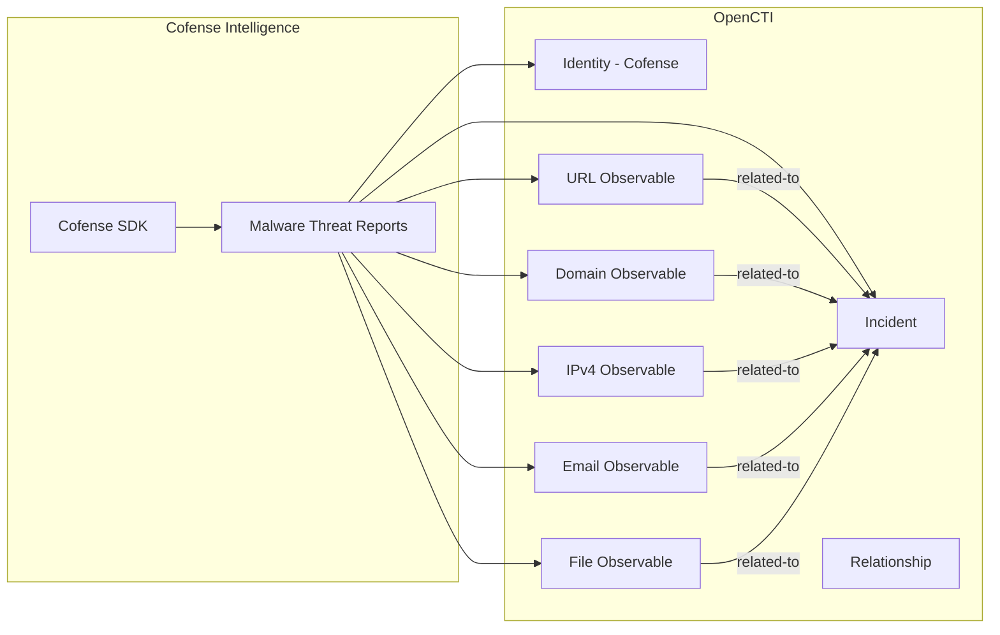

# OpenCTI Cofense Intelligence Connector

| Status | Date | Comment |
|--------|------|---------|
| Filigran Verified | -    | -       |

The Cofense Intelligence connector imports threat intelligence data from the Cofense Intelligence platform into OpenCTI, including malware threat reports and associated indicators.

## Table of Contents

- [OpenCTI Cofense Intelligence Connector](#opencti-cofense-intelligence-connector)
  - [Table of Contents](#table-of-contents)
  - [Introduction](#introduction)
  - [Installation](#installation)
    - [Requirements](#requirements)
  - [Configuration variables](#configuration-variables)
    - [OpenCTI environment variables](#opencti-environment-variables)
    - [Base connector environment variables](#base-connector-environment-variables)
    - [Connector extra parameters environment variables](#connector-extra-parameters-environment-variables)
  - [Deployment](#deployment)
    - [Docker Deployment](#docker-deployment)
    - [Manual Deployment](#manual-deployment)
  - [Usage](#usage)
  - [Behavior](#behavior)
  - [Debugging](#debugging)
  - [Additional information](#additional-information)

## Introduction

Cofense Intelligence provides threat intelligence focused on phishing and email-based threats. Their platform delivers actionable intelligence about active phishing campaigns, malware families, and associated indicators of compromise.

This connector uses the Cofense Intelligence SDK (`cofense_intelligence`) to retrieve Malware Threat Reports (MTRIs) and converts them into STIX objects for import into OpenCTI, including incidents, observables, and relationships.

## Installation

### Requirements

- OpenCTI Platform >= 5.3.7
- Cofense Intelligence API credentials (user token + password)
- `cofense_intelligence` Python SDK

## Configuration variables

There are a number of configuration options, which are set either in `docker-compose.yml` (for Docker) or in `config.yml` (for manual deployment).

### OpenCTI environment variables

| Parameter     | config.yml | Docker environment variable | Mandatory | Description                                          |
|---------------|------------|-----------------------------|-----------|------------------------------------------------------|
| OpenCTI URL   | url        | `OPENCTI_URL`               | Yes       | The URL of the OpenCTI platform.                     |
| OpenCTI Token | token      | `OPENCTI_TOKEN`             | Yes       | The default admin token set in the OpenCTI platform. |

### Base connector environment variables

| Parameter        | config.yml | Docker environment variable | Default      | Mandatory | Description                                                              |
|------------------|------------|-----------------------------|--------------|-----------|--------------------------------------------------------------------------|
| Connector ID     | id         | `CONNECTOR_ID`              |              | Yes       | A unique `UUIDv4` identifier for this connector instance.                |
| Connector Type   | type       | `CONNECTOR_TYPE`            | EXTERNAL_IMPORT | Yes    | Must be `EXTERNAL_IMPORT` for this connector.                            |
| Connector Name   | name       | `CONNECTOR_NAME`            | CofenseIntel | Yes       | Name of the connector.                                                   |
| Connector Scope  | scope      | `CONNECTOR_SCOPE`           |              | Yes       | The scope or type of data the connector is importing.                    |
| Log Level        | log_level  | `CONNECTOR_LOG_LEVEL`       | info         | No        | Determines the verbosity of logs: `debug`, `info`, `warn`, or `error`.   |

### Connector extra parameters environment variables

| Parameter           | config.yml          | Docker environment variable  | Default | Mandatory | Description                                                    |
|---------------------|---------------------|------------------------------|---------|-----------|----------------------------------------------------------------|
| Interval            | cofense.interval    | `COFENSEINTEL_INTERVAL`      |         | Yes       | Polling interval in seconds between connector runs.            |
| User Token          | cofense.user        | `COFENSEINTEL_USER`          |         | Yes       | User token for the Cofense Intelligence SDK.                   |
| Password            | cofense.password    | `COFENSEINTEL_PASSWORD`      |         | Yes       | User password for the Cofense Intelligence SDK.                |
| Update Existing     | cofense.update_existing_data | `COFENSEINTEL_UPDATE` | false  | No        | Whether to update existing data in OpenCTI.                    |

## Deployment

### Docker Deployment

Build the Docker image:

```bash
docker build -t opencti/connector-cofense:latest .
```

Configure the connector in `docker-compose.yml`:

```yaml
  connector-cofense:
    image: opencti/connector-cofense:latest
    environment:
      - OPENCTI_URL=http://localhost
      - OPENCTI_TOKEN=ChangeMe
      - CONNECTOR_ID=ChangeMe
      - CONNECTOR_TYPE=EXTERNAL_IMPORT
      - CONNECTOR_NAME=CofenseIntel
      - CONNECTOR_SCOPE=cofense
      - CONNECTOR_LOG_LEVEL=info
      - COFENSEINTEL_INTERVAL=3600
      - COFENSEINTEL_USER=ChangeMe
      - COFENSEINTEL_PASSWORD=ChangeMe
      - COFENSEINTEL_UPDATE=false
    restart: always
```

Start the connector:

```bash
docker compose up -d
```

### Manual Deployment

1. Create `config.yml` based on `config.yml.sample`.

2. Install dependencies:

```bash
pip3 install -r requirements.txt
```

3. Start the connector from the `src` directory:

```bash
python3 main.py
```

## Usage

The connector runs automatically at the interval defined by `COFENSEINTEL_INTERVAL`. To force an immediate run:

**Data Management → Ingestion → Connectors**

Find the connector and click the refresh button to reset the state and trigger a new data fetch.

## Behavior

The connector fetches Malware Threat Reports (MTRIs) from Cofense Intelligence and converts them to STIX objects.

### Data Flow



### Entity Mapping

| Cofense Data         | OpenCTI Entity      | Description                                      |
|----------------------|---------------------|--------------------------------------------------|
| Malware Threat Report| Incident            | Phishing/malware campaign incident               |
| Block Set - URL      | URL                 | Malicious URL observable                         |
| Block Set - Domain   | Domain-Name         | Malicious domain observable                      |
| Block Set - IPv4     | IPv4-Addr           | Malicious IP address observable                  |
| Block Set - Email    | Email-Addr          | Malicious email address observable               |
| Executable Set       | File                | Malicious file with hashes (MD5, SHA1, SHA256, SHA512) |
| Malware Families     | Labels              | Applied as `family:{name}` labels                |
| Delivery Mechanisms  | Labels              | Applied as `delivery:{name}` labels              |
| Brands               | Labels              | Applied as `brand:{name}` labels                 |

### Processing Details

For each Malware Threat Report (MRTI), the connector creates:

1. **Incident**: Contains the threat report label and executive summary
   - Marked as TLP:RED
   - Labels include malware families, delivery mechanisms, and brands

2. **Observables from Block Set**:
   - URLs, domains, IPv4 addresses, and emails
   - Score: 100 (high confidence)
   - Auto-creates indicators (`x_opencti_create_indicator: true`)
   - Labels include related MRTI labels plus specific malware family and delivery mechanism

3. **File Observables from Executable Set**:
   - File name and hashes (MD5, SHA-1, SHA-256, SHA-512)
   - Score: 100 (high confidence)
   - Auto-creates indicators

4. **Relationships**: `related-to` from each observable to the incident

### Labels Applied

The connector applies structured labels to entities:

| Label Type    | Format              | Example                     |
|---------------|---------------------|-----------------------------|
| Malware Family| `family:{name}`     | `family:Emotet`             |
| Delivery      | `delivery:{method}` | `delivery:phishing-email`   |
| Brand         | `brand:{name}`      | `brand:Microsoft`           |
| Related       | `related-{label}`   | `related-family:Emotet`     |

## Debugging

Enable verbose logging:

```env
CONNECTOR_LOG_LEVEL=debug
```

Log output includes:
- Connector run status
- Threat report processing details
- Bundle creation and sending status

## Additional information

- **Position Tracking**: The connector uses a position file (`cf_intel.pos`) for sync state; defaults to 30 days back if not present
- **TLP Marking**: All entities are marked as TLP:RED by default
- **SDK Dependency**: Requires the `cofense_intelligence` Python package
- **Score**: All observables are assigned a score of 100 (high confidence)
- **Indicator Creation**: Observables automatically create corresponding indicators
