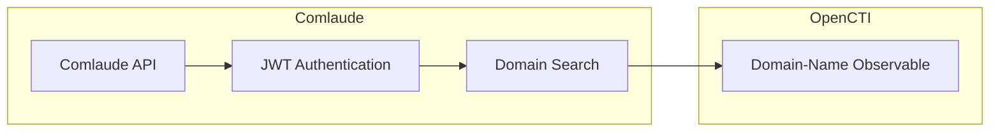

# OpenCTI Comlaude Connector

| Status | Date | Comment |
|--------|------|---------|
| Community | -    | -       |

The Comlaude connector imports domain information from the Comlaude API into OpenCTI for CTI allowlist management.

## Table of Contents

- [OpenCTI Comlaude Connector](#opencti-comlaude-connector)
  - [Table of Contents](#table-of-contents)
  - [Introduction](#introduction)
  - [Installation](#installation)
    - [Requirements](#requirements)
  - [Configuration variables](#configuration-variables)
    - [OpenCTI environment variables](#opencti-environment-variables)
    - [Base connector environment variables](#base-connector-environment-variables)
    - [Connector extra parameters environment variables](#connector-extra-parameters-environment-variables)
  - [Deployment](#deployment)
    - [Docker Deployment](#docker-deployment)
    - [Manual Deployment](#manual-deployment)
  - [Usage](#usage)
  - [Behavior](#behavior)
  - [Debugging](#debugging)
  - [Additional information](#additional-information)

## Introduction

The Comlaude Connector integrates with the [Comlaude API](https://api.comlaude.com/docs) to leverage the Domain Search Endpoint. This endpoint provides a comprehensive list of all domains within a specified group, along with detailed information for each domain.

### Key Features

- **Domain Retrieval**: Fetches domain details from a specific group in the Comlaude system
- **OpenCTI Integration**: Imports the retrieved domains into OpenCTI
- **CTI Allowlists Support**: Enhances Cyber Threat Intelligence (CTI) allowlists by integrating domain details

By integrating Comlaude's domain information with OpenCTI, the connector aids in a more robust and informed CTI strategy.

## Installation

### Requirements

- OpenCTI Platform >= 6.9.23
- Comlaude API credentials (Username, Password, and API Key)

## Configuration variables

There are a number of configuration options, which are set either in `docker-compose.yml` (for Docker) or in `config.yml` (for manual deployment).

### OpenCTI environment variables

| Parameter     | config.yml | Docker environment variable | Mandatory | Description                                          |
|---------------|------------|-----------------------------|-----------|------------------------------------------------------|
| OpenCTI URL   | url        | `OPENCTI_URL`               | Yes       | The URL of the OpenCTI platform.                     |
| OpenCTI Token | token      | `OPENCTI_TOKEN`             | Yes       | The default admin token set in the OpenCTI platform. |

### Base connector environment variables

| Parameter          | config.yml         | Docker environment variable     | Default | Mandatory | Description                                                                 |
|--------------------|--------------------|---------------------------------|---------|-----------|-----------------------------------------------------------------------------|
| Connector ID       | id                 | `CONNECTOR_ID`                  |         | Yes       | A unique `UUIDv4` identifier for this connector instance.                   |
| Connector Name     | name               | `CONNECTOR_NAME`                |         | Yes       | Name of the connector.                                                      |
| Connector Scope    | scope              | `CONNECTOR_SCOPE`               |         | Yes       | The scope or type of data the connector is importing.                       |
| Log Level          | log_level          | `CONNECTOR_LOG_LEVEL`           | info    | Yes       | Determines the verbosity of logs: `debug`, `info`, `warn`, or `error`.      |
| Run and Terminate  | run_and_terminate  | `CONNECTOR_RUN_AND_TERMINATE`   | false   | Yes       | Terminate container after successful execution.                             |
| Duration Period    | duration_period    | `CONNECTOR_DURATION_PERIOD`     |         | Yes       | Execution period in ISO 8601 format (e.g., `PT2H` for 2 hours).             |
| Queue Threshold    | queue_threshold    | `CONNECTOR_QUEUE_THRESHOLD`     | 500     | No        | Optional queue threshold in MB (default: 500MB).                            |

### Connector extra parameters environment variables

| Parameter     | config.yml          | Docker environment variable | Default | Mandatory | Description                                                    |
|---------------|---------------------|------------------------------|---------|-----------|----------------------------------------------------------------|
| Username      | comlaude.username   | `COMLAUDE_USERNAME`          |         | Yes       | Username for the account with API access in Comlaude.          |
| Password      | comlaude.password   | `COMLAUDE_PASSWORD`          |         | Yes       | Password for the account with API access in Comlaude.          |
| API Key       | comlaude.api_key    | `COMLAUDE_API_KEY`           |         | Yes       | API Key for the account with API access in Comlaude.           |
| Group ID      | comlaude.group_id   | `COMLAUDE_GROUP_ID`          |         | Yes       | Group ID for the Comlaude API domain search.                   |
| Start Time    | comlaude.start_time | `COMLAUDE_START_TIME`        |         | Yes       | Earliest entry to retrieve (e.g., `1970-01-01T00:00:00Z`).     |
| Labels        | comlaude.labels     | `COMLAUDE_LABELS`            |         | Yes       | Labels to apply to STIX Objects (e.g., `comlaude,safelist`).   |
| Score         | comlaude.score      | `COMLAUDE_SCORE`             |         | Yes       | Default score value to be assigned to domains.                 |

## Deployment

### Docker Deployment

Build the Docker image:

```bash
docker build -t opencti/connector-comlaude:latest .
```

Configure the connector in `docker-compose.yml`:

```yaml
  connector-comlaude:
    image: opencti/connector-comlaude:latest
    environment:
      - OPENCTI_URL=http://localhost
      - OPENCTI_TOKEN=ChangeMe
      - CONNECTOR_ID=ChangeMe
      - CONNECTOR_NAME=Comlaude
      - CONNECTOR_SCOPE=comlaude
      - CONNECTOR_LOG_LEVEL=info
      - CONNECTOR_RUN_AND_TERMINATE=false
      - CONNECTOR_DURATION_PERIOD=PT24H
      - COMLAUDE_USERNAME=ChangeMe
      - COMLAUDE_PASSWORD=ChangeMe
      - COMLAUDE_API_KEY=ChangeMe
      - COMLAUDE_GROUP_ID=ChangeMe
      - COMLAUDE_START_TIME=1970-01-01T00:00:00Z
      - COMLAUDE_LABELS=comlaude,safelist
      - COMLAUDE_SCORE=0
    restart: always
```

Start the connector:

```bash
docker compose up -d
```

### Manual Deployment

1. Create `config.yml` based on `config.yml.sample`.

2. Install dependencies:

```bash
pip3 install -r requirements.txt
```

3. Start the connector from the `src` directory:

```bash
python3 main.py
```

## Usage

The connector runs automatically at the interval defined by `CONNECTOR_DURATION_PERIOD`. To force an immediate run:

**Data Management → Ingestion → Connectors**

Find the connector and click the refresh button to reset the state and trigger a new data fetch.

## Behavior

The connector fetches domain information from Comlaude and imports them into OpenCTI for allowlist management.

### Data Flow



### Entity Mapping

| Comlaude Data   | OpenCTI Entity      | Description                                      |
|-----------------|---------------------|--------------------------------------------------|
| Domain          | Domain-Name         | Domain observable with configured labels         |
| Updated Time    | Filtering           | Used to filter domains by update timestamp       |

### Processing Details

1. **Authentication**: Uses JWT-based authentication with username, password, and API key
2. **Token Management**: Automatically refreshes tokens before expiration (12-hour threshold)
3. **Pagination**: Handles paginated results (500 domains per page by default)
4. **Time Filtering**: Filters domains by `updated_before` and `updated_after` timestamps
5. **Labels**: Applies configured labels to all imported domains
6. **Score**: Assigns configured score to all domains

### Use Cases

- **Allowlisting**: Import known-good domains to prevent false positives
- **Brand Protection**: Track your organization's domains for security monitoring
- **Asset Inventory**: Maintain an inventory of domains within your organization

## Debugging

Enable verbose logging:

```env
CONNECTOR_LOG_LEVEL=debug
```

Log output includes:
- Token retrieval and refresh status
- Domain search results
- Pagination progress
- Error messages and status codes

## Additional information

- **API Documentation**: Full API documentation at [api.comlaude.com/docs](https://api.comlaude.com/docs)
- **Group-based Access**: Domains are organized by groups; specify the target group with `COMLAUDE_GROUP_ID`
- **Incremental Sync**: Use `COMLAUDE_START_TIME` to control the initial sync range
- **Allowlist Focus**: Typically used with low scores (e.g., `0`) for safelist/allowlist purposes
- **SSL Verification**: Currently disabled for API requests (development consideration)
