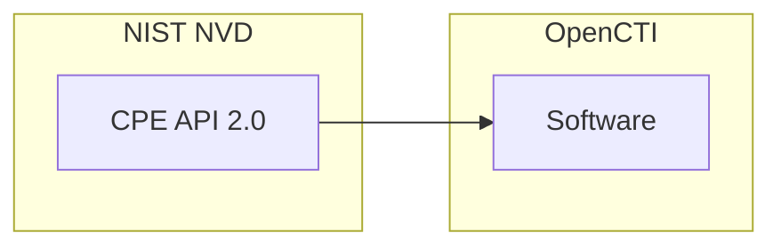

# OpenCTI CPE Connector

| Status | Date | Comment |
|--------|------|---------|
| Community | -    | -       |

The CPE (Common Platform Enumeration) connector imports software and product information from the NIST National Vulnerability Database (NVD) into OpenCTI as Software entities.

## Table of Contents

- [OpenCTI CPE Connector](#opencti-cpe-connector)
  - [Table of Contents](#table-of-contents)
  - [Introduction](#introduction)
  - [Installation](#installation)
    - [Requirements](#requirements)
  - [Configuration variables](#configuration-variables)
  - [Deployment](#deployment)
    - [Docker Deployment](#docker-deployment)
    - [Manual Deployment](#manual-deployment)
  - [Usage](#usage)
  - [Behavior](#behavior)
  - [Debugging](#debugging)
  - [Additional information](#additional-information)

## Introduction

The [NVD](https://nvd.nist.gov/general/brief-history) is the US government's source for standards-based vulnerability management data and is a product of the [NIST](https://www.nist.gov/) Computer Security Division, Information Technology Laboratory.

**CPE (Common Platform Enumeration)** is a structured naming scheme for information technology systems, software, and packages, designed to provide a consistent and uniform way of identifying and describing them.

The CPE repository is maintained by [NIST NVD](https://nvd.nist.gov/products/cpe) and is freely available.

This connector collects CPE data from the NVD, converts them to STIX 2.1 Software objects, and imports them into OpenCTI at regular intervals.

## Installation

### Requirements

- OpenCTI Platform >= 5.12.9
- NIST NVD API key ([Request an API Key](https://nvd.nist.gov/developers/request-an-api-key))

## Configuration variables

There are a number of configuration options, which are set either in `docker-compose.yml` (for Docker) or in `config.yml` (for manual deployment).

### OpenCTI environment variables

Find all the configuration variables available here: [Connector Configurations](./__metadata__/CONNECTOR_CONFIG_DOC.md)

_The `opencti` and `connector` options in the `docker-compose.yml` and `config.yml` are the same as for any other connector.
For more information regarding variables, please refer to [OpenCTI's documentation on connectors](https://docs.opencti.io/latest/deployment/connectors/)._

## Deployment

### Docker Deployment

Build the Docker image:

```bash
docker build -t opencti/connector-cpe:latest .
```

Configure the connector in `docker-compose.yml`:

```yaml
  connector-cpe:
    image: opencti/connector-cpe:latest
    environment:
      - OPENCTI_URL=http://localhost
      - OPENCTI_TOKEN=ChangeMe
      - CONNECTOR_ID=ChangeMe
      - CONNECTOR_TYPE=EXTERNAL_IMPORT
      - CONNECTOR_NAME=Common Platform Enumeration
      - CONNECTOR_SCOPE=software
      - CONNECTOR_LOG_LEVEL=info
      - CPE_BASE_URL=https://services.nvd.nist.gov/rest/json/cpes/2.0
      - NIST_API_KEY=ChangeMe
      - CPE_INTERVAL=6h
    restart: always
```

Start the connector:

```bash
docker compose up -d
```

### Manual Deployment

1. Create `config.yml` based on `config.yml.sample`.

2. Install dependencies:

```bash
pip3 install -r requirements.txt
```

3. Start the connector from the `src` directory:

```bash
python3 main.py
```

## Usage

The connector runs automatically at the interval defined by `CPE_INTERVAL`. To force an immediate run:

**Data Management → Ingestion → Connectors**

Find the connector and click the refresh button to reset the state and trigger a new data fetch.

## Behavior

The connector fetches CPE data from the NIST NVD API and converts them to STIX 2.1 Software objects.

### Data Flow



### Entity Mapping

| CPE Data         | OpenCTI Entity      | Description                                      |
|------------------|---------------------|--------------------------------------------------|
| CPE Name         | Software            | STIX 2.1 Software observable                     |
| Title            | Software.name       | Human-readable software name                     |
| Vendor           | Software.vendor     | Software vendor/publisher                        |
| Version          | Software.version    | Software version number                          |
| Language         | Software.languages  | Software language (IETF standardized)            |
| CPE String       | Software.cpe        | Full CPE 2.3 string                              |

### Processing Details

1. **Full Import**: On first run or after 120 days, imports all CPEs from NVD
2. **Incremental Import**: Subsequent runs import only CPEs modified since last run
3. **Pagination**: Handles API pagination automatically
4. **Rate Limiting**: Respects NIST NVD rate limits (6-second delay between requests)
5. **Retry Logic**: Automatic retry with exponential backoff on API errors

### Import Modes

| Mode        | Trigger                        | Description                                      |
|-------------|--------------------------------|--------------------------------------------------|
| Full Import | First run or >120 days gap     | Imports entire CPE dictionary                    |
| Delta Import| Regular interval               | Imports only modified CPEs since last run        |

### CPE Filtering

The connector filters out:
- **Deprecated CPEs**: CPEs marked as deprecated in NVD
- **Hardware CPEs**: CPEs for hardware (type `h`) as STIX 2.1 Software doesn't support hardware

### CPE String Parsing

CPE 2.3 format: `cpe:2.3:part:vendor:product:version:update:edition:language:sw_edition:target_sw:target_hw:other`

| Field    | Position | Description                    |
|----------|----------|--------------------------------|
| Part     | 3        | `a` (application), `o` (OS), `h` (hardware) |
| Vendor   | 4        | Vendor/publisher name          |
| Product  | 5        | Product name                   |
| Version  | 6        | Version string                 |
| Language | 9        | Language code                  |

## Debugging

Enable verbose logging:

```env
CONNECTOR_LOG_LEVEL=debug
```

Log output includes:
- API request URLs
- Request parameters (pagination)
- CPE conversion details
- Bundle sending status

## Additional information

- **API Key Required**: Request an API key at [NIST NVD Developers](https://nvd.nist.gov/developers/request-an-api-key)
- **Rate Limits**: With an API key, you get higher rate limits; 6-second delays are built into the connector
- **Large Dataset**: The full CPE dictionary contains 1M+ entries; initial sync takes significant time
- **Interval Recommendation**: Minimum 6 hours between runs; NVD updates are not real-time
- **120-Day Rule**: If connector hasn't run in >120 days, it performs a full resync
- **Related Connector**: Use with the CVE connector for complete vulnerability management
