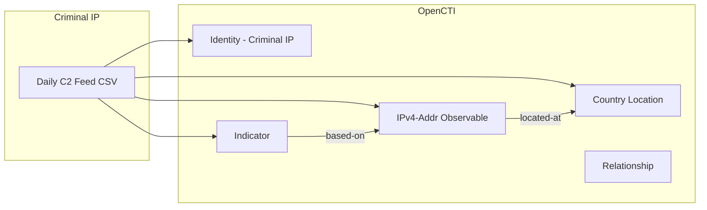

# OpenCTI Criminal IP C2 Daily Feed Connector

The Criminal IP C2 Daily Feed connector imports malicious IP addresses from the Criminal IP real-time threat hunting database into OpenCTI.

| Status    | Date | Comment |
|-----------|------|---------|
| Community | -    | -       |

## Table of Contents

- [OpenCTI Criminal IP C2 Daily Feed Connector](#opencti-criminal-ip-c2-daily-feed-connector)
  - [Table of Contents](#table-of-contents)
  - [Introduction](#introduction)
  - [Installation](#installation)
    - [Requirements](#requirements)
  - [Configuration variables](#configuration-variables)
    - [OpenCTI environment variables](#opencti-environment-variables)
    - [Base connector environment variables](#base-connector-environment-variables)
    - [Connector extra parameters environment variables](#connector-extra-parameters-environment-variables)
  - [Deployment](#deployment)
    - [Docker Deployment](#docker-deployment)
    - [Manual Deployment](#manual-deployment)
  - [Usage](#usage)
  - [Behavior](#behavior)
  - [Debugging](#debugging)
  - [Additional information](#additional-information)

## Introduction

Criminal IP offers a daily sample of 50 malicious IP addresses identified by the Criminal IP real-time threat hunting search engine, specializing in OSINT-based Cyber Threat Intelligence (CTI).

This connector retrieves the daily C2 (Command & Control) feed CSV file from the [Criminal IP C2-Daily-Feed](https://github.com/criminalip/C2-Daily-Feed) GitHub repository and imports the malicious IP addresses into OpenCTI as observables and indicators with geolocation information.

## Installation

### Requirements

- OpenCTI Platform >= 6.7.4

## Configuration variables

There are a number of configuration options, which are set either in `docker-compose.yml` (for Docker) or in `config.yml` (for manual deployment).

### OpenCTI environment variables

| Parameter     | config.yml | Docker environment variable | Mandatory | Description                                          |
|---------------|------------|-----------------------------|-----------|------------------------------------------------------|
| OpenCTI URL   | url        | `OPENCTI_URL`               | Yes       | The URL of the OpenCTI platform.                     |
| OpenCTI Token | token      | `OPENCTI_TOKEN`             | Yes       | The default admin token set in the OpenCTI platform. |

### Base connector environment variables

| Parameter        | config.yml | Docker environment variable | Default | Mandatory | Description                                                              |
|------------------|------------|-----------------------------|---------|-----------|--------------------------------------------------------------------------|
| Connector ID     | id         | `CONNECTOR_ID`              |         | Yes       | A unique `UUIDv4` identifier for this connector instance.                |
| Connector Name   | name       | `CONNECTOR_NAME`            |         | Yes       | Name of the connector.                                                   |
| Connector Scope  | scope      | `CONNECTOR_SCOPE`           |         | Yes       | The scope or type of data the connector is importing.                    |
| Log Level        | log_level  | `CONNECTOR_LOG_LEVEL`       | info    | Yes       | Determines the verbosity of logs: `debug`, `info`, `warn`, or `error`.   |

### Connector extra parameters environment variables

| Parameter          | config.yml                   | Docker environment variable     | Default                                                              | Mandatory | Description                                                    |
|--------------------|------------------------------|---------------------------------|----------------------------------------------------------------------|-----------|----------------------------------------------------------------|
| CSV URL            | criminalipc2dailyfeed.csv_url| `CRIMINALIP_CSV_URL`            | https://raw.githubusercontent.com/criminalip/C2-Daily-Feed/refs/heads/main | Yes  | Base URL for the Criminal IP C2 Daily Feed CSV files.          |
| Confidence Score   | criminalipc2dailyfeed.score  | `CRIMINALIP_CONFIDENCE_SCORE`   |                                                                      | Yes       | Confidence score to assign to imported indicators (0-100).     |
| Interval           | criminalipc2dailyfeed.interval| `CRIMINALIP_INTERVAL`          |                                                                      | Yes       | Interval in days between collections.                          |

## Deployment

### Docker Deployment

Build the Docker image:

```bash
docker build -t opencti/connector-criminalip-c2-daily-feed:latest .
```

Configure the connector in `docker-compose.yml`:

```yaml
  connector-criminalip-c2-daily-feed:
    image: opencti/connector-criminalip-c2-daily-feed:latest
    environment:
      - OPENCTI_URL=http://localhost
      - OPENCTI_TOKEN=ChangeMe
      - CONNECTOR_ID=ChangeMe
      - CONNECTOR_NAME=Criminal IP C2 Daily Feed
      - CONNECTOR_SCOPE=criminalip
      - CONNECTOR_LOG_LEVEL=info
      - CRIMINALIP_CSV_URL=https://raw.githubusercontent.com/criminalip/C2-Daily-Feed/refs/heads/main
      - CRIMINALIP_CONFIDENCE_SCORE=75
      - CRIMINALIP_INTERVAL=1
    restart: always
```

Start the connector:

```bash
docker compose up -d
```

### Manual Deployment

1. Create `config.yml` based on `config.yml.sample`.

2. Install dependencies:

```bash
pip3 install -r requirements.txt
```

3. Start the connector from the `src` directory:

```bash
python3 main.py
```

## Usage

The connector runs automatically at the interval defined by `CRIMINALIP_INTERVAL`. To force an immediate run:

**Data Management → Ingestion → Connectors**

Find the connector and click the refresh button to reset the state and trigger a new data fetch.

## Behavior

The connector fetches the daily C2 feed CSV and imports malicious IP addresses into OpenCTI.

### Data Flow



### Entity Mapping

| CSV Field        | OpenCTI Entity      | Description                                      |
|------------------|---------------------|--------------------------------------------------|
| IP               | IPv4-Addr           | Malicious IP address observable                  |
| IP               | Indicator           | STIX pattern `[ipv4-addr:value = '...']`         |
| Target C2        | Label               | C2 framework/malware family                      |
| Country          | Location            | Country where IP is geolocated                   |
| OpenPorts        | Description         | Port information included in description         |

### Processing Details

For each IP address in the CSV, the connector creates:

1. **Identity**: Criminal IP C2 Daily Feed organization identity (author)

2. **IPv4-Addr Observable** with:
   - `x_opencti_score`: Configured confidence score
   - `x_opencti_description`: Port information
   - `x_opencti_labels`: C2 framework name
   - TLP marking: TLP:WHITE

3. **Indicator** with:
   - Pattern: `[ipv4-addr:value = '<ip>']`
   - Name: `{C2 framework} IP - {IP}`
   - Confidence: Configured score
   - Labels: C2 framework name
   - `x_opencti_main_observable_type`: "IPv4-Addr"

4. **Location**: Country entity based on country code

5. **Relationships**:
   - Indicator → `based-on` → Observable
   - Observable → `located-at` → Location

### CSV Schema

| Column    | Description                           |
|-----------|---------------------------------------|
| IP        | Malicious IPv4 address                |
| Target C2 | C2 framework (e.g., `c2_cobalt-strike`) |
| Country   | ISO 3166-1 alpha-2 country code       |
| OpenPorts | Open ports observed on the IP         |

### C2 Framework Labels

The connector extracts C2 framework names from the `Target C2` field:
- Format: `c2_{framework_name}` → `{framework_name}`
- Example: `c2_cobalt-strike` → `cobalt-strike`

## Debugging

Enable verbose logging:

```env
CONNECTOR_LOG_LEVEL=debug
```

Log output includes:
- CSV fetch status
- Bundle creation details
- Entity creation progress
- State management

## Additional information

- **Free Feed**: The Criminal IP C2 Daily Feed is publicly available on GitHub
- **Daily Updates**: New CSV files are published daily with 50 IP addresses
- **Date-based Files**: Files are named by date (e.g., `2024-01-15.csv`)
- **Geolocation**: Uses `pycountry` library to resolve country codes to names
- **TLP Marking**: All data is marked as TLP:WHITE
- **C2 Detection**: Focuses on Command & Control infrastructure detection
- **Reference**: [Criminal IP C2-Daily-Feed](https://github.com/criminalip/C2-Daily-Feed)
