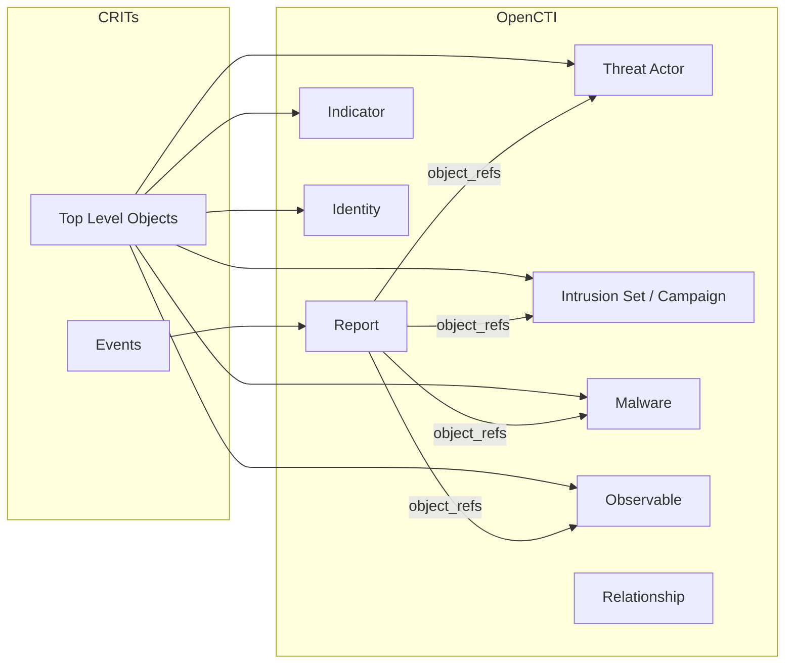

# OpenCTI CRITs Connector

The CRITs connector imports threat intelligence data from a CRITs (Collaborative Research Into Threats) database into OpenCTI, facilitating migration from CRITs to OpenCTI.

| Status    | Date | Comment |
|-----------|------|---------|
| Community | -    | -       |

## Table of Contents

- [OpenCTI CRITs Connector](#opencti-crits-connector)
  - [Table of Contents](#table-of-contents)
  - [Introduction](#introduction)
  - [Installation](#installation)
    - [Requirements](#requirements)
  - [Configuration variables](#configuration-variables)
    - [OpenCTI environment variables](#opencti-environment-variables)
    - [Base connector environment variables](#base-connector-environment-variables)
    - [Connector extra parameters environment variables](#connector-extra-parameters-environment-variables)
  - [Deployment](#deployment)
    - [Docker Deployment](#docker-deployment)
    - [Manual Deployment](#manual-deployment)
  - [Usage](#usage)
  - [Behavior](#behavior)
  - [Debugging](#debugging)
  - [Additional information](#additional-information)

## Introduction

[CRITs](https://crits.github.io/) (Collaborative Research Into Threats) is an open-source malware and threat repository that stores and analyzes threats. As CRITs is largely unmaintained since 2022, this connector helps organizations migrate their threat intelligence data from CRITs to OpenCTI.

The connector uses the CRITs [Authenticated API](https://github.com/crits/crits/wiki/Authenticated-API) to synchronize data, converting CRITs entities to STIX 2.1 objects for import into OpenCTI.

## Installation

### Requirements

- OpenCTI Platform >= 5.3.15
- CRITs instance with API enabled
- CRITs user account with API key

## Configuration variables

There are a number of configuration options, which are set either in `docker-compose.yml` (for Docker) or in `config.yml` (for manual deployment).

### OpenCTI environment variables

| Parameter     | config.yml | Docker environment variable | Mandatory | Description                                          |
|---------------|------------|-----------------------------|-----------|------------------------------------------------------|
| OpenCTI URL   | url        | `OPENCTI_URL`               | Yes       | The URL of the OpenCTI platform.                     |
| OpenCTI Token | token      | `OPENCTI_TOKEN`             | Yes       | The default admin token set in the OpenCTI platform. |

### Base connector environment variables

| Parameter        | config.yml | Docker environment variable | Default | Mandatory | Description                                                              |
|------------------|------------|-----------------------------|---------|-----------|--------------------------------------------------------------------------|
| Connector ID     | id         | `CONNECTOR_ID`              |         | Yes       | A unique `UUIDv4` identifier for this connector instance.                |
| Connector Name   | name       | `CONNECTOR_NAME`            | CRITs   | Yes       | Name of the connector.                                                   |
| Connector Scope  | scope      | `CONNECTOR_SCOPE`           | crits   | Yes       | The scope or type of data the connector is importing.                    |
| Log Level        | log_level  | `CONNECTOR_LOG_LEVEL`       | info    | No        | Determines the verbosity of logs: `debug`, `info`, `warn`, or `error`.   |

### Connector extra parameters environment variables

| Parameter            | config.yml              | Docker environment variable   | Default      | Mandatory | Description                                                                                 |
|----------------------|-------------------------|-------------------------------|--------------|-----------|---------------------------------------------------------------------------------------------|
| CRITs URL            | crits.url               | `CRITS_URL`                   |              | Yes       | The URL of the CRITs instance (without trailing `/`).                                       |
| CRITs Reference URL  | crits.reference_url     | `CRITS_REFERENCE_URL`         | (CRITS_URL)  | No        | URL for external references to link imported data back to CRITs.                            |
| CRITs User           | crits.user              | `CRITS_USER`                  |              | Yes       | CRITs username for API authentication.                                                      |
| CRITs API Key        | crits.api_key           | `CRITS_API_KEY`               |              | Yes       | CRITs API key (found in user profile, not the password).                                    |
| Event Type           | crits.event_type        | `CRITS_EVENT_TYPE`            | crits-event  | No        | Report type for imported CRITs Events in OpenCTI.                                           |
| Interval             | crits.interval          | `CRITS_INTERVAL`              | 60           | Yes       | Polling interval in minutes between connector runs.                                         |
| Import Campaign As   | crits.import_campaign_as| `CRITS_IMPORT_CAMPAIGN_AS`    | IntrusionSet | No        | Import CRITs Campaigns as `Campaign` or `IntrusionSet`.                                     |
| Timestamp Field      | crits.timestamp_field   | `CRITS_TIMESTAMP_FIELD`       | modified     | No        | CRITs field to use for timestamp filtering (`modified` or `created`).                       |
| Chunk Size           | crits.chunk_size        | `CRITS_CHUNK_SIZE`            | 100          | No        | Number of entities to process per API request (affects memory usage).                       |
| Default Marking      | crits.default_marking   | `CRITS_DEFAULT_MARKING`       | TLP:GREEN    | No        | TLP marking for imported data (`TLP:CLEAR`, `TLP:GREEN`, `TLP:AMBER`, `TLP:RED`).           |
| Default Score        | crits.default_score     | `CRITS_DEFAULT_SCORE`         | 50           | No        | Default score for indicators and observables (1-100).                                       |

## Deployment

### Docker Deployment

Build the Docker image:

```bash
docker build -t opencti/connector-crits:latest .
```

Configure the connector in `docker-compose.yml`:

```yaml
  connector-crits:
    image: opencti/connector-crits:latest
    environment:
      - OPENCTI_URL=http://localhost
      - OPENCTI_TOKEN=ChangeMe
      - CONNECTOR_ID=ChangeMe
      - CONNECTOR_NAME=CRITs
      - CONNECTOR_SCOPE=crits
      - CONNECTOR_LOG_LEVEL=info
      - CRITS_URL=http://crits.example.com
      - CRITS_USER=ChangeMe
      - CRITS_API_KEY=ChangeMe
      - CRITS_EVENT_TYPE=crits-event
      - CRITS_INTERVAL=60
      - CRITS_IMPORT_CAMPAIGN_AS=IntrusionSet
      - CRITS_CHUNK_SIZE=100
      - CRITS_TIMESTAMP_FIELD=modified
      - CRITS_DEFAULT_MARKING=TLP:GREEN
      - CRITS_DEFAULT_SCORE=50
    restart: always
```

Start the connector:

```bash
docker compose up -d
```

### Manual Deployment

1. Create `config.yml` based on `config.yml.sample`.

2. Install dependencies:

```bash
pip3 install -r requirements.txt
```

3. Start the connector from the `src` directory:

```bash
python3 crits.py
```

## Usage

The connector runs automatically at the interval defined by `CRITS_INTERVAL`. To force an immediate run:

**Data Management → Ingestion → Connectors**

Find the connector and click the refresh button to reset the state and trigger a new data fetch.

## Behavior

The connector synchronizes data from CRITs to OpenCTI, converting CRITs entities to STIX 2.1 format.

### Data Flow



### Entity Mapping

| CRITs Entity      | OpenCTI Entity      | Description                                          |
|-------------------|---------------------|------------------------------------------------------|
| Event             | Report              | CRITs Events become analysis reports                 |
| Actor             | Threat Actor        | Threat actor entities                                |
| Campaign          | Intrusion Set       | Or Campaign, configurable via `import_campaign_as`   |
| Backdoor          | Malware             | Malware with `is_family=true`                        |
| Exploit           | Malware             | Malware with type `exploit-kit`                      |
| IP                | IPv4-Addr/IPv6-Addr | IP address observables                               |
| Domain            | Domain-Name         | Domain name observables                              |
| Sample            | File                | File observables with hashes (MD5, SHA-1, SHA-256, SHA-512, SSDEEP) |
| Indicator         | Indicator           | STIX pattern indicators                              |
| Signature         | Indicator           | YARA, Snort, or other signature patterns             |
| Email             | Email-Message       | Email message observables                            |
| Target            | Identity            | Individual identity with contact information         |
| RawData           | Text Observable     | Custom text observable                               |
| Source            | Identity            | Organization identity for data attribution           |

### Indicator Type Mapping

| CRITs Indicator Type | STIX Pattern                                    |
|----------------------|-------------------------------------------------|
| IPv4 Address         | `[ipv4-addr:value = '...']`                     |
| IPv4 Subnet          | `[ipv4-addr:value = '...']`                     |
| IPv6 Address         | `[ipv6-addr:value = '...']`                     |
| IPv6 Subnet          | `[ipv6-addr:value = '...']`                     |
| Domain               | `[domain-name:value = '...']`                   |
| MD5                  | `[file:hashes.'MD5' = '...']`                   |
| SHA1                 | `[file:hashes.'SHA-1' = '...']`                 |
| SHA256               | `[file:hashes.'SHA-256' = '...']`               |
| URI                  | `[url:value = '...']`                           |
| User Agent           | `[network-traffic:extensions.'http-request-ext'.request_header.'User-Agent' = '...']` |

### Processing Details

1. **Two-Phase Import**:
   - **Phase 1**: Import Events as Reports with their related objects
   - **Phase 2**: Import standalone objects not associated with Events

2. **Relationship Handling**:
   - CRITs relationships within the same Event are preserved as STIX relationships
   - Cross-entity relationships use `related-to` relationship type
   - Relationship reasons from CRITs are stored in relationship descriptions

3. **Source Attribution**:
   - Each CRITs source becomes an Organization identity
   - Source references are preserved as external references
   - The first source is set as the `created_by_ref`

4. **External References**:
   - Source instance references are imported as external references
   - Links back to CRITs entities are created using `CRITS_REFERENCE_URL`
   - Valid URLs are stored as URLs; non-URLs are stored as external IDs

5. **Incremental Sync**:
   - Uses the `timestamp_field` to track changes
   - Only imports entities modified since the last run
   - First run imports all historical data

### Unsupported CRITs Data Types

The following CRITs data types cannot be imported due to API limitations:

- **PCAP**: Binary network capture files
- **Certificate**: SSL/TLS certificates
- **Screenshot**: Image files

## Debugging

Enable verbose logging:

```env
CONNECTOR_LOG_LEVEL=debug
```

Log output includes:
- API connection status
- Collection processing progress
- Entity conversion details
- Bundle sending status
- Pagination information

## Additional information

- **Migration Focus**: This connector is primarily designed to help migrate data from CRITs to OpenCTI
- **One-Way Sync**: Data flows from CRITs to OpenCTI only; changes in OpenCTI are not pushed back to CRITs
- **CRITs Status**: CRITs is largely unmaintained as of 2022; consider this connector for migration rather than ongoing sync
- **Campaign Handling**: The `campaign` field on CRITs Events is handled specially; campaign fields on other objects are ignored
- **Memory Management**: Adjust `CRITS_CHUNK_SIZE` based on available memory; larger values are faster but use more memory
- **Email Limitations**: Raw email content cannot be fully reconstructed; headers and significant metadata are imported
- **Reference**: [CRITs GitHub](https://crits.github.io/) | [CRITs API Documentation](https://github.com/crits/crits/wiki/Authenticated-API)
