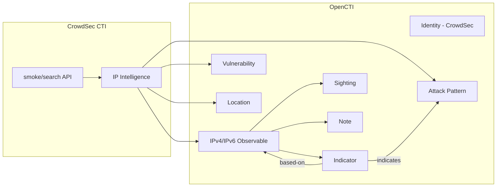

# OpenCTI CrowdSec External Import Connector

The CrowdSec External Import Connector imports IP address threat intelligence from CrowdSec's Cyber Threat Intelligence (CTI) API into OpenCTI. It enriches IP observables with comprehensive threat data including reputation scores, attack patterns, MITRE techniques, vulnerabilities (CVEs), and behavioral analysis.

| Status  | Date | Comment |
|---------|------|---------|
| Partner | -    | -       |

## Table of Contents

- [OpenCTI CrowdSec External Import Connector](#opencti-crowdsec-external-import-connector)
  - [Table of Contents](#table-of-contents)
  - [Introduction](#introduction)
  - [Installation](#installation)
    - [Requirements](#requirements)
  - [Configuration variables](#configuration-variables)
    - [OpenCTI environment variables](#opencti-environment-variables)
    - [Base connector environment variables](#base-connector-environment-variables)
    - [Connector extra parameters environment variables](#connector-extra-parameters-environment-variables)
  - [Deployment](#deployment)
    - [Docker Deployment](#docker-deployment)
    - [Manual Deployment](#manual-deployment)
  - [Usage](#usage)
  - [Behavior](#behavior)
  - [Debugging](#debugging)
  - [Additional information](#additional-information)

## Introduction

CrowdSec is a collaborative security engine that leverages crowd intelligence to detect and block malicious IPs. The CrowdSec CTI API provides access to a comprehensive database of malicious IP addresses observed attacking infrastructure across their global network.

This connector retrieves IP addresses using configurable Lucene queries from the CrowdSec CTI `smoke/search` endpoint and creates enriched observables with:

- **Reputation classifications**: malicious, suspicious, known, or safe
- **Attack behaviors**: SSH bruteforce, HTTP probing, etc.
- **MITRE ATT&CK techniques**: mapped attack patterns and tactics
- **CVE associations**: related vulnerabilities
- **Geolocation data**: origin and targeted countries
- **Temporal information**: first/last seen timestamps

## Installation

### Requirements

- OpenCTI Platform >= 5.3.7
- CrowdSec CTI API key - [Get your API key](https://docs.crowdsec.net/docs/next/cti_api/getting_started/#getting-an-api-key)

## Configuration variables

There are a number of configuration options, which are set either in `docker-compose.yml` (for Docker) or in `config.yml` (for manual deployment).

### OpenCTI environment variables

| Parameter     | config.yml | Docker environment variable | Mandatory | Description                                          |
|---------------|------------|-----------------------------|-----------|------------------------------------------------------|
| OpenCTI URL   | url        | `OPENCTI_URL`               | Yes       | The URL of the OpenCTI platform.                     |
| OpenCTI Token | token      | `OPENCTI_TOKEN`             | Yes       | The default admin token set in the OpenCTI platform. |

### Base connector environment variables

| Parameter            | config.yml                       | Docker environment variable      | Default         | Mandatory | Description                                                                 |
|----------------------|----------------------------------|----------------------------------|-----------------|-----------|-----------------------------------------------------------------------------|
| Connector ID         | connector.id                     | `CONNECTOR_ID`                   |                 | Yes       | A unique `UUIDv4` identifier for this connector instance.                   |
| Connector Type       | connector.type                   | `CONNECTOR_TYPE`                 | EXTERNAL_IMPORT | No        | Should always be set to `EXTERNAL_IMPORT` for this connector.               |
| Connector Name       | connector.name                   | `CONNECTOR_NAME`                 |                 | Yes       | Name of the connector.                                                      |
| Connector Scope      | connector.scope                  | `CONNECTOR_SCOPE`                |                 | Yes       | The scope or type of data the connector is importing.                       |
| Update Existing Data | connector.update_existing_data   | `CONNECTOR_UPDATE_EXISTING_DATA` | false           | No        | Whether to update existing data in OpenCTI.                                 |
| Log Level            | connector.log_level              | `CONNECTOR_LOG_LEVEL`            | info            | No        | Determines the verbosity of logs: `debug`, `info`, `warn`, or `error`.      |

### Connector extra parameters environment variables

| Parameter                    | config.yml                               | Docker environment variable                      | Default                           | Mandatory | Description                                                                      |
|------------------------------|------------------------------------------|--------------------------------------------------|-----------------------------------|-----------|----------------------------------------------------------------------------------|
| CrowdSec API Key             | crowdsec.key                             | `CROWDSEC_KEY`                                   |                                   | Yes       | CrowdSec CTI API key.                                                            |
| Import Query                 | crowdsec.import_query                    | `CROWDSEC_IMPORT_QUERY`                          | behaviors.label:"SSH Bruteforce"  | No        | Lucene query to filter CrowdSec data.                                            |
| Query Time Range             | crowdsec.import_query_since              | `CROWDSEC_IMPORT_QUERY_SINCE`                    | 24                                | No        | Time window in hours for fetching data.                                          |
| Enrichment Threshold         | crowdsec.enrichment_threshold_per_import | `CROWDSEC_ENRICHMENT_THRESHOLD_PER_IMPORT`       | 2000                              | No        | Maximum IPs to enrich per import.                                                |
| Max TLP                      | crowdsec.max_tlp                         | `CROWDSEC_MAX_TLP`                               | TLP:AMBER                         | No        | Maximum TLP level for processing.                                                |
| TLP Level                    | crowdsec.tlp_level                       | `CROWDSEC_TLP_LEVEL`                             | amber                             | No        | TLP for created STIX objects.                                                    |
| Create Indicators From       | crowdsec.indicator_create_from           | `CROWDSEC_INDICATOR_CREATE_FROM`                 | malicious,suspicious,known        | No        | Reputation types to create indicators from.                                      |
| Create Notes                 | crowdsec.create_note                     | `CROWDSEC_CREATE_NOTE`                           | true                              | No        | Enable note creation for enrichments.                                            |
| Create Sightings             | crowdsec.create_sighting                 | `CROWDSEC_CREATE_SIGHTING`                       | true                              | No        | Enable sighting creation.                                                        |
| Min Enrichment Delay         | crowdsec.min_delay_between_enrichments   | `CROWDSEC_MIN_DELAY_BETWEEN_ENRICHMENTS`         | 86400                             | No        | Minimum seconds between enrichments.                                             |
| Scenario Name Labels         | crowdsec.labels_scenario_name            | `CROWDSEC_LABELS_SCENARIO_NAME`                  | true                              | No        | Enable scenario name labels.                                                     |
| Scenario Label Labels        | crowdsec.labels_scenario_label           | `CROWDSEC_LABELS_SCENARIO_LABEL`                 | false                             | No        | Enable scenario label labels.                                                    |
| CVE Labels                   | crowdsec.labels_cve                      | `CROWDSEC_LABELS_CVE`                            | true                              | No        | Enable CVE-based labels.                                                         |
| MITRE Labels                 | crowdsec.labels_mitre                    | `CROWDSEC_LABELS_MITRE`                          | true                              | No        | Enable MITRE technique labels.                                                   |
| Behavior Labels              | crowdsec.labels_behavior                 | `CROWDSEC_LABELS_BEHAVIOR`                       | false                             | No        | Enable behavior labels.                                                          |
| Reputation Labels            | crowdsec.labels_reputation               | `CROWDSEC_LABELS_REPUTATION`                     | true                              | No        | Enable reputation labels.                                                        |
| Scenario Color               | crowdsec.labels_scenario_color           | `CROWDSEC_LABELS_SCENARIO_COLOR`                 | #2E2A14                           | No        | Scenario label color.                                                            |
| CVE Color                    | crowdsec.labels_cve_color                | `CROWDSEC_LABELS_CVE_COLOR`                      | #800080                           | No        | CVE label color.                                                                 |
| MITRE Color                  | crowdsec.labels_mitre_color              | `CROWDSEC_LABELS_MITRE_COLOR`                    | #000080                           | No        | MITRE technique label color.                                                     |
| Behavior Color               | crowdsec.labels_behavior_color           | `CROWDSEC_LABELS_BEHAVIOR_COLOR`                 | #808000                           | No        | Behavior label color.                                                            |
| Malicious Color              | crowdsec.labels_reputation_malicious_color | `CROWDSEC_LABELS_REPUTATION_MALICIOUS_COLOR`   | #FF0000                           | No        | Malicious reputation label color.                                                |
| Suspicious Color             | crowdsec.labels_reputation_suspicious_color | `CROWDSEC_LABELS_REPUTATION_SUSPICIOUS_COLOR` | #FFA500                           | No        | Suspicious reputation label color.                                               |
| Known Color                  | crowdsec.labels_reputation_known_color   | `CROWDSEC_LABELS_REPUTATION_KNOWN_COLOR`         | #808080                           | No        | Known reputation label color.                                                    |
| Safe Color                   | crowdsec.labels_reputation_safe_color    | `CROWDSEC_LABELS_REPUTATION_SAFE_COLOR`          | #00BFFF                           | No        | Safe reputation label color.                                                     |

## Deployment

### Docker Deployment

Before building the Docker container, ensure you have set the version of `pycti` in `requirements.txt` to match the version of OpenCTI you are running (e.g., `pycti==5.12.20`).

Build the Docker image:

```bash
docker build -t opencti/connector-crowdsec-import:latest .
```

Configure the connector in `docker-compose.yml`:

```yaml
  connector-crowdsec-import:
    image: opencti/connector-crowdsec-import:latest
    environment:
      - OPENCTI_URL=http://localhost
      - OPENCTI_TOKEN=ChangeMe
      - CONNECTOR_ID=ChangeMe
      - CONNECTOR_NAME=CrowdSec Import
      - CONNECTOR_SCOPE=crowdsec
      - CONNECTOR_LOG_LEVEL=info
      - CONNECTOR_UPDATE_EXISTING_DATA=false
      - CROWDSEC_KEY=ChangeMe
      - CROWDSEC_IMPORT_QUERY=behaviors.label:"SSH Bruteforce"
      - CROWDSEC_IMPORT_QUERY_SINCE=24
      - CROWDSEC_ENRICHMENT_THRESHOLD_PER_IMPORT=2000
      - CROWDSEC_TLP_LEVEL=amber
      - CROWDSEC_INDICATOR_CREATE_FROM=malicious,suspicious,known
      - CROWDSEC_CREATE_NOTE=true
      - CROWDSEC_CREATE_SIGHTING=true
    restart: always
```

Start the connector:

```bash
docker compose up -d
```

### Manual Deployment

1. Create `config.yml` based on `config.yml.sample`.

2. Install dependencies:

```bash
pip3 install -r requirements.txt
```

3. Start the connector from the `src` directory:

```bash
python3 main.py
```

## Usage

The connector runs automatically at a regular interval specified in your configuration via `duration_period`. To force an immediate run:

**Data Management → Ingestion → Connectors**

Find the connector and click the refresh button to reset the connector's state and trigger a new data fetch.

## Behavior

The connector queries CrowdSec CTI API using the configured Lucene query and creates enriched IP observables in OpenCTI.

### Data Flow



### Entity Mapping

| CrowdSec Data        | OpenCTI Entity      | Description                                      |
|----------------------|---------------------|--------------------------------------------------|
| IP Address           | IPv4-Addr/IPv6-Addr | IP address observable with enrichment data       |
| Reputation           | Indicator           | Created based on reputation type (configurable)  |
| Reputation           | Label               | Color-coded reputation label                     |
| Behaviors            | Label               | Attack behavior labels                           |
| Scenarios            | Label               | Scenario name/label                              |
| MITRE Techniques     | Attack Pattern      | MITRE ATT&CK technique mapping                   |
| CVEs                 | Vulnerability       | Associated CVE vulnerabilities                   |
| CVEs                 | Label               | CVE-based labels                                 |
| Country              | Location            | Geolocation information                          |
| Sighting Info        | Sighting            | Temporal observation data                        |
| Enrichment Details   | Note                | Detailed enrichment information                  |

### Processing Details

For each imported IP address, the connector creates:

1. **Observable**: IPv4-Addr or IPv6-Addr with basic IP information
2. **Labels**: Configurable color-coded labels for reputation, scenarios, CVEs, and MITRE techniques
3. **External References**: Links to CrowdSec CTI and related threat intelligence sources
4. **Indicators**: Generated based on reputation (configurable which reputation types)
5. **Attack Patterns**: Created from MITRE ATT&CK techniques with relationships to indicators
6. **Vulnerabilities**: Generated from associated CVE information
7. **Locations**: Country-based locations for geolocation context
8. **Sightings**: Temporal information about when the IP was observed
9. **Notes**: Detailed enrichment information including confidence levels and behavioral analysis

### Lucene Query Examples

Configure `CROWDSEC_IMPORT_QUERY` with Lucene syntax:

| Query | Description |
|-------|-------------|
| `behaviors.label:"SSH Bruteforce"` | SSH brute force attacks |
| `behaviors.label:"HTTP Admin Interface Probing"` | HTTP admin probing |
| `behaviors.label:("SSH Bruteforce" OR "HTTP Probing")` | Multiple attack types |
| `reputation:("malicious" OR "suspicious")` | Filter by reputation |
| `behaviors.label:"SSH Bruteforce" AND reputation:"malicious"` | Combined filters |

See [CrowdSec query documentation](https://docs.crowdsec.net/u/cti_api/search_queries/) for complete syntax reference.

### Import Performance

Import performance varies based on server specifications and enrichment configuration:

| IPs Imported | Approximate Time (8-core, 32GB RAM) |
|--------------|-------------------------------------|
| 2,000 IPs    | ~1.5 hours                          |
| 10,000 IPs   | ~8.5 hours                          |
| 50,000 IPs   | ~3.5 days                           |

## Debugging

Enable verbose logging:

```env
CONNECTOR_LOG_LEVEL=debug
```

Log levels available:
- `debug`: Detailed debugging information including API calls and data processing
- `info`: General operational information (default)
- `warn`: Warning messages for potential issues
- `error`: Error messages only

### Common Issues

| Issue | Solution |
|-------|----------|
| Authentication Errors | Verify `CROWDSEC_KEY` is valid and has appropriate permissions |
| Import Failures | Review Lucene query syntax in `CROWDSEC_IMPORT_QUERY` |
| Performance Issues | Reduce `CROWDSEC_ENRICHMENT_THRESHOLD_PER_IMPORT` or disable unnecessary enrichment features |
| TLP Level Conflicts | Ensure `CROWDSEC_MAX_TLP` matches your organization's classification scheme |

## Additional information

- **API Integration**: Uses CrowdSec CTI API `smoke/search` endpoint - [API Documentation](https://crowdsecurity.github.io/cti-api/#/Freemium/get_smoke_search)
- **STIX 2.1 Compliance**: All created objects follow STIX 2.1 specifications
- **Related Connectors**: Consider pairing with **CrowdSec Internal Enrichment Connector** for enriching existing observables
- **API Key**: Get your API key at [CrowdSec Getting Started](https://docs.crowdsec.net/docs/next/cti_api/getting_started/#getting-an-api-key)
