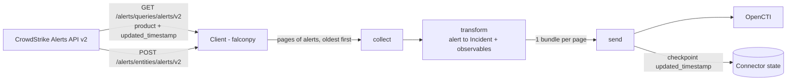

# OpenCTI CrowdStrike Incidents Connector

Table of Contents

- [Introduction](#introduction)
- [Installation](#installation)
  - [Requirements](#requirements)
- [Configuration variables](#configuration-variables)
- [Deployment](#deployment)
  - [Docker Deployment](#docker-deployment)
  - [Manual Deployment](#manual-deployment)
- [Usage](#usage)
- [Behavior](#behavior)
  - [Data flow](#data-flow)
  - [STIX 2.1 mapping](#stix-21-mapping)
  - [Incremental collection and resilience](#incremental-collection-and-resilience)
- [Known caveats](#known-caveats)
- [Debugging](#debugging)
- [Additional information](#additional-information)

## Introduction

[CrowdStrike Falcon Next-Gen SIEM](https://www.crowdstrike.com/platform/next-gen-siem/) raises
**alerts** when one of its **correlation rules** matches the logs ingested in the platform.

This connector retrieves these Next-Gen SIEM alerts through the CrowdStrike Falcon **Alerts API v2**
and imports each of them into OpenCTI as an **Incident**, together with the hosts, IP addresses and
user accounts involved, and the MITRE ATT&CK techniques declared by the correlation rule.

> Next-Gen SIEM alerts only exist when a correlation rule fires. The raw logs stored in Next-Gen SIEM
> (LogScale repositories) are not exposed by the Alerts API and are not imported.

## Installation

### Requirements

- OpenCTI Platform >= 7.261008.0
- A CrowdStrike Falcon API client (Support and resources > API clients and keys) with the
  **`Alerts: Read`** scope. No other scope is needed.
  Source: [PSFalcon `Get-FalconAlert`](https://github.com/CrowdStrike/psfalcon/blob/master/public/alerts.ps1)
  ("Requires 'Alerts: Read'").
- The base URL of the CrowdStrike cloud region of the tenant, e.g. `https://api.crowdstrike.com`
  (US-1), `https://api.us-2.crowdstrike.com` (US-2), `https://api.eu-1.crowdstrike.com` (EU-1).

## Configuration variables

The exhaustive, generated list of every parameter is available in
[Connector Configurations](./__metadata__/CONNECTOR_CONFIG_DOC.md).

Main parameters (environment variable prefix `CROWDSTRIKE_INCIDENTS_`):

| Parameter            | Default                       | Description                                                                                      |
|----------------------|-------------------------------|--------------------------------------------------------------------------------------------------|
| `api_base_url`       | `https://api.crowdstrike.com` | Base URL of the CrowdStrike API for the tenant's cloud region.                                   |
| `client_id`          | (required)                    | CrowdStrike API client ID.                                                                       |
| `client_secret`      | (required)                    | CrowdStrike API client secret.                                                                   |
| `import_start_date`  | `P7D`                         | How far back to look on the first run (ISO 8601 duration). Ignored once a cursor is stored.      |
| `products`           | `ngsiem`                      | Alert products to import. **Only `ngsiem` is supported**; other values are ignored with a warning, and the connector does not start if no supported value remains. |
| `severity_min`       | (none)                        | Minimum severity to import: `informational`, `low`, `medium`, `high` or `critical`.              |
| `include_hidden`     | `false`                       | Also import the alerts hidden in the Falcon console.                                             |
| `tlp_level`          | `amber+strict`                | TLP marking applied to every created object.                                                    |
| `connector.duration_period` | `PT5M`                 | Interval between two runs.                                                                       |

In-code constants (not configurable):

| Constant   | Value                                     | Notes                                                                 |
|------------|-------------------------------------------|-----------------------------------------------------------------------|
| Page size  | 1000 alerts                               | Alert IDs per query and alerts per detail request.                    |
| User-Agent | `OpenCTI-CrowdStrike-Incidents-Connector` | Sent on every API call.                                               |
| Auth       | OAuth2 client credentials                 | Token request, refresh and retries are handled by the official [falconpy](https://github.com/CrowdStrike/falconpy) SDK. |

## Deployment

### Docker Deployment

Build the image, or use the published one:

```shell
docker build . -t opencti/connector-crowdstrike-incidents:latest
```

Fill in the environment variables of `docker-compose.yml`, then:

```shell
docker compose up -d
```

### Manual Deployment

```shell
cp config.yml.sample src/config.yml   # then fill in the values
pip install -r requirements.txt
cd src
python main.py
```

## Usage

The connector runs every `duration_period`. To force an immediate run, go to
**Data management > Ingestion > Connectors**, select the connector and click the refresh button.

To re-import from scratch, reset the connector state from the same page: the next run starts again
from `now - import_start_date`.

## Behavior

### Data flow



API reference:

| Step               | Endpoint                             | falconpy                    |
|--------------------|--------------------------------------|-----------------------------|
| List alert IDs     | `GET /alerts/queries/alerts/v2`      | `Alerts.query_alerts_v2`    |
| Get alert details  | `POST /alerts/entities/alerts/v2`    | `Alerts.get_alerts_v2`      |

The FQL filter is `product:['ngsiem']+updated_timestamp:>='<cursor>'`, sorted by
`updated_timestamp|asc`. The `ngsiem` product value is documented in CrowdStrike's
[falcon-mcp `detections.py`](https://github.com/CrowdStrike/falcon-mcp/blob/main/falcon_mcp/resources/detections.py).

### STIX 2.1 mapping

Each alert produces one **Incident** and its related objects. Every object is created by the
`CrowdStrike` organization and carries the configured TLP marking.

#### Alert → Incident

| CrowdStrike field                             | OpenCTI Incident        | Notes                                                                                                     |
|-----------------------------------------------|-------------------------|-----------------------------------------------------------------------------------------------------------|
| `display_name`, `host_names[0]`, `user_names[0]` | `name`               | `<rule> on <host> by <user>`, as in the Falcon console. Falls back to `name`, then to `composite_id`.     |
| `description`                                 | `description`           | Followed by a table: product, type, status, priority, priority explanation, detection ID, event IDs.      |
| `severity_name`                               | `severity`              | `Informational` and `Low` → `low`, `Medium` → `medium`, `High` → `high`, `Critical` → `critical`.         |
| —                                             | `incident_type`         | Always `alert`.                                                                                           |
| `product`                                     | `source`                | `CrowdStrike Falcon Next-Gen SIEM`.                                                                       |
| `created_timestamp`                           | `created`               |                                                                                                           |
| `start_time` / `end_time`                     | `first_seen` / `last_seen` | Detection window of the correlation rule.                                                              |
| `mitre_attack[].tactic`                       | `labels`                | e.g. `Execution`, `Persistence`.                                                                          |
| `falcon_host_link`, `composite_id`            | External reference      | `source_name` `CrowdStrike Falcon Next-Gen SIEM`, `url` = console link, `external_id` = `composite_id`.   |

The Incident STIX ID is generated from its `name` and `created` date, which do not change when the
alert is updated in CrowdStrike: an updated alert updates the existing Incident instead of creating
a new one.

#### Related objects

| CrowdStrike field                 | OpenCTI object                          | Relationship (from the Incident) |
|-----------------------------------|-----------------------------------------|----------------------------------|
| `host_names[]`                    | `Hostname` observable                   | `related-to`                     |
| `source_ips[]`                    | `IPv4-Addr` / `IPv6-Addr` observable    | `related-to`                     |
| `users[].user_name`, `users[].sid` (or `user_names[]`) | `User-Account` (`account_login`, `user_id`) | `related-to`  |
| `mitre_attack[].technique_id`, `technique` | `Attack-Pattern`               | `uses`                           |

Attack Patterns are only created for MITRE ATT&CK IDs (`T1234` or `T1234.567`). Their STIX ID only
depends on the MITRE ID, so they **merge with the techniques already imported** by the MITRE ATT&CK
connector instead of creating duplicates.

#### Not mapped

`agent_id`, `aggregate_id`, `cid`, `origin_cid`, `correlation_rule_*`, `crawled_timestamp`,
`timestamp`, `seconds_to_resolved`, `seconds_to_triaged`, `show_in_ui`, `poly_id`, `pattern_id`,
`vendor_pattern_id`, `priority_details`, `data_domains`, `source_products`, `source_vendors`,
`source_hosts` (duplicate of `host_names`), `usernames` (duplicate of `user_names`),
`enriched_entities` (always empty on Next-Gen SIEM alerts).

### Incremental collection and resilience

- **Cursor**: `updated_timestamp`. Alerts updated in CrowdStrike after their first import (status
  change, etc.) are fetched again and update the existing Incident.
- **Pagination**: the Alerts API rejects queries where `offset + limit` exceeds 10 000. The connector
  therefore paginates by keyset: after each page, the next query restarts at offset 0 from the last
  `updated_timestamp`. When a full page shares the same timestamp, it falls back to the offset within
  that timestamp. Alerts already sent at the cursor boundary are skipped.
- **Checkpoint after every bundle**: the cursor is saved after each page is sent to OpenCTI, so a
  crash during a large backlog resumes where it stopped instead of restarting.
- **Per-alert failures**: an alert that cannot be parsed or converted is logged and skipped; the
  cursor still moves past it.
- **API errors**: a non-success response stops the run with an explicit error (a `403` mentions the
  `Alerts: Read` scope); the next scheduled run retries from the last saved cursor.

## Known caveats

- **Only Next-Gen SIEM alerts are supported.** Other Alerts API products (`epp`, `idp`, `xdr`, ...)
  have a different payload (devices, files, hashes) and are ignored, even if configured.
- **Checkpointing deviates from the connectors-sdk rule** that processors must not call
  `state.save()`: it is needed to resume large backlogs.
- **falconpy is used instead of the connectors-sdk `BaseClientApi`**: the official SDK handles the
  OAuth2 flow, token refresh and cloud regions.
- **Observables describe the affected internal assets**, not threat indicators: host names, private
  IP addresses and machine accounts (e.g. `HOST$`) are common.
- **Incident names are not unique**: two alerts of the same rule on the same host and user share a
  name; they stay distinct Incidents because their creation dates differ.
- **Unknown severities are always imported**, even when `severity_min` is set.
- **Alert retention**: alerts older than the CrowdStrike retention period (about 90 days observed)
  cannot be imported, whatever `import_start_date` is.
- **No MITRE technique** is attached to an alert when its correlation rule does not declare any.

## Debugging

Set `CONNECTOR_LOG_LEVEL=debug`. Each run logs the cursor it starts from, the number of alerts
fetched per page, and every skipped alert with its `composite_id`.

## Additional information

Out of scope for this version:

- Alerts of products other than `ngsiem`.
- CrowdStrike **Cases** (Incident Response Cases in OpenCTI): the Cases API requires another scope.
- The raw events behind an alert (LogScale search API, referenced by `event_ids`).
- Writing back to CrowdStrike (alert status, comments).

This connector supersedes the proof of concept of
[#7523](https://github.com/OpenCTI-Platform/connectors/pull/7523). Issue:
[#3039](https://github.com/OpenCTI-Platform/connectors/issues/3039).
