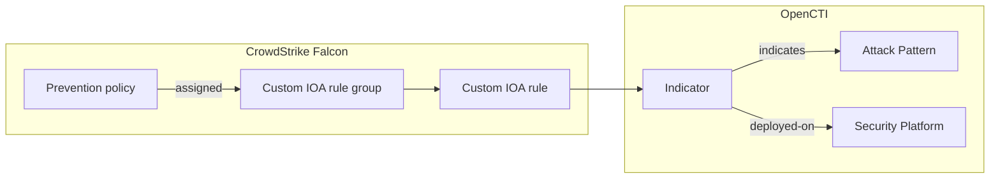

# OpenCTI CrowdStrike Falcon Custom IOA Rules Connector

| Status              | Date | Comment |
|---------------------|------|---------|
| Filigran Maintained | -    | -       |

Table of Contents

- [OpenCTI CrowdStrike Falcon Custom IOA Rules Connector](#opencti-crowdstrike-falcon-custom-ioa-rules-connector)
  - [Introduction](#introduction)
  - [Installation](#installation)
    - [Requirements](#requirements)
    - [API client scopes](#api-client-scopes)
  - [Configuration variables](#configuration-variables)
  - [Deployment](#deployment)
    - [Docker Deployment](#docker-deployment)
    - [Manual Deployment](#manual-deployment)
  - [Usage](#usage)
  - [Behavior](#behavior)
    - [Entity mapping](#entity-mapping)
    - [Indicator pattern](#indicator-pattern)
    - [Rule id](#rule-id)
    - [Deployment status and reconciliation](#deployment-status-and-reconciliation)
    - [ATT&CK techniques](#attck-techniques)
    - [The deployed-on relationship](#the-deployed-on-relationship)
  - [Debugging](#debugging)
  - [Additional information](#additional-information)

## Introduction

This connector imports the custom IOA (Indicator of Attack) rules deployed in a
[CrowdStrike Falcon](https://www.crowdstrike.com/platform/endpoint-security/) tenant into OpenCTI.
Each rule becomes an Indicator whose pattern is the rule logic, linked to the MITRE ATT&CK techniques
the rule detects and recorded as deployed on the CrowdStrike Falcon platform with its current status.

Together with the other deployed-rule importers (Microsoft Sentinel, Splunk, Elastic Security, Google
SecOps), it feeds the detection layer of the OpenCTI Threat-Informed Defense Matrix: for each technique
used by the threats you track, which rules exist, where they run, and whether they are enabled.

The connector is read-only on the CrowdStrike side: it only reads custom IOA rule groups and prevention
policies, and never creates, modifies, enables or disables a rule, a rule group or a policy.

## Installation

### Requirements

- OpenCTI Platform >= 7.261002.0 for the `deployed-on` relationship and the rule metadata properties.
  Older platforms are supported: deployments are then recorded as `related-to` relationships (see
  [The deployed-on relationship](#the-deployed-on-relationship)).
- `pycti==7.261002.0` and the connectors SDK (`src/requirements.txt`).
- Network access to the CrowdStrike API of your cloud (`api.crowdstrike.com`, `api.us-2.crowdstrike.com`,
  `api.eu-1.crowdstrike.com` or `api.laggar.gcw.crowdstrike.com`).

### API client scopes

Create an API client in the Falcon console (**Support and resources -> API clients and keys**) with the
following read-only scopes:

| Scope | Why |
|---|---|
| `Custom IOA rules: Read` | List the custom IOA rule groups and their rules. Required. |
| `Prevention policies: Read` | Tell which rule groups are assigned to an enabled prevention policy, i.e. actually run on hosts. Recommended: without it, the connector logs a warning and the deployment status only reflects whether rules and rule groups are enabled. |

The connector uses the OAuth 2.0 client credentials flow (`/oauth2/token`). For Flight Control (MSSP)
parent API clients, set `CROWDSTRIKE_IOA_RULES_MEMBER_CID` to read a child CID.

## Configuration variables

Find all the configuration variables available here: [Connector Configurations](./__metadata__/CONNECTOR_CONFIG_DOC.md)

_The `opencti` and `connector` options in the `docker-compose.yml` and `config.yml` are the same as for any other connector.
For more information regarding variables, please refer to [OpenCTI's documentation on connectors](https://docs.opencti.io/latest/deployment/connectors/)._

Connector-specific variables:

| Docker environment variable | `config.yml` key | Required | Default | Description |
|---|---|---|---|---|
| `CROWDSTRIKE_IOA_RULES_CLIENT_ID` | `crowdstrike_ioa_rules.client_id` | Yes | | API client id. |
| `CROWDSTRIKE_IOA_RULES_CLIENT_SECRET` | `crowdstrike_ioa_rules.client_secret` | Yes | | API client secret. |
| `CROWDSTRIKE_IOA_RULES_BASE_URL` | `crowdstrike_ioa_rules.base_url` | No | `https://api.crowdstrike.com` | API base URL of your cloud: `https://api.crowdstrike.com` (US-1), `https://api.us-2.crowdstrike.com` (US-2), `https://api.eu-1.crowdstrike.com` (EU-1), `https://api.laggar.gcw.crowdstrike.com` (US-GOV-1). |
| `CROWDSTRIKE_IOA_RULES_MEMBER_CID` | `crowdstrike_ioa_rules.member_cid` | No | | Child CID to read, for Flight Control (MSSP) parent API clients. |
| `CROWDSTRIKE_IOA_RULES_RULE_GROUP_FILTER` | `crowdstrike_ioa_rules.rule_group_filter` | No | | FQL filter on rule groups, e.g. `platform:'windows'` or `enabled:true`. Rules of groups left out by the filter count as removed. |
| `CROWDSTRIKE_IOA_RULES_CHECK_PREVENTION_POLICIES` | `crowdstrike_ioa_rules.check_prevention_policies` | No | `true` | Only count a rule as `active` when its rule group is assigned to an enabled prevention policy. |
| `CROWDSTRIKE_IOA_RULES_IMPORT_DISABLED_RULES` | `crowdstrike_ioa_rules.import_disabled_rules` | No | `true` | Import inactive rules with the status `deployed`. When `false`, they are left out (and count as removed). |
| `CROWDSTRIKE_IOA_RULES_PAGE_SIZE` | `crowdstrike_ioa_rules.page_size` | No | `100` | Rule group ids requested per page (1 to 500). |
| `CROWDSTRIKE_IOA_RULES_REQUEST_TIMEOUT` | `crowdstrike_ioa_rules.request_timeout` | No | `60` | Timeout of each HTTP request, in seconds. |
| `CROWDSTRIKE_IOA_RULES_MAX_RETRIES` | `crowdstrike_ioa_rules.max_retries` | No | `5` | Retries on 429, 5xx and network errors, with exponential backoff honoring `Retry-After` and `X-RateLimit-RetryAfter`. |
| `CROWDSTRIKE_IOA_RULES_PLATFORM_NAME` | `crowdstrike_ioa_rules.platform_name` | No | `CrowdStrike Falcon` | Name of the Security Platform in OpenCTI. Use one name per CID. |
| `CROWDSTRIKE_IOA_RULES_PLATFORM_ID` | `crowdstrike_ioa_rules.platform_id` | No | | Id (internal or STIX) of an existing Security Platform in OpenCTI, for example the one the CrowdStrike stream connector of the same tenant reports to. Takes precedence over the platform name and type: the rules are deployed on that platform, which the connector references and never rewrites. A run fails when the id is not a Security Platform. |
| `CROWDSTRIKE_IOA_RULES_PLATFORM_TYPE` | `crowdstrike_ioa_rules.platform_type` | No | `EDR` | `security_platform_type` of that platform: `SIEM`, `EDR`, `XDR`, `SOAR`, `NDR` or `ISPM`. |
| `CROWDSTRIKE_IOA_RULES_TLP_LEVEL` | `crowdstrike_ioa_rules.tlp_level` | No | `amber` | TLP marking of every imported object. |

The connector runs every `CONNECTOR_DURATION_PERIOD` (default `PT6H`); every run reads the full rule set.

## Deployment

### Docker Deployment

Build a Docker Image using the provided `Dockerfile`:

```shell
docker build . -t opencti/connector-crowdstrike-ioa-rules:latest
```

Set the environment variables in `docker-compose.yml` (at least `OPENCTI_URL`, `OPENCTI_TOKEN`,
`CONNECTOR_ID`, `CROWDSTRIKE_IOA_RULES_CLIENT_ID` and `CROWDSTRIKE_IOA_RULES_CLIENT_SECRET`), then:

```shell
docker compose up -d
```

### Manual Deployment

Create `config.yml` from `config.yml.sample` and fill in the `ChangeMe` values. Then, in a virtual
environment:

```shell
cd src
pip3 install -r requirements.txt
python3 main.py
```

`entrypoint.sh` starts the connector the same way from `/opt/opencti-connector-crowdstrike-ioa-rules`.

## Usage

The connector runs on its schedule. To trigger a run immediately, go to **Data management ->
Ingestion -> Connectors**, open the connector and reset its state: the next run happens right away and
re-reads every rule.

## Behavior



### Entity mapping

| Custom IOA rule (and its rule group) | OpenCTI |
|---|---|
| `ruletype_id`, `ruletype_name`, `disposition_id`, `action_label`, `field_values` | Indicator `pattern`, `pattern_type: crowdstrike-ioa` (see [Indicator pattern](#indicator-pattern)) |
| `name`, `description` | Indicator `name`, `description` |
| `created_on` (or `modified_on`) | Indicator `valid_from`, `deployed-on` `deployed_at` |
| `pattern_severity` (`informational`, `low`, `medium`, `high`, `critical`) | Indicator `x_opencti_rule_level` |
| Group `platform` (`windows`, `mac`, `linux`) | Indicator `x_mitre_platforms` (`windows`, `macos`, `linux`) and `x_opencti_rule_logsource.product` |
| `ruletype_name` (`Process Creation`, `File Creation`, `Network Connection`, `Domain Name`) | `x_opencti_rule_logsource.category` (`process_creation`, `file_event`, `network_connection`, `dns_query`) |
| Rule id `<rule group id>/<instance_id>` | External reference `external_id`, `deployed-on` `external_id` (see [Rule id](#rule-id)) |
| Technique ids in `name`, `description`, `comment` (or in the group `name` and `description`) | `indicates` relationships to Attack Patterns |
| Rule `enabled`, group `enabled`, group assigned to an enabled prevention policy | `deployed-on` `deployment_status`: `active` or `deployed` |

Every object carries the `CrowdStrike` author and the configured TLP marking. The Security Platform
identity (`identity_class: securityplatform`, `security_platform_type: EDR` by default) is named after
`CROWDSTRIKE_IOA_RULES_PLATFORM_NAME`. When `CROWDSTRIKE_IOA_RULES_PLATFORM_ID` designates an existing Security Platform, the deployments target that platform instead, which the bundles reference without carrying its identity. Deleted rules and rules of deleted groups are left out.

### Indicator pattern

Custom IOA rules have no query language: a rule is a rule type, an action and a set of field values
(regular expressions on the image file name, the command line, the domain name...). The Indicator
pattern is the canonical JSON of that logic (two-space indentation, sorted keys, field values sorted by
name; shown condensed here):

```json
{
  "action_label": "Kill Process",
  "disposition_id": 30,
  "field_values": [
    {"final_value": ".*-enc.*", "label": "Command Line", "name": "CommandLine", "type": "excludable", "values": [{"label": "include", "value": ".*-enc.*"}]},
    {"final_value": ".*\\\\powershell\\.exe", "label": "Image Filename", "name": "ImageFilename", "type": "excludable", "values": [{"label": "include", "value": ".*\\\\powershell\\.exe"}]}
  ],
  "ruletype_id": "1",
  "ruletype_name": "Process Creation"
}
```

Renaming a rule or editing its comment keeps the same Indicator; changing its logic (field values, rule
type or action) gives a new Indicator.

### Rule id

CrowdStrike numbers the rules of each rule group from `1` (`instance_id`), so every rule group has its
rule `1`. The connector therefore identifies each rule by `<rule group id>/<instance_id>`, for example
`0a1b2c3d4e5f60718293a4b5c6d7e8f9/1`. This id is the `external_id` of the external reference and of the
deployment, whether the deployment is current or `removed`, and it keys the connector state, so rules of
two groups never share a deployment id and a removal always names the rule that is gone.

### Deployment status and reconciliation

A custom IOA rule only runs on hosts when the rule is enabled, its rule group is enabled, and the group
is assigned to at least one enabled prevention policy. Such a rule gets the status `active`; any other
rule present in the tenant gets `deployed`. When the API client cannot read prevention policies, or with
`CROWDSTRIKE_IOA_RULES_CHECK_PREVENTION_POLICIES=false`, only the enabled state of rules and rule groups
counts.

Every run reads all the rule groups and sends, for each rule, its Indicator and its deployment with
`last_sync_at` set to the time of the run. The connector state keeps the Indicator of every rule imported
by the previous run (keyed by its rule id), so that:

- a rule deleted since the previous run gets the status `removed` and a `removed_at` time;
- a rule whose logic changed gets a new Indicator; the Indicator of the previous logic gets the status
  `removed`.

A removed rule whose Indicator was deleted from OpenCTI in the meantime is skipped. If OpenCTI cannot be
asked whether the Indicator still exists, the removal is retried on the next run.

### ATT&CK techniques

CrowdStrike has no structured ATT&CK mapping for custom IOA rules. The connector reads the technique ids
written in the rule name, description and comment: standalone uppercase ids (`T1059`, `T1059.001`) and
ATT&CK links (`https://attack.mitre.org/techniques/T1059/001/`). When the rule has none, the ids written in
the name and description of its rule group apply. Tactics create no relationship.

Each technique gives an `indicates` relationship from the rule Indicator to the Attack Pattern whose id is
derived from the MITRE id, which is the id of the technique imported by the MITRE ATT&CK connector. Once
per run, OpenCTI is asked which techniques it already holds: those are referenced as they are and never
renamed or re-attributed. A technique OpenCTI does not hold yet is created under its MITRE id; the MITRE
ATT&CK connector gives it its name when it imports it.

To map a rule, write its technique ids in its name (`Encoded PowerShell (T1059.001)`), description or
comment, or name the rule group after the technique it covers.

### The deployed-on relationship

The `deployed-on` relationship (Indicator -> Security Platform) and its `deployment_status`,
`external_id`, `deployed_at`, `last_sync_at` and `removed_at` properties are defined by the OpenCTI
dissemination assurance feature
([OpenCTI-Platform/opencti#18680](https://github.com/OpenCTI-Platform/opencti/issues/18680)). Once per
run, the connector checks the relationship schema of the platform (`schemaRelationsTypesMapping`). When
`deployed-on` is not defined between an Indicator and a Security Platform, it records each deployment as
a `related-to` relationship described as
`Deployed on <platform> (status: <status>, rule id: <rule group id>/<instance_id>)`
instead, and logs one warning per run.

## Debugging

Set `CONNECTOR_LOG_LEVEL=debug` for verbose logs. Each run logs the rule groups and rules read and how
many groups are assigned to a prevention policy, then a summary: rules read, active, disabled, removed,
techniques linked, rules left out per reason (`deleted`, `no_rule_id`, `disabled`, ...) and the
relationship used for deployments. Throttled (429), failing (5xx) and unreachable requests are logged
with the delay before the next attempt. An expired or revoked access token is renewed once.

## Additional information

- CrowdStrike API: custom IOA rule groups (`/ioarules/queries/rule-groups/v1`,
  `/ioarules/entities/rule-groups/v1`) and prevention policies (`/policy/combined/prevention/v1`). See
  the Falcon console API documentation or [FalconPy](https://www.falconpy.io/Service-Collections/Custom-IOA.html).
- One connector instance reads one CID; deploy one instance per CID (with distinct `CONNECTOR_ID` and
  `CROWDSTRIKE_IOA_RULES_PLATFORM_NAME` or `CROWDSTRIKE_IOA_RULES_PLATFORM_ID`).
- Switching from the platform name to a platform id (or between ids) moves the deployments: the
  previous platform gets every deployment marked `removed` and the new one gets the current ones.
  When OpenCTI cannot be asked about those removals, they are retried on the next runs while the new
  platform is reconciled normally from the first run on.
