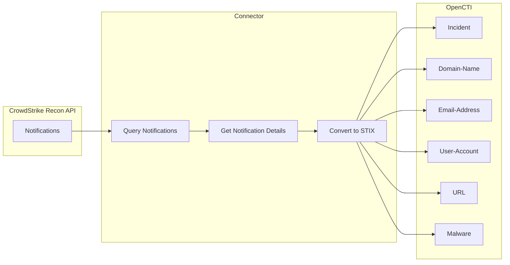

# OpenCTI CrowdStrike Recon Connector

| Status    | Date | Comment |
|-----------|------|---------|
| Community | -    | -       |

The OpenCTI CrowdStrike Recon connector imports alerts from the CrowdStrike Falcon **Recon / Exposure Monitoring** module into OpenCTI as **Incidents**. It monitors exposure notifications such as typosquatting domains, exposed credentials, dark web posts, and file leaks.

## Table of Contents

- [Introduction](#introduction)
- [Installation](#installation)
  - [Requirements](#requirements)
- [Configuration variables](#configuration-variables)
  - [OpenCTI environment variables](#opencti-environment-variables)
  - [Base connector environment variables](#base-connector-environment-variables)
  - [Connector extra parameters environment variables](#connector-extra-parameters-environment-variables)
- [Deployment](#deployment)
  - [Docker Deployment](#docker-deployment)
  - [Manual Deployment](#manual-deployment)
- [Usage](#usage)
- [Behavior](#behavior)
- [Debugging](#debugging)
- [Additional information](#additional-information)

## Introduction

CrowdStrike Falcon Recon (Exposure Monitoring) provides real-time notifications about external threats targeting your organization, including typosquatting domains, leaked credentials, dark web chatter, and exposed files.

This connector fetches those notifications via the CrowdStrike Recon API and converts them into OpenCTI Incidents with associated observables and relationships.

### Supported notification types

| Notification Type        | Description                                      |
|--------------------------|--------------------------------------------------|
| `typosquatting_domain`   | Domain names mimicking your brand                |
| `exposed_data`           | Leaked credentials and breach data               |
| `reply`                  | Dark web forum replies matching monitoring rules  |
| `post`                   | Dark web forum posts matching monitoring rules    |
| `file`                   | Leaked files matching monitoring rules            |

### STIX objects created

| OpenCTI Entity     | Source                                                     |
|--------------------|------------------------------------------------------------|
| Incident           | One per Recon notification, with severity and type         |
| Domain-Name        | Typosquatting domains (unicode + punycode), credential domains |
| Email-Address      | Exposed email addresses from breach data                   |
| User-Account       | Exposed login accounts from breach data                    |
| URL                | Credential URLs from breach data                           |
| Malware            | Malware families detected in breach items                  |
| Relationship       | `related-to` links between Incidents and observables       |

Each Incident also includes an attached Markdown file (`alert.md`) with the full alert details.

## Installation

### Requirements

- Python >= 3.11
- OpenCTI Platform >= 6.9.5
- [`pycti`](https://pypi.org/project/pycti/) library matching your OpenCTI version
- [`connectors-sdk`](https://github.com/OpenCTI-Platform/connectors.git@master#subdirectory=connectors-sdk) library matching your OpenCTI version
- CrowdStrike Falcon subscription with **Recon / Exposure Monitoring** module
- CrowdStrike API credentials (Client ID and Client Secret) with **Recon** read permissions

## Configuration variables

There are a number of configuration options, which are set either in `docker-compose.yml` (for Docker) or in `config.yml` (for manual deployment).

### OpenCTI environment variables

| Parameter     | config.yml | Docker environment variable | Mandatory | Description                                          |
|---------------|------------|-----------------------------|-----------|------------------------------------------------------|
| OpenCTI URL   | url        | `OPENCTI_URL`               | Yes       | The URL of the OpenCTI platform.                     |
| OpenCTI Token | token      | `OPENCTI_TOKEN`             | Yes       | The default admin token set in the OpenCTI platform. |

### Base connector environment variables

| Parameter       | config.yml      | Docker environment variable   | Default           | Mandatory | Description                                                                |
|-----------------|-----------------|-------------------------------|-------------------|-----------|----------------------------------------------------------------------------|
| Connector ID    | id              | `CONNECTOR_ID`                |                   | Yes       | A unique `UUIDv4` identifier for this connector instance.                  |
| Connector Type  | type            | `CONNECTOR_TYPE`              | EXTERNAL_IMPORT   | Yes       | Should always be set to `EXTERNAL_IMPORT` for this connector.              |
| Connector Name  | name            | `CONNECTOR_NAME`              | CrowdStrike Recon | No        | Name of the connector.                                                     |
| Connector Scope | scope           | `CONNECTOR_SCOPE`             |                   | Yes       | The scope or type of data the connector is importing.                      |
| Log Level       | log_level       | `CONNECTOR_LOG_LEVEL`         | error             | No        | Determines the verbosity of the logs: `debug`, `info`, `warn`, or `error`. |
| Duration Period | duration_period | `CONNECTOR_DURATION_PERIOD`   | PT1H              | No        | Time interval between connector runs in ISO 8601 format.                   |

### Connector extra parameters environment variables

| Parameter          | config.yml                      | Docker environment variable           | Default      | Mandatory | Description                                                                                                          |
|--------------------|---------------------------------|---------------------------------------|--------------|-----------|----------------------------------------------------------------------------------------------------------------------|
| API Base URL       | crowdstrike_recon.api_base_url  | `CROWDSTRIKE_RECON_API_BASE_URL`      |              | Yes       | CrowdStrike Falcon API base URL (e.g. `https://api.crowdstrike.com`).                                                |
| Client ID          | crowdstrike_recon.client_id     | `CROWDSTRIKE_RECON_CLIENT_ID`         |              | Yes       | CrowdStrike Falcon API Client ID.                                                                                    |
| Client Secret      | crowdstrike_recon.client_secret | `CROWDSTRIKE_RECON_CLIENT_SECRET`     |              | Yes       | CrowdStrike Falcon API Client Secret.                                                                                |
| TLP Level          | crowdstrike_recon.tlp_level     | `CROWDSTRIKE_RECON_TLP_LEVEL`         | amber+strict | No        | TLP marking for imported data. Values: `clear`, `white`, `green`, `amber`, `amber+strict`, `red`.                    |
| Import Start Date  | crowdstrike_recon.import_start_date | `CROWDSTRIKE_RECON_IMPORT_START_DATE` | P10D     | No        | ISO 8601 duration specifying how far back to import alerts on first run (e.g. `P1D` for 1 day, `P30D` for 30 days). |
| Filter Topic       | crowdstrike_recon.filter_topic  | `CROWDSTRIKE_RECON_FILTER_TOPIC`      |              | No        | Comma-separated topic name(s) to filter notifications (e.g. `SA_BRAND,SA_THIRD_PARTY_V2`). Empty = no filtering.     |
| Filter Type        | crowdstrike_recon.filter_type   | `CROWDSTRIKE_RECON_FILTER_TYPE`       |              | No        | Comma-separated notification type(s) to filter (e.g. `typosquatting_domain,exposed_data`). Empty = no filtering.     |
| Filter Priority    | crowdstrike_recon.filter_priority | `CROWDSTRIKE_RECON_FILTER_PRIORITY` |              | No        | Comma-separated priority(ies) to filter (e.g. `high,medium`). Empty = no filtering.                                  |

## Deployment

### Docker Deployment

Build the Docker image:

```bash
docker build -t opencti/connector-crowdstrike-recon:latest .
```

Configure the connector in `docker-compose.yml`:

```yaml
services:
  connector-crowdstrike-recon:
    image: opencti/connector-crowdstrike-recon:latest
    environment:
      - OPENCTI_URL=http://localhost
      - OPENCTI_TOKEN=ChangeMe
      - CONNECTOR_ID=ChangeMe
      - CONNECTOR_NAME=CrowdStrike Recon
      - CONNECTOR_SCOPE=crowdstrike-recon
      - CONNECTOR_LOG_LEVEL=error
      - CONNECTOR_DURATION_PERIOD=PT1H
      - CROWDSTRIKE_RECON_API_BASE_URL=https://api.crowdstrike.com
      - CROWDSTRIKE_RECON_CLIENT_ID=ChangeMe
      - CROWDSTRIKE_RECON_CLIENT_SECRET=ChangeMe
      - CROWDSTRIKE_RECON_TLP_LEVEL=amber+strict
      - CROWDSTRIKE_RECON_IMPORT_START_DATE=P10D
      #- CROWDSTRIKE_RECON_FILTER_TOPIC=SA_BRAND,SA_THIRD_PARTY_V2
      #- CROWDSTRIKE_RECON_FILTER_TYPE=typosquatting_domain,exposed_data
      #- CROWDSTRIKE_RECON_FILTER_PRIORITY=high,medium
    restart: always
```

Start the connector:

```bash
docker compose up -d
```

### Manual Deployment

1. Create a file `config.yml` based on the provided `config.yml.sample`.

2. Install the required Python dependencies (preferably in a virtual environment):

```bash
cd src
pip3 install -r requirements.txt
```

3. Start the connector from the `src` directory:

```bash
python3 main.py
```

## Usage

After installation, the connector runs automatically at the interval defined by `CONNECTOR_DURATION_PERIOD` (default: every hour).

To force an immediate run, navigate to **Data management → Ingestion → Connectors** in the OpenCTI platform. Find the connector and click the refresh button to reset the connector's state and trigger a new import.

## Behavior

### Data Flow



### State Management

The connector persists its state between runs using OpenCTI's connector state mechanism:

- **`last_alert_date`**: The `created_date` of the most recently ingested notification. On subsequent runs, only notifications newer than this date are fetched.
- **`last_run`**: Timestamp of the last successful connector run.

On first run (no existing state), the connector imports alerts from `now - IMPORT_START_DATE` (default: 10 days back).

### FQL Filtering

The connector builds CrowdStrike FQL (Falcon Query Language) filter strings from the configured filter parameters. Filters are combined with AND logic. For example, with `filter_topic=SA_BRAND` and `filter_priority=high,medium`, the FQL filter would be:

```
topic:['SA_BRAND']+priority:['high','medium']+created_date:>'2026-05-01T00:00:00Z'
```

### Incident Details

Each Incident created in OpenCTI includes:

- **Name**: `{rule_name} : {title}` (title derived from notification content)
- **Description**: Alert metadata summary (Markdown)
- **Attached file**: `alert.md` — Full Markdown report with detailed information per notification type
- **Severity**: Mapped from CrowdStrike `rule_priority`
- **Incident type**: The CrowdStrike notification `item_type` (e.g. `typosquatting_domain`, `exposed_data`, `post`)

## Debugging

The connector can be debugged by setting the appropriate log level:

```env
CONNECTOR_LOG_LEVEL=debug
```

Log output includes:

- FQL filter construction
- Number of notifications retrieved per run
- STIX bundle creation and sending progress
- State updates with `last_alert_date`

## Additional information

- **API Regions**: Use the appropriate base URL for your CrowdStrike region (US-1: `https://api.crowdstrike.com`, US-2: `https://api.us-2.crowdstrike.com`, EU-1: `https://api.eu-1.crowdstrike.com`)
- **TLP Marking**: Default is `amber+strict` reflecting CrowdStrike's data sensitivity
- **Unsupported Types**: Notification types not yet handled by the connector are skipped with a warning log
- **Subscription Required**: Active CrowdStrike Falcon subscription with Recon / Exposure Monitoring module required
