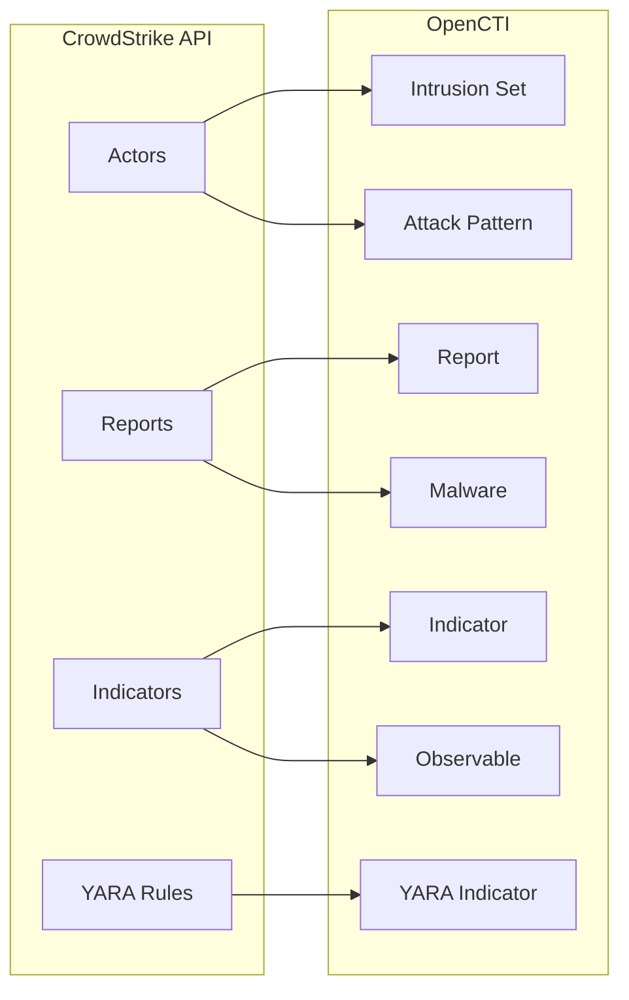

# OpenCTI CrowdStrike Connector

| Status | Date | Comment |
|--------|------|---------|
| Filigran Verified | -    | -       |

The OpenCTI CrowdStrike connector can be used to import knowledge from the CrowdStrike
Falcon platform. The connector leverages the Intel APIs to get information about
CrowdStrike's intelligence, including data about actors, indicators, reports, malware,
and YARA rules.

The CrowdStrike connector imports threat intelligence from CrowdStrike Falcon Intelligence into OpenCTI, including actors, reports, indicators, and detection rules.

## Table of Contents

- [OpenCTI CrowdStrike Connector](#opencti-crowdstrike-connector)
  - [Table of Contents](#table-of-contents)
  - [Introduction](#introduction)
  - [Installation](#installation)
    - [Requirements](#requirements)
  - [Configuration variables](#configuration-variables)
    - [OpenCTI environment variables](#opencti-environment-variables)
    - [Base connector environment variables](#base-connector-environment-variables)
    - [Connector extra parameters environment variables](#connector-extra-parameters-environment-variables)
  - [Deployment](#deployment)
    - [Docker Deployment](#docker-deployment)
    - [Manual Deployment](#manual-deployment)
  - [Usage](#usage)
  - [Behavior](#behavior)
  - [Debugging](#debugging)
  - [Additional information](#additional-information)

## Introduction

CrowdStrike Falcon Intelligence provides comprehensive threat intelligence including threat actor profiles, intelligence reports, indicators of compromise, and detection rules (YARA/Snort/Suricata).

This connector supports importing multiple data types:
- **Actors**: Threat actor profiles and TTPs
- **Reports**: Intelligence reports and analysis
- **Indicators**: IOCs with confidence scoring
- **YARA Master**: YARA detection rules
- **Snort/Suricata Master**: Network detection rules

## Installation

### Requirements

- OpenCTI Platform >= 6.x
- CrowdStrike Falcon Intelligence subscription
- CrowdStrike API credentials (Client ID and Secret)

## Configuration variables

There are a number of configuration options, which are set either in `docker-compose.yml` (for Docker) or in `config.yml` (for manual deployment).

### OpenCTI environment variables

| Parameter     | config.yml | Docker environment variable | Mandatory | Description                                          |
|---------------|------------|-----------------------------|-----------|------------------------------------------------------|
| OpenCTI URL   | url        | `OPENCTI_URL`               | Yes       | The URL of the OpenCTI platform.                     |
| OpenCTI Token | token      | `OPENCTI_TOKEN`             | Yes       | The default admin token set in the OpenCTI platform. |

### Base connector environment variables

| Parameter         | config.yml      | Docker environment variable   | Default      | Mandatory | Description                                                                 |
|-------------------|-----------------|-------------------------------|--------------|-----------|-----------------------------------------------------------------------------|
| Connector ID      | id              | `CONNECTOR_ID`                |              | Yes       | A unique `UUIDv4` identifier for this connector instance.                   |
| Connector Name    | name            | `CONNECTOR_NAME`              | CrowdStrike  | No        | Name of the connector.                                                      |
| Connector Scope   | scope           | `CONNECTOR_SCOPE`             | crowdstrike  | No        | The scope or type of data the connector is importing.                       |
| Log Level         | log_level       | `CONNECTOR_LOG_LEVEL`         | error        | No        | Determines the verbosity of the logs: `debug`, `info`, `warn`, or `error`.  |
| Duration Period   | duration_period | `CONNECTOR_DURATION_PERIOD`   | PT30M        | No        | Time interval between connector runs in ISO 8601 format.                    |

### Connector extra parameters environment variables

| Parameter                   | config.yml                              | Docker environment variable                  | Default                                              | Mandatory | Description                                                                      |
|-----------------------------|-----------------------------------------|----------------------------------------------|------------------------------------------------------|-----------|----------------------------------------------------------------------------------|
| Base URL                    | crowdstrike.base_url                    | `CROWDSTRIKE_BASE_URL`                       | https://api.crowdstrike.com                          | No        | CrowdStrike API base URL.                                                        |
| Client ID                   | crowdstrike.client_id                   | `CROWDSTRIKE_CLIENT_ID`                      |                                                      | Yes       | CrowdStrike API Client ID.                                                       |
| Client Secret               | crowdstrike.client_secret               | `CROWDSTRIKE_CLIENT_SECRET`                  |                                                      | Yes       | CrowdStrike API Client Secret.                                                   |
| TLP                         | crowdstrike.tlp                         | `CROWDSTRIKE_TLP`                            | amber+strict                                         | No        | TLP marking for imported data.                                                   |
| Create Observables          | crowdstrike.create_observables          | `CROWDSTRIKE_CREATE_OBSERVABLES`             | true                                                 | No        | Create observables from indicators.                                              |
| Create Indicators           | crowdstrike.create_indicators           | `CROWDSTRIKE_CREATE_INDICATORS`              | true                                                 | No        | Create indicators.                                                               |
| Scopes                      | crowdstrike.scopes                      | `CROWDSTRIKE_SCOPES`                         | actor,report,indicator,yara_master                   | No        | Comma-separated list of data types to import.                                    |
| MITRE ATT&CK Version        | crowdstrike.attack_version              | `CROWDSTRIKE_ATTACK_VERSION`                 | 17.1                                                | No        | MITRE ATT&CK Enterprise version used to resolve label-derived ATT&CK techniques to canonical MITRE IDs. Should match the version imported by the MITRE ATT&CK external import connector. |
| MITRE ATT&CK Enterprise URL | crowdstrike.attack_enterprise_url       | `CROWDSTRIKE_ATTACK_ENTERPRISE_URL`          |                                                      | No        | Optional override URL for the MITRE ATT&CK Enterprise STIX dataset. If set, this URL is used instead of constructing one from the ATT&CK version (useful for air-gapped or mirrored environments). |
| Actor Start Timestamp       | crowdstrike.actor_start_timestamp       | `CROWDSTRIKE_ACTOR_START_TIMESTAMP`          | (30 days ago)                                        | No        | Unix timestamp. Empty = 30 days ago. 0 = ALL actors.                             |
| Vulnerability Start Timestamp | crowdstrike.vulnerability_start_timestamp | `CROWDSTRIKE_VULNERABILITY_START_TIMESTAMP` | 30 days ago                   | No        | `0`                                                                  | The Vulnerabilities updated after this timestamp will be imported. Timestamp in UNIX Epoch time, UTC. Default is 30 days ago. |
| Malware Start Timestamp     | crowdstrike.malware_start_timestamp     | `CROWDSTRIKE_MALWARE_START_TIMESTAMP`        | (30 days ago)                                        | No        | Unix timestamp. Empty = 30 days ago. 0 = ALL malware.                             |
| Report Start Timestamp      | crowdstrike.report_start_timestamp      | `CROWDSTRIKE_REPORT_START_TIMESTAMP`         | (30 days ago)                                        | No        | Unix timestamp. Empty = 30 days ago. 0 = ALL reports.                            |
| Report Status               | crowdstrike.report_status               | `CROWDSTRIKE_REPORT_STATUS`                  | New                                                  | No        | Status for imported reports.                                                     |
| Report Include Types        | crowdstrike.report_include_types        | `CROWDSTRIKE_REPORT_INCLUDE_TYPES`           | notice,tipper,intelligence report,periodic report    | No        | Comma-separated report types to include.                                         |
| Report Type                 | crowdstrike.report_type                 | `CROWDSTRIKE_REPORT_TYPE`                    | threat-report                                        | No        | OpenCTI report type.                                                             |
| Report Target Industries    | crowdstrike.report_target_industries    | `CROWDSTRIKE_REPORT_TARGET_INDUSTRIES`       |                                                      | No        | Filter reports by target industry.                                               |
| Report Guess Malware        | crowdstrike.report_guess_malware        | `CROWDSTRIKE_REPORT_GUESS_MALWARE`           | false                                                | No        | Use report tags to guess malware.                                                |
| Report Guess Relations      | crowdstrike.report_guess_relations      | `CROWDSTRIKE_REPORT_GUESS_RELATIONS`         | false                                                | No        | Auto-create relationships between entities.                                      |
| Indicator Start Timestamp   | crowdstrike.indicator_start_timestamp   | `CROWDSTRIKE_INDICATOR_START_TIMESTAMP`      | (30 days ago)                                        | No        | Unix timestamp. Empty = 30 days ago. 0 = ALL indicators.                         |
| Indicator Exclude Types     | crowdstrike.indicator_exclude_types     | `CROWDSTRIKE_INDICATOR_EXCLUDE_TYPES`        | hash_ion,hash_md5,hash_sha1,password,username        | No        | Comma-separated indicator types to exclude.                                      |
| Default Score               | crowdstrike.default_x_opencti_score     | `CROWDSTRIKE_DEFAULT_X_OPENCTI_SCORE`        | 50                                                   | No        | Default x_opencti_score for indicators.                                          |
| Low Score                   | crowdstrike.indicator_low_score         | `CROWDSTRIKE_INDICATOR_LOW_SCORE`            | 40                                                   | No        | Score for low confidence indicators.                                             |
| Low Score Labels            | crowdstrike.indicator_low_score_labels  | `CROWDSTRIKE_INDICATOR_LOW_SCORE_LABELS`     | MaliciousConfidence/Low                              | No        | Labels that trigger low score.                                                   |
| Medium Score                | crowdstrike.indicator_medium_score      | `CROWDSTRIKE_INDICATOR_MEDIUM_SCORE`         | 60                                                   | No        | Score for medium confidence indicators.                                          |
| Medium Score Labels         | crowdstrike.indicator_medium_score_labels | `CROWDSTRIKE_INDICATOR_MEDIUM_SCORE_LABELS` | MaliciousConfidence/Medium                          | No        | Labels that trigger medium score.                                                |
| High Score                  | crowdstrike.indicator_high_score        | `CROWDSTRIKE_INDICATOR_HIGH_SCORE`           | 80                                                   | No        | Score for high confidence indicators.                                            |
| High Score Labels           | crowdstrike.indicator_high_score_labels | `CROWDSTRIKE_INDICATOR_HIGH_SCORE_LABELS`    | MaliciousConfidence/High                             | No        | Labels that trigger high score.                                                  |
| Unwanted Labels             | crowdstrike.indicator_unwanted_labels   | `CROWDSTRIKE_INDICATOR_UNWANTED_LABELS`      |                                                      | No        | Filter out indicators with these labels.                                         |
| No File Trigger Import      | crowdstrike.no_file_trigger_import      | `CROWDSTRIKE_NO_FILE_TRIGGER_IMPORT`         | true                                                 | No        | Import indicator updates without file triggers.                                  |

**Note**: It is not recommended to use the default value `0` for configuration parameters `report_start_timestamp`, `indicator_start_timestamp`, and `malware_start_timestamp` because of the large data volumes.

## Deployment

### Docker Deployment

Build the Docker image:

```bash
docker build -t opencti/connector-crowdstrike:latest .
```

Configure the connector in `docker-compose.yml`:

```yaml
  connector-crowdstrike:
    image: opencti/connector-crowdstrike:latest
    environment:
      - OPENCTI_URL=http://localhost
      - OPENCTI_TOKEN=ChangeMe
      - CONNECTOR_ID=ChangeMe
      - CONNECTOR_NAME=CrowdStrike
      - CONNECTOR_SCOPE=crowdstrike
      - CONNECTOR_LOG_LEVEL=error
      - CONNECTOR_DURATION_PERIOD=PT30M
      - CROWDSTRIKE_BASE_URL=https://api.crowdstrike.com
      - CROWDSTRIKE_CLIENT_ID=ChangeMe
      - CROWDSTRIKE_CLIENT_SECRET=ChangeMe
      - CROWDSTRIKE_TLP=amber+strict
      - CROWDSTRIKE_CREATE_OBSERVABLES=true
      - CROWDSTRIKE_CREATE_INDICATORS=true
      - CROWDSTRIKE_SCOPES=actor,report,indicator,yara_master
      - CROWDSTRIKE_REPORT_STATUS=New
      # MITRE ATT&CK Enterprise lookup (used for resolving ATT&CK labels to canonical techniques)
      - CROWDSTRIKE_ATTACK_VERSION=17.1
      # Optional override for air-gapped or mirrored environments
      #- CROWDSTRIKE_ATTACK_ENTERPRISE_URL=https://raw.githubusercontent.com/mitre-attack/attack-stix-data/refs/heads/master/enterprise-attack/enterprise-attack-17.1.json
      - CROWDSTRIKE_REPORT_INCLUDE_TYPES=notice,tipper,intelligence report,periodic report
      - CROWDSTRIKE_REPORT_TYPE=threat-report
      - CROWDSTRIKE_INDICATOR_EXCLUDE_TYPES=hash_ion,hash_md5,hash_sha1,password,username
      - CROWDSTRIKE_DEFAULT_X_OPENCTI_SCORE=50
    restart: always
```

Start the connector:

```bash
docker compose up -d
```

### Manual Deployment

1. Create `config.yml` based on `config.yml.sample`.

2. Install dependencies:

```bash
pip3 install -r requirements.txt
```

3. Start the connector from the `src` directory:

```bash
python3 main.py
```

## Usage

The connector runs automatically at the interval defined by `CONNECTOR_DURATION_PERIOD`. To force an immediate run:

**Data Management → Ingestion → Connectors**

Find the connector and click the refresh button to reset the state and trigger a new sync.

## Behavior

The connector imports threat intelligence from CrowdStrike Falcon Intelligence API.

### MITRE ATT&CK Label Resolution

CrowdStrike indicators may include ATT&CK-related labels (e.g. `MitreATTCK/DefenseEvasion/ProcessInjection`).

When ATT&CK lookup is enabled, the connector:
- Loads the MITRE ATT&CK Enterprise STIX dataset once at startup
- Resolves label-derived ATT&CK technique names to canonical MITRE technique IDs (e.g. `T1055`)
- Creates Attack Pattern relationships using deterministic STIX IDs that match the MITRE ATT&CK external import connector (source of truth)

If ATT&CK labels are present but a technique cannot be resolved, the connector will skip Attack Pattern creation to avoid creating duplicate or non-canonical objects.

### Data Flow



### Supported Scopes

| Scope         | Data Imported                                      |
|---------------|---------------------------------------------------|
| actor         | Threat actors as Intrusion Sets with TTPs         |
| report        | Intelligence reports with related entities        |
| indicator     | IOCs (IPs, domains, hashes, URLs, etc.)           |
| yara_master   | YARA detection rules                              |
| snort_master  | Snort/Suricata network detection rules            |

### Entity Mapping

| CrowdStrike Data     | OpenCTI Entity      | Description                                      |
|----------------------|---------------------|--------------------------------------------------|
| Actor                | Intrusion Set       | Threat actor with aliases, TTPs, targets         |
| Report               | Report              | Intelligence report with object references       |
| Indicator (IP)       | IPv4-Addr/IPv6-Addr | IP address observables                           |
| Indicator (Domain)   | Domain-Name         | Domain observables                               |
| Indicator (Hash)     | File                | File hash observables                            |
| Indicator (URL)      | URL                 | URL observables                                  |
| YARA Rule            | Indicator (YARA)    | YARA pattern indicators                          |
| Snort Rule           | Indicator (Snort)   | Snort/Suricata pattern indicators                |

### Confidence Scoring

Indicators are scored based on CrowdStrike's MaliciousConfidence labels:

| Label                    | Default Score |
|--------------------------|---------------|
| MaliciousConfidence/Low  | 40            |
| MaliciousConfidence/Medium | 60          |
| MaliciousConfidence/High | 80            |

## Debugging

Enable verbose logging:

```env
CONNECTOR_LOG_LEVEL=debug
```

Log output includes:
- API authentication status
- Entity processing progress
- Bundle creation and sending

## Additional information

- **API Regions**: Use appropriate base URL for your CrowdStrike region
- **Start Timestamps**: Setting to 0 imports ALL historical data (use with caution)
- **Excluded Types**: Consider excluding weak hash types (MD5, SHA1) to reduce noise
- **TLP Marking**: Default is `amber+strict` reflecting CrowdStrike's data sensitivity
- **Subscription Required**: Active CrowdStrike Falcon Intelligence subscription required

## Known Issues and Workarounds

- **Large Historical Imports**: Use start timestamps to limit initial data volume
- **Rate Limits**: CrowdStrike API has rate limits; connector handles them automatically
- **Missing Actors/Reports**: Ensure your API credentials have appropriate permissions
