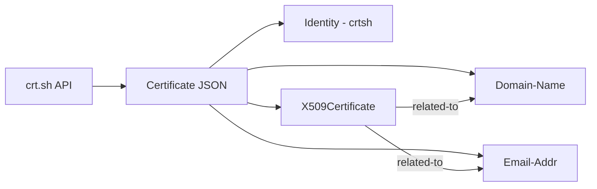

# Certificate Search (crt.sh) External Import Connector

| Status    | Date | Comment |
|-----------|------|---------|
| Community | -    | -       |

## Table of Contents

- [Introduction](#introduction)
- [Installation](#installation)
  - [Requirements](#requirements)
- [Configuration](#configuration)
  - [Configuration Variables](#configuration-variables)
- [Deployment](#deployment)
  - [Docker Deployment](#docker-deployment)
  - [Manual Deployment](#manual-deployment)
- [Behavior](#behavior)
  - [Data Flow](#data-flow)
  - [Entity Mapping](#entity-mapping)
- [Debugging](#debugging)
- [Additional Information](#additional-information)

---

## Introduction

This connector integrates [crt.sh](https://crt.sh/) (Certificate Transparency Search) data with the OpenCTI platform. crt.sh is a certificate transparency log search engine that allows users to search for SSL/TLS certificates issued for specific domains. This connector enables automated discovery and tracking of certificates issued for monitored domains, helping security teams identify potentially unauthorized or suspicious certificates.

The connector fetches certificate data for a specified domain, extracts related domains and email addresses from certificate Subject Alternative Names (SANs), and creates STIX 2.1 objects with appropriate relationships.

---

## Installation

### Requirements

- OpenCTI Platform version 5.11.13 or higher
- A domain to monitor for certificate issuance

---

## Configuration

### Configuration Variables

#### OpenCTI Parameters

| Parameter | Docker envvar | Mandatory | Description |
|-----------|---------------|-----------|-------------|
| OpenCTI URL | `OPENCTI_URL` | Yes | The URL of the OpenCTI platform |
| OpenCTI Token | `OPENCTI_TOKEN` | Yes | The default admin token configured in the OpenCTI platform |

#### Base Connector Parameters

| Parameter | Docker envvar | Mandatory | Description |
|-----------|---------------|-----------|-------------|
| Connector ID | `CONNECTOR_ID` | Yes | A unique `UUIDv4` for this connector |
| Connector Name | `CONNECTOR_NAME` | Yes | Name displayed in OpenCTI (e.g., `crtsh`) |
| Connector Scope | `CONNECTOR_SCOPE` | Yes | Supported scope (e.g., `stix2`) |
| Log Level | `CONNECTOR_LOG_LEVEL` | Yes | Log level: `debug`, `info`, `warn`, or `error` |
| Run Every | `CONNECTOR_RUN_EVERY` | Yes | Polling interval (e.g., `30s`, `1h`, `1d`) |
| Update Existing Data | `CONNECTOR_UPDATE_EXISTING_DATA` | No | Whether to update existing data |

#### Connector Extra Parameters

| Parameter | Docker envvar | Mandatory | Description |
|-----------|---------------|-----------|-------------|
| Domain | `CRTSH_DOMAIN` | Yes | Domain to search for (e.g., `google.com`) |
| Labels | `CRTSH_LABELS` | Yes | Comma-separated list of labels (e.g., `crtsh,osint`) |
| TLP Marking | `CRTSH_MARKING_REFS` | Yes | TLP marking level: `TLP:WHITE`, `TLP:GREEN`, `TLP:AMBER`, `TLP:RED` |
| Filter Expired | `CRTSH_IS_EXPIRED` | Yes | Exclude expired certificates: `true` or `false` |
| Wildcard Search | `CRTSH_IS_WILDCARD` | Yes | Apply wildcard to domain search: `true` or `false` |

---

## Deployment

### Docker Deployment

Use the following `docker-compose.yml`:

```yaml
services:
  connector-crtsh:
    image: opencti/connector-crtsh:latest
    environment:
      - OPENCTI_URL=http://opencti:8080
      - OPENCTI_TOKEN=${OPENCTI_ADMIN_TOKEN}
      - CONNECTOR_ID=${CONNECTOR_CRTSH_ID}
      - CONNECTOR_NAME=crtsh
      - CONNECTOR_SCOPE=stix2
      - CONNECTOR_LOG_LEVEL=info
      - CONNECTOR_RUN_EVERY=1d
      - CONNECTOR_UPDATE_EXISTING_DATA=false
      - CRTSH_DOMAIN=example.com
      - CRTSH_LABELS=crtsh,certificate-transparency
      - CRTSH_MARKING_REFS=TLP:WHITE
      - CRTSH_IS_EXPIRED=false
      - CRTSH_IS_WILDCARD=true
    restart: always
    depends_on:
      - opencti
```

### Manual Deployment

1. Clone the repository and navigate to the connector directory
2. Install dependencies: `pip install -r requirements.txt`
3. Configure `config.yml` or set environment variables
4. Run: `python main.py`

---

## Behavior

### Data Flow



### Entity Mapping

| crt.sh Data | OpenCTI Entity | Notes |
|-------------|----------------|-------|
| Certificate | X509Certificate | Includes issuer, subject, serial number, validity dates, and X.509 v3 extensions (SANs) |
| Common Name / SAN Domain | Domain-Name | Extracted from `common_name` and `name_value` fields |
| SAN Email | Email-Addr | Email addresses found in certificate SANs |
| - | Relationship | `related-to` relationships between certificates and domains/emails |

### Processing Details

1. **API Request**: Queries `https://crt.sh/?q={domain}&output=json`
   - Wildcard mode prepends `%.` to domain for broader matches
   - Expired certificates can be filtered with `exclude=expired` parameter

2. **Certificate Processing**:
   - Creates `X509Certificate` observable with:
     - `issuer`: Certificate issuer name
     - `subject`: Certificate subject (Common Name)
     - `serial_number`: Unique certificate serial
     - `validity_not_before` / `validity_not_after`: Validity period
     - `x509_v3_extensions`: Subject Alternative Names (SANs)
     - Custom labels and TLP marking

3. **Domain/Email Extraction**:
   - Parses `common_name` field for domain names
   - Parses `name_value` field (SANs) for additional domains and emails
   - Validates domains and emails before creating observables
   - Strips wildcard prefix (`*.`) from domain names

4. **Relationship Creation**:
   - Creates `related-to` relationships between:
     - X509Certificate → Domain-Name
     - X509Certificate → Email-Addr

5. **Author Identity**: All objects reference a "crtsh" organization identity as creator

---

## Debugging

Enable debug logging by setting `CONNECTOR_LOG_LEVEL=debug`. Common issues:

- **Invalid domain**: Ensure `CRTSH_DOMAIN` is a valid domain format
- **No results**: Domain may have no certificates logged in Certificate Transparency logs
- **Rate limiting**: crt.sh may rate limit requests; increase `CONNECTOR_RUN_EVERY` interval

---

## Additional Information

### Use Cases

- **Certificate Discovery**: Monitor domains for newly issued certificates
- **Phishing Detection**: Discover certificates for lookalike domains
- **Shadow IT**: Identify unauthorized certificates for corporate domains
- **Compliance**: Track certificate issuance for auditing purposes

### API Reference

crt.sh Query Format:
```
https://crt.sh/?q={domain}&output=json
```

### Limitations

- Rate limiting may apply during high-frequency queries
- Historical data availability depends on Certificate Transparency log coverage
- Only certificates logged to CT logs are discoverable