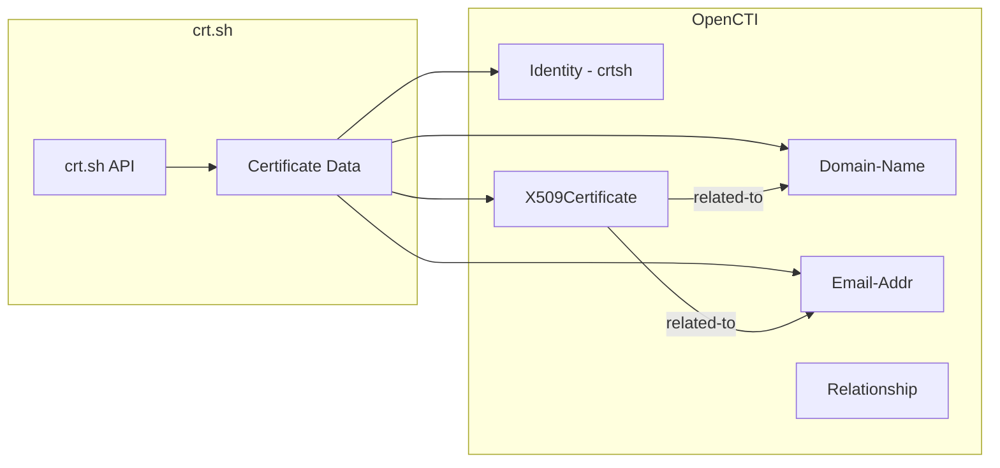

# OpenCTI Certificate Search (crt.sh) Connector

The crt.sh connector imports certificate transparency data from crt.sh into OpenCTI, enabling automated discovery and tracking of SSL/TLS certificates issued for monitored domains.

| Status    | Date | Comment |
|-----------|------|---------|
| Community | -    | -       |

## Table of Contents

- [OpenCTI Certificate Search (crt.sh) Connector](#opencti-certificate-search-crtsh-connector)
  - [Table of Contents](#table-of-contents)
  - [Introduction](#introduction)
  - [Installation](#installation)
    - [Requirements](#requirements)
  - [Configuration variables](#configuration-variables)
    - [OpenCTI environment variables](#opencti-environment-variables)
    - [Base connector environment variables](#base-connector-environment-variables)
    - [Connector extra parameters environment variables](#connector-extra-parameters-environment-variables)
  - [Deployment](#deployment)
    - [Docker Deployment](#docker-deployment)
    - [Manual Deployment](#manual-deployment)
  - [Usage](#usage)
  - [Behavior](#behavior)
  - [Debugging](#debugging)
  - [Additional information](#additional-information)

## Introduction

[crt.sh](https://crt.sh/) is a certificate transparency log search engine that allows users to search for SSL/TLS certificates issued for specific domains. Certificate Transparency (CT) is a framework for monitoring and auditing the issuance of TLS certificates.

This connector fetches certificate data for a specified domain, extracts related domains and email addresses from certificate Subject Alternative Names (SANs), and creates STIX 2.1 objects with appropriate relationships. This helps security teams identify potentially unauthorized or suspicious certificates.

## Installation

### Requirements

- OpenCTI Platform >= 5.11.13
- A domain to monitor for certificate issuance

## Configuration variables

There are a number of configuration options, which are set either in `docker-compose.yml` (for Docker) or in `config.yml` (for manual deployment).

### OpenCTI environment variables

| Parameter     | config.yml | Docker environment variable | Mandatory | Description                                          |
|---------------|------------|-----------------------------|-----------|------------------------------------------------------|
| OpenCTI URL   | url        | `OPENCTI_URL`               | Yes       | The URL of the OpenCTI platform.                     |
| OpenCTI Token | token      | `OPENCTI_TOKEN`             | Yes       | The default admin token set in the OpenCTI platform. |

### Base connector environment variables

| Parameter            | config.yml           | Docker environment variable      | Default | Mandatory | Description                                                              |
|----------------------|----------------------|----------------------------------|---------|-----------|--------------------------------------------------------------------------|
| Connector ID         | id                   | `CONNECTOR_ID`                   |         | Yes       | A unique `UUIDv4` identifier for this connector instance.                |
| Connector Name       | name                 | `CONNECTOR_NAME`                 | crtsh   | Yes       | Name of the connector.                                                   |
| Connector Scope      | scope                | `CONNECTOR_SCOPE`                | stix2   | Yes       | The scope or type of data the connector is importing.                    |
| Log Level            | log_level            | `CONNECTOR_LOG_LEVEL`            | info    | No        | Determines the verbosity of logs: `debug`, `info`, `warn`, or `error`.   |
| Run Every            | run_every            | `CONNECTOR_RUN_EVERY`            |         | Yes       | Polling interval (e.g., `30s`, `1h`, `1d`).                              |
| Update Existing Data | update_existing_data | `CONNECTOR_UPDATE_EXISTING_DATA` | false   | No        | Whether to update existing data in OpenCTI.                              |

### Connector extra parameters environment variables

| Parameter       | config.yml       | Docker environment variable | Default    | Mandatory | Description                                                    |
|-----------------|------------------|-----------------------------|------------|-----------|----------------------------------------------------------------|
| Domain          | crtsh.domain     | `CRTSH_DOMAIN`              |            | Yes       | Domain to search for certificates (e.g., `google.com`).        |
| Labels          | crtsh.labels     | `CRTSH_LABELS`              |            | Yes       | Comma-separated list of labels (e.g., `crtsh,osint`).          |
| TLP Marking     | crtsh.marking    | `CRTSH_MARKING_REFS`        |            | Yes       | TLP marking level: `TLP:WHITE`, `TLP:GREEN`, `TLP:AMBER`, `TLP:RED`. |
| Filter Expired  | crtsh.is_expired | `CRTSH_IS_EXPIRED`          | false      | Yes       | Exclude expired certificates: `true` or `false`.               |
| Wildcard Search | crtsh.is_wildcard| `CRTSH_IS_WILDCARD`         | false      | Yes       | Apply wildcard to domain search: `true` or `false`.            |

## Deployment

### Docker Deployment

Build the Docker image:

```bash
docker build -t opencti/connector-crtsh:latest .
```

Configure the connector in `docker-compose.yml`:

```yaml
  connector-crtsh:
    image: opencti/connector-crtsh:latest
    environment:
      - OPENCTI_URL=http://localhost
      - OPENCTI_TOKEN=ChangeMe
      - CONNECTOR_ID=ChangeMe
      - CONNECTOR_NAME=crtsh
      - CONNECTOR_SCOPE=stix2
      - CONNECTOR_LOG_LEVEL=info
      - CONNECTOR_RUN_EVERY=1d
      - CONNECTOR_UPDATE_EXISTING_DATA=false
      - CRTSH_DOMAIN=example.com
      - CRTSH_LABELS=crtsh,certificate-transparency
      - CRTSH_MARKING_REFS=TLP:WHITE
      - CRTSH_IS_EXPIRED=false
      - CRTSH_IS_WILDCARD=true
    restart: always
```

Start the connector:

```bash
docker compose up -d
```

### Manual Deployment

1. Create `config.yml` based on `config.yml.sample`.

2. Install dependencies:

```bash
pip3 install -r requirements.txt
```

3. Start the connector:

```bash
python3 main.py
```

## Usage

The connector runs automatically at the interval defined by `CONNECTOR_RUN_EVERY`. To force an immediate run:

**Data Management → Ingestion → Connectors**

Find the connector and click the refresh button to reset the state and trigger a new data fetch.

## Behavior

The connector fetches certificate data from crt.sh and creates STIX 2.1 objects for certificates, domains, and email addresses.

### Data Flow



### Entity Mapping

| crt.sh Data                  | OpenCTI Entity      | Description                                                  |
|------------------------------|---------------------|--------------------------------------------------------------|
| Certificate                  | X509Certificate     | Includes issuer, subject, serial number, validity dates, SANs |
| Common Name / SAN Domain     | Domain-Name         | Extracted from `common_name` and `name_value` fields          |
| SAN Email                    | Email-Addr          | Email addresses found in certificate SANs                     |
| -                            | Relationship        | `related-to` relationships between certificates and domains/emails |

### Processing Details

1. **API Request**: Queries `https://crt.sh/?q={domain}&output=json`
   - Wildcard mode prepends `%.` to domain for broader matches
   - Expired certificates can be filtered with `exclude=expired` parameter

2. **Certificate Processing**:
   - Creates `X509Certificate` observable with:
     - `issuer`: Certificate issuer name
     - `subject`: Certificate subject (Common Name)
     - `serial_number`: Unique certificate serial
     - `validity_not_before` / `validity_not_after`: Validity period
     - `x509_v3_extensions`: Subject Alternative Names (SANs)
     - Custom labels and TLP marking

3. **Domain/Email Extraction**:
   - Parses `common_name` field for domain names
   - Parses `name_value` field (SANs) for additional domains and emails
   - Validates domains and emails before creating observables
   - Strips wildcard prefix (`*.`) from domain names

4. **Relationship Creation**:
   - Creates `related-to` relationships between:
     - X509Certificate → Domain-Name
     - X509Certificate → Email-Addr

5. **Author Identity**: All objects reference a "crtsh" organization identity as creator

## Debugging

Enable verbose logging:

```env
CONNECTOR_LOG_LEVEL=debug
```

Common issues:
- **Invalid domain**: Ensure `CRTSH_DOMAIN` is a valid domain format
- **No results**: Domain may have no certificates logged in Certificate Transparency logs
- **Rate limiting**: crt.sh may rate limit requests; increase `CONNECTOR_RUN_EVERY` interval

## Additional information

### Use Cases

| Use Case              | Description                                            |
|-----------------------|--------------------------------------------------------|
| Certificate Discovery | Monitor domains for newly issued certificates          |
| Phishing Detection    | Discover certificates for lookalike domains            |
| Shadow IT             | Identify unauthorized certificates for corporate domains |
| Compliance            | Track certificate issuance for auditing purposes       |

### API Reference

crt.sh Query Format:
```
https://crt.sh/?q={domain}&output=json
```

### Limitations

- Rate limiting may apply during high-frequency queries
- Historical data availability depends on Certificate Transparency log coverage
- Only certificates logged to CT logs are discoverable
