# CTM360 CyberBlindSpot — OpenCTI Connector

An OpenCTI **EXTERNAL_IMPORT** connector that ingests Digital Risk Protection (DRP)
findings from the [CTM360 CyberBlindSpot](https://cbs.ctm360.com) platform
into OpenCTI as structured STIX 2.1 objects.

CyberBlindSpot monitors the open, deep, and dark web to surface threats targeting
your brand, credentials, payment cards, and domains. This connector pulls those
findings on a configurable schedule and creates the corresponding STIX objects,
relationships, and indicators in your OpenCTI knowledge graph.

**Connector type**: EXTERNAL_IMPORT
**OpenCTI compatibility**: >= 7.x (tested on 7.260604.0)

---

## STIX Entity Mapping



---

## Data Categories

The connector imports five data categories from the CyberBlindSpot API:

### Incidents

Security incidents such as phishing, brand impersonation, fraud, and leaked
credentials detected by CTM360 analysts.

| Object | Description |
|--------|-------------|
| `CaseIncident` | The primary incident record (created via OpenCTI API, not in the STIX bundle) |
| `Identity` | Organization identity included in the STIX bundle |

### Malware Logs

Malware activity logs capturing compromised endpoints, credentials exfiltrated
by infostealer families.

| STIX Object | Description |
|-------------|-------------|
| `Malware` | Malware family (e.g. RedLine, Raccoon) |
| `IPv4-Addr` | IP address of the compromised host |
| `Domain-Name` | Domain exfiltrated from the infected host |
| `Email-Addr` | Email address found in the malware log |
| `Relationship` | `uses` relationships linking the malware family to each observed IP, domain, and email |

### Breached Credentials

Credentials exposed in data breaches collected from third-party breach sources.

| STIX Object | Description |
|-------------|-------------|
| `User-Account` | User account derived from the breach record |
| `Email-Addr` | Email address in the breach record |
| `Domain-Name` | Domain associated with the breached account |
| `Note` | Contextual note with breach details |

### Card Leaks

Payment card data exposed on underground marketplaces or paste sites.

| STIX Object | Description |
|-------------|-------------|
| `Note` | Card leak record (card metadata, bank name, leak date) |

### Domain Protection

Domain monitoring findings such as typosquatting, lookalike domains, and
unauthorized domain registrations targeting your brand.

| STIX Object | Description |
|-------------|-------------|
| `Indicator` | Suspicious domain indicator with risk score |
| `Domain-Name` | The suspicious domain name |
| `IPv4-Addr` | IP address to which the suspicious domain resolves |

---

## Requirements

| Dependency       | Version                        |
|------------------|--------------------------------|
| OpenCTI Platform | >= 7.x (tested on 7.260604.0)  |
| pycti            | == 7.260604.0                  |
| connectors-sdk   | master (from OpenCTI repo)     |
| stix2            | == 3.0.1                       |
| requests         | == 2.32.3                      |
| Python           | 3.12 (Alpine Docker image)     |

A valid CTM360 CyberBlindSpot API key is required. Obtain it from your
CyberBlindSpot console.

Docker and Docker Compose are required for the recommended deployment.

---

## Installation

### 1. Clone or copy the connector directory

```bash
git clone <repository-url>
cd ctm360-cyberblindspot-feed
```

### 2. Create a `.env` file

Create a `.env` file in the connector directory with the required secrets:

```env
# OpenCTI connection
OPENCTI_URL=http://opencti:8080
OPENCTI_TOKEN=your-opencti-admin-token

# Connector identity (generate a random UUID)
CONNECTOR_ID=xxxxxxxx-xxxx-xxxx-xxxx-xxxxxxxxxxxx

# CTM360 CyberBlindSpot credentials
CTM360_CBS_API_KEY=your-cyberblindspot-api-key
```

### 3. Add the connector to your OpenCTI Docker Compose stack

Copy the service definition from `docker-compose.yml` into your existing
OpenCTI `docker-compose.yml`, or run the connector standalone alongside
a running OpenCTI instance.

The sample service does not declare a `depends_on` condition so it stays
portable when OpenCTI runs elsewhere (a separate stack or an external host).
If you add it to the same Compose file as OpenCTI, start the connector after
the platform is up and reachable.

### 4. Start the connector

```bash
docker compose up -d connector-ctm360-cyberblindspot
```

---

## Environment Variables

### OpenCTI Platform Variables

| Variable | Description | Default | Required |
|----------|-------------|---------|----------|
| `OPENCTI_URL` | URL of the OpenCTI platform API | — | Yes |
| `OPENCTI_TOKEN` | OpenCTI administrator API token | — | Yes |

### Connector Framework Variables

| Variable | Description | Default | Required |
|----------|-------------|---------|----------|
| `CONNECTOR_ID` | Unique UUID for this connector instance | — | Yes |
| `CONNECTOR_NAME` | Display name shown in the OpenCTI UI | `CTM360-CyberBlindSpot` | No |
| `CONNECTOR_SCOPE` | Connector scope identifier (the provided `docker-compose.yml` sets it to `CTM360-CyberBlindSpot`) | — | Yes |
| `CONNECTOR_TYPE` | Connector type (must be `EXTERNAL_IMPORT`) | `EXTERNAL_IMPORT` | No |
| `CONNECTOR_LOG_LEVEL` | Log verbosity: `debug`, `info`, `warn`, `error` | `error` | No |
| `CONNECTOR_DURATION_PERIOD` | ISO 8601 duration required by the SDK base config (the provided `docker-compose.yml` sets it to `PT24H`; runtime scheduling actually uses `CTM360_CBS_IMPORT_INTERVAL`) | — | Yes |

### CTM360 CyberBlindSpot Variables

| Variable | Description | Default | Required |
|----------|-------------|---------|----------|
| `CTM360_CBS_API_KEY` | API key for CyberBlindSpot authentication | — | Yes |
| `CTM360_CBS_API_BASE_URL` | CyberBlindSpot API base URL | `https://cbs.ctm360.com` | No |
| `CTM360_CBS_IMPORT_INTERVAL` | Interval in seconds between imports | `86400` (24h) | No |
| `CTM360_CBS_IMPORT_INCIDENTS` | Enable importing incidents | `true` | No |
| `CTM360_CBS_IMPORT_MALWARE_LOGS` | Enable importing malware logs | `true` | No |
| `CTM360_CBS_IMPORT_BREACHED_CREDENTIALS` | Enable importing breached credentials | `true` | No |
| `CTM360_CBS_IMPORT_CARD_LEAKS` | Enable importing card leaks | `true` | No |
| `CTM360_CBS_IMPORT_DOMAIN_PROTECTION` | Enable importing domain protection findings | `true` | No |
| `CTM360_CBS_ENABLE_STATUS_TRACKING` | Enable background polling for incident status changes | `true` | No |
| `CTM360_CBS_STATUS_POLL_INTERVAL` | Interval in seconds between status polling cycles | `3600` (1h) | No |

---

## Usage

### Start the connector

```bash
docker compose up -d connector-ctm360-cyberblindspot
```

### View logs

```bash
docker compose logs -f connector-ctm360-cyberblindspot
```

### Stop the connector

```bash
docker compose stop connector-ctm360-cyberblindspot
```

### Trigger a manual import

The connector runs automatically at the configured interval. To trigger an
immediate import, restart the container:

```bash
docker compose restart connector-ctm360-cyberblindspot
```

### Disable a data category

Set the corresponding `CTM360_CBS_IMPORT_*` variable to `false`. For example,
to disable card leak imports:

```env
CTM360_CBS_IMPORT_CARD_LEAKS=false
```

---

## Architecture Overview

The connector is structured as a Python package using the `connectors-sdk`
framework with Pydantic-validated settings.

```
src/
├── connector/
│   ├── connector.py          # Orchestration: import loop, Work API, state management
│   ├── converter_to_stix.py  # STIX factory: all 5 categories → STIX 2.1 objects
│   ├── settings.py           # Pydantic configuration models
│   └── utils.py              # Shared utilities: timestamp handling, ID generation
└── ctm360_cbs_client/
    └── api_client.py         # HTTP client: retries, rate limiting, all 5 endpoints
```

### Import cycle

On each timer tick, the connector:

1. Reads the `last_run` timestamp from OpenCTI state.
2. Calls each enabled CyberBlindSpot endpoint with `date_from=last_run`.
3. Converts each API response to STIX 2.1 objects via the converter module.
4. Sends the accumulated bundle to OpenCTI in a single `send_stix2_bundle` call.
5. Marks the work as processed and saves `last_run = now` to OpenCTI state.

### Error handling

The connector uses a **partial import** strategy. If one data category fails
(e.g. a transient API error), the connector logs the error and continues
fetching the remaining categories. The state timestamp is advanced only if at
least one category succeeds. If all categories fail, the work is marked as
errored and the state is not updated, causing the next run to retry the same
time window.

### Rate limiting

On HTTP 429 (Too Many Requests), the client honours the `Retry-After` response
header when it is present and expressed as a number of seconds; if the header is
missing or non-numeric (e.g. an HTTP-date), it falls back to a linear backoff
(`retry_delay × attempt`). Transient server errors (any HTTP 5xx, e.g. 500,
502, 503, 504) are retried with the same linear backoff, up to 3 attempts
before failing.

---

## Troubleshooting

### Connector does not appear in OpenCTI

- Verify `OPENCTI_URL` is reachable from the connector container.
- Verify `OPENCTI_TOKEN` is a valid administrator token.
- Verify `CONNECTOR_ID` is a well-formed UUID (e.g. generate one with
  `python3 -c "import uuid; print(uuid.uuid4())"`).
- Check the container logs: `docker compose logs connector-ctm360-cyberblindspot`.

### Authentication error (HTTP 401 / 403)

- Verify `CTM360_CBS_API_KEY` is set correctly.
- Confirm the API key is active in the CyberBlindSpot console.
- Check that `CTM360_CBS_API_BASE_URL` has not been changed inadvertently.

### No objects imported after the first run

- The first run fetches data from 24 hours prior. If no new findings exist in
  that window, no objects are created. This is expected behaviour.
- To import a longer historical window, clear the connector state in the OpenCTI
  UI (Data > Ingestion > Connectors > CTM360-CyberBlindSpot > Reset state) and
  restart the container.

### Import stops after one category

- Check the logs for HTTP errors against specific endpoints.
- Verify your API key has access to all five data categories in CyberBlindSpot.
- Per-category fetch failures (partial imports) are logged at `ERROR` level,
  and the import-cycle summary notes how many categories failed; a full-cycle
  failure (every category failed) is also logged at `ERROR` level.

### High memory usage

- The connector is configured with a 512 MB memory limit (`mem_limit: 512m`).
- If large data volumes (> 10,000 records per category) cause memory pressure,
  reduce `CTM360_CBS_IMPORT_INTERVAL` to import more frequently in smaller
  batches.

### Debug logging

Set `CONNECTOR_LOG_LEVEL=debug` to enable verbose output from the HTTP client,
including request URLs, response codes, and rate limit headers.
