# CTM360 CYNA Feed — OpenCTI Connector

An OpenCTI **EXTERNAL_IMPORT** connector that ingests cybersecurity news and alerts
from the [CTM360 CYNA (Cyber News & Alerts)](https://cyna.ctm360.com) platform and
converts them into STIX 2.1 objects for import into OpenCTI.

Version: 1.0.0

---

## STIX Entity Mapping



---

## Overview

CTM360 CYNA is an aggregated cybersecurity news feed that collects and categorises
threat intelligence news from across the internet. This connector polls the CYNA API
on a configurable schedule, extracts CVE references, classifies content by threat
category, and pushes STIX bundles into OpenCTI.

---

## Key Features

- **Cursor-based pagination** — iterates through the full CYNA news feed using the
  `searchAfter` cursor token; configurable page size and safety page limit.
- **CVE extraction** — scans each news item's title and description with a regex
  pattern to detect CVE identifiers (e.g. `CVE-2024-12345`) and creates deduplicated
  STIX Vulnerability objects for every unique CVE found in a batch.
- **Keyword-based label classification** — assigns one or more labels to each Report
  based on content keywords: `cve`, `ransomware`, `ddos`, `data-leak`, `threat-actor`,
  `advisory`, `phishing`, `malware`, `zero-day`. All items receive the base label
  `cyna`.
- **Incremental imports** — persists a `last_run` timestamp in connector state so that
  subsequent import cycles only process news items published after the previous run.
- **Startup connectivity check** — the connector pings the CYNA API at launch and
  exits with code 1 immediately if authentication fails or the API is unreachable.
- **Retry with linear backoff** — HTTP 429 (rate limit), 5xx server errors,
  connection errors, and timeouts are all retried up to three times with linearly
  increasing delays (5s, 10s, 15s). HTTP 429 honours the `Retry-After` header when
  present.
- **Total failure guard** — raises an error and marks the work item as failed if all
  news items in a cycle fail STIX conversion rather than silently importing nothing.

---

## STIX Objects Created

| STIX Type        | Description                                                                 |
|------------------|-----------------------------------------------------------------------------|
| `Identity`       | Single author identity: "CTM360 CYNA" (organization). Created once per bundle. |
| `Report`         | One Report per news item. Name prefixed with `[CYNA]`. Report type: `threat-report`. Marked `TLP:WHITE`. |
| `Vulnerability`  | One per unique CVE ID found across all items in a cycle. Deduplicated globally within the batch. NVD URL included as an external reference. |
| `Relationship`   | `related-to` relationship from each Report to each Vulnerability referenced in that item. |

All objects are marked `TLP:WHITE` and attributed to the CTM360 CYNA identity.

---

## Requirements

| Dependency          | Version                        |
|---------------------|--------------------------------|
| OpenCTI Platform    | >= 7.x                         |
| pycti               | 7.260529.0                     |
| connectors-sdk      | master (from OpenCTI repo)     |
| stix2               | == 3.0.1                       |
| requests            | == 2.32.3                      |
| Python              | 3.12 (Alpine Docker image)     |

A valid CTM360 CYNA API key is required. Contact CTM360 to obtain one.

---

## Installation

### Docker (recommended)

1. Clone or copy this connector directory.

2. Create a `.env` file (or export environment variables) with the required secrets:

   ```env
   OPENCTI_ADMIN_TOKEN=your-opencti-token
   CONNECTOR_CTM360_CYNA_ID=a-unique-uuid-v4
   CTM360_CYNA_API_KEY=your-ctm360-api-key
   ```

3. Add the connector service to your existing OpenCTI `docker-compose.yml`, or run it
   standalone against an already-running OpenCTI instance:

   ```bash
   docker compose up -d connector-ctm360-cyna
   ```

4. Verify the connector appears as **Active** in OpenCTI under
   **Data > Ingestion > Connectors**.

### Build the image manually

```bash
docker build -t ctm360-cyna-feed:1.0.0 .
```

---

## Environment Variables

All variables are required unless a default is listed.

### OpenCTI connection

| Variable          | Description                                      | Default  |
|-------------------|--------------------------------------------------|----------|
| `OPENCTI_URL`     | URL of the OpenCTI platform (including port).    | —        |
| `OPENCTI_TOKEN`   | OpenCTI API token (admin or dedicated user).     | —        |

### Connector identity

| Variable                    | Description                                              | Default           |
|-----------------------------|----------------------------------------------------------|-------------------|
| `CONNECTOR_ID`              | Unique UUIDv4 for this connector instance.               | —                 |
| `CONNECTOR_NAME`            | Display name in OpenCTI.                                 | `CTM360-CYNA`     |
| `CONNECTOR_SCOPE`           | Connector scope label (required; the provided samples use `ctm360-cyna`). | —    |
| `CONNECTOR_TYPE`            | Must be `EXTERNAL_IMPORT`.                               | `EXTERNAL_IMPORT` |
| `CONNECTOR_LOG_LEVEL`       | Logging verbosity: `debug`, `info`, `warning`, `error` (the provided samples set `info`). | `error`           |
| `CONNECTOR_DURATION_PERIOD` | ISO 8601 duration required by the SDK base config (the provided samples set `PT24H`); runtime scheduling actually uses `CTM360_CYNA_IMPORT_INTERVAL`. | —             |

### CTM360 CYNA settings

| Variable                    | Description                                                             | Default                      |
|-----------------------------|-------------------------------------------------------------------------|------------------------------|
| `CTM360_CYNA_API_BASE_URL`  | CYNA API base URL.                                                      | `https://cyna.ctm360.com`    |
| `CTM360_CYNA_API_KEY`       | API key for CYNA authentication. **Required.**                          | —                            |
| `CTM360_CYNA_IMPORT_INTERVAL` | Seconds between import cycles (used by the connector's internal loop). | `86400` (24 hours)           |
| `CTM360_CYNA_PAGE_SIZE`     | Number of news items fetched per API page.                              | `25`                         |
| `CTM360_CYNA_MAX_PAGES`     | Maximum pages to fetch per import cycle (safety cap).                   | `100`                        |

---

## Usage

Once the connector is running it will:

1. Perform a startup ping against `GET /api/v1/news?size=1` to confirm the API key
   is valid.
2. Begin the first import cycle immediately.
3. Fetch all available news pages up to `CTM360_CYNA_MAX_PAGES`, using the
   `searchAfter` cursor from each response to advance to the next page.
4. Filter fetched items to those published after the previous `last_run` timestamp
   (skipped on the very first run).
5. Convert each news item to a STIX Report; extract CVEs; create Vulnerability
   objects and `related-to` relationships.
6. Send the STIX 2.1 bundle to OpenCTI via `send_stix2_bundle`.
7. Persist `last_run` in connector state.
8. Sleep for `CTM360_CYNA_IMPORT_INTERVAL` seconds before the next cycle.

Import progress is visible in OpenCTI under **Data > Ingestion > Connectors** by
clicking the connector and reviewing its work queue.

---

## Architecture

```
┌──────────────────────────────────────────────────────────────┐
│                    CTM360CynaConnector                        │
│  run()                                                        │
│   ├─ startup ping (exit 1 on failure)                        │
│   └─ loop: _import_data()                                     │
│       ├─ read state (last_run)                               │
│       ├─ CTM360CynaClient.get_all_news()                     │
│       │   └─ GET /api/v1/news?size=N&searchAfter=<cursor>    │
│       │       (retry + backoff on 429 / 5xx / timeout)       │
│       ├─ client-side time filter (published_date > last_run) │
│       ├─ ConverterToStix.news_to_stix()                      │
│       │   ├─ Identity (author, once)                         │
│       │   ├─ per item: Report + labels + ext refs            │
│       │   ├─ CVE regex → Vulnerability (deduplicated)        │
│       │   └─ Relationship: Report --related-to--> Vuln       │
│       ├─ send_stix2_bundle → OpenCTI                         │
│       └─ set_state (last_run = now)                          │
└──────────────────────────────────────────────────────────────┘
```

### Module layout

```
ctm360-cyna-feed/
├── Dockerfile
├── docker-compose.yml
├── entrypoint.sh
├── VERSION
└── src/
    ├── requirements.txt
    ├── main.py
    ├── connector/
    │   ├── connector.py          # Main connector class and import loop
    │   ├── converter_to_stix.py  # STIX conversion logic
    │   ├── settings.py           # Pydantic settings / env var definitions
    │   └── utils.py              # CVE regex, timestamp helpers, deterministic IDs
    └── ctm360_cyna_client/
        └── api_client.py         # HTTP client, pagination, retry logic
```

---

## Troubleshooting

**Connector exits immediately at startup**

The startup ping failed. Check:
- `CTM360_CYNA_API_KEY` is set and correct.
- `CTM360_CYNA_API_BASE_URL` is reachable from the Docker network.
- The container has outbound internet access to `cyna.ctm360.com`.

**No new data imported despite news being available**

The `last_run` state filter may be excluding items. To force a full re-import,
clear the connector state in OpenCTI (Settings > Connectors > Reset state) or
delete and recreate the connector.

**Import cycle fails with "All N news items failed STIX conversion"**

Every item in the batch raised an exception during STIX conversion. Enable
`CONNECTOR_LOG_LEVEL=debug` to see per-item error details. Common causes: unexpected
API response structure or missing required fields in the `metadata` sub-object.

**Rate limiting (HTTP 429)**

The client honours the `Retry-After` response header and will wait the instructed
number of seconds before retrying. Reduce `CTM360_CYNA_PAGE_SIZE` or
`CTM360_CYNA_MAX_PAGES` if sustained rate limiting is observed.

**Connector shows as disconnected in OpenCTI**

Verify `OPENCTI_URL` and `OPENCTI_TOKEN` are correct and that the connector container
can reach the OpenCTI platform on the configured port. Check Docker network membership
if running inside a Compose stack.
