# CTM360 HackerView — OpenCTI Connector

An OpenCTI **External Import** connector that pulls External Attack Surface Management
(EASM) data from the [CTM360 HackerView](https://hackerview.ctm360.com) platform and
converts it into STIX 2.1 objects for ingestion into OpenCTI.

## STIX Entity Mapping



## Overview

CTM360 HackerView continuously monitors an organisation's internet-facing attack surface,
discovering exposed assets and identifying security issues such as misconfigurations,
CVEs, open ports, and certificate anomalies. This connector bridges HackerView with
OpenCTI by fetching that data on a configurable schedule and creating a structured,
correlated STIX graph.

### Data Categories

| Category | Description |
|---|---|
| **Issues** | Active security findings on attack-surface assets (CVEs, misconfigurations, exposed services) |
| **Resolved Issues** | Historical findings that have been remediated in HackerView |
| **Domain Assets** | Genuine domain names attributed to the monitored organisation |
| **Host Assets** | Hostnames (subdomains, virtual hosts) attributed to the organisation |
| **IP Assets** | IPv4 and IPv6 addresses attributed to the organisation |

Each category can be enabled or disabled independently via environment variables.

### STIX Objects Created

| STIX Type | Source | Notes |
|---|---|---|
| `identity` (organization) | All | The `HackerView` author identity attached to every object |
| `identity` (system) | Issues, Domain / Host / IP Assets | One System per affected asset (host, domain, IP) — assets are modelled as System identities, not observables |
| `vulnerability` | Issues / Resolved Issues | Created when a CVE identifier is present; score derived from severity |
| `note` | Issues / Resolved Issues | Full issue detail (category, severity, impact, technologies, status) |
| `attack-pattern` | Issues | One per CWE identifier on the issue |
| `software` | Issues | One per detected technology |
| `case-incident` | Issues | One `CustomObjectCaseIncident` per issue, shipped in the bundle with a deterministic id (`CaseIncident.generate_id`) and referencing the issue's vulnerability/system/note/attack-pattern/software |
| `relationship` | Issues | `has` (system → vulnerability), `related-to` (vulnerability → attack-pattern, system → software) |

All objects are attributed to the `CTM360 HackerView` Identity and carry an
`x_opencti_score` mapped from HackerView severity:

| HackerView Severity | OpenCTI Score |
|---|---|
| critical | 95 |
| high | 80 |
| medium | 55 |
| low | 30 |
| info / informational | 10 |

Resolved issues have their score reduced by 20 points.

## Requirements

| Dependency       | Version                        |
|------------------|--------------------------------|
| OpenCTI Platform | >= 7.x (tested on 7.260529.0)  |
| pycti            | == 7.260529.0                  |
| connectors-sdk   | master (from OpenCTI repo)     |
| stix2            | == 3.0.1                       |
| requests         | == 2.32.3                      |
| Python           | 3.12 (Alpine Docker image)     |

A valid CTM360 HackerView API key is required.

Docker and Docker Compose are required for the recommended deployment.

## Installation

### 1. Clone or copy the connector directory

```
ctm360-hackerview-feed/
```

### 2. Configure environment variables

Copy the relevant variables from the table below into your `.env` file or directly
into the `docker-compose.yml` environment section. At minimum you must supply:

- `OPENCTI_URL`
- `OPENCTI_TOKEN`
- `CONNECTOR_ID` (a unique UUID for this connector instance)
- `CTM360_HACKERVIEW_FEED_API_KEY`

### 3. Add to your OpenCTI Docker Compose stack

Append the connector service to your existing `docker-compose.yml`, or run it
standalone while pointing `OPENCTI_URL` at your running platform:

```yaml
services:
  connector-ctm360-hackerview-feed:
    image: opencti/connector-ctm360-hackerview:latest
    environment:
      - OPENCTI_URL=http://opencti:8080
      - OPENCTI_TOKEN=${OPENCTI_ADMIN_TOKEN}
      - CONNECTOR_ID=${CONNECTOR_CTM360_HACKERVIEW_FEED_ID}
      - CONNECTOR_NAME=CTM360-HackerView
      - CONNECTOR_SCOPE=CTM360-HackerView
      - CONNECTOR_TYPE=EXTERNAL_IMPORT
      - CONNECTOR_LOG_LEVEL=info
      - CONNECTOR_DURATION_PERIOD=PT24H
      - CTM360_HACKERVIEW_FEED_API_BASE_URL=https://hackerview.ctm360.com
      - CTM360_HACKERVIEW_FEED_API_KEY=${CTM360_HACKERVIEW_FEED_API_KEY}
      - CTM360_HACKERVIEW_FEED_IMPORT_ISSUES=true
      - CTM360_HACKERVIEW_FEED_IMPORT_RESOLVED_ISSUES=true
      - CTM360_HACKERVIEW_FEED_IMPORT_DOMAIN_ASSETS=true
      - CTM360_HACKERVIEW_FEED_IMPORT_HOST_ASSETS=true
      - CTM360_HACKERVIEW_FEED_IMPORT_IP_ASSETS=true
      - CTM360_HACKERVIEW_FEED_ENABLE_STATUS_TRACKING=true
      - CTM360_HACKERVIEW_FEED_STATUS_POLL_INTERVAL=PT1H
    restart: always
```

### 4. Start the connector

```bash
docker compose up -d connector-ctm360-hackerview-feed
```

## Environment Variables

### OpenCTI Connection

| Variable | Description | Default | Required |
|---|---|---|---|
| `OPENCTI_URL` | Base URL of the OpenCTI platform | — | Yes |
| `OPENCTI_TOKEN` | OpenCTI API token (admin or dedicated connector token) | — | Yes |

### Connector Identity

| Variable | Description | Default | Required |
|---|---|---|---|
| `CONNECTOR_ID` | Unique UUID for this connector instance | — | Yes |
| `CONNECTOR_NAME` | Display name shown in OpenCTI | `CTM360-HackerView` | No |
| `CONNECTOR_SCOPE` | Connector scope label | `CTM360-HackerView` | No |
| `CONNECTOR_TYPE` | Connector type (must not be changed) | `EXTERNAL_IMPORT` | No |
| `CONNECTOR_LOG_LEVEL` | Logging verbosity: `debug`, `info`, `warning`, `error` | `info` | No |
| `CONNECTOR_DURATION_PERIOD` | ISO 8601 duration for the platform-level run schedule | `PT24H` | No |

### CTM360 HackerView API

| Variable | Description | Default | Required |
|---|---|---|---|
| `CTM360_HACKERVIEW_FEED_API_BASE_URL` | HackerView API base URL | `https://hackerview.ctm360.com` | No |
| `CTM360_HACKERVIEW_FEED_API_KEY` | API key for HackerView authentication | — | Yes |

> The import cadence is controlled by the standard `CONNECTOR_DURATION_PERIOD` (there is no separate import-interval variable).

### Data Category Toggles

| Variable | Description | Default | Required |
|---|---|---|---|
| `CTM360_HACKERVIEW_FEED_IMPORT_ISSUES` | Import active security issues | `true` | No |
| `CTM360_HACKERVIEW_FEED_IMPORT_RESOLVED_ISSUES` | Import resolved (remediated) issues | `true` | No |
| `CTM360_HACKERVIEW_FEED_IMPORT_DOMAIN_ASSETS` | Import genuine domain assets | `true` | No |
| `CTM360_HACKERVIEW_FEED_IMPORT_HOST_ASSETS` | Import hostname assets | `true` | No |
| `CTM360_HACKERVIEW_FEED_IMPORT_IP_ASSETS` | Import IP address assets | `true` | No |

### Status Tracking

| Variable | Description | Default | Required |
|---|---|---|---|
| `CTM360_HACKERVIEW_FEED_ENABLE_STATUS_TRACKING` | Enable background polling of issue status changes | `true` | No |
| `CTM360_HACKERVIEW_FEED_STATUS_POLL_INTERVAL` | ISO-8601 duration between status polling cycles | `PT1H` | No |

## Usage

Once started, the connector will:

1. Schedule itself via the platform-level `CONNECTOR_DURATION_PERIOD` (pycti's
   `schedule_process`).
2. At the start of each run, perform a connectivity check against the HackerView API
   (`/api/v2/issues`). If the ping fails, the run is skipped and retried on the next
   scheduled cycle (the connector process is not killed).
3. Import all enabled categories and send a single STIX bundle.
4. Store the timestamp of each successful run in the OpenCTI connector state.
5. On subsequent runs, pass the stored timestamp as a `first_seen` filter when
   fetching issues so that only new findings are retrieved. Asset endpoints are
   fetched in full each cycle.

If some but not all categories fail during a cycle, the connector still sends the
partial bundle and records which categories failed in the work message. If every
enabled category fails, an exception is raised and the cycle is retried on the next
schedule.

### Monitoring

Import progress is visible in the OpenCTI interface under
**Data > Ingestion > Connectors**. Each run creates a work entry showing the number
of STIX objects ingested and any partial failures.

## Architecture

```
┌─────────────────────────────────────────────────────────────┐
│                    Docker container                          │
│                                                             │
│  main.py                                                    │
│    └─ ConnectorSettings (Pydantic)  ← environment vars      │
│    └─ OpenCTIConnectorHelper        ← pycti SDK             │
│    └─ CTM360HackerViewConnector                             │
│         ├─ CTM360HvClient           ← HTTP + retry logic    │
│         │    ├─ GET /api/v2/issues                          │
│         │    ├─ GET /api/v2/resolved_issues                 │
│         │    ├─ GET /api/v2/assets/domain                   │
│         │    ├─ GET /api/v2/assets/host                     │
│         │    └─ GET /api/v2/assets/ip_address               │
│         └─ ConverterToStix          ← raw JSON → STIX 2.1   │
│              └─ stix2_create_bundle → send_stix2_bundle     │
└────────────────────────────┬────────────────────────────────┘
                             │ STIX 2.1 bundle (HTTP)
                             v
                     OpenCTI platform
```

**Module responsibilities:**

- `connector/settings.py` — Pydantic settings model; reads all configuration from
  environment variables using the `connectors-sdk` base classes.
- `ctm360_hv_client/api_client.py` — Thin HTTP client with session reuse, automatic
  retry (up to 3 attempts) on 5xx errors and connection failures, and rate-limit
  handling via `Retry-After`.
- `connector/connector.py` — Orchestration loop; fetches data per category, collects
  STIX objects (including the case incidents), sends a single bundle, updates connector
  state, and handles partial failures without masking partial successes.
- `connector/converter_to_stix.py` — Converts raw HackerView JSON records into STIX
  2.1 objects; generates deterministic IDs for every object (including
  `CustomObjectCaseIncident` via `CaseIncident.generate_id`) so re-imports upsert
  instead of duplicating. Nothing is created through the OpenCTI API.
- `connector/case_status_tracker.py` — Optional background daemon
  (`CTM360_HACKERVIEW_FEED_ENABLE_STATUS_TRACKING`) that polls HackerView for status
  changes on the case incidents shipped in the bundle and, when a status changes,
  updates the case's `status:` label (a label update on an existing object, keyed by
  the deterministic case id — never a creation).

## Troubleshooting

### Connector logs "API ping failed — skipping this run"

The per-run API ping failed, so the cycle was skipped (it will retry on the next
schedule). Check:
- `CTM360_HACKERVIEW_FEED_API_KEY` is set and valid.
- `CTM360_HACKERVIEW_FEED_API_BASE_URL` is reachable from the connector container.
- No firewall or proxy is blocking outbound HTTPS to `hackerview.ctm360.com`.

View logs with:
```bash
docker compose logs connector-ctm360-hackerview-feed
```

### No objects appear in OpenCTI after a successful run

- Verify that at least one category toggle is set to `true`.
- Check that the HackerView account has data in the selected categories.
- If `CONNECTOR_DURATION_PERIOD` is very large and this is not the first run, the
  incremental `first_seen` filter may return no new issues. Set the connector state
  to `null` in OpenCTI to force a full re-import.

### Partial import failures

The connector logs which categories failed at `ERROR` level. Individual category
failures do not abort the run; the remaining categories are still imported. Inspect
logs for lines such as:

```
[CONNECTOR] Issues fetch failed  {"error": "..."}
```

Resolve the underlying API error and the next scheduled run will retry all categories.

### Rate limiting (HTTP 429)

The client respects the `Retry-After` response header and will automatically pause
before retrying. If rate limiting is persistent, consider increasing
`CONNECTOR_DURATION_PERIOD` to reduce API call frequency.