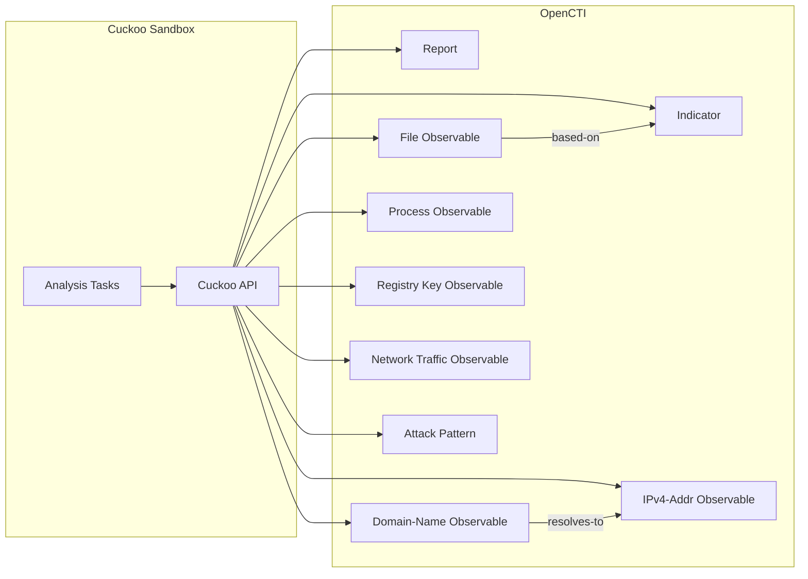

# OpenCTI Cuckoo Sandbox Connector

The Cuckoo Sandbox connector imports malware analysis reports and IOCs from Cuckoo Sandbox into OpenCTI.

| Status    | Date | Comment |
|-----------|------|---------|
| Community | -    | -       |

## Table of Contents

- [OpenCTI Cuckoo Sandbox Connector](#opencti-cuckoo-sandbox-connector)
  - [Table of Contents](#table-of-contents)
  - [Introduction](#introduction)
  - [Installation](#installation)
    - [Requirements](#requirements)
  - [Configuration variables](#configuration-variables)
    - [OpenCTI environment variables](#opencti-environment-variables)
    - [Base connector environment variables](#base-connector-environment-variables)
    - [Connector extra parameters environment variables](#connector-extra-parameters-environment-variables)
  - [Deployment](#deployment)
    - [Docker Deployment](#docker-deployment)
    - [Manual Deployment](#manual-deployment)
  - [Usage](#usage)
  - [Behavior](#behavior)
  - [Debugging](#debugging)
  - [Additional information](#additional-information)

## Introduction

[Cuckoo Sandbox](https://cuckoosandbox.org/) is an open-source automated malware analysis system that executes suspicious files in an isolated environment and monitors their behavior.

This connector polls the Cuckoo API for completed analysis tasks, extracts behavioral indicators (network activity, dropped files, processes, signatures), creates STIX 2.1 objects, and imports them into OpenCTI as comprehensive malware analysis reports.

## Installation

### Requirements

- OpenCTI Platform >= 5.11.0
- Running Cuckoo Sandbox instance with API enabled
- Network access from connector to Cuckoo API

## Configuration variables

There are a number of configuration options, which are set either in `docker-compose.yml` (for Docker) or in `config.yml` (for manual deployment).

### OpenCTI environment variables

| Parameter     | config.yml | Docker environment variable | Mandatory | Description                                          |
|---------------|------------|-----------------------------|-----------|------------------------------------------------------|
| OpenCTI URL   | url        | `OPENCTI_URL`               | Yes       | The URL of the OpenCTI platform.                     |
| OpenCTI Token | token      | `OPENCTI_TOKEN`             | Yes       | The default admin token set in the OpenCTI platform. |

### Base connector environment variables

| Parameter            | config.yml           | Docker environment variable      | Default | Mandatory | Description                                                              |
|----------------------|----------------------|----------------------------------|---------|-----------|--------------------------------------------------------------------------|
| Connector ID         | id                   | `CONNECTOR_ID`                   |         | Yes       | A unique `UUIDv4` identifier for this connector instance.                |
| Connector Name       | name                 | `CONNECTOR_NAME`                 | Cuckoo  | Yes       | Name of the connector.                                                   |
| Connector Scope      | scope                | `CONNECTOR_SCOPE`                | cuckoo  | Yes       | The scope or type of data the connector is importing.                    |
| Log Level            | log_level            | `CONNECTOR_LOG_LEVEL`            | info    | No        | Determines the verbosity of logs: `debug`, `info`, `warn`, or `error`.   |
| Update Existing Data | update_existing_data | `CONNECTOR_UPDATE_EXISTING_DATA` | false   | No        | Whether to update existing data in OpenCTI.                              |

### Connector extra parameters environment variables

| Parameter              | config.yml             | Docker environment variable   | Default | Mandatory | Description                                                    |
|------------------------|------------------------|-------------------------------|---------|-----------|----------------------------------------------------------------|
| API URL                | cuckoo.api_url         | `CUCKOO_API_URL`              |         | Yes       | The Cuckoo API server endpoint (e.g., `http://cuckoo:8090`).   |
| Base URL               | cuckoo.base_url        | `CUCKOO_BASE_URL`             |         | Yes       | The Sandbox web interface URL for external references.         |
| Interval               | cuckoo.interval        | `CUCKOO_INTERVAL`             | 30      | Yes       | Polling interval in minutes for new analysis tasks.            |
| Create Indicators      | cuckoo.create_indicators | `CUCKOO_CREATE_INDICATORS`  | true    | No        | Create Indicators for Observables.                             |
| Enable Registry Keys   | cuckoo.enable_registry_keys | `CUCKOO_ENABLE_REGISTRY_KEYS` | false | No        | Create Registry Key Observables (can be verbose).              |
| Enable Network Traffic | cuckoo.enable_network_traffic | `CUCKOO_ENABLE_NETWORK_TRAFFIC` | false | No        | Create Network Traffic Observables (can be verbose).           |
| Start Task ID          | cuckoo.start_task_id   | `CUCKOO_START_TASK_ID`        | 0       | No        | First Cuckoo Task ID to sync from.                             |
| Report Score Threshold | cuckoo.report_score    | `CUCKOO_REPORT_SCORE`         | 0       | No        | Minimum score to create a Report (0-10 scale).                 |
| Verify SSL             | cuckoo.verify_ssl      | `VERIFY_SSL`                  | true    | No        | Require SSL/TLS connection (`true`/`false`).                   |

## Deployment

### Docker Deployment

Build the Docker image:

```bash
docker build -t opencti/connector-cuckoo:latest .
```

Configure the connector in `docker-compose.yml`:

```yaml
  connector-cuckoo:
    image: opencti/connector-cuckoo:latest
    environment:
      - OPENCTI_URL=http://localhost
      - OPENCTI_TOKEN=ChangeMe
      - CONNECTOR_ID=ChangeMe
      - CONNECTOR_NAME=Cuckoo Sandbox
      - CONNECTOR_SCOPE=cuckoo
      - CONNECTOR_LOG_LEVEL=info
      - CONNECTOR_UPDATE_EXISTING_DATA=false
      - CUCKOO_API_URL=http://cuckoo:8090
      - CUCKOO_BASE_URL=http://cuckoo:8080
      - CUCKOO_INTERVAL=30
      - CUCKOO_CREATE_INDICATORS=true
      - CUCKOO_ENABLE_REGISTRY_KEYS=false
      - CUCKOO_ENABLE_NETWORK_TRAFFIC=false
      - CUCKOO_START_TASK_ID=0
      - CUCKOO_REPORT_SCORE=5
      - VERIFY_SSL=true
    restart: always
```

Start the connector:

```bash
docker compose up -d
```

### Manual Deployment

1. Create `config.yml` based on `config.yml.sample`.

2. Install dependencies:

```bash
pip3 install -r requirements.txt
```

3. Start the connector:

```bash
python3 main.py
```

## Usage

The connector polls the Cuckoo API at the configured interval for new completed analysis tasks. To force an immediate run:

**Data Management → Ingestion → Connectors**

Find the connector and click the refresh button to reset the state and trigger a new sync.

## Behavior

The connector fetches analysis reports from Cuckoo Sandbox and converts them to STIX 2.1 objects.

### Data Flow



### Entity Mapping

| Cuckoo Data                      | OpenCTI Entity       | Description                                                  |
|----------------------------------|----------------------|--------------------------------------------------------------|
| Analysis Task (score >= threshold) | Report             | Contains analysis summary, external reference to Cuckoo web UI |
| Target File                      | File                 | Primary analyzed file with hashes (MD5, SHA1, SHA256, SHA512, SSDEEP) |
| Dropped Files                    | File                 | Executable files dropped during analysis                     |
| Network Hosts                    | IPv4-Addr            | IP addresses contacted during execution                      |
| Network Domains                  | Domain-Name          | DNS requests made during execution                           |
| DNS Resolution                   | Relationship         | `resolves-to` relationship between Domain and IP             |
| Process Tree                     | Process              | Spawned processes with PID and command line                  |
| Registry Keys Written            | Windows-Registry-Key | Registry modifications (optional)                            |
| Network Packets                  | Network-Traffic      | TCP/UDP/ICMP traffic (optional)                              |
| Signatures/TTPs                  | Attack Pattern       | MITRE ATT&CK techniques from behavioral signatures           |
| -                                | Indicator            | Created for file hashes, IPs, domains (optional)             |

### Processing Details

1. **Task Polling**:
   - Polls Cuckoo API `/tasks/list` for completed tasks
   - Processes only tasks with status `reported` and `completed_on` timestamp
   - Tracks last processed task ID in connector state

2. **Report Creation** (if score >= threshold):
   - Creates Report SDO with:
     - Name: `Cuckoo Sandbox Report {task_id} - {filename/url}`
     - Description: Analysis details with target file hashes
     - Confidence: Derived from Cuckoo score (score × 100, max 100)
     - External Reference: Link to Cuckoo web UI analysis page
   - All extracted observables are referenced in Report

3. **Observable Extraction**:
   - **Primary Binary**: Target file with all hash types, creates `based-on` relationship to Indicator
   - **Dropped Files**: Executable files filtered by type (PE32, script, batch, executable, HTML)
   - **Network Hosts**: IPv4 addresses from `network.hosts`
   - **DNS Requests**: Creates Domain-Name and IPv4-Addr with `resolves-to` relationships
   - **Process Tree**: Processes with PID, PPID, and command line

4. **Optional Observables**:
   - **Registry Keys**: Written registry keys (when `enable_registry_keys=true`)
   - **Network Traffic**: TCP/UDP/ICMP packets with src/dst IPs and ports (when `enable_network_traffic=true`)

5. **Indicator Creation** (when `create_indicators=true`):
   - Creates STIX Indicators with patterns for:
     - File hashes: `[file:hashes.'SHA-256'='...']`
     - IP addresses: `[ipv4-addr:value='...']`
     - Domains: `[domain-name:value='...']`

### Relationships Created

| Source          | Relationship  | Target                                |
|-----------------|---------------|---------------------------------------|
| File (primary)  | `related-to`  | IPv4-Addr, Domain-Name, Process, Attack Pattern |
| File (primary)  | `based-on`    | Indicator                             |
| Domain-Name     | `resolves-to` | IPv4-Addr                             |

### Score Interpretation

Cuckoo assigns scores based on behavioral analysis:

| Score | Interpretation               |
|-------|------------------------------|
| 0-3   | Likely benign                |
| 4-6   | Suspicious behavior detected |
| 7-10  | Malicious behavior detected  |

Use `CUCKOO_REPORT_SCORE` to filter which analyses generate Reports in OpenCTI.

## Debugging

Enable verbose logging:

```env
CONNECTOR_LOG_LEVEL=debug
```

Common issues:
- **Connection refused**: Verify Cuckoo API URL and network connectivity
- **SSL errors**: Set `VERIFY_SSL=false` for self-signed certificates
- **No tasks synced**: Check `start_task_id` and ensure tasks have `reported` status
- **Missing reports**: Verify task score meets `report_score` threshold

## Additional information

### Supported Cuckoo Versions

- Cuckoo Sandbox 2.x
- Cuckoo3 (community fork)

### Performance Considerations

- Increase `CUCKOO_INTERVAL` for high-volume environments
- Use `CUCKOO_START_TASK_ID` to skip historical analyses on first run
- Consider enabling registry keys and network traffic only when needed (generates many objects)

### API Endpoints Used

| Endpoint              | Purpose                    |
|-----------------------|----------------------------|
| `/tasks/list`         | List all analysis tasks    |
| `/tasks/summary/{id}` | Get detailed task summary  |
