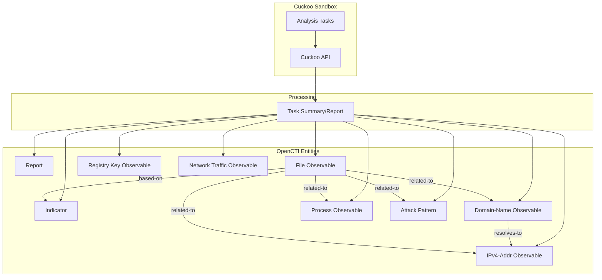

# OpenCTI Cuckoo Sandbox Connector

| Status    | Date | Comment |
|-----------|------|---------|
| Community | -    | -       |

## Table of Contents

- [Introduction](#introduction)
- [Installation](#installation)
  - [Requirements](#requirements)
- [Configuration](#configuration)
  - [Configuration Variables](#configuration-variables)
- [Deployment](#deployment)
  - [Docker Deployment](#docker-deployment)
  - [Manual Deployment](#manual-deployment)
- [Behavior](#behavior)
  - [Data Flow](#data-flow)
  - [Entity Mapping](#entity-mapping)
- [Debugging](#debugging)
- [Additional Information](#additional-information)

---

## Introduction

This connector integrates [Cuckoo Sandbox](https://cuckoosandbox.org/) analysis results with the OpenCTI platform. Cuckoo Sandbox is an open-source automated malware analysis system that executes suspicious files in an isolated environment and monitors their behavior.

The connector polls the Cuckoo API for completed analysis tasks, extracts behavioral indicators (network activity, dropped files, processes, signatures), creates STIX 2.1 objects, and imports them into OpenCTI as comprehensive malware analysis reports.

---

## Installation

### Requirements

- OpenCTI Platform version 5.11.0 or higher
- Running Cuckoo Sandbox instance with API enabled
- Network access from connector to Cuckoo API

---

## Configuration

### Configuration Variables

#### OpenCTI Parameters

| Parameter | Docker envvar | Mandatory | Description |
|-----------|---------------|-----------|-------------|
| OpenCTI URL | `OPENCTI_URL` | Yes | The URL of the OpenCTI platform |
| OpenCTI Token | `OPENCTI_TOKEN` | Yes | The default admin token configured in the OpenCTI platform |

#### Base Connector Parameters

| Parameter | Docker envvar | Mandatory | Description |
|-----------|---------------|-----------|-------------|
| Connector ID | `CONNECTOR_ID` | Yes | A unique `UUIDv4` for this connector |
| Connector Name | `CONNECTOR_NAME` | Yes | Name displayed in OpenCTI (e.g., `Cuckoo`) |
| Connector Scope | `CONNECTOR_SCOPE` | Yes | Supported scope (e.g., `cuckoo`) |
| Log Level | `CONNECTOR_LOG_LEVEL` | Yes | Log level: `debug`, `info`, `warn`, or `error` |
| Update Existing Data | `CONNECTOR_UPDATE_EXISTING_DATA` | No | Whether to update existing data |

#### Connector Extra Parameters

| Parameter | Docker envvar | config.yml | Mandatory | Description |
|-----------|---------------|------------|-----------|-------------|
| API URL | `CUCKOO_API_URL` | `api_url` | Yes | The Cuckoo API server endpoint (e.g., `http://cuckoo:8090`) |
| Base URL | `CUCKOO_BASE_URL` | `base_url` | Yes | The Sandbox web interface URL for external references |
| Poll Interval | `CUCKOO_INTERVAL` | `interval` | Yes | Polling interval in minutes (e.g., `30`) |
| Create Indicators | `CUCKOO_CREATE_INDICATORS` | `create_indicators` | No | Create Indicators for Observables (`true`/`false`) |
| Enable Registry Keys | `CUCKOO_ENABLE_REGISTRY_KEYS` | `enable_registry_keys` | No | Create Registry Key Observables (`true`/`false`) |
| Enable Network Traffic | `CUCKOO_ENABLE_NETWORK_TRAFFIC` | `enable_network_traffic` | No | Create Network Traffic Observables (`true`/`false`) |
| Start Task ID | `CUCKOO_START_TASK_ID` | `start_task_id` | No | First Cuckoo Task ID to sync from (default: `0`) |
| Report Score Threshold | `CUCKOO_REPORT_SCORE` | `report_score` | No | Minimum score to create a Report (default: `0`) |
| Verify SSL | `VERIFY_SSL` | `verify_ssl` | No | Require SSL/TLS connection (`true`/`false`, default: `true`) |

---

## Deployment

### Docker Deployment

Use the following `docker-compose.yml`:

```yaml
services:
  connector-cuckoo:
    image: opencti/connector-cuckoo:latest
    environment:
      - OPENCTI_URL=http://opencti:8080
      - OPENCTI_TOKEN=${OPENCTI_ADMIN_TOKEN}
      - CONNECTOR_ID=${CONNECTOR_CUCKOO_ID}
      - CONNECTOR_NAME=Cuckoo Sandbox
      - CONNECTOR_SCOPE=cuckoo
      - CONNECTOR_LOG_LEVEL=info
      - CONNECTOR_UPDATE_EXISTING_DATA=false
      - CUCKOO_API_URL=http://cuckoo:8090
      - CUCKOO_BASE_URL=http://cuckoo:8080
      - CUCKOO_INTERVAL=30
      - CUCKOO_CREATE_INDICATORS=true
      - CUCKOO_ENABLE_REGISTRY_KEYS=false
      - CUCKOO_ENABLE_NETWORK_TRAFFIC=false
      - CUCKOO_START_TASK_ID=0
      - CUCKOO_REPORT_SCORE=5
      - VERIFY_SSL=true
    restart: always
    depends_on:
      - opencti
```

### Manual Deployment

1. Clone the repository and navigate to the connector directory
2. Install dependencies: `pip install -r requirements.txt`
3. Configure `config.yml`:

```yaml
opencti:
  url: 'http://localhost:8080'
  token: 'your-token'

connector:
  id: 'your-uuid'
  name: 'Cuckoo Sandbox'
  scope: 'cuckoo'
  log_level: 'info'

cuckoo:
  api_url: 'http://cuckoo:8090'
  base_url: 'http://cuckoo:8080'
  interval: 30
  create_indicators: true
  enable_registry_keys: false
  enable_network_traffic: false
  start_task_id: 0
  report_score: 5
  verify_ssl: true
```

4. Run: `python main.py`

---

## Behavior

### Data Flow



### Entity Mapping

| Cuckoo Data | OpenCTI Entity | Notes |
|-------------|----------------|-------|
| Analysis Task (score >= threshold) | Report | Contains analysis summary, external reference to Cuckoo web UI |
| Target File | File | Primary analyzed file with hashes (MD5, SHA1, SHA256, SHA512, SSDEEP) |
| Dropped Files | File | Executable files dropped during analysis |
| Network Hosts | IPv4-Addr | IP addresses contacted during execution |
| Network Domains | Domain-Name | DNS requests made during execution |
| DNS Resolution | Relationship | `resolves-to` relationship between Domain and IP |
| Process Tree | Process | Spawned processes with PID and command line |
| Registry Keys Written | Windows-Registry-Key | Registry modifications (optional) |
| Network Packets | Network-Traffic | TCP/UDP/ICMP traffic (optional) |
| Signatures/TTPs | Attack Pattern | MITRE ATT&CK techniques from behavioral signatures |
| - | Indicator | Created for file hashes, IPs, domains (optional) |

### Processing Details

1. **Task Polling**:
   - Polls Cuckoo API `/tasks/list` for completed tasks
   - Processes only tasks with status `reported` and `completed_on` timestamp
   - Tracks last processed task ID in connector state

2. **Report Creation** (if score >= threshold):
   - Creates Report SDO with:
     - Name: `Cuckoo Sandbox Report {task_id} - {filename/url}`
     - Description: Analysis details with target file hashes
     - Confidence: Derived from Cuckoo score (score × 100, max 100)
     - External Reference: Link to Cuckoo web UI analysis page
   - All extracted observables are referenced in Report

3. **Observable Extraction**:
   - **Primary Binary**: Target file with all hash types, creates `based-on` relationship to Indicator
   - **Dropped Files**: Executable files filtered by type (PE32, script, batch, executable, HTML)
   - **Network Hosts**: IPv4 addresses from `network.hosts`
   - **DNS Requests**: Creates Domain-Name and IPv4-Addr with `resolves-to` relationships
   - **Process Tree**: Processes with PID, PPID, and command line

4. **Optional Observables**:
   - **Registry Keys**: Written registry keys (when `enable_registry_keys=true`)
   - **Network Traffic**: TCP/UDP/ICMP packets with src/dst IPs and ports (when `enable_network_traffic=true`)

5. **Indicator Creation** (when `create_indicators=true`):
   - Creates STIX Indicators with patterns for:
     - File hashes: `[file:hashes.'SHA-256'='...']`
     - IP addresses: `[ipv4-addr:value='...']`
     - Domains: `[domain-name:value='...']`

6. **Attack Patterns**:
   - Extracts TTPs from behavioral signatures
   - Looks up existing MITRE ATT&CK patterns by ID or name
   - Creates new patterns if not found

### Relationships Created

| Source | Relationship | Target |
|--------|--------------|--------|
| File (primary) | `related-to` | IPv4-Addr, Domain-Name, Process, Attack Pattern |
| File (primary) | `based-on` | Indicator |
| Domain-Name | `resolves-to` | IPv4-Addr |

---

## Debugging

Enable debug logging by setting `CONNECTOR_LOG_LEVEL=debug`. Common issues:

- **Connection refused**: Verify Cuckoo API URL and network connectivity
- **SSL errors**: Set `VERIFY_SSL=false` for self-signed certificates
- **No tasks synced**: Check `start_task_id` and ensure tasks have `reported` status
- **Missing reports**: Verify task score meets `report_score` threshold

---

## Additional Information

### Supported Cuckoo Versions

- Cuckoo Sandbox 2.x
- Cuckoo3 (community fork)

### Performance Considerations

- Increase `CUCKOO_INTERVAL` for high-volume environments
- Use `CUCKOO_START_TASK_ID` to skip historical analyses on first run
- Consider enabling registry keys and network traffic only when needed (generates many objects)

### API Endpoints Used

| Endpoint | Purpose |
|----------|---------|
| `/tasks/list` | List all analysis tasks |
| `/tasks/summary/{id}` | Get detailed task summary |

### Score Interpretation

Cuckoo assigns scores based on behavioral analysis:
- **0-3**: Likely benign
- **4-6**: Suspicious behavior detected
- **7-10**: Malicious behavior detected

Use `CUCKOO_REPORT_SCORE` to filter which analyses generate Reports in OpenCTI.

