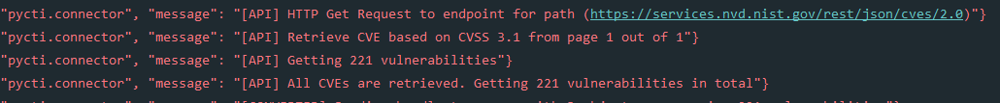
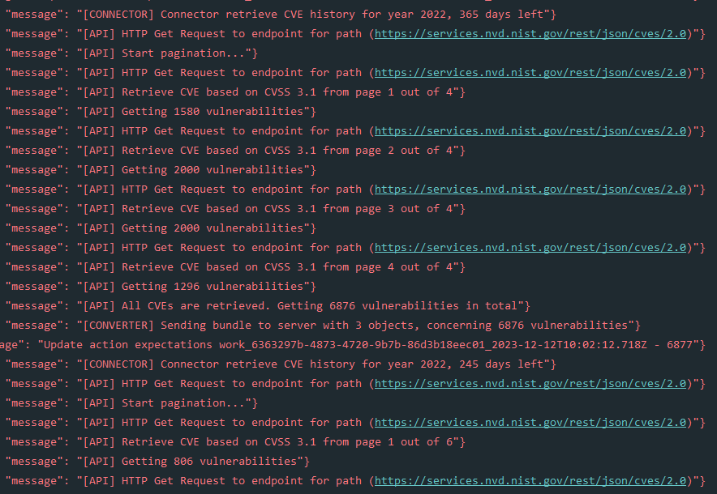
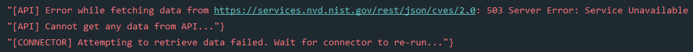
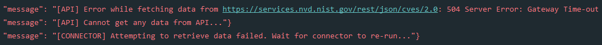
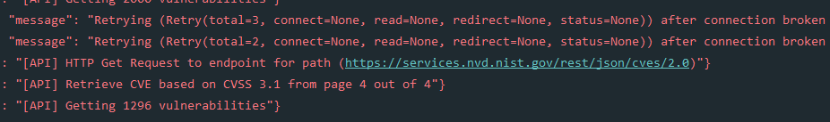
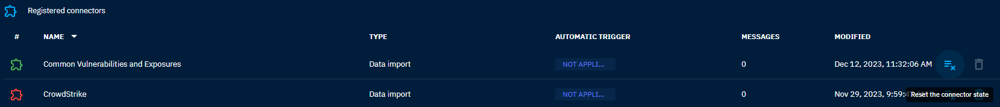

# OpenCTI CVE connector

The CVE connector is a standalone Python process that collect data from the NVD (National Vulnerability Database).

## Summary

- [Introduction](#introduction)
- [CVE and CVSS base score V3.1](#cve-and-cvss-base-score-v31)
- [Requirements](#requirements)
- [Configuration variables](#configuration-variables)
- [Deployment](#deployment)
  - [Docker Deployment](#docker-deployment)
  - [Manual Deployment](#manual-deployment)
- [Behavior](#behavior)
  - [Initial population](#initial-population)
  - [Pull CVEs history](#pull-cves-history)
  - [Maintaining data](#maintaining-data)
  - [Errors](#errors)
- [Usage](#usage)
- [Sources](#sources)

---

### Introduction

The [NVD](https://nvd.nist.gov/general/brief-history) is the US government's source for standards-based vulnerability
management data and is a product of the [NIST](https://www.nist.gov/) Computer Security Division, Information Technology
Laboratory.

This data enables the automation of vulnerability management, security measurement, and compliance. NVD includes
databases of vulnerability lists, software vulnerabilities, product names, and severity scores.

The **CVE (Common Vulnerabilities and Exposures)** is a dictionary of publicly known information security
vulnerabilities and
other information security exposures.

The CVE repository is maintained by [MITRE Corporation](https://www.mitre.org/) and is freely available.

This connector collects CVE data from the NVD, converts to STIX2 and imports them into OpenCTI at a regular intervals.

### CVE and CVSS base score V3.1

CVEs are assigned a criticality score (CVSS) making it possible to prioritize vulnerabilities and thus prioritize IS
security projects.

As of July 13th, 2022, the NVD will no longer generate new information for CVSS v2.

Existing CVSS V2 information will remain in the database, but the NVD will no longer actively populate CVSS V2 for new
CVEs.

CVSS V3.1 was released in June 2019, thus most CVE published before 2019 do not include the `cvssMetricV31` object. The
exception are CVE published before 2019 that were later reanalyzed or modified.

These CVE may have been updated to include CVSS V3.1 information. If the CVE was updated in this way, the API response
would include this optional information.

This connector will import all CVE with CVSS V3.1 base score.

### Requirements

- OpenCTI Platform version 5.12.0 or higher
- An API Key for accessing

#### Request an API Key

To import data from the NVD and use the connector, you need to request an API Key:

- [Request an API Key](https://nvd.nist.gov/developers/request-an-api-key)

### Configuration variables

Below are the parameters you'll need to set for OpenCTI:

| Parameter     | config.yml | Docker environment variable | Mandatory | Description                                          |
|---------------|------------|-----------------------------|-----------|------------------------------------------------------|
| OpenCTI URL   | url        | `OPENCTI_URL`               | Yes       | The URL of the OpenCTI platform.                     |
| OpenCTI Token | token      | `OPENCTI_TOKEN`             | Yes       | The default admin token set in the OpenCTI platform. |

Below are the parameters you'll need to set for running the connector properly:

| Parameter            | config.yml           | Docker environment variable      | Default                              | Mandatory | Description                                                                                                                                 |
|----------------------|----------------------|----------------------------------|--------------------------------------|-----------|---------------------------------------------------------------------------------------------------------------------------------------------|
| Connector ID         | id                   | `CONNECTOR_ID`                   | /                                    | Yes       | A unique `UUIDv4` identifier for this connector instance.                                                                                   |
| Connector Name       | name                 | `CONNECTOR_NAME`                 | Common Vulnerabilities and Exposures | Yes       | Name of the connector.                                                                                                                      |
| Connector Scope      | scope                | `CONNECTOR_SCOPE`                | identity,vulnerability               | Yes       | The scope or type of data the connector is importing, either a MIME type or Stix Object.                                                    |
| Run and Terminate    | run_and_terminate    | `CONNECTOR_RUN_AND_TERMINATE`    | False                                | No        | Launch the connector once if set to True. Takes 2 available values: `True` or `False`                                                       |
| Log Level            | log_level            | `CONNECTOR_LOG_LEVEL`            | info                                 | Yes       | Determines the verbosity of the logs. Options are `debug`, `info`, `warn`, or `error`.                                                      |

Below are the parameters you'll need to set for CVE connector:

| Parameter              | config.yml         | Docker environment variable | Default                                      | Mandatory | Description                                                                                                                                                         |
|------------------------|--------------------|-----------------------------|----------------------------------------------|-----------|---------------------------------------------------------------------------------------------------------------------------------------------------------------------|
| CVE Base URL           | base_url           | `CVE_BASE_URL`              | https://services.nvd.nist.gov/rest/json/cves | Yes       | URL for the CVE API.                                                                                                                                                |
| CVE API Key            | api_key            | `CVE_API_KEY`               | /                                            | Yes       | API Key for the CVE API.                                                                                                                                            |
| CVE Interval           | interval           | `CVE_INTERVAL`              | 2                                            | Yes       | Interval in hours to check and import new CVEs. Must be strictly greater than 1, advice from NIST minimum 2 hours                                                   |
| CVE Max Date Range     | max_date_range     | `CVE_MAX_DATE_RANGE`        | 120                                          | Yes       | Determines how many days to collect CVE. Maximum of 120 days.                                                                                                       |
| CVE Maintain Data      | maintain_data      | `CVE_MAINTAIN_DATA`         | True                                         | Yes       | If set to `True`, import CVEs from the last run of the connector to the current time. Takes 2 values: `True` or `False`.                                            |
| CVE Pull History       | pull_history       | `CVE_PULL_HISTORY`          | False                                        | No        | If set to `True`, import all CVEs from start year define in history start year configuration and history start year is required. Takes 2 values: `True` or `False`. |
| CVE History Start Year | history_start_year | `CVE_HISTORY_START_YEAR`    | 2019                                         | No        | Year in number. Required when pull_history is set to `True`.  Minimum 2019 as CVSS V3.1 was released in June 2019, thus most CVE published before 2019 do not include the cvssMetricV31 object.                                                                                      |

For more details about the CVE API, see the documentation at the link below:

- [CVE API](https://nvd.nist.gov/developers/vulnerabilities)

### Deployment

#### Docker Deployment

Build a Docker Image using the provided `Dockerfile`.

Example:

```shell
docker build . -t opencti-cve-import:latest
```

Make sure to replace the environment variables in `docker-compose.yml` with the appropriate configurations for your
environment. Then, start the docker container with the provided docker-compose.yml

```shell
docker compose up -d
# -d for detached
```

#### Manual Deployment

Create a file `config.yml` based on the provided `config.yml.sample`.

Replace the configuration variables (especially the "**ChangeMe**" variables) with the appropriate configurations for
you environment.

Install the required python dependencies (preferably in a virtual environment):

```shell
pip3 install -r requirements.txt
```

Or if you have Make installed, in cve/src:

```shell
# Will install the requirements
make init
```

Then, start the connector from cve/src:

```shell
python3 main.py
```

### Behavior

#### Initial population

For the first run of the connector, the connector will import the most recent CVEs based on the CVSS V3.1 base score.

Configuring the `max_date_range` allows to fetch all CVEs from the last `max_date_range` days to now.

The maximum allowable range when using any date range parameters is **120 consecutive days**. So, the `max_date_range`
cannot exceed 120 days.

If the response from CVE API is 200, data is fetched successfully, and you will see the following logs:

Example of logs:

_max_date_range: 1_



#### Pull CVEs history

For the first run of the connector, you may want to pull CVEs from the last years.
Configuring `pull_history` to `True` requires to add a start year.

Example of logs:

_pull_history: True_

_history_start_year: 2022_



Since the maximum allowed range when using any date range parameter is **120 consecutive days**, and the default value
and **maximum allowed limit to fetch is 2000** vulnerabilities (for network considerations), fetching CVEs of 1 year
will take these parameters into account.

These values have been optimized to provide the greatest number of results with the fewest number of requests.

#### Maintaining data

By default, `maintain_data` will be set to `True` to keep data updated.

If the connector runs and the last run is higher than the `interval` set, the connector will import the last CVEs added
or modified.

#### Errors

You may encounter some errors from the server:





The connector will retry to fetch data from CVE API after few minutes.

It retries for a total of 4 times the request before fail.




### Usage

After Installation, the connector should require minimal interaction to use, and should update automatically at the
hourly interval specified in your `docker-compose.yml` or `config.yml`.

However, if you would like to force an immediate poll of the CVE instance, navigate to _Data_ -> _Connectors_ in the
OpenCTI platform.
Find the "Common Vulnerabilities and Exposures" connector, and click on the refresh button to reset the connector's
state and force a new poll of the CVEs.



### Sources

- [NVD](https://nvd.nist.gov/info)
- [CVSS V2 deprecated](https://nvd.nist.gov/vuln-metrics/cvss/v2-calculator)
- [CVSS V3.1 Official Support](https://nvd.nist.gov/general/news/cvss-v3-1-official-support)
- [Computer Security Division](https://www.nist.gov/itl/csd)
