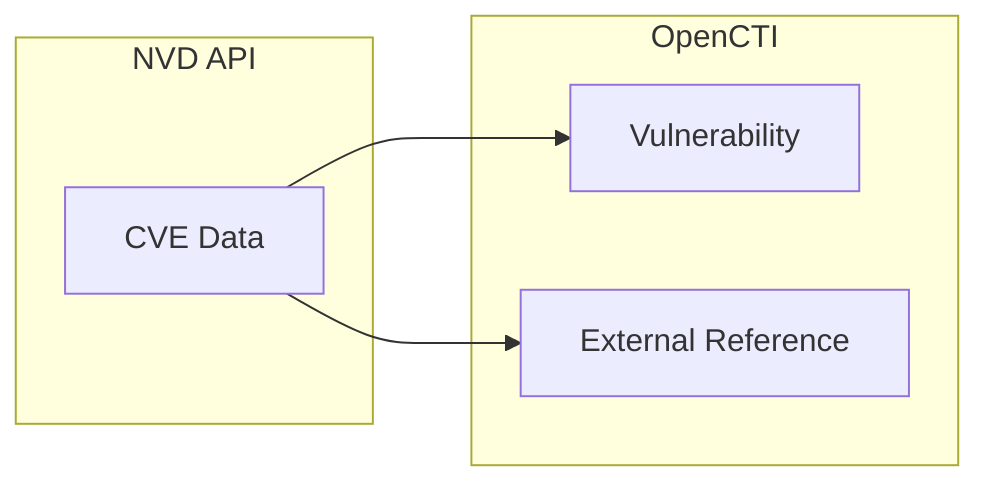

# OpenCTI CVE Connector

| Status | Date | Comment |
|--------|------|---------|
| Filigran Verified | -    | -       |

The CVE connector imports Common Vulnerabilities and Exposures (CVE) data from the NIST National Vulnerability Database (NVD) into OpenCTI.

## Table of Contents

- [OpenCTI CVE Connector](#opencti-cve-connector)
  - [Table of Contents](#table-of-contents)
  - [Introduction](#introduction)
  - [Installation](#installation)
    - [Requirements](#requirements)
  - [Configuration variables](#configuration-variables)
    - [OpenCTI environment variables](#opencti-environment-variables)
    - [Base connector environment variables](#base-connector-environment-variables)
    - [Connector extra parameters environment variables](#connector-extra-parameters-environment-variables)
  - [Deployment](#deployment)
    - [Docker Deployment](#docker-deployment)
    - [Manual Deployment](#manual-deployment)
  - [Usage](#usage)
  - [Behavior](#behavior)
  - [Debugging](#debugging)
  - [Additional information](#additional-information)

## Introduction

The National Vulnerability Database (NVD) is the U.S. government repository of standards-based vulnerability management data. This connector retrieves CVE (Common Vulnerabilities and Exposures) data from the NVD API and imports it into OpenCTI as Vulnerability entities.

The connector supports both incremental updates (maintaining data since last run) and historical import (pulling all CVEs from a specified year).

## Installation

### Requirements

- OpenCTI Platform >= 6.x
- NVD API key (required - request at [NVD API Key Request](https://nvd.nist.gov/developers/request-an-api-key))

## Configuration variables

There are a number of configuration options, which are set either in `docker-compose.yml` (for Docker) or in `config.yml` (for manual deployment).

### OpenCTI environment variables

| Parameter     | config.yml | Docker environment variable | Mandatory | Description                                          |
|---------------|------------|-----------------------------|-----------|------------------------------------------------------|
| OpenCTI URL   | url        | `OPENCTI_URL`               | Yes       | The URL of the OpenCTI platform.                     |
| OpenCTI Token | token      | `OPENCTI_TOKEN`             | Yes       | The default admin token set in the OpenCTI platform. |

### Base connector environment variables

| Parameter         | config.yml      | Docker environment variable   | Default                                  | Mandatory | Description                                                                 |
|-------------------|-----------------|-------------------------------|------------------------------------------|-----------|-----------------------------------------------------------------------------|
| Connector ID      | id              | `CONNECTOR_ID`                |                                          | Yes       | A unique `UUIDv4` identifier for this connector instance.                   |
| Connector Name    | name            | `CONNECTOR_NAME`              | Common Vulnerabilities and Exposures     | No        | Name of the connector.                                                      |
| Connector Scope   | scope           | `CONNECTOR_SCOPE`             | cve                                      | No        | The scope or type of data the connector is importing.                       |
| Log Level         | log_level       | `CONNECTOR_LOG_LEVEL`         | error                                    | No        | Determines the verbosity of the logs: `debug`, `info`, `warn`, or `error`.  |

### Connector extra parameters environment variables

| Parameter          | config.yml           | Docker environment variable | Default                                      | Mandatory | Description                                                                 |
|--------------------|----------------------|-----------------------------|----------------------------------------------|-----------|-----------------------------------------------------------------------------|
| API Key            | cve.api_key          | `CVE_API_KEY`               |                                              | Yes       | Your NVD API key.                                                           |
| Base URL           | cve.base_url         | `CVE_BASE_URL`              | https://services.nvd.nist.gov/rest/json/cves | No        | NVD API endpoint URL.                                                       |
| Interval           | cve.interval         | `CVE_INTERVAL`              | 6                                            | No        | Interval in hours between checks. Minimum 2 hours recommended by NIST.      |
| Max Date Range     | cve.max_date_range   | `CVE_MAX_DATE_RANGE`        | 120                                          | No        | Maximum days per API query. Maximum 120 days.                               |
| Maintain Data      | cve.maintain_data    | `CVE_MAINTAIN_DATA`         | true                                         | No        | Import CVEs from last run to current time (incremental updates).            |
| Pull History       | cve.pull_history     | `CVE_PULL_HISTORY`          | false                                        | No        | Import all CVEs from `history_start_year`. Requires `history_start_year`.   |
| History Start Year | cve.history_start_year | `CVE_HISTORY_START_YEAR`  | 2019                                         | No        | Required if `pull_history=true`. Minimum 2019 (CVSS v3.1 release).          |

## Deployment

### Docker Deployment

Build the Docker image:

```bash
docker build -t opencti/connector-cve:latest .
```

Configure the connector in `docker-compose.yml`:

```yaml
  connector-cve:
    image: opencti/connector-cve:latest
    environment:
      - OPENCTI_URL=http://localhost
      - OPENCTI_TOKEN=ChangeMe
      - CONNECTOR_ID=ChangeMe
      - CONNECTOR_NAME=Common Vulnerabilities and Exposures
      - CONNECTOR_SCOPE=cve
      - CONNECTOR_LOG_LEVEL=error
      - CVE_API_KEY=ChangeMe
      - CVE_INTERVAL=6 # In hours, minimum 2 recommended by NIST
      # - CVE_BASE_URL=https://services.nvd.nist.gov/rest/json/cves
      # - CVE_MAX_DATE_RANGE=120
      # - CVE_MAINTAIN_DATA=true
      # - CVE_PULL_HISTORY=false
      # - CVE_HISTORY_START_YEAR=2019
    restart: always
```

Start the connector:

```bash
docker compose up -d
```

### Manual Deployment

1. Create `config.yml` based on `config.yml.sample`.

2. Install dependencies:

```bash
pip3 install -r requirements.txt
```

3. Start the connector from the `src` directory:

```bash
python3 -m __main__
```

## Usage

The connector runs automatically at the interval defined by `CVE_INTERVAL`. To force an immediate run:

**Data Management → Ingestion → Connectors**

Find the connector and click the refresh button to reset the state and trigger a new sync.

## Behavior

The connector fetches CVE data from the NVD API and converts it to STIX Vulnerability objects.

### Data Flow



### Entity Mapping

| NVD CVE Data         | OpenCTI Entity/Property | Description                                      |
|----------------------|-------------------------|--------------------------------------------------|
| CVE ID               | Vulnerability.name      | CVE identifier (e.g., CVE-2021-44228)            |
| Description          | Vulnerability.description | CVE description                                |
| Published Date       | Vulnerability.created   | Date CVE was published                           |
| Last Modified        | Vulnerability.modified  | Last modification date                           |
| CVSS v2 baseScore    | Vulnerability.x_opencti_cvss_v2_base_score | CVSS v2 Base Score            |
| CVSS v2 accessVector | Vulnerability.x_opencti_cvss_v2_access_vector | CVSS v2 Access Vector      |
| CVSS v2 accessComplexity| Vulnerability.x_opencti_cvss_v2_access_complexity | CVSS v2 Access Complexity |
| CVSS v2 authentication | Vulnerability.x_opencti_cvss_v2_authentication | CVSS v2 Authentication  |
| CVSS v2 confidentialityImpact | Vulnerability.x_opencti_cvss_v2_confidentiality_impact | CVSS v2 Confidentiality Impact |
| CVSS v2 integrityImpact | Vulnerability.x_opencti_cvss_v2_integrity_impact | CVSS v2 Integrity Impact |
| CVSS v2 availabilityImpact | Vulnerability.x_opencti_cvss_v2_availability_impact | CVSS v2 Availability Impact |
| CVSS v3.1 baseScore  | Vulnerability.x_opencti_cvss_base_score | CVSS v3.1 base score             |
| CVSS v3.1 baseSeverity | Vulnerability.x_opencti_cvss_base_severity | CVSS v3.1 Base Severity: CRITICAL/HIGH/MEDIUM/LOW |
| CVSS v3.1 attackVector | Vulnerability.x_opencti_cvss_attack_vector | CVSS v3.1 Attack Vector     |
| CVSS v3.1 attackComplexity | Vulnerability.x_opencti_cvss_attack_complexity | CVSS v3.1 Attack Complexity |
| CVSS v3.1 privilegesRequired | Vulnerability.x_opencti_cvss_privileges_required | CVSS v3.1 Privileges Required |
| CVSS v3.1 userInteraction | Vulnerability.x_opencti_cvss_user_interaction | CVSS v3.1 User Interaction |
| CVSS v3.1 scope | Vulnerability.x_opencti_cvss_scope | CVSS v3.1 Scope                            |
| CVSS v3.1 confidentialityImpact | Vulnerability.x_opencti_confidentiality_impact | CVSS v3.1 Confidentiality Impact |
| CVSS v3.1 integrityImpact | Vulnerability.x_opencti_integrity_impact | CVSS v3.1 Integrity Impact |
| CVSS v3.1 availabilityImpact | Vulnerability.x_opencti_availability_impact | CVSS v3.1 Availability Impact |
| CVSS v4.0 baseScore | Vulnerability.x_opencti_cvss_v4_base_score | CVSS v4.0 Base Score           |
| CVSS v4.0 baseSeverity | Vulnerability.x_opencti_cvss_v4_base_severity | CVSS v4.0 Base Severity  |
| CVSS v4.0 attackVector | Vulnerability.x_opencti_cvss_v4_attack_vector | CVSS v4.0 Attack Vector (AV) |
| CVSS v4.0 attackComplexity | Vulnerability.x_opencti_cvss_v4_attack_complexity | CVSS v4.0 Attack Complexity (AC)|
| CVSS v4.0 attackRequirements | Vulnerability.x_opencti_cvss_v4_attack_requirements | CVSS v4.0 Attack Requirements (AT) |
| CVSS v4.0 privilegesRequired | Vulnerability.x_opencti_cvss_v4_privileges_required | CVSS v4.0 Privileges Required (PR)|
| CVSS v4.0 userInteraction | Vulnerability.x_opencti_cvss_v4_user_interaction | CVSS v4.0 User Interaction (UI) |
| CVSS v4.0 vulnConfidentialityImpact | Vulnerability.x_opencti_cvss_v4_confidentiality_impact_v | CVSS v4.0 Confidentiality (VC) |
| CVSS v4.0 subConfidentialityImpact | Vulnerability.x_opencti_cvss_v4_confidentiality_impact_s | CVSS v4.0 Confidentiality (SC) |
| CVSS v4.0 vulnIntegrityImpact | Vulnerability.x_opencti_cvss_v4_integrity_impact_v | CVSS v4.0 Integrity  (VI)|
| CVSS v4.0 subIntegrityImpact | Vulnerability.x_opencti_cvss_v4_integrity_impact_s | CVSS v4.0 Integrity  (SI)|
| CVSS v4.0 vulnAvailabilityImpact | Vulnerability.x_opencti_cvss_v4_availability_impact_v | CVSS v4.0 Availability (VA) |
| CVSS v4.0 subAvailabilityImpact | Vulnerability.x_opencti_cvss_v4_availability_impact_s | CVSS v4.0 Availability (SA) |
| CWE IDs              | Labels                  | Weakness classifications                         |
| References           | External References     | Links to advisories and patches                  |

### Operating Modes

1. **Incremental Updates** (`maintain_data=true`):
   - Default mode
   - Imports CVEs modified since the last run
   - Keeps vulnerability data up-to-date

2. **Historical Import** (`pull_history=true`):
   - Imports all CVEs from specified year to present
   - Useful for initial population
   - Requires `history_start_year` (minimum 2019)

### Processing Details

- **CVSS Support**: Connector supports CVSS v2, v3.1, and v4.0
- **Rate Limiting**: NVD API has rate limits; connector handles pagination
- **Date Range**: Maximum 120-day range per API query
- **API Key Required**: Unauthenticated requests are heavily rate-limited

## Debugging

Enable verbose logging:

```env
CONNECTOR_LOG_LEVEL=debug
```

Log output includes:
- API request/response details
- CVE processing progress
- STIX conversion details

## Additional information

- **API Key**: Required for reasonable rate limits. Request at [NVD](https://nvd.nist.gov/developers/request-an-api-key)
- **Rate Limits**: With API key: 50 requests/30 seconds. Without: 5 requests/30 seconds
- **CVSS v3.1**: Minimum start year is 2019 (CVSS v3.1 release date)
- **Large Dataset**: NVD contains 200,000+ CVEs; historical import takes significant time
- **Polling Interval**: NIST recommends minimum 2-hour intervals
- **Reference**: [NVD API Documentation](https://nvd.nist.gov/developers/vulnerabilities)