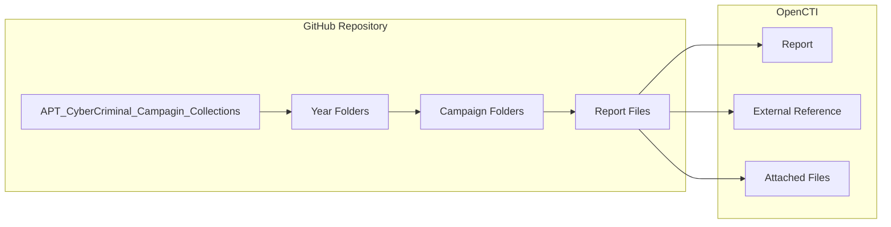

# OpenCTI Cyber Campaign Collection Connector

| Status | Date | Comment |
|--------|------|---------|
| Community | -    | -       |

The Cyber Campaign Collection connector imports APT and cybercriminal campaign reports from the CyberMonitor GitHub repository into OpenCTI.

## Table of Contents

- [OpenCTI Cyber Campaign Collection Connector](#opencti-cyber-campaign-collection-connector)
  - [Table of Contents](#table-of-contents)
  - [Introduction](#introduction)
  - [Installation](#installation)
    - [Requirements](#requirements)
  - [Configuration variables](#configuration-variables)
    - [OpenCTI environment variables](#opencti-environment-variables)
    - [Base connector environment variables](#base-connector-environment-variables)
    - [Connector extra parameters environment variables](#connector-extra-parameters-environment-variables)
  - [Deployment](#deployment)
    - [Docker Deployment](#docker-deployment)
    - [Manual Deployment](#manual-deployment)
  - [Usage](#usage)
  - [Behavior](#behavior)
  - [Debugging](#debugging)
  - [Additional information](#additional-information)

## Introduction

The [CyberMonitor APT_CyberCriminal_Campagin_Collections](https://github.com/CyberMonitor/APT_CyberCriminal_Campagin_Collections) GitHub repository is a community-maintained collection that aggregates publicly available threat intelligence reports documenting APT (Advanced Persistent Threat) and cybercriminal campaigns from various security vendors and researchers.

This connector parses the repository structure (organized by year and campaign date) and creates Report entities in OpenCTI with attached original documents (PDFs, images, etc.).

## Installation

### Requirements

- OpenCTI Platform >= 6.0.0
- (Optional) GitHub Personal Access Token for higher API rate limits

## Configuration variables

There are a number of configuration options, which are set either in `docker-compose.yml` (for Docker) or in `config.yml` (for manual deployment).

### OpenCTI environment variables

| Parameter     | config.yml | Docker environment variable | Mandatory | Description                                          |
|---------------|------------|-----------------------------|-----------|------------------------------------------------------|
| OpenCTI URL   | url        | `OPENCTI_URL`               | Yes       | The URL of the OpenCTI platform.                     |
| OpenCTI Token | token      | `OPENCTI_TOKEN`             | Yes       | The default admin token set in the OpenCTI platform. |

### Base connector environment variables

| Parameter            | config.yml           | Docker environment variable      | Default                   | Mandatory | Description                                                              |
|----------------------|----------------------|----------------------------------|---------------------------|-----------|--------------------------------------------------------------------------|
| Connector ID         | id                   | `CONNECTOR_ID`                   |                           | Yes       | A unique `UUIDv4` identifier for this connector instance.                |
| Connector Name       | name                 | `CONNECTOR_NAME`                 | Cyber Campaign Collection | Yes       | Name of the connector.                                                   |
| Connector Scope      | scope                | `CONNECTOR_SCOPE`                | cyber-monitor             | Yes       | The scope or type of data the connector is importing.                    |
| Log Level            | log_level            | `CONNECTOR_LOG_LEVEL`            | info                      | No        | Determines the verbosity of logs: `debug`, `info`, `warn`, or `error`.   |
| Update Existing Data | update_existing_data | `CONNECTOR_UPDATE_EXISTING_DATA` | false                     | No        | Whether to update existing data in OpenCTI.                              |

### Connector extra parameters environment variables

| Parameter    | config.yml               | Docker environment variable    | Default | Mandatory | Description                                                    |
|--------------|--------------------------|--------------------------------|---------|-----------|----------------------------------------------------------------|
| GitHub Token | cyber_monitor.github_token | `CYBER_MONITOR_GITHUB_TOKEN` |         | No        | GitHub personal access token for higher API rate limits.       |
| From Year    | cyber_monitor.from_year  | `CYBER_MONITOR_FROM_YEAR`      |         | Yes       | Starting year for historical import (e.g., `2020`).            |
| Interval     | cyber_monitor.interval   | `CYBER_MONITOR_INTERVAL`       |         | Yes       | Polling interval in days (e.g., `7`).                          |

## Deployment

### Docker Deployment

Build the Docker image:

```bash
docker build -t opencti/connector-cyber-campaign-collection:latest .
```

Configure the connector in `docker-compose.yml`:

```yaml
  connector-cyber-campaign-collection:
    image: opencti/connector-cyber-campaign-collection:latest
    environment:
      - OPENCTI_URL=http://localhost
      - OPENCTI_TOKEN=ChangeMe
      - CONNECTOR_ID=ChangeMe
      - CONNECTOR_NAME=Cyber Campaign Collection
      - CONNECTOR_SCOPE=cyber-monitor
      - CONNECTOR_LOG_LEVEL=info
      - CONNECTOR_UPDATE_EXISTING_DATA=false
      - CYBER_MONITOR_GITHUB_TOKEN=ChangeMe
      - CYBER_MONITOR_FROM_YEAR=2020
      - CYBER_MONITOR_INTERVAL=7
    restart: always
```

Start the connector:

```bash
docker compose up -d
```

### Manual Deployment

1. Create `config.yml` based on `config.yml.sample`.

2. Install dependencies:

```bash
pip3 install -r requirements.txt
```

3. Start the connector:

```bash
python3 cyber_campaign_collection.py
```

## Usage

The connector runs automatically at the interval defined by `CYBER_MONITOR_INTERVAL`. To force an immediate run:

**Data Management → Ingestion → Connectors**

Find the connector and click the refresh button to reset the state and trigger a new data fetch.

## Behavior

The connector fetches campaign reports from the GitHub repository and creates Report entities with attached files.

### Data Flow



### Entity Mapping

| GitHub Data                  | OpenCTI Entity      | Description                                          |
|------------------------------|---------------------|------------------------------------------------------|
| Campaign Folder              | Report              | Name extracted from folder name (after date prefix)  |
| Folder Date (YYYY.MM.DD)     | Report.published    | Date extracted and parsed from folder name           |
| Files (PDF, images, etc.)    | Report.x_opencti_files | Files attached to the Report                       |
| GitHub URL                   | External Reference  | Link to the GitHub folder                            |

### Processing Details

1. **Repository Structure**:
   - Repository is organized by year: `2019/`, `2020/`, `2021/`, etc.
   - Each campaign has a folder: `YYYY.MM.DD_Campaign_Name`
   - Files within each folder are attached to the corresponding Report

2. **Date Parsing**:
   - Extracts date from folder name prefix (first 10 characters)
   - Handles various formats: `YYYY.MM.DD`, `YYYY-MM-DD`
   - Defaults missing month/day to `01`

3. **Report Creation**:
   - Name: Campaign name (folder name without date prefix, underscores replaced with spaces)
   - Published date: Extracted from folder name
   - External Reference: Link to GitHub folder

4. **File Attachments**:
   - Downloads all files from campaign folder
   - Attaches as `x_opencti_files` custom property
   - MIME types are auto-detected
   - Files marked with `no_trigger_import: true` to prevent recursive processing

5. **Import Strategy**:
   - **First Run**: Imports all campaigns from `from_year` to present
   - **Subsequent Runs**: Only imports current year campaigns

### Import Frequency

| Mode               | Trigger                        | Data Scope                        |
|--------------------|--------------------------------|-----------------------------------|
| Historical Import  | First run (no `last_run` state)| All years from `from_year` to current |
| Incremental Import | Subsequent runs                | Current year only                 |

## Debugging

Enable verbose logging:

```env
CONNECTOR_LOG_LEVEL=debug
```

Common issues:
- **GitHub API rate limits**: Provide a `CYBER_MONITOR_GITHUB_TOKEN` to increase limits
- **Large files**: Some PDFs may be large; ensure adequate memory
- **Invalid date formats**: Some folder names may have non-standard dates; connector handles gracefully

## Additional information

### Source Repository

- **Repository**: [CyberMonitor/APT_CyberCriminal_Campagin_Collections](https://github.com/CyberMonitor/APT_CyberCriminal_Campagin_Collections)
- **Maintained by**: Community contributors
- **Content**: Public threat intelligence reports from security vendors

### Rate Limits

| Authentication   | Rate Limit           |
|------------------|----------------------|
| Without token    | 60 requests/hour     |
| With token       | 5,000 requests/hour  |

### Recommendations

- Use a GitHub Personal Access Token for production deployments
- Set `from_year` based on your data retention needs (older reports may be less relevant)
- Consider running weekly (`interval: 7`) to catch new additions
