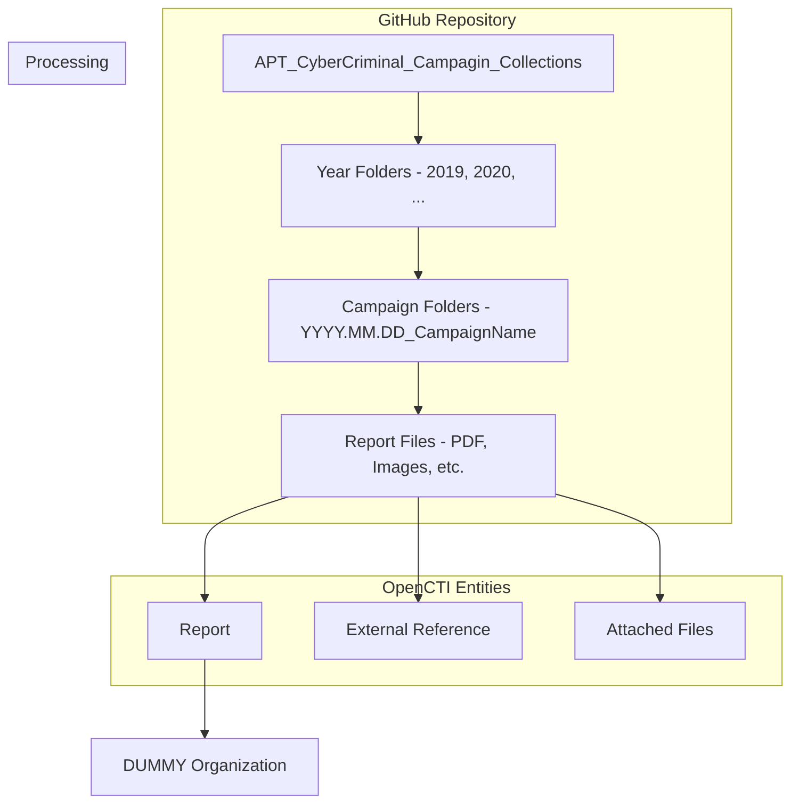

# Cyber Campaign Collection Connector

| Status    | Date | Comment |
|-----------|------|---------|
| Community | -    | -       |

## Table of Contents

- [Introduction](#introduction)
- [Installation](#installation)
  - [Requirements](#requirements)
- [Configuration](#configuration)
  - [Configuration Variables](#configuration-variables)
- [Deployment](#deployment)
  - [Docker Deployment](#docker-deployment)
  - [Manual Deployment](#manual-deployment)
- [Behavior](#behavior)
  - [Data Flow](#data-flow)
  - [Entity Mapping](#entity-mapping)
- [Debugging](#debugging)
- [Additional Information](#additional-information)

---

## Introduction

This connector imports APT and cybercriminal campaign reports from the [CyberMonitor APT_CyberCriminal_Campagin_Collections](https://github.com/CyberMonitor/APT_CyberCriminal_Campagin_Collections) GitHub repository into OpenCTI. This community-maintained repository aggregates publicly available threat intelligence reports documenting APT (Advanced Persistent Threat) and cybercriminal campaigns from various security vendors and researchers.

The connector parses the repository structure (organized by year and campaign date) and creates Report entities in OpenCTI with attached original documents (PDFs, images, etc.).

---

## Installation

### Requirements

- OpenCTI Platform version 6.0.0 or higher
- (Optional) GitHub Personal Access Token for higher API rate limits

---

## Configuration

### Configuration Variables

#### OpenCTI Parameters

| Parameter | Docker envvar | Mandatory | Description |
|-----------|---------------|-----------|-------------|
| OpenCTI URL | `OPENCTI_URL` | Yes | The URL of the OpenCTI platform |
| OpenCTI Token | `OPENCTI_TOKEN` | Yes | The default admin token configured in the OpenCTI platform |

#### Base Connector Parameters

| Parameter | Docker envvar | Mandatory | Description |
|-----------|---------------|-----------|-------------|
| Connector ID | `CONNECTOR_ID` | Yes | A unique `UUIDv4` for this connector |
| Connector Name | `CONNECTOR_NAME` | Yes | Name displayed in OpenCTI (e.g., `Cyber Campaign Collection`) |
| Connector Scope | `CONNECTOR_SCOPE` | Yes | Supported scope (e.g., `cyber-monitor`) |
| Log Level | `CONNECTOR_LOG_LEVEL` | Yes | Log level: `debug`, `info`, `warn`, or `error` |
| Update Existing Data | `CONNECTOR_UPDATE_EXISTING_DATA` | No | Whether to update existing data |

#### Connector Extra Parameters

| Parameter | Docker envvar | Mandatory | Description |
|-----------|---------------|-----------|-------------|
| GitHub Token | `CYBER_MONITOR_GITHUB_TOKEN` | No | GitHub personal access token for higher API rate limits |
| From Year | `CYBER_MONITOR_FROM_YEAR` | Yes | Starting year for historical import (e.g., `2020`) |
| Interval | `CYBER_MONITOR_INTERVAL` | Yes | Polling interval in days (e.g., `7`) |

---

## Deployment

### Docker Deployment

Use the following `docker-compose.yml`:

```yaml
services:
  connector-cyber-campaign-collection:
    image: opencti/connector-cyber-campaign-collection:latest
    environment:
      - OPENCTI_URL=http://opencti:8080
      - OPENCTI_TOKEN=${OPENCTI_ADMIN_TOKEN}
      - CONNECTOR_ID=${CONNECTOR_CYBER_CAMPAIGN_ID}
      - CONNECTOR_NAME=Cyber Campaign Collection
      - CONNECTOR_SCOPE=cyber-monitor
      - CONNECTOR_LOG_LEVEL=info
      - CONNECTOR_UPDATE_EXISTING_DATA=false
      - CYBER_MONITOR_GITHUB_TOKEN=${GITHUB_TOKEN}
      - CYBER_MONITOR_FROM_YEAR=2020
      - CYBER_MONITOR_INTERVAL=7
    restart: always
    depends_on:
      - opencti
```

### Manual Deployment

1. Clone the repository and navigate to the connector directory
2. Install dependencies: `pip install -r requirements.txt`
3. Configure `config.yml`:

```yaml
opencti:
  url: 'http://localhost:8080'
  token: 'your-token'

connector:
  id: 'your-uuid'
  name: 'Cyber Campaign Collection'
  scope: 'cyber-monitor'
  log_level: 'info'
  update_existing_data: false

cyber_monitor:
  github_token: 'your-github-token'  # Optional
  from_year: 2020
  interval: 7  # Days
```

4. Run: `python cyber_campaign_collection.py`

---

## Behavior

### Data Flow



### Entity Mapping

| GitHub Data | OpenCTI Entity | Notes |
|-------------|----------------|-------|
| Campaign Folder | Report | Name extracted from folder name (after date prefix) |
| Folder Date (YYYY.MM.DD) | Report.published | Date extracted and parsed from folder name |
| Files (PDF, images, etc.) | Report.x_opencti_files | Files attached to the Report |
| GitHub URL | External Reference | Link to the GitHub folder |

### Processing Details

1. **Repository Structure**:
   - Repository is organized by year: `2019/`, `2020/`, `2021/`, etc.
   - Each campaign has a folder: `YYYY.MM.DD_Campaign_Name`
   - Files within each folder are attached to the corresponding Report

2. **Date Parsing**:
   - Extracts date from folder name prefix (first 10 characters)
   - Handles various formats: `YYYY.MM.DD`, `YYYY-MM-DD`
   - Defaults missing month/day to `01`

3. **Report Creation**:
   - Name: Campaign name (folder name without date prefix, underscores replaced with spaces)
   - Published date: Extracted from folder name
   - External Reference: Link to GitHub folder

4. **File Attachments**:
   - Downloads all files from campaign folder
   - Attaches as `x_opencti_files` custom property
   - MIME types are auto-detected
   - Files marked with `no_trigger_import: true` to prevent recursive processing

5. **Import Strategy**:
   - **First Run**: Imports all campaigns from `from_year` to present
   - **Subsequent Runs**: Only imports current year campaigns

6. **Author Identity**: A "DUMMY" organization is created as a placeholder object reference (required for valid STIX bundles)

### Import Frequency

| Mode | Trigger | Data Scope |
|------|---------|------------|
| Historical Import | First run (no `last_run` state) | All years from `from_year` to current |
| Incremental Import | Subsequent runs | Current year only |

---

## Debugging

Enable debug logging by setting `CONNECTOR_LOG_LEVEL=debug`. Common issues:

- **GitHub API rate limits**: Provide a `CYBER_MONITOR_GITHUB_TOKEN` to increase limits
- **Large files**: Some PDFs may be large; ensure adequate memory
- **Invalid date formats**: Some folder names may have non-standard dates; connector handles gracefully

---

## Additional Information

### Source Repository

- **Repository**: [CyberMonitor/APT_CyberCriminal_Campagin_Collections](https://github.com/CyberMonitor/APT_CyberCriminal_Campagin_Collections)
- **Maintained by**: Community contributors
- **Content**: Public threat intelligence reports from security vendors

### Rate Limits

| Authentication | Rate Limit |
|----------------|------------|
| Without token | 60 requests/hour |
| With token | 5,000 requests/hour |

### Recommendations

- Use a GitHub Personal Access Token for production deployments
- Set `from_year` based on your data retention needs (older reports may be less relevant)
- Consider running weekly (`interval: 7`) to catch new additions

