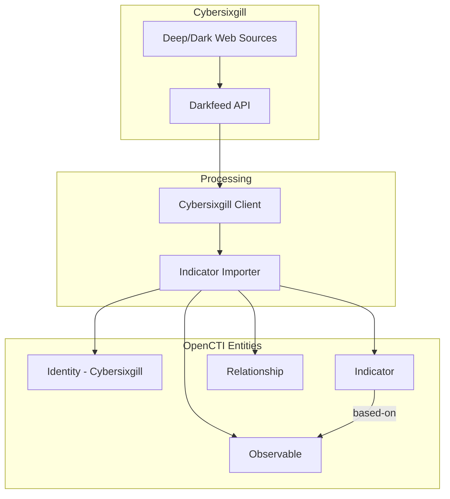

# OpenCTI Cybersixgill Connector

| Status    | Date | Comment |
|-----------|------|---------|
| Community | -    | -       |

## Table of Contents

- [Introduction](#introduction)
- [Installation](#installation)
  - [Requirements](#requirements)
- [Configuration](#configuration)
  - [Configuration Variables](#configuration-variables)
- [Deployment](#deployment)
  - [Docker Deployment](#docker-deployment)
  - [Manual Deployment](#manual-deployment)
- [Behavior](#behavior)
  - [Data Flow](#data-flow)
  - [Entity Mapping](#entity-mapping)
- [Debugging](#debugging)
- [Additional Information](#additional-information)

---

## Introduction

The Cybersixgill Darkfeed connector imports threat intelligence data from [Cybersixgill's](https://www.cybersixgill.com/) underground monitoring platform into OpenCTI. The Darkfeed provides IOCs (Indicators of Compromise) automatically extracted from Cybersixgill's comprehensive collection of deep and dark web sources.

### What it does

- Imports IOCs including file hashes, IP addresses, domains, and URLs
- Provides early warning of emerging threats from underground sources
- Includes compromised domains, domains sold on dark web, malware file links, malware hashes, and malicious C&C IPs

### Use Cases

- Automated IOC integration into security infrastructure
- Threat hunting within your network
- Understanding emerging malware trends, tactics, techniques, and procedures
- Machine-to-machine threat blocking with no human involvement

---

## Installation

### Requirements

- OpenCTI Platform >= 6.9.5
- Cybersixgill Client ID and Client Secret (contact Cybersixgill for access)

---

## Configuration

### Configuration Variables

#### OpenCTI Parameters

| Parameter | Docker envvar | Mandatory | Description |
|-----------|---------------|-----------|-------------|
| OpenCTI URL | `OPENCTI_URL` | Yes | The URL of the OpenCTI platform |
| OpenCTI Token | `OPENCTI_TOKEN` | Yes | The default admin token configured in the OpenCTI platform |

#### Base Connector Parameters

| Parameter | Docker envvar | Mandatory | Default | Description |
|-----------|---------------|-----------|---------|-------------|
| Connector ID | `CONNECTOR_ID` | Yes | - | A unique `UUIDv4` for this connector |
| Connector Scope | `CONNECTOR_SCOPE` | Yes | - | Supported scope (MIME Type or STIX Object) |
| Log Level | `CONNECTOR_LOG_LEVEL` | No | `info` | Log level: `debug`, `info`, `warn`, or `error` |

#### Connector Extra Parameters

| Parameter | Docker envvar | Mandatory | Default | Description |
|-----------|---------------|-----------|---------|-------------|
| Client ID | `CYBERSIXGILL_CLIENT_ID` | Yes | - | Cybersixgill API Client ID |
| Client Secret | `CYBERSIXGILL_CLIENT_SECRET` | Yes | - | Cybersixgill API Client Secret |
| Create Observables | `CYBERSIXGILL_CREATE_OBSERVABLES` | No | `true` | Create observables from indicators |
| Create Indicators | `CYBERSIXGILL_CREATE_INDICATORS` | No | `true` | Create STIX indicators |
| Fetch Size | `CYBERSIXGILL_FETCH_SIZE` | No | `2000` | Number of indicators to fetch per run |
| Enable Relationships | `CYBERSIXGILL_ENABLE_RELATIONSHIPS` | No | `true` | Create relationships between SDOs |
| Interval | `CYBERSIXGILL_INTERVAL_SEC` | No | `300` | Import interval in seconds |

---

## Deployment

### Docker Deployment

Use the following `docker-compose.yml`:

```yaml
services:
  connector-cybersixgill:
    image: opencti/connector-cybersixgill:latest
    environment:
      - OPENCTI_URL=http://opencti:8080
      - OPENCTI_TOKEN=${OPENCTI_ADMIN_TOKEN}
      - CONNECTOR_ID=${CONNECTOR_CYBERSIXGILL_ID}
      - CONNECTOR_SCOPE=cybersixgill
      - CONNECTOR_LOG_LEVEL=info
      - CYBERSIXGILL_CLIENT_ID=${CYBERSIXGILL_CLIENT_ID}
      - CYBERSIXGILL_CLIENT_SECRET=${CYBERSIXGILL_CLIENT_SECRET}
      - CYBERSIXGILL_CREATE_OBSERVABLES=true
      - CYBERSIXGILL_CREATE_INDICATORS=true
      - CYBERSIXGILL_FETCH_SIZE=2000
      - CYBERSIXGILL_ENABLE_RELATIONSHIPS=true
      - CYBERSIXGILL_INTERVAL_SEC=300
    restart: always
    depends_on:
      - opencti
```

### Manual Deployment

1. Clone the repository and navigate to the connector directory
2. Install dependencies: `pip install -r requirements.txt`
3. Configure `config.yml`:

```yaml
opencti:
  url: 'http://localhost:8080'
  token: 'your-token'

connector:
  id: 'your-uuid'
  scope: 'cybersixgill'
  log_level: 'info'

cybersixgill:
  client_id: 'your-client-id'
  client_secret: 'your-client-secret'
  create_observables: true
  create_indicators: true
  fetch_size: 2000
  enable_relationships: true
  interval_sec: 300
```

4. Run: `python main.py`

---

## Behavior

### Data Flow



### Entity Mapping

| Cybersixgill Data | OpenCTI Entity | Notes |
|-------------------|----------------|-------|
| File Hash (MD5, SHA1, SHA256) | File Observable + Indicator | Malware samples from underground sources |
| IP Address | IPv4-Addr/IPv6-Addr Observable + Indicator | C&C servers, malicious infrastructure |
| Domain | Domain-Name Observable + Indicator | Compromised/malicious domains |
| URL | URL Observable + Indicator | Phishing links, malware distribution |
| - | Identity | "Cybersixgill" as author |
| - | Relationship | `based-on` between Indicator and Observable |

### Processing Details

1. **Authentication**:
   - Authenticates with Cybersixgill API using Client ID and Client Secret
   - Maintains session for API calls

2. **Indicator Import**:
   - Fetches indicators in configurable batch sizes (`fetch_size`)
   - Processes each indicator based on type (hash, IP, domain, URL)

3. **Observable Creation** (when `create_observables=true`):
   - Creates appropriate STIX Cyber Observable based on indicator type:
     - `file:hashes.*` → File Observable
     - `ipv4-addr:value` → IPv4-Addr Observable
     - `ipv6-addr:value` → IPv6-Addr Observable
     - `domain-name:value` → Domain-Name Observable
     - `url:value` → URL Observable

4. **Indicator Creation** (when `create_indicators=true`):
   - Creates STIX Indicator with:
     - STIX pattern matching the observable
     - Confidence score from Cybersixgill
     - Labels and external references

5. **Relationship Creation** (when `enable_relationships=true`):
   - Creates `based-on` relationships between Indicators and Observables
   - Links related entities from the same intelligence

6. **Author Identity**:
   - All objects created by this connector reference "Cybersixgill" organization identity

### State Management

| State Key | Description |
|-----------|-------------|
| `last_run` | Unix timestamp of last successful run |

---

## Debugging

Enable debug logging by setting `CONNECTOR_LOG_LEVEL=debug`. Common issues:

- **Authentication failures**: Verify Client ID and Client Secret
- **API rate limits**: Increase `CYBERSIXGILL_INTERVAL_SEC` if hitting limits
- **Large batch sizes**: Reduce `CYBERSIXGILL_FETCH_SIZE` if experiencing timeouts

### Support

For assistance, bug reports, or feature requests:

- **Support Portal**: https://www.cybersixgill.com/contact-us/
- **Email**: support@cybersixgill.com

---

## Additional Information

### Data Sources

Cybersixgill collects intelligence from:
- Deep and dark web forums
- Marketplaces
- Paste sites
- Social media
- Messaging platforms

### Recommended Configuration

| Deployment | Interval | Fetch Size | Notes |
|------------|----------|------------|-------|
| Production | 300-600s | 2000 | Standard setup |
| High-volume | 600-900s | 5000 | For large deployments |
| Testing | 60s | 100 | For development |

### API Documentation

Refer to Cybersixgill's official API documentation for detailed endpoint specifications (requires customer access).
