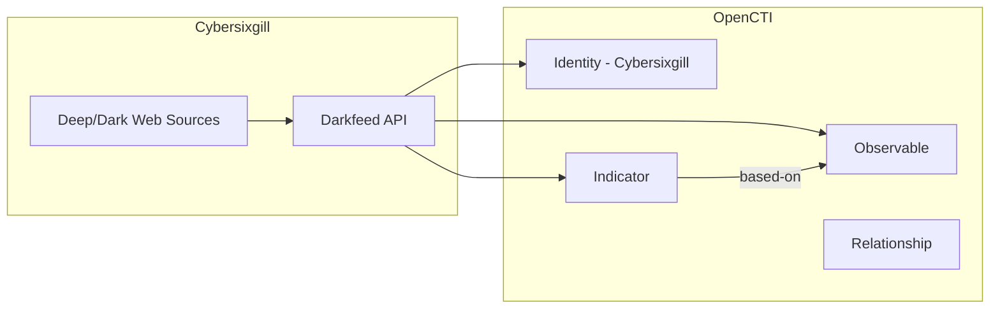

# OpenCTI Cybersixgill Connector

| Status | Date | Comment |
|--------|------|---------|
| Community | -    | -       |

The Cybersixgill Darkfeed connector imports threat intelligence data from Cybersixgill's underground monitoring platform into OpenCTI.

## Table of Contents

- [OpenCTI Cybersixgill Connector](#opencti-cybersixgill-connector)
  - [Table of Contents](#table-of-contents)
  - [Introduction](#introduction)
  - [Installation](#installation)
    - [Requirements](#requirements)
  - [Configuration variables](#configuration-variables)
    - [OpenCTI environment variables](#opencti-environment-variables)
    - [Base connector environment variables](#base-connector-environment-variables)
    - [Connector extra parameters environment variables](#connector-extra-parameters-environment-variables)
  - [Deployment](#deployment)
    - [Docker Deployment](#docker-deployment)
    - [Manual Deployment](#manual-deployment)
  - [Usage](#usage)
  - [Behavior](#behavior)
  - [Debugging](#debugging)
  - [Additional information](#additional-information)

## Introduction

[Cybersixgill](https://www.cybersixgill.com/) provides real-time threat intelligence from the deep and dark web. The Darkfeed provides IOCs (Indicators of Compromise) automatically extracted from Cybersixgill's comprehensive collection of underground sources.

This connector imports IOCs including file hashes, IP addresses, domains, and URLs, providing early warning of emerging threats from underground sources. The data includes:

- Compromised domains
- Domains sold on dark web
- Malware file links
- Malware hashes
- Malicious C&C IPs

## Installation

### Requirements

- OpenCTI Platform >= 6.9.22
- Cybersixgill Client ID and Client Secret (contact Cybersixgill for access)

## Configuration variables

There are a number of configuration options, which are set either in `docker-compose.yml` (for Docker) or in `config.yml` (for manual deployment).

### OpenCTI environment variables

| Parameter     | config.yml | Docker environment variable | Mandatory | Description                                          |
|---------------|------------|-----------------------------|-----------|------------------------------------------------------|
| OpenCTI URL   | url        | `OPENCTI_URL`               | Yes       | The URL of the OpenCTI platform.                     |
| OpenCTI Token | token      | `OPENCTI_TOKEN`             | Yes       | The default admin token set in the OpenCTI platform. |

### Base connector environment variables

| Parameter        | config.yml | Docker environment variable | Default      | Mandatory | Description                                                              |
|------------------|------------|-----------------------------|--------------|-----------|--------------------------------------------------------------------------|
| Connector ID     | id         | `CONNECTOR_ID`              |              | Yes       | A unique `UUIDv4` identifier for this connector instance.                |
| Connector Scope  | scope      | `CONNECTOR_SCOPE`           | cybersixgill | Yes       | The scope or type of data the connector is importing.                    |
| Log Level        | log_level  | `CONNECTOR_LOG_LEVEL`       | info         | No        | Determines the verbosity of logs: `debug`, `info`, `warn`, or `error`.   |

### Connector extra parameters environment variables

| Parameter            | config.yml                      | Docker environment variable          | Default | Mandatory | Description                                                    |
|----------------------|---------------------------------|--------------------------------------|---------|-----------|----------------------------------------------------------------|
| Client ID            | cybersixgill.client_id          | `CYBERSIXGILL_CLIENT_ID`             |         | Yes       | Cybersixgill API Client ID.                                    |
| Client Secret        | cybersixgill.client_secret      | `CYBERSIXGILL_CLIENT_SECRET`         |         | Yes       | Cybersixgill API Client Secret.                                |
| Create Observables   | cybersixgill.create_observables | `CYBERSIXGILL_CREATE_OBSERVABLES`    | true    | No        | Create observables from indicators.                            |
| Create Indicators    | cybersixgill.create_indicators  | `CYBERSIXGILL_CREATE_INDICATORS`     | true    | No        | Create STIX indicators.                                        |
| Fetch Size           | cybersixgill.fetch_size         | `CYBERSIXGILL_FETCH_SIZE`            | 2000    | No        | Number of indicators to fetch per run.                         |
| Enable Relationships | cybersixgill.enable_relationships | `CYBERSIXGILL_ENABLE_RELATIONSHIPS` | true    | No        | Create relationships between SDOs.                             |
| Interval             | cybersixgill.interval_sec       | `CYBERSIXGILL_INTERVAL_SEC`          | 300     | No        | Import interval in seconds.                                    |

## Deployment

### Docker Deployment

Build the Docker image:

```bash
docker build -t opencti/connector-cybersixgill:latest .
```

Configure the connector in `docker-compose.yml`:

```yaml
  connector-cybersixgill:
    image: opencti/connector-cybersixgill:latest
    environment:
      - OPENCTI_URL=http://localhost
      - OPENCTI_TOKEN=ChangeMe
      - CONNECTOR_ID=ChangeMe
      - CONNECTOR_SCOPE=cybersixgill
      - CONNECTOR_LOG_LEVEL=info
      - CYBERSIXGILL_CLIENT_ID=ChangeMe
      - CYBERSIXGILL_CLIENT_SECRET=ChangeMe
      - CYBERSIXGILL_CREATE_OBSERVABLES=true
      - CYBERSIXGILL_CREATE_INDICATORS=true
      - CYBERSIXGILL_FETCH_SIZE=2000
      - CYBERSIXGILL_ENABLE_RELATIONSHIPS=true
      - CYBERSIXGILL_INTERVAL_SEC=300
    restart: always
```

Start the connector:

```bash
docker compose up -d
```

### Manual Deployment

1. Create `config.yml` based on `config.yml.sample`.

2. Install dependencies:

```bash
pip3 install -r requirements.txt
```

3. Start the connector:

```bash
python3 main.py
```

## Usage

The connector runs automatically at the interval defined by `CYBERSIXGILL_INTERVAL_SEC`. To force an immediate run:

**Data Management → Ingestion → Connectors**

Find the connector and click the refresh button to reset the state and trigger a new data fetch.

## Behavior

The connector fetches IOCs from Cybersixgill Darkfeed and imports them as STIX 2.1 objects.

### Data Flow



### Entity Mapping

| Cybersixgill Data              | OpenCTI Entity      | Description                                          |
|--------------------------------|---------------------|------------------------------------------------------|
| File Hash (MD5, SHA1, SHA256)  | File Observable     | Malware samples from underground sources             |
| File Hash                      | Indicator           | STIX indicator with pattern                          |
| IP Address                     | IPv4-Addr/IPv6-Addr | C&C servers, malicious infrastructure                |
| Domain                         | Domain-Name         | Compromised/malicious domains                        |
| URL                            | URL                 | Phishing links, malware distribution                 |
| -                              | Identity            | "Cybersixgill" as author                             |
| -                              | Relationship        | `based-on` between Indicator and Observable          |

### Processing Details

1. **Authentication**:
   - Authenticates with Cybersixgill API using Client ID and Client Secret
   - Maintains session for API calls

2. **Indicator Import**:
   - Fetches indicators in configurable batch sizes (`fetch_size`)
   - Processes each indicator based on type (hash, IP, domain, URL)

3. **Observable Creation** (when `create_observables=true`):
   - Creates appropriate STIX Cyber Observable based on indicator type:
     - `file:hashes.*` → File Observable
     - `ipv4-addr:value` → IPv4-Addr Observable
     - `ipv6-addr:value` → IPv6-Addr Observable
     - `domain-name:value` → Domain-Name Observable
     - `url:value` → URL Observable

4. **Indicator Creation** (when `create_indicators=true`):
   - Creates STIX Indicator with:
     - STIX pattern matching the observable
     - Confidence score from Cybersixgill
     - Labels and external references

5. **Relationship Creation** (when `enable_relationships=true`):
   - Creates `based-on` relationships between Indicators and Observables
   - Links related entities from the same intelligence

6. **Author Identity**:
   - All objects created by this connector reference "Cybersixgill" organization identity

## Debugging

Enable verbose logging:

```env
CONNECTOR_LOG_LEVEL=debug
```

Common issues:
- **Authentication failures**: Verify Client ID and Client Secret
- **API rate limits**: Increase `CYBERSIXGILL_INTERVAL_SEC` if hitting limits
- **Large batch sizes**: Reduce `CYBERSIXGILL_FETCH_SIZE` if experiencing timeouts

### Support

For assistance, bug reports, or feature requests:

- **Support Portal**: https://www.cybersixgill.com/contact-us/
- **Email**: support@cybersixgill.com

## Additional information

### Data Sources

Cybersixgill collects intelligence from:
- Deep and dark web forums
- Marketplaces
- Paste sites
- Social media
- Messaging platforms

### Recommended Configuration

| Deployment   | Interval    | Fetch Size | Notes              |
|--------------|-------------|------------|--------------------|
| Production   | 300-600s    | 2000       | Standard setup     |
| High-volume  | 600-900s    | 5000       | For large deployments |
| Testing      | 60s         | 100        | For development    |

### Use Cases

- Automated IOC integration into security infrastructure
- Threat hunting within your network
- Understanding emerging malware trends, tactics, techniques, and procedures
- Machine-to-machine threat blocking with no human involvement

### API Documentation

Refer to Cybersixgill's official API documentation for detailed endpoint specifications (requires customer access).
