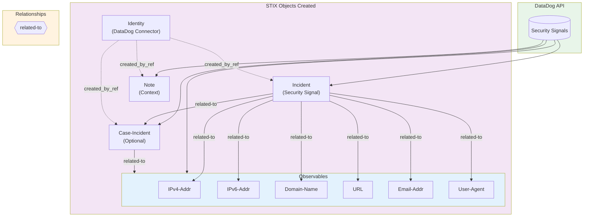
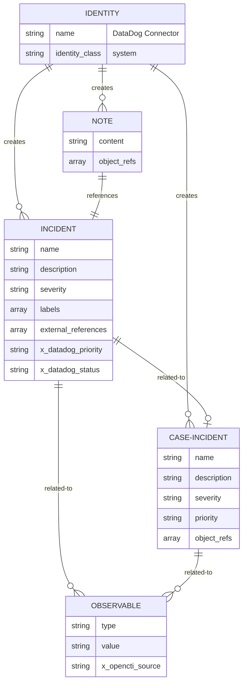
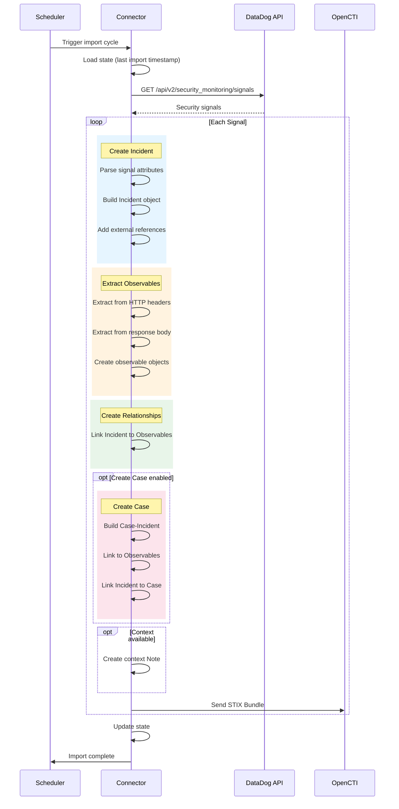

# DataDog Import Connector

OpenCTI external import connector that imports DataDog Security Signals and converts them to STIX incident objects with associated observables and context.

## Summary

| Property | Value |
|----------|-------|
| Connector Type | `EXTERNAL_IMPORT` |
| Connector Scope | `stix2` |
| Trigger | Scheduled (configurable interval) |
| TLP Support | Configurable (default: `TLP:AMBER`) |

## Features

- Imports DataDog security signals as STIX Incidents
- Extracts observables (IPv4, IPv6, domains, URLs, emails, user-agents)
- Creates Incident Response Cases for case management
- Rich context from security signal attributes
- Configurable filtering by priority and tags
- Incremental imports with timestamp tracking
- External references linking back to DataDog

## STIX Relationship Diagram



## STIX Entity Relationship Map



## Import Flow



## STIX Objects Created

| Object Type | Description | TLP Level |
|-------------|-------------|-----------|
| Identity | DataDog Connector (system) | - |
| Incident | Security signal details | TLP:WHITE |
| Case-Incident | Incident response case (optional) | TLP:WHITE |
| IPv4-Addr | Client IP addresses | TLP:WHITE |
| IPv6-Addr | Client IPv6 addresses | TLP:WHITE |
| Domain-Name | Host domains | TLP:WHITE |
| URL | Request URLs | TLP:WHITE |
| Email-Addr | Email addresses | TLP:WHITE |
| User-Agent | HTTP user agents (custom) | TLP:WHITE |
| Note | Context information | TLP:WHITE |
| Relationship | Links between objects | TLP:WHITE |

## Relationship Types

| Source | Relationship | Target |
|--------|--------------|--------|
| Incident | `related-to` | Observable (all types) |
| Incident | `related-to` | Case-Incident |
| Case-Incident | `related-to` | Observable (all types) |

## Observable Extraction

Observables are automatically extracted from security signals:

| Observable Type | Source Field |
|----------------|--------------|
| IPv4-Addr | `x-real-ip`, `x-forwarded-for` headers |
| IPv6-Addr | `x-real-ip`, `x-forwarded-for` headers |
| Domain-Name | `host` header |
| URL | `http.url`, `content.url` fields |
| Email-Addr | Response body scan |
| User-Agent | `user-agent` header |

## Severity Mapping

| DataDog Severity | Priority | Description |
|-----------------|----------|-------------|
| Critical | P1 | Critical severity |
| High | P2 | High severity |
| Medium | P3 | Medium severity |
| Low | P4 | Low severity |
| Info | P5 | Informational |

## Configuration

### Required Environment Variables

| Variable | Description |
|----------|-------------|
| `DATADOG_TOKEN` | DataDog API token |
| `DATADOG_APP_KEY` | DataDog App key (for Security Monitoring API) |

### Optional Environment Variables

| Variable | Default | Description |
|----------|---------|-------------|
| `DATADOG_API_BASE_URL` | `https://api.datadoghq.com` | API base URL |
| `DATADOG_APP_BASE_URL` | `https://app.datadoghq.com` | App URL for external refs |
| `DATADOG_IMPORT_INTERVAL` | `60` | Import interval in minutes |
| `DATADOG_IMPORT_START_DATE` | 24h ago | ISO format start date |
| `DATADOG_MAX_TLP` | `TLP:AMBER` | Maximum TLP level |
| `DATADOG_BATCH_SIZE` | `100` | Batch size for processing |
| `DATADOG_IMPORT_ALERTS` | `true` | Enable signal import |
| `DATADOG_CREATE_INCIDENT_RESPONSE_CASES` | `true` | Create case objects |
| `DATADOG_ALERT_PRIORITIES` | (empty) | Filter by priority (P1-P5) |
| `DATADOG_ALERT_TAGS_FILTER` | (empty) | Filter by tags |
| `DATADOG_EXTRACT_OBSERVABLES_FROM_ALERTS` | `true` | Extract observables |

## Local Development

### With Docker

```bash
cp docker-compose.yml.sample docker-compose.yml
# Edit docker-compose.yml with your credentials
docker-compose up
```

### Without Docker (Python)

1. **Install Python dependencies**:

```bash
cd src/
pip install -r requirements.txt
```

2. **Create configuration file**:

```bash
cp config.yml.sample config.yml
# Edit config.yml with your actual values
```

3. **Required configuration updates in `config.yml`**:
   - Set `opencti.url` to your OpenCTI instance URL
   - Set `opencti.token` to your OpenCTI API token
   - Generate a new UUID for `connector.id`: `python -c "import uuid; print(uuid.uuid4())"`
   - Set `datadog.token` to your DataDog API token
   - Set `datadog.app_key` to your DataDog App key
   - Update `datadog.app_base_url` if using a custom DataDog instance

4. **Run the connector**:

```bash
python connector.py
```

**Note**: The connector will run continuously and import data at the configured interval. Use `Ctrl+C` to stop.

## Project Structure

```
datadog/
├── src/
│   ├── connector.py         # Main connector logic
│   ├── config.yml.sample    # Configuration template
│   ├── requirements.txt     # Python dependencies
│   └── lib/
│       ├── client.py        # DataDog API client
│       ├── importer.py      # Data processing
│       ├── converter.py     # STIX conversion
│       └── utils.py         # Utility functions
├── config.json              # Terraform deployment config
├── Dockerfile               # Container build
├── docker-compose.yml       # Local development
└── entrypoint.sh            # Container entrypoint
```

## API Requirements

### Permissions

The DataDog App key requires:
- **Security Monitoring Signals Read**: Access security signals

### API Endpoint

- **Endpoint**: `/api/v2/security_monitoring/signals`
- **Documentation**: https://docs.datadoghq.com/api/latest/security-monitoring/

## Troubleshooting

### Common Issues

1. **Authentication Errors**
   - Verify `DATADOG_TOKEN` and `DATADOG_APP_KEY`
   - Check API key has required permissions

2. **No Data Imported**
   - Check priority/tag filters
   - Verify `import_start_date` range
   - Confirm security signals exist

3. **Missing Observables**
   - Enable `extract_observables_from_alerts`
   - Verify signals contain HTTP request samples

4. **Case Objects Not Created**
   - Enable `create_incident_response_cases`
   - Check logs for case creation errors

### Debug Mode

```yaml
connector:
  log_level: 'debug'
```
