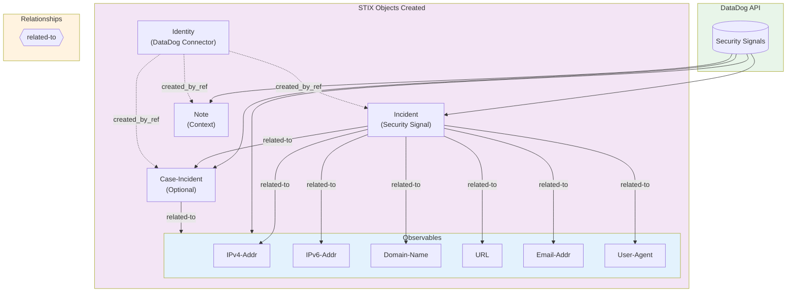
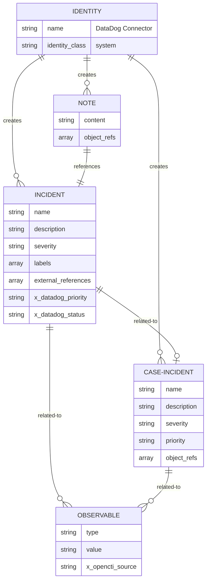
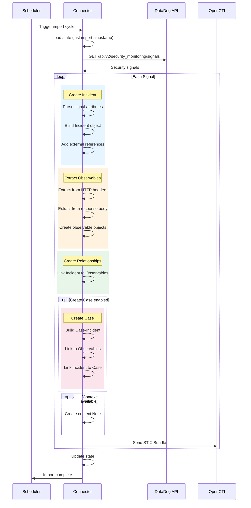

# DataDog Cloud SIEM Connector

OpenCTI external-import connector that ingests Security Signals raised by DataDog's Cloud SIEM / Security Monitoring and surfaces them as STIX 2.1 `Incident` objects (optionally with `Case-Incident` response objects), enriched with the observables embedded in the signal payload and a contextual note carrying the monitor query, tags and assignee details.

## Summary

| Property | Value |
|----------|-------|
| Connector Type | `EXTERNAL_IMPORT` |
| Connector Scope | `stix2` |
| Trigger | Polling loop (default every 60 min — configurable via `DATADOG_IMPORT_INTERVAL`) |
| TLP Support | Configurable via `DATADOG_MAX_TLP` (default: `TLP:AMBER`) |
| Source API | DataDog Security Monitoring v2 (`/api/v2/security_monitoring/signals`) |

## Features

- Imports DataDog security signals as STIX Incidents
- Extracts observables (IPv4, IPv6, domains, URLs, emails, user-agents)
- Creates Incident Response Cases for case management
- Rich context from security signal attributes
- Configurable filtering by priority and tags
- Incremental imports with timestamp tracking
- External references linking back to DataDog

## STIX Relationship Diagram


```mermaid
flowchart TB
    subgraph Source["DataDog API"]
        SIG[("Security Signals")]
    end

    subgraph Created["STIX Objects Created"]
        ID["Identity\n(DataDog Connector)"]
        INC["Incident\n(Security Signal)"]
        CASE["Case-Incident\n(Optional)"]
        NOTE["Note\n(Context)"]
        
        subgraph Observables
            IP4["IPv4-Addr"]
            IP6["IPv6-Addr"]
            DOM["Domain-Name"]
            URL["URL"]
            EMAIL["Email-Addr"]
            UA["User-Agent"]
        end
    end

    subgraph Relationships["Relationships"]
        R1{{"related-to"}}
    end

    SIG --> INC
    SIG --> CASE
    SIG --> Observables
    SIG --> NOTE

    INC -->|related-to| IP4
    INC -->|related-to| IP6
    INC -->|related-to| DOM
    INC -->|related-to| URL
    INC -->|related-to| EMAIL
    INC -->|related-to| UA
    INC -->|related-to| CASE

    CASE -->|related-to| Observables

    ID -.->|created_by_ref| INC
    ID -.->|created_by_ref| CASE
    ID -.->|created_by_ref| NOTE

    style Source fill:#e8f5e9
    style Created fill:#f3e5f5
    style Observables fill:#e3f2fd
    style Relationships fill:#fff3e0
```

## STIX Entity Relationship Map


```mermaid
erDiagram
    IDENTITY ||--o{ INCIDENT : creates
    IDENTITY ||--o{ CASE-INCIDENT : creates
    IDENTITY ||--o{ NOTE : creates
    
    INCIDENT ||--o{ OBSERVABLE : "related-to"
    INCIDENT ||--o| CASE-INCIDENT : "related-to"
    CASE-INCIDENT ||--o{ OBSERVABLE : "related-to"
    NOTE ||--|| INCIDENT : references
    
    IDENTITY {
        string name "DataDog Connector"
        string identity_class "system"
    }
    INCIDENT {
        string name
        string description
        string severity
        array labels
        array external_references
        string x_datadog_priority
        string x_datadog_status
    }
    CASE-INCIDENT {
        string name
        string description
        string severity
        string priority
        array object_refs
    }
    OBSERVABLE {
        string type
        string value
        string x_opencti_source
    }
    NOTE {
        string content
        array object_refs
    }
```

## Import Flow


```mermaid
sequenceDiagram
    participant SCH as Scheduler
    participant CON as Connector
    participant API as DataDog API
    participant OC as OpenCTI

    SCH->>CON: Trigger import cycle
    CON->>CON: Load state (last import timestamp)
    
    CON->>API: GET /api/v2/security_monitoring/signals
    API-->>CON: Security signals

    loop Each Signal
        rect rgb(230, 245, 255)
            Note over CON: Create Incident
            CON->>CON: Parse signal attributes
            CON->>CON: Build Incident object
            CON->>CON: Add external references
        end

        rect rgb(255, 243, 224)
            Note over CON: Extract Observables
            CON->>CON: Extract from HTTP headers
            CON->>CON: Extract from response body
            CON->>CON: Create observable objects
        end

        rect rgb(232, 245, 233)
            Note over CON: Create Relationships
            CON->>CON: Link Incident to Observables
        end

        opt Create Case enabled
            rect rgb(252, 228, 236)
                Note over CON: Create Case
                CON->>CON: Build Case-Incident
                CON->>CON: Link to Observables
                CON->>CON: Link Incident to Case
            end
        end

        opt Context available
            CON->>CON: Create context Note
        end

        CON->>OC: Send STIX Bundle
    end

    CON->>CON: Update state
    CON->>SCH: Import complete
```

## STIX Objects Created

Every object emitted by the connector carries the marking configured via `DATADOG_MAX_TLP` (default `TLP:AMBER`); the table below lists what shows up in each bundle.

| Object Type | Description |
|-------------|-------------|
| Identity | `DataDog Connector` (system) — `created_by_ref` of every downstream SDO |
| MarkingDefinition | The configured TLP marking, materialised so the bundle is self-contained |
| Incident | Per Security Signal — name, description, severity, priority, external reference to the signal in DataDog |
| Case-Incident | Optional per signal (when `DATADOG_CREATE_INCIDENT_RESPONSE_CASES=true`) |
| IPv4-Addr / IPv6-Addr | Extracted from `x-real-ip`, `x-forwarded-for` |
| Domain-Name | Extracted from the request `host` header |
| URL | Extracted from `http.url` / `content.url` |
| Email-Addr | Extracted from the response body |
| User-Agent | Extracted from the `user-agent` header (deterministic OpenCTI observable) |
| Note | Contextual note (DataDog tags, monitor query, assignee) attached to the incident |
| Relationship | `related-to` linking the incident / case to each observable, and the incident to its case |

## Relationship Types

| Source | Relationship | Target |
|--------|--------------|--------|
| Incident | `related-to` | Observable (all types) |
| Incident | `related-to` | Case-Incident |
| Case-Incident | `related-to` | Observable (all types) |

## Observable Extraction

Observables are automatically extracted from security signals:

| Observable Type | Source Field |
|----------------|--------------|
| IPv4-Addr | `x-real-ip`, `x-forwarded-for` headers |
| IPv6-Addr | `x-real-ip`, `x-forwarded-for` headers |
| Domain-Name | `host` header |
| URL | `http.url`, `content.url` fields |
| Email-Addr | Response body scan |
| User-Agent | `user-agent` header |

## Severity Mapping

| DataDog Severity | Priority | Description |
|-----------------|----------|-------------|
| Critical | P1 | Critical severity |
| High | P2 | High severity |
| Medium | P3 | Medium severity |
| Low | P4 | Low severity |
| Info | P5 | Informational |

## Configuration

### Required Environment Variables

| Variable | Description |
|----------|-------------|
| `DATADOG_TOKEN` | DataDog API token |
| `DATADOG_APP_KEY` | DataDog App key (for Security Monitoring API) |

### Optional Environment Variables

| Variable | Default | Description |
|----------|---------|-------------|
| `DATADOG_API_BASE_URL` | `https://api.datadoghq.com` | DataDog API base URL (use `api.datadoghq.eu`, `api.us3.datadoghq.com`, etc. for non-US1 sites) |
| `DATADOG_APP_BASE_URL` | `https://app.datadoghq.com` | DataDog app URL used to build the external references pointing back to signals / incidents |
| `DATADOG_IMPORT_INTERVAL` | `60` | Import interval in minutes |
| `DATADOG_IMPORT_START_DATE` | 24h ago | ISO 8601 start date for the first import cycle (e.g. `2024-01-01T00:00:00Z`); subsequent runs resume from the state-tracked timestamp |
| `DATADOG_MAX_TLP` | `TLP:AMBER` | TLP marking applied to every emitted STIX object. Accepts `TLP:CLEAR`, `TLP:WHITE`, `TLP:GREEN`, `TLP:AMBER`, `TLP:AMBER+STRICT`, `TLP:RED` |
| `DATADOG_BATCH_SIZE` | `100` | Page size (`page[limit]`) used when paginating the v2 Security Monitoring API (DataDog caps this at 1000) |
| `DATADOG_IMPORT_ALERTS` | `true` | Enable Security Signal import |
| `DATADOG_CREATE_INCIDENT_RESPONSE_CASES` | `false` | If `true`, also emit a `Case-Incident` per signal carrying the same observables and linked back to the `Incident` |
| `DATADOG_ALERT_PRIORITIES` | `P1,P2,P3,P4` | Comma-separated priority filter; only signals with one of these priorities are imported |
| `DATADOG_ALERT_TAGS_FILTER` | (empty) | Comma-separated tags filter (e.g. `env:prod,team:secops`); only signals carrying every listed tag are imported |
| `DATADOG_EXTRACT_OBSERVABLES_FROM_ALERTS` | `true` | If `true`, extract IPv4/IPv6/domain/URL/email/user-agent observables from each signal and attach them to the incident |
| `DATADOG_INCLUDE_ALERT_CONTEXT` | `true` | If `true`, emit an explanatory `Note` per incident with the DataDog tags, monitor query and assignee / creator names |

## Local Development

### With Docker

```bash
cp docker-compose.yml.sample docker-compose.yml
# Edit docker-compose.yml with your credentials (OPENCTI_TOKEN, CONNECTOR_ID, DATADOG_TOKEN, DATADOG_APP_KEY)
docker compose up --build
```

### Without Docker

```bash
cd src/
pip install -r requirements.txt
cp config.yml.sample config.yml
# Edit config.yml — set opencti.url, opencti.token, a fresh connector.id
# (python -c "import uuid; print(uuid.uuid4())"), datadog.token and datadog.app_key
python connector.py
```

When `src/config.yml` exists it is loaded by the connector; when it is absent (the typical Docker / Kubernetes deployment) every key is resolved from the matching environment variable instead. The connector loops on `DATADOG_IMPORT_INTERVAL` minutes; use `Ctrl+C` to stop it.

## Project Structure

```
datadog/
├── __metadata__/
│   └── connector_manifest.json   # Catalog manifest used by XTM Composer
├── src/
│   ├── connector.py              # Main connector loop + config loading
│   ├── config.yml.sample         # YAML configuration template
│   ├── requirements.txt          # Python dependencies (incl. pycti pin)
│   └── lib/
│       ├── client.py             # DataDog v2 Security Monitoring API client
│       ├── importer.py           # Signal parsing + observable extraction
│       ├── converter.py          # STIX 2.1 conversion + bundling
│       └── utils.py              # Priority → severity mapping
├── .env.sample                   # Sample env-var file for Docker / local runs
├── config.json                   # Platform deployment config
├── Dockerfile                    # Container build
├── docker-compose.yml.sample     # Docker Compose template
├── entrypoint.sh                 # Container entrypoint
└── README.md                     # This file
```

## API Requirements

### Permissions

The DataDog App key requires:
- **Security Monitoring Signals Read**: Access security signals

### API Endpoint

- **Endpoint**: `/api/v2/security_monitoring/signals`
- **Documentation**: https://docs.datadoghq.com/api/latest/security-monitoring/

## Troubleshooting

### Common Issues

1. **Authentication Errors**
   - Verify `DATADOG_TOKEN` and `DATADOG_APP_KEY`
   - Check API key has required permissions

2. **No Data Imported**
   - Check priority/tag filters
   - Verify `import_start_date` range
   - Confirm security signals exist

3. **Missing Observables**
   - Enable `extract_observables_from_alerts`
   - Verify signals contain HTTP request samples

4. **Case Objects Not Created**
   - Enable `create_incident_response_cases`
   - Check logs for case creation errors

### Debug Mode

```yaml
connector:
  log_level: 'debug'
```
