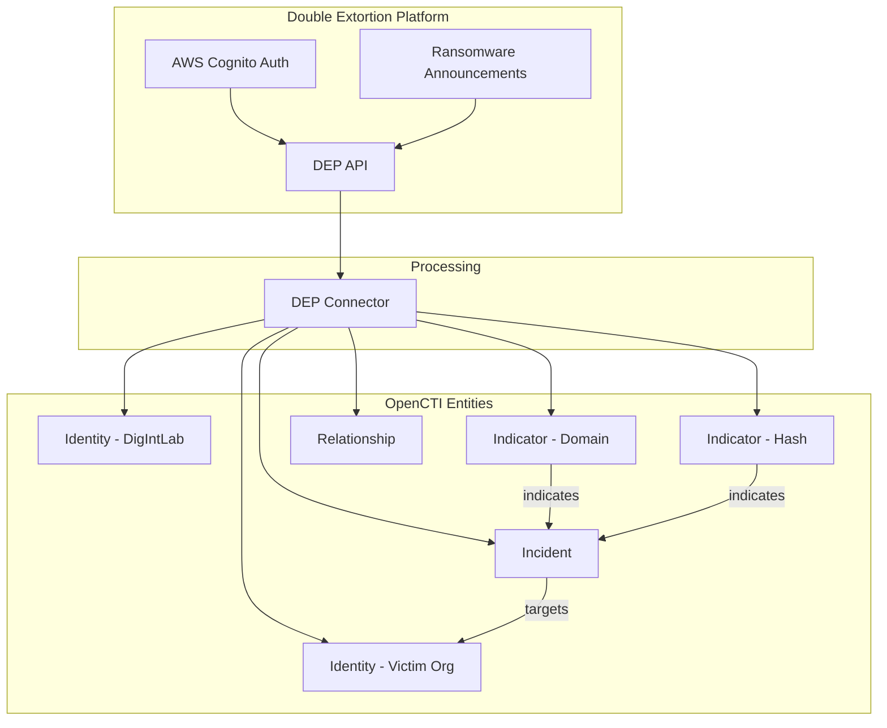

# Double Extortion (DigIntLab DEP) Connector

| Status | Date | Comment |
|--------|------|---------|
| Community | -    | -       |

## Table of Contents

- [Introduction](#introduction)
- [Installation](#installation)
  - [Requirements](#requirements)
- [Configuration](#configuration)
  - [Configuration Variables](#configuration-variables)
- [Deployment](#deployment)
  - [Docker Deployment](#docker-deployment)
  - [Manual Deployment](#manual-deployment)
- [Behavior](#behavior)
  - [Data Flow](#data-flow)
  - [Entity Mapping](#entity-mapping)
- [Debugging](#debugging)
- [Additional Information](#additional-information)

---

## Introduction

The Double Extortion connector ingests ransomware and data leak announcements published on the [DoubleExtortion Platform](https://doubleextortion.com/) by DigIntLab and converts them into STIX 2.1 entities inside OpenCTI. 

The platform tracks ransomware groups' activities, including victim announcements, leak site publications, and related metadata. This connector enables automated ingestion of this intelligence for threat monitoring and incident tracking.

### Features

- Authenticates against AWS Cognito identity provider
- Models double extortion announcements as **Incidents**
- Creates **Organization** identities for victims
- Generates optional **Indicators** for victim domains and leak hash identifiers
- Supports multiple datasets (e.g., `ext`, `sanctions`)
- Maintains connector state for incremental updates

---

## Installation

### Requirements

- OpenCTI Platform >= 6.0.0
- Double Extortion Platform account with:
  - Username and Password
  - API Key
  - AWS Cognito Client ID

---

## Configuration

### Configuration Variables

#### OpenCTI Parameters

| Parameter | Docker envvar | Mandatory | Description |
|-----------|---------------|-----------|-------------|
| OpenCTI URL | `OPENCTI_URL` | Yes | The URL of the OpenCTI platform |
| OpenCTI Token | `OPENCTI_TOKEN` | Yes | API token for OpenCTI |

#### Base Connector Parameters

| Parameter | Docker envvar | Mandatory | Default | Description |
|-----------|---------------|-----------|---------|-------------|
| Connector ID | `CONNECTOR_ID` | Yes | - | A unique `UUIDv4` for this connector |
| Connector Name | `CONNECTOR_NAME` | Yes | - | Name displayed in OpenCTI |
| Log Level | `CONNECTOR_LOG_LEVEL` | No | `info` | Log level: `debug`, `info`, `warn`, or `error` |
| Run Interval | `CONNECTOR_RUN_INTERVAL` | No | `3600` | Interval in seconds between executions |

#### Connector Extra Parameters

| Parameter | Docker envvar | Mandatory | Default | Description |
|-----------|---------------|-----------|---------|-------------|
| Username | `DEP_USERNAME` | Yes | - | Double Extortion Platform username |
| Password | `DEP_PASSWORD` | Yes | - | Double Extortion Platform password |
| API Key | `DEP_API_KEY` | Yes | - | API key issued by the platform |
| Client ID | `DEP_CLIENT_ID` | Yes | - | AWS Cognito App Client ID |
| Login Endpoint | `DEP_LOGIN_ENDPOINT` | No | `https://cognito-idp.eu-west-1.amazonaws.com/` | Cognito login endpoint |
| API Endpoint | `DEP_API_ENDPOINT` | No | `https://api.eu-ep1.doubleextortion.com/v1/dbtr/privlist` | REST endpoint for announcements |
| Lookback Days | `DEP_LOOKBACK_DAYS` | No | `7` | Days to look back on first run |
| Extended Results | `DEP_EXTENDED_RESULTS` | No | `true` | Request extended leak information |
| Dataset | `DEP_DSET` | No | `ext` | Dataset to query (`ext`, `sanctions`, etc.) |
| Enable Site Indicator | `DEP_ENABLE_SITE_INDICATOR` | No | `true` | Create domain indicator per victim |
| Enable Hash Indicator | `DEP_ENABLE_HASH_INDICATOR` | No | `true` | Create hash indicator when available |
| Confidence | `DEP_CONFIDENCE` | No | `70` | Confidence level for created objects |

---

## Deployment

### Docker Deployment

Build the Docker image:

```bash
docker build -t opencti-connector-dep .
```

Use the following `docker-compose.yml`:

```yaml
services:
  connector-dep:
    image: opencti-connector-dep:latest
    environment:
      - OPENCTI_URL=http://opencti:8080
      - OPENCTI_TOKEN=${OPENCTI_ADMIN_TOKEN}
      - CONNECTOR_ID=${CONNECTOR_DEP_ID}
      - CONNECTOR_NAME=Double Extortion
      - CONNECTOR_LOG_LEVEL=info
      - CONNECTOR_RUN_INTERVAL=3600
      - DEP_USERNAME=${DEP_USERNAME}
      - DEP_PASSWORD=${DEP_PASSWORD}
      - DEP_API_KEY=${DEP_API_KEY}
      - DEP_CLIENT_ID=${DEP_CLIENT_ID}
      - DEP_LOOKBACK_DAYS=7
      - DEP_EXTENDED_RESULTS=true
      - DEP_DSET=ext
      - DEP_ENABLE_SITE_INDICATOR=true
      - DEP_ENABLE_HASH_INDICATOR=true
    restart: always
    depends_on:
      - opencti
```

### Manual Deployment

1. Clone the repository and navigate to the connector directory
2. Install dependencies: `pip install -r requirements.txt`
3. Configure `config.yml` (see `config.yml.sample`)
4. Run: `python main.py`

---

## Behavior

### Data Flow



### Entity Mapping

| DEP Data | OpenCTI Entity | Notes |
|----------|----------------|-------|
| Announcement | Incident | Type: `cybercrime`, includes first_seen date |
| Victim Name | Identity (Organization) | Organization identity with sector/revenue description |
| Victim Domain | Indicator | STIX pattern: `[domain-name:value = '...']` |
| Hash ID | Indicator | STIX pattern based on hash type (MD5/SHA1/SHA256) |
| Announcement Link | External Reference | Link to DEP announcement page |
| Victim Site | External Reference | Link to victim's website |
| - | Relationship | `targets` (Incident → Victim), `indicates` (Indicator → Incident) |

### Processing Details

1. **Authentication**:
   - Authenticates with AWS Cognito using username/password
   - Retrieves ID token for API authorization
   - Uses API key for additional authentication

2. **Data Fetching**:
   - Fetches announcements within configured date range
   - Uses `lookback_days` on first run or from last run timestamp
   - Supports extended results for additional leak metadata

3. **Incident Creation**:
   - Name: `DEP announcement - {victim_name}`
   - Description: Auto-decoded URL-encoded descriptions
   - First Seen: Announcement date
   - Type: `cybercrime`
   - External Reference: Link to announcement

4. **Victim Identity**:
   - Name: Victim organization name
   - Identity Class: `organization`
   - Description: Includes industry sector and reported revenue
   - External References: Announcement and victim site links

5. **Indicator Creation**:
   - **Domain Indicator** (when `enable_site_indicator=true`):
     - Pattern: `[domain-name:value = '{victim_domain}']`
     - Strips protocol prefixes
   - **Hash Indicator** (when `enable_hash_indicator=true`):
     - Auto-detects hash type by length (MD5=32, SHA-1=40, SHA-256=64)
     - Pattern: `[file:hashes.'{type}' = '{hash}']`

6. **Relationships**:
   - `targets`: Incident → Victim Organization
   - `indicates`: Domain/Hash Indicator → Incident

### State Management

| State Key | Description |
|-----------|-------------|
| `last_run` | ISO timestamp of last successful run |

---

## Debugging

Enable debug logging by setting `CONNECTOR_LOG_LEVEL=debug`. Common issues:

- **Authentication failures**: Verify DEP credentials and Client ID
- **API errors**: Check API endpoint and key validity
- **Missing data**: Ensure `extended_results` is enabled for full metadata

### Development Notes

- URL-encoded descriptions are automatically decoded
- Intrusion Set creation is disabled by default (not all datasets represent threat actors)
- Delete connector state in OpenCTI to re-ingest older records

---

## Additional Information

### Datasets

| Dataset | Description |
|---------|-------------|
| `ext` | Standard double extortion announcements |
| `sanctions` | Sanctions-related data |

### License

This project is released under the [MIT License](LICENSE).

### Contact

- **Platform**: https://doubleextortion.com/
- **Provider**: DigIntLab
